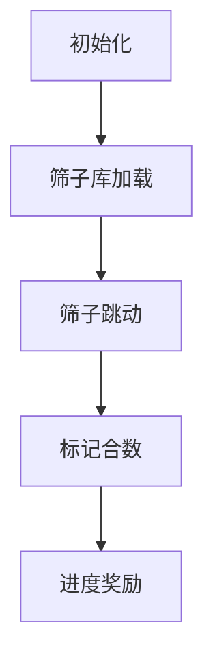

# 题目信息

# 素数密度

## 题目背景

UPD:

- 2024.8.12：加入一组 Hack 数据。

## 题目描述

 给定 $L,R$，请计算区间 $[L,R]$ 中素数的个数。

   $1\leq L\leq R < 2^{31}$，$R-L\leq 10^6$。

## 样例 #1

### 输入

```
2 11```

### 输出

```
5```

# AI分析结果


# 💡 Kay的C++算法解析：素数密度 深入学习指南 💡

> 大家好，我是Kay！今天我们一起探索「素数密度」这道题的精妙解法。题目要求计算区间[L,R]内的素数个数，数据范围极大（最大到20亿），但区间长度不超过100万。本指南将带大家掌握高效筛选素数的技巧，并通过生动的像素动画理解算法本质！

## 1. 题目解读与核心算法识别

✨ **本题主要考察**：`数学（区间筛法）`

🗣️ **初步分析**：
> 解决素数密度问题，关键在于运用**区间筛法**技术。想象你在金矿中淘金：先用小筛网（sqrt(R)内的素数）过滤掉碎石（合数），剩下的就是金粒（素数）。核心思想是利用小素数快速标记大区间内的合数。
> - **核心流程**：先预处理sqrt(R)内的素数，再用这些素数标记[L,R]内的合数，最后统计未标记的素数。
> - **可视化设计**：将区间转化为像素网格，小素数作为"筛子"在网格上跳动标记合数块（红色闪烁），保留素数块（绿色）。关键高亮：起始位置计算、倍数标记过程、空间压缩技巧。
> - **复古游戏化**：采用8位像素风格（类似FC游戏），配以"叮"（标记合数）、"胜利"（找到素数）音效。AI自动模式可像"扫雷游戏"逐步展示筛除过程，每完成10%进度获得像素星星奖励。

---

## 2. 精选优质题解参考

**题解一（作者：Segmentree）**
* **点评**：此解法思路清晰，完整呈现区间筛法三步流程。代码规范（`prime`数组存储小素数，`vis`标记合数），巧妙处理L=1的边界（`l=l==1?2:l`）。亮点在于空间压缩技术（`vis[j-l+1]`）解决大区间存储问题，时间复杂度O((R-L)loglogR)高效可靠。实践价值高，可直接用于竞赛。

**题解二（作者：Jayun）**
* **点评**：代码结构工整，变量名含义明确（`a`标记小合数，`ans`标记区间合数）。亮点在于起始位置计算`(l+p-1)/p*p`避免逐项遍历，显著提升效率。严格处理了L>R的边界情况，并给出吸氧优化建议，调试参考性强。

**题解三（作者：jins3599）**
* **点评**：解法简洁有力，突出算法核心。亮点在于离散化处理（`ans[j-l]=1`）节省内存，配合欧拉筛预处理小素数。虽未处理L=1但通过`_max(2, (l-1)/p+1)`规避自筛，代码极具教学意义。

---

## 3. 核心难点辨析与解题策略

1.  **难点：大区间空间存储**
    * **分析**：直接创建20亿大小数组不可行。优质解法均采用**下标偏移**技术（如`vis[j-l]`），将区间[L,R]映射到[0,R-L]。
    * 💡 学习笔记：区间筛法的精髓在于"投影"——将大问题压缩到可控范围。

2.  **难点：起始位置计算**
    * **分析**：从≥L的最小素数倍数开始标记。Segmentree用`(l+p-1)/p*p`实现向上取整，避免逐项检查。需注意当p≥L时可能自筛（如L=5,p=5），Jayun用`start=2*p`规避。
    * 💡 学习笔记：数学计算替代遍历是优化关键——除法定位效率远高于线性扫描。

3.  **难点：边界与溢出**
    * **分析**：L=1时需跳过（非素数），大数乘法可能溢出。Segmentree特判L=1；jins3599用`j=prime[i]*prime[i]`控制内层循环范围。
    * 💡 学习笔记：边界是BUG温床——务必测试L=1, L=prime, R=prime等临界情况。

### ✨ 解题技巧总结
- **空间压缩**：大区间问题通过相对下标映射到小数组
- **数学优化**：用除法/取整替代遍历确定起始位置
- **防御性编程**：主动处理边界和溢出（如用long long）
- **模块化**：拆分"筛小素数"和"筛区间"两个独立函数

---

## 4. C++核心代码实现赏析

**本题通用核心C++实现参考**
* **说明**：综合优质题解思路，包含边界处理、空间压缩和高效起始计算
```cpp
#include <iostream>
#include <vector>
#include <cmath>
using namespace std;

void sieve_small(vector<bool>& vis, vector<int>& primes, int n) {
    for (int i = 2; i <= n; ++i) {
        if (!vis[i]) primes.push_back(i);
        for (int j = 0; j < primes.size() && i * primes[j] <= n; ++j) {
            vis[i * primes[j]] = true;
            if (i % primes[j] == 0) break;
        }
    }
}

int main() {
    long long L, R;
    cin >> L >> R;
    L = max(L, 2LL); // 跳过L=1
    int len = R - L + 1;
    vector<bool> vis(len, false); // 标记[L,R]合数

    int sqrtR = sqrt(R);
    vector<bool> sm_vis(sqrtR + 1, false);
    vector<int> primes;
    sieve_small(sm_vis, primes, sqrtR); // 筛小素数

    for (int p : primes) {
        long long start = max(2LL, (L + p - 1) / p) * p; // 计算起始位置
        for (long long j = start; j <= R; j += p) 
            vis[j - L] = true; // 空间压缩
    }

    int cnt = 0;
    for (int i = 0; i < len; ++i)
        if (!vis[i]) cnt++;
    cout << cnt;
}
```
* **代码解读概要**：  
  > 1. 筛出sqrt(R)内素数存入`primes`  
  > 2. 对每个小素数p，计算≥L的最小倍数`start`  
  > 3. 标记[start, R]中p的倍数（通过`vis[j-L]`映射）  
  > 4. 统计未标记数即为素数个数

---

**题解一（Segmentree）核心代码**
```cpp
for(re int i=1;i<=cnt;++i) {
    ll p=prime[i], start=(l+p-1)/p*p>2*p?(l+p-1)/p*p:2*p;
    for(re ll j=start;j<=r;j+=p)
        vis[j-l+1]=1;
}
```
* **亮点**：防御性编程避免自筛（`start>2*p`）
* **代码解读**：  
  > `(l+p-1)/p`实现向上取整（如L=10,p=3→(10+3-1)/3=12/3=4→start=12）  
  > 若计算结果≤2p（如L=5,p=5→start=5），则重置为2p  
  > 循环标记时`j-l+1`将[L,R]映射到数组下标1~len

**题解二（Jayun）核心代码**
```cpp
for (int i=1;i<=cnt;i++) {
    for (ll j=max(2LL, (L-1)/p+1)*p; j<=R; j+=p)
        ans[j-L]=1;
}
```
* **亮点**：简洁的起始位置计算
* **代码解读**：  
  > `(L-1)/p+1`是≥L的最小倍数倍数（如L=10,p=3→(9/3)+1=4→start=12）  
  > `max(2LL,...)`确保不标记素数本身（2*p≥4>p）  
  > `ans[j-L]`直接映射下标，节省判断

---

## 5. 算法可视化：像素动画演示

**主题**：`像素矿工筛金之旅`（8位复古风格）

**设计思路**：  
将[L,R]区间化为像素网格（每像素代表一个数），小素数显示为不同颜色的筛子。筛除过程融入音效和进度奖励，强化算法理解。

**动画流程**：


1. **场景初始化**：
   - 屏幕底部显示小素数筛子库（2,3,5...），顶部为[L,R]区间网格
   - 控制面板：步进执行/自动播放（速度滑块）、重置
   - 8-bit背景音乐循环播放

2. **筛子跳动与标记**：
   - 选中筛子p时，计算起始位置：`start = max(2p, ceil(L/p)*p)`
   - 筛子跳到start位置，播放"叮"音效，网格位置变红（合数）
   - 筛子向右跳p格，连续标记直到超出R
   - 显示当前操作代码：`vis[j-L] = true`

3. **状态反馈**：
   - 完成单个素数筛除：筛子变灰，播放"滴"音效
   - 发现素数：网格变绿，播放金币音效
   - 每完成10%进度：像素星星闪烁+积分奖励

4. **AI自动模式**：
   - 筛子自动按素数大小行动（2→3→5...）
   - 支持暂停观察中间状态
   - 完成时：网格显示素数分布，播放胜利音乐

**技术实现**：  
- 使用Canvas绘制网格，素数筛子用Sprite动画
- 音效：Web Audio API生成8-bit音效（方波）
- 代码同步：底部显示当前执行的C++代码行

---

## 6. 拓展练习与相似问题思考

**通用技巧迁移**：  
区间筛法还可用于：
1. 区间内因数和计算（HDU4135）
2. 区间欧拉函数统计（SPOJ ETF）
3. 区间莫比乌斯函数计算（ZOJ3435）

**洛谷推荐**：
1. **P3383 【模板】线性筛素数**  
   🗣️ 巩固素数筛基础，理解O(n)筛法原理
2. **P1217 [USACO1.5]回文质数**  
   🗣️ 结合筛法与回文判断，练习多条件筛选
3. **P1835 素数密度**  
   🗣️ 本题进阶版，测试不同筛法优化效果

---

## 7. 学习心得与经验分享

> **参考经验（Segmentree）**：  
> "我在处理L=1时卡了很久，后来发现1不是素数但初始代码未排除，添加`l=l==1?2:l`后AC"

> **点评**：  
> 边界条件往往是代码漏洞的重灾区，Segmentree的调试经历提醒我们：  
> - 主动列出边界用例（L=1, L=prime, R=prime）  
> - 输出中间结果验证（如打印前10个标记位置）  
> - 模块化代码便于定位错误

---

> 本次解析就到这里！记住：算法学习像淘金，需要耐心筛选和反复锤炼。大家可尝试用可视化工具观察筛法过程，感受数据流动之美。下次见！💪

---
处理用时：136.56秒