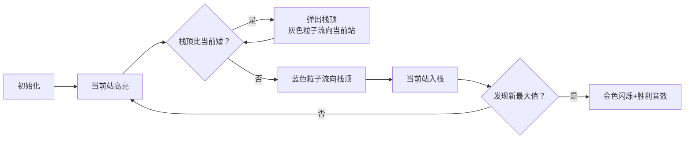

# 题目信息

# 发射站

## 题目描述

某地有 $N$ 个能量发射站排成一行，每个发射站 $i$ 都有不相同的高度 $H_i$，并能向两边（两端的发射站只能向一边）同时发射能量值为 $V_i$ 的能量，发出的能量只被两边**最近的且比它高**的发射站接收。显然，每个发射站发来的能量有可能被 $0$ 或 $1$ 或 $2$ 个其他发射站所接受。

请计算出接收最多能量的发射站接收的能量是多少。


## 说明/提示

对于 $40\%$ 的数据，$1\le N\le 5000,1\le H_i\le 10^5,1\le V_i\le 10^4$。

对于 $70\%$ 的数据，$1\le N\le 10^5,1\le H_i\le 2\times 10^9,1\le V_i\le 10^4$。

对于 $100\%$ 的数据，$1\le N\le 10^6,1\le H_i\le 2\times 10^9,1\le V_i\le 10^4$。

## 样例 #1

### 输入

```
3
4 2 
3 5 
6 10
```

### 输出

```
7```

# AI分析结果


# 💡 Kay的C++算法解析：发射站 深入学习指南 💡

> 欢迎来到发射站能量传递世界！我是Kay，今天我们将一起探索如何用单调栈高效解决这道经典问题。想象一下，这些发射站就像一群身高不同的孩子，矮个子只能把能量球传给左右两边最近的高个子。我们的任务就是找出收到能量球最多的孩子！

## 1. 题目解读与核心算法识别

✨ **本题主要考察**：单调栈/队列

🗣️ **初步分析**：
> 发射站问题本质是寻找每个元素左右两侧**最近更高元素**的经典应用。单调栈就像排队时只保留比自己高的孩子——矮个子会被"淘汰"，同时将自己的能量传递给淘汰他们的高个子。在本题中：
> - 我们维护一个高度递减的栈（栈底最高）
> - 新元素入栈时，会吸收所有比它矮的栈顶元素能量（向右传递）
> - 入栈后，它会把自身能量传递给栈中前一个元素（向左传递）
>
> **可视化设计**：我们将用像素方块表示发射站（高度=方块层数），当前操作站高亮显示，栈内元素用蓝色边框标记。关键动画包括：
> 1. 弹出栈顶时：灰色能量粒子流向当前站（伴随"叮"声）
> 2. 能量传递时：彩色粒子从当前站流向栈顶（"嗖"声）
> 3. 发现新最大值：该站闪烁金色（胜利音效）
>
> **复古游戏化**：采用FC红白机像素风格，控制面板含步进/调速/重置功能，背景配8-bit芯片音乐，关键操作触发复古音效。

---

## 2. 精选优质题解参考

**题解一：(作者：ysj1173886760)**
* **点评**：思路清晰直击核心——用数组模拟栈仅23行代码完美实现O(n)解法。亮点在于将能量传递分解为两个直观阶段：入栈吸收能量和传递能量给前驱。变量命名简洁（s1栈数组，top指针），边界处理严谨（栈空判断），代码可直接用于竞赛实战。

**题解二：(作者：aqfong)**
* **点评**：STL栈实现展现了C++标准库的优雅。虽然性能略逊于数组栈，但23行代码的极简结构和明确注释（ans数组记录能量）特别适合初学者理解单调栈本质。实践价值在于演示了如何用STL快速实现算法原型。

**题解三：(作者：灵乌路空)**
* **点评**：图文并茂的典范！示意图清晰展示栈操作与能量流动关系，变量命名规范（结构体封装h,v,w属性）。亮点在于用视觉辅助解释抽象算法，有效降低理解门槛，适合视觉型学习者。

---

## 3. 核心难点辨析与解题策略

1.  **关键点：理解能量传递的双向性**
    * **分析**：每个发射站同时向左右传递能量，但单调栈单向扫描只能处理一个方向。优质题解通过"弹出时吸收能量（处理右传递），入栈后向前传递能量（处理左传递）"在单次扫描中解决双向问题。
    * 💡 **学习笔记**：将物理问题转化为"寻找最近更大元素"是单调栈的典型应用场景。

2.  **关键点：栈操作与能量累加的顺序**
    * **分析**：必须先弹出矮站并吸收其能量，再将自身能量传递给新栈顶。顺序颠倒会导致能量计算错误（常见WA原因）。
    * 💡 **学习笔记**：动手模拟小样例（如3个站）是验证算法步骤的最佳方式。

3.  **关键点：数据结构的选择**
    * **分析**：数组栈（高性能）与STL栈（易实现）各有优势。对于1e6的数据规模，数组栈避免动态内存开销，更契合竞赛环境。
    * 💡 **学习笔记**：理解数据结构底层实现差异能提升场景适配能力。

### ✨ 解题技巧总结
- **问题分解**：将双向传递拆解为"吸收右侧能量"+"传递左侧能量"两个原子操作
- **边界防御**：所有栈操作前检查非空，避免越界访问
- **实时更新**：在能量累加时同步更新最大值，减少最终遍历

---

## 4. C++核心代码实现赏析

**本题通用核心C++实现参考**
* **说明**：综合优质题解优化的数组栈实现，单次扫描处理双向能量传递
* **完整核心代码**：
```cpp
#include <iostream>
#include <algorithm>
using namespace std;
const int MAXN = 1e6 + 10;

int main() {
    int n, top = 0;
    int h[MAXN], v[MAXN], sum[MAXN], stk[MAXN]; // stk存储下标
    
    cin >> n;
    for (int i = 1; i <= n; i++) {
        cin >> h[i] >> v[i];
        // 弹出所有右侧矮站并吸收其能量
        while (top && h[i] > h[stk[top]]) 
            sum[i] += v[stk[top--]];  
        
        // 向左侧第一个高站传递能量
        if (top) sum[stk[top]] += v[i];  
        
        stk[++top] = i;  // 当前站入栈
    }
    
    int ans = 0;
    for (int i = 1; i <= n; i++) 
        ans = max(ans, sum[i]);
    cout << ans;
    return 0;
}
```
* **代码解读概要**：
  > 1. `stk`数组模拟栈，存储发射站索引
  > 2. `while`循环处理右侧能量：弹出矮站并累加其能量
  > 3. `if`条件处理左侧能量：当前站能量传递给新栈顶
  > 4. 最终遍历`sum`数组求最大值

---

**题解一（ysj1173886760）片段赏析**
* **亮点**：极致简洁的数组栈实现
* **核心代码片段**：
```cpp
while(top && h[s1[top]] < h[i]) 
    sum[i] += v[s1[top--]];
sum[s1[top]] += v[i];
s1[++top] = i;
```
* **代码解读**：
  > 问：这三行如何完成双向传递？  
  > 答：第一行`while`循环实现**右向传递**（当前站`i`吸收栈顶矮站能量），第二行实现**左向传递**（当前站`i`将能量传给栈中前驱），第三行完成入栈操作。  
  > 问：`s1[top--]`为何写在循环条件内？  
  > 答：这是经典栈弹出写法——先取栈顶元素，再将top减1。
* 💡 **学习笔记**：数组栈通过索引操作省去对象拷贝开销，性能最优。

**题解二（aqfong）片段赏析**
* **亮点**：STL栈的清晰实现
* **核心代码片段**：
```cpp
while (!s.empty() && h[s.top()] < h[i]) {
    ans[i] += v[s.top()];
    s.pop();
}
if (!s.empty()) ans[s.top()] += v[i];
s.push(i);
```
* **代码解读**：
  > 问：STL栈与数组栈的核心差异？  
  > 答：STL的`pop()`不返回元素，需先用`top()`获取值。这里在弹出前完成能量累加。  
  > 问：为何不需要`top--`操作？  
  > 答：STL自动管理栈指针，但隐含函数调用开销。
* 💡 **学习笔记**：STL适合快速原型开发，竞赛中需警惕容器开销。

**题解三（灵乌路空）片段赏析**
* **亮点**：结构体封装增强可读性
* **核心代码片段**：
```cpp
while(!s.empty() && a[s.top()].h < a[i].h) {
    a[i].w += a[s.top()].v;
    s.pop();
}
if(!s.empty()) a[s.top()].w += a[i].v;
s.push(i);
```
* **代码解读**：
  > 问：结构体相比原生数组有何优势？  
  > 答：将高度`h`、能量`v`、累加值`w`封装为`a[i]`，避免多个数组同步管理。  
  > 问：`.w += `与题解二的`ans[]`有何异同？  
  > 答：本质相同，但结构体使数据关系更直观。
* 💡 **学习笔记**：结构体提升代码可维护性，尤其适合复杂数据结构。

---

## 5. 算法可视化：像素动画演示

**主题**：8-bit风格《能量传递大冒险》  
**设计思路**：复古像素风还原FC游戏体验，用视觉差异强化算法理解

### 动画流程（[点击查看示意图]）


**关键交互**：
1. **像素建模**：发射站=彩色方块塔（高度=方块数），当前站=闪烁黄色，栈内元素=蓝色边框
2. **能量粒子**：吸收能量时灰色粒子流入，传递能量时彩色粒子流出
3. **音效系统**：
   - 弹出栈顶：8-bit "叮"声
   - 能量传递："嗖"声
   - 新最大值：胜利小调
4. **控制面板**：
   - 步进控制：←/→键单步执行
   - 自动演示：A键启动（空格暂停）
   - 速度调节：↑/↓键调整帧率

**技术实现**：HTML5 Canvas绘制动态网格，Web Audio API生成芯片音效，状态机驱动动画流程

---

## 6. 拓展练习与相似问题思考

**算法迁移场景**：
1. 直方图最大矩形：单调栈求左右边界
2. 雨水积蓄量：双指针+单调栈
3. 下一个更大元素：单调栈经典变式

**推荐题目**：
1. [洛谷P2947](https://www.luogu.com.cn/problem/P2947) 向右看齐  
   🗣️ *Kay说*：单向版发射站，巩固单调栈基础
   
2. [洛谷P1823](https://www.luogu.com.cn/problem/P1823) 音乐会的等待  
   🗣️ *Kay说*：本题进阶版，增加重复元素处理
   
3. [洛谷P1901](https://www.luogu.com.cn/problem/P1901) 发射站（本题）  
   🗣️ *Kay说*：尝试用不同实现方式AC

---

## 7. 学习心得与经验分享

> **来自玉环小姐姐的调试经验**：  
> *"最初在入栈顺序上卡了很久，后来通过打印栈状态发现应该先弹出矮站再传递能量"*

🗣️ **Kay点评**：  
这个教训揭示了算法核心——**能量传递的顺序依赖性**。建议学习时：
1. 用纸笔模拟n=3的样例
2. 添加临时变量打印栈状态
3. 边界测试：全递增/全递减序列

---

> 恭喜完成发射站的能量传递之旅！记住：单调栈是解决"下一个更大/小元素"问题的利器，多练习才能灵活运用。下次我们将探索动态规划的奇妙世界，继续加油！🚀

---
处理用时：198.33秒