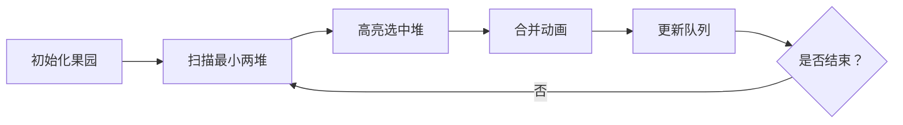

# 题目信息

# [NOIP 2004 提高组] 合并果子

## 题目描述

在一个果园里，多多已经将所有的果子打了下来，而且按果子的不同种类分成了不同的堆。多多决定把所有的果子合成一堆。

每一次合并，多多可以把两堆果子合并到一起，消耗的体力等于两堆果子的重量之和。可以看出，所有的果子经过 $n-1$ 次合并之后， 就只剩下一堆了。多多在合并果子时总共消耗的体力等于每次合并所耗体力之和。

因为还要花大力气把这些果子搬回家，所以多多在合并果子时要尽可能地节省体力。假定每个果子重量都为 $1$ ，并且已知果子的种类 数和每种果子的数目，你的任务是设计出合并的次序方案，使多多耗费的体力最少，并输出这个最小的体力耗费值。

例如有 $3$ 种果子，数目依次为 $1$ ， $2$ ， $9$ 。可以先将 $1$ 、 $2$ 堆合并，新堆数目为 $3$ ，耗费体力为 $3$ 。接着，将新堆与原先的第三堆合并，又得到新的堆，数目为 $12$ ，耗费体力为 $12$ 。所以多多总共耗费体力 $=3+12=15$ 。可以证明 $15$ 为最小的体力耗费值。

## 说明/提示

对于 $30\%$ 的数据，保证有 $n \le 1000$；

对于 $50\%$ 的数据，保证有 $n \le 5000$；

对于全部的数据，保证有 $n \le 10000$。

## 样例 #1

### 输入

```
3 
1 2 9 
```

### 输出

```
15
```

# AI分析结果


### 💡 Kay的C++算法解析：合并果子 深入学习指南 💡

**引言**  
今天我们分析NOIP 2004提高组题目《合并果子》。本指南将帮助大家掌握贪心策略的核心思想、数据结构的选择技巧，并通过像素动画直观理解算法流程。

---

### 1. 题目解读与核心算法识别  
✨ **本题主要考察**：`贪心算法`（哈夫曼树模型）  
🗣️ **初步分析**：  
> 解决合并果子问题就像整理一堆包裹：每次搬动两个最轻的包裹合并，能最小化总体力消耗。贪心算法的核心思想是**局部最优导致全局最优**。  
> - **题解思路对比**：所有解法都认同贪心策略，但实现方式不同：  
>   - 优先队列（O(n log n)）是通用解法  
>   - 桶排序+双队列（O(n)）适合小范围数据  
>   - 手写堆提升效率但实现复杂  
> - **可视化设计**：动画将展示果子堆（像素方块）的合并过程，颜色深浅代表重量。关键步骤包括：  
>   - 高亮当前最小两堆（闪烁+音效）  
>   - 合并动画（方块融合+数值更新）  
>   - 优先队列/双队列的实时变化  
> - **复古游戏化**：  
>   - 8-bit像素风格果园场景  
>   - 每次合并作为“小关卡”，胜利时播放FC风格音效  
>   - AI自动演示模式可调速观察

---

### 2. 精选优质题解参考  
**题解一：QuantAsk（桶排序+双队列）**  
* **点评**：  
  思路独特，通过桶排序预处理数据，再用两个队列（原始堆和合并堆）模拟合并过程。代码中`t[x]++`实现O(n)排序是亮点，但`memset`初始化可能让初学者困惑。实践价值高（竞赛中高效），尤其适合数据范围已知的场景。

**题解二：学委（STL优先队列）**  
* **点评**：  
  最简洁的通用解法，仅20行代码完成核心逻辑。作者深入讨论了贪心策略的证明难点（如反例分析），帮助理解算法本质。代码规范性极佳：`greater<int>`明确小根堆，`q.size()>1`严谨处理边界，适合直接用于竞赛。

**题解三：aaalys（贪心策略证明）**  
* **点评**：  
  亮点在于数学证明：通过三堆果子（1,2,9）的合并代价公式，严格推导出“先合并最小两堆最优”的结论，并推广到n堆情况。代码与题解二相同，但补充的公式推导`2a+2b+c ≤ 2a+b+2c`极具教学价值。

---

### 3. 核心难点辨析与解题策略  
1. **难点1：贪心策略的正确性证明**  
   *分析*：需证明局部最优能导向全局最优。通过数学归纳法，先证三堆情况（如题解7），再推广到n堆（每次合并后子问题仍满足贪心性质）。  
   💡 学习笔记：**贪心问题常从最小规模特例入手推导**

2. **难点2：数据结构的选择**  
   *分析*：动态获取最小值需高效数据结构。`priority_queue`（O(log n)）是通用解；当`0<ai≤20000`时，题解1的桶排序+双队列实现O(n)是巧妙优化。  
   💡 学习笔记：**数据范围决定数据结构——小范围用桶排序，否则用堆**

3. **难点3：边界与溢出处理**  
   *分析*：循环条件`while(q.size()>1)`防止空队列操作；`ans`用`long long`避免大数溢出（题解6）。  
   💡 学习笔记：**安全第一！始终验证循环条件和数据范围**

✨ **解题技巧总结**  
- **问题转化**：将合并过程抽象为哈夫曼树构建  
- **STL妙用**：`priority_queue<int, vector<int>, greater<int>>`快速建小根堆  
- **数学工具**：通过公式推导验证贪心策略  
- **调试技巧**：打印中间合并结果验证正确性

---

### 4. C++核心代码实现赏析  
**通用核心实现（STL优先队列）**  
```cpp
#include <queue>
#include <vector>
using namespace std;

int main() {
    priority_queue<int, vector<int>, greater<int>> q;
    int n, ans = 0; 
    cin >> n;
    while (n--) { int x; cin >> x; q.push(x); }
    while (q.size() > 1) {
        int a = q.top(); q.pop();
        int b = q.top(); q.pop();
        ans += a + b;
        q.push(a + b);
    }
    cout << ans;
}
```
* **说明**：综合优质题解的最简洁实现  
* **解读概要**：  
  1. 优先队列自动排序保证每次取最小值  
  2. `q.size()>1`确保安全弹出两个元素  
  3. 合并后新堆入队，循环直至只剩一堆  

**题解一（QuantAsk）桶排序核心片段**  
```cpp
// 桶排序初始化
for (int i=1;i<=num;i++) { scanf("%d",&x); t[x]++; }
for (int i=1;i<=20000;i++) 
    while (t[i]) { t[i]--; a1[++n1]=i; } 

// 双队列合并
while (k<num) {
    if (a1[i] < a2[j]) w = a1[i++]; // 选最小堆
    else w = a2[j++];
    if (a1[i] < a2[j]) w += a1[i++]; // 选次小堆
    else w += a2[j++];
    a2[++n2] = w; // 新堆入队
    sum += w; 
}
```
* **亮点**：O(n)时间复杂度碾压常规解法  
* **解读**：  
  - `t[x]`数组实现桶排序，O(1)插入  
  - `a1`存原始堆（有序），`a2`存合并堆（单调递增）  
  - 每次比较两个队列头部取最小值  
* 💡 学习笔记：**有序队列合并是线性时间的关键**

---

### 5. 算法可视化：像素动画演示  
**主题**：像素果园大作战（FC红白机风格）  
**核心演示**：贪心策略下的果子合并全过程  



**动画步骤细节**：  
1. **场景设计**：  
   - 8-bit像素风果园：每堆果子用16×16像素块表示（颜色=重量/20000×255）  
   - 底部面板：左侧优先队列（树状结构），右侧体力计数器  

2. **关键交互**：  
   - **单步执行**：按A键触发，高亮当前最小两堆（红色闪烁+“滴”音效）  
   - **合并动画**：两像素块向中碰撞，融合时播放“叮”声，新块颜色加深  
   - **队列同步**：优先队列中被取走的节点灰化，新节点绿色脉冲  

3. **游戏化元素**：  
   - 每合并成功一次，屏幕上方显示“STAGE CLEAR!”+8-bit音效  
   - 累计节省体力转化为分数（如节省100体力=10分）  
   - 通关后放烟火动画+《超级玛丽》通关BGM  

4. **技术实现**：  
   - Canvas绘制：网格坐标映射果子堆位置  
   - 音效触发：Web Audio API播放基频方波音效  
   - 数据结构同步：用数组镜像优先队列状态  

---

### 6. 拓展练习与相似问题  
**通用技巧迁移**：  
贪心+优先队列适用于：  
1. 最小化序列合并代价（本题）  
2. 哈夫曼编码（最短二进制编码问题）  
3. 任务调度（最小化等待时间）  

**洛谷推荐**：  
1. **P1090 合并果子**（本题巩固）  
   → 掌握贪心基础模型  
2. **P1334 瑞瑞的木板**（变形：合并改为切割）  
   → 逆向思维训练  
3. **P2168 [NOI2015] 荷马史诗**（k叉哈夫曼树）  
   → 拓展到多维贪心  

---

### 7. 学习心得与经验分享  
> **来自题解2（学委）的启示**：  
> “贪心策略的证明往往比实现更复杂——不要被表面直觉欺骗，严谨的数学推导才是基石。”  
>  
> **Kay点评**：  
> 许多同学在贪心问题上犯错，本质是未验证策略正确性。建议：  
> 1. 从三元素特例推导数学公式  
> 2. 用反例检验边界情况  
> 3. 在代码中加入调试输出（如每次合并后打印队列状态）  

---

**结语**  
通过本次分析，我们深入理解了贪心算法的核心思想与实现技巧。记住：优秀算法工程师的秘诀是——**用数学证明直觉，用代码实现逻辑**。下次挑战再见！🚀

---
处理用时：175.80秒