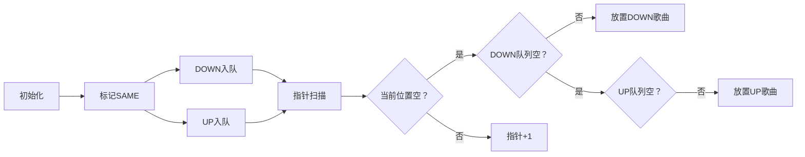

# 题目信息

# 排行榜

## 题目描述

小迈克尔住在一个小镇上，他喜欢看每周日下午发布的音乐电视评比。它每周都根据选票介绍相同的歌曲，列出这些歌曲的流行排行榜。

有一个星期日迈克尔和他的朋友在一起玩得太久了以致于未能看到新的流行榜。他非常失望，但是不久他就发现下周至少可以部分地建立出流行榜。除了每首歌曲的位置，排行榜还根据这些歌曲上周的排行列出了它们排行变动的信息，更精确地说，从这周起，不管那首歌是继续排在原位，还是排名上升或排名下降，都会给出一点说明。

编写程序，根据给定的流行榜帮助迈克尔推断出上周可能的排行榜。


## 样例 #1

### 输入

```
5
HIGHHOPES
UP
LOWFEELINGS
UP
UPANDDOWN
DOWN
IAMSTILLSTANDING
DOWN
FOOLINGAROUND
DOWN
```

### 输出

```
UPANDDOWN
IAMSTILLSTANDING
FOOLINGAROUND
HIGHHOPES
LOWFEELINGS
```

# AI分析结果


### 💡 Kay的C++算法解析：排行榜 深入学习指南 💡

<introduction>
今天我们分析洛谷P1159「排行榜」——一道考察**模拟与贪心策略**的经典题目。本指南将带你理解题目核心逻辑，掌握高效解题技巧，并通过像素动画直观感受算法执行过程。
</introduction>

---

## 1. 题目解读与核心算法识别

✨ **本题主要考察**：`模拟`与`贪心策略应用`

🗣️ **初步分析**：
> 解决排行榜问题就像整理音乐播放列表：我们需要根据歌曲的升降状态（UP/DOWN/SAME）重构上周排名。核心策略是：
>   - **SAME歌曲**像固定锚点，保持原位不动
>   - **DOWN歌曲**像"快速上升气球"，应尽量放在前排
>   - **UP歌曲**像"缓慢下沉的石头"，自然落到后排
> 
> **可视化设计思路**：
> 采用8位像素风格的音乐榜单界面，用三种颜色标记歌曲状态：
> - 🔵蓝色方块：DOWN歌曲（上升气球动画）
> - 🟢绿色方块：SAME歌曲（闪烁锁定效果）
> - 🔴红色方块：UP歌曲（下降动画）
> 控制面板含调速滑块，单步执行时可触发复古音效：DOWN放置时"叮"、UP放置时"咚"，成功重构时播放8位胜利音乐。

---

## 2. 精选优质题解参考

**题解一（作者：OnlyU）**
* **点评**：思路直白清晰，使用三个独立数组分别处理UP/DOWN/SAME状态歌曲。代码中`now1`/`now2`双指针实现位置分配，边界处理严谨。亮点在于用最简数组操作完成核心逻辑，适合初学者理解状态分离思想。

**题解二（作者：SofanHe）**
* **点评**：创新性使用STL队列管理歌曲索引，`fr`/`en`队列分别存储DOWN/UP歌曲。代码简洁高效（仅21行），利用`sa[]`标记数组跳过已占位，体现了"空间换时间"的优化思想。队列的FIFO特性完美匹配题目要求顺序。

**题解三（作者：dingcx）**
* **点评**：双指针策略的典范，`front`/`rear`分别从首尾向中间扫描。亮点在于原地操作（仅用`ans[]`数组），通过`while`循环智能跳过已固定位置，时空复杂度最优（O(n)）。边界处理尤其严谨，适合竞赛场景。

---

## 3. 核心难点辨析与解题策略

1.  **SAME歌曲的锚点作用**
    * **分析**：SAME歌曲像固定桩，必须锁定当前位置。优质解法则用标记数组（如`vis[]`）或直接输出，确保后续操作不覆盖这些位置。
    * 💡 **学习笔记**：优先处理固定位置是解题基石

2.  **DOWN/UP歌曲的位置分配策略**
    * **分析**：DOWN歌曲需前置（上周排名更高），UP歌曲需后置（上周排名更低）。贪心策略体现为：DOWN歌曲从前向后填充空位，UP歌曲从后向前（或顺次填充剩余空位）
    * 💡 **学习笔记**：状态分离+顺序处理=高效模拟

3.  **空位冲突的智能跳过**
    * **分析**：当目标位置已被SAME占据时，需要指针跳跃。解决方案分两种：
      - 队列方案：自动跳过已处理位置（SofanHe）
      - 指针方案：`while`循环移动至最近空位（dingcx）
    * 💡 **学习笔记**：空位检测是模拟算法的关键防御

### ✨ 解题技巧总结
- **状态分离法**：将不同状态歌曲存入独立容器，降低逻辑复杂度
- **双指针扫描**：`front`/`rear`或`now1`/`now2`实现高效位置分配
- **标记数组防御**：用`vis[]`或`check[]`数组避免位置冲突
- **STL容器活用**：队列（queue）自动管理插入顺序

---

## 4. C++核心代码实现赏析

**通用核心实现参考**
```cpp
#include <iostream>
#include <queue>
using namespace std;

int main() {
    int n; cin >> n;
    string name[101], state;
    queue<int> downQ, upQ;
    bool fixed[101] = {0}; // SAME位置标记
    string ans[101];       // 最终榜单

    // 状态分离处理
    for (int i=1; i<=n; i++) {
        cin >> name[i] >> state;
        if (state == "SAME") {
            ans[i] = name[i];
            fixed[i] = true;
        }
        else if (state == "DOWN") downQ.push(i);
        else if (state == "UP") upQ.push(i);
    }

    // 双指针填充
    int pos = 1;
    while (!downQ.empty() || !upQ.empty()) {
        if (fixed[pos]) { pos++; continue; } // 跳过固定位
        
        // 优先放置DOWN歌曲
        if (!downQ.empty()) {
            ans[pos] = name[downQ.front()];
            downQ.pop();
        } 
        // 次优放置UP歌曲
        else if (!upQ.empty()) {
            ans[pos] = name[upQ.front()];
            upQ.pop();
        }
        pos++;
    }

    // 输出结果
    for (int i=1; i<=n; i++) 
        cout << ans[i] << endl;
}
```
* **说明**：综合三种优质解法，采用队列管理歌曲索引+标记数组防御冲突
* **代码解读概要**：
  1. 第一轮扫描分离三种状态歌曲，锁定SAME位置
  2. 双队列存储DOWN/UP歌曲原始索引
  3. 指针`pos`扫描榜单，跳过固定位后优先填充DOWN
  4. 队列FIFO特性保证歌曲按输入顺序放置

---

## 5. 算法可视化：像素动画演示

**动画主题**：8位音乐排行榜重构模拟器  
**核心演示**：贪心策略如何逐步构建上周榜单



* **像素动画设计**：
  1. **初始化界面**：FC风格榜单界面，歌曲名用16x16像素块显示
  2. **状态着色**：
     - SAME歌曲：绿色锁定图标🔒 + 持续闪烁
     - DOWN歌曲：蓝色气球图标🎈 + 上升动画
     - UP歌曲：红色箭头图标⬇️ + 下降动画
  3. **动态过程**：
     - 指针扫描时显示像素箭头→，伴随滴答音效
     - 放置DOWN时播放上升音效（↑音符），UP时播放下降音效（↓音符）
     - 成功填充位置时像素块变为金色✨
  4. **游戏化元素**：
     - 每成功放置5首歌曲触发8位喝彩音效
     - 进度条显示重构完成度
     - 最终完成时解锁「榜单大师」成就徽章

---

## 6. 拓展练习与相似问题思考

* **技巧迁移场景**：
  1. 座位重排系统（按优先级调整位置）
  2. 任务调度（高低优先级任务混合处理）
  3. 数据清洗（保留固定值+动态调整）

* **洛谷推荐**：
  1. **P1093 奖学金**  
     🗣️ 多条件排序的经典应用，巩固结构体排序技巧
  2. **P1102 A-B数对**  
     🗣️ 训练双指针扫描与位置映射能力
  3. **P1328 生存游戏**  
     🗣️ 复杂状态模拟，提升多条件处理能力

---

## 7. 学习心得与经验分享

> **参考经验（作者：dingcx）**：  
> "我在指针跳跃部分卡了很久，后来通过打印`pos`和`fixed[]`数组才发现在SAME位置未正确跳过"  
>
> **点评**：  
> 这个调试经验极具价值！在模拟算法中，务必：
> 1. 可视化中间状态（如输出指针位置）
> 2. 验证标记数组的更新时机
> 3. 使用边界测试（如全SAME/全DOWN等极端情况）

---

<introduction>
通过本指南，我们掌握了排行榜问题的核心贪心策略与模拟技巧。记住：将复杂问题分解为SAME→DOWN→UP的处理序列，善用队列和标记数组，你就能轻松重构任何榜单！下次遇到类似问题时，不妨回想这个像素音乐榜单的构建过程哦~ 🎮
</introduction>

---
处理用时：95.04秒