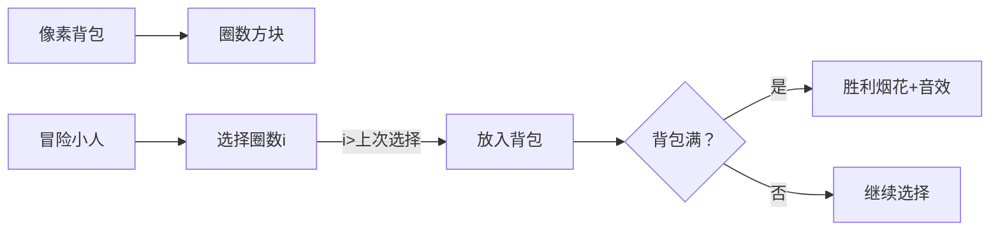

# 题目信息

# 跑步

## 题目描述

路人甲准备跑 $n$ 圈来锻炼自己的身体，他准备分多次（$\gt1$）跑完，每次都跑正整数圈，然后休息下再继续跑。

为了有效地提高自己的体能，他决定每次跑的圈数都必须比上次跑的多。

可以假设他刚开始跑了 $0$ 圈，那么请问他可以有多少种跑完这 $n$ 圈的方案？

## 说明/提示

#### 数据规模与约定

对于 $100\%$ 的数据，保证 $5\le n\le 500$。

## 样例 #1

### 输入

```
212```

### 输出

```
995645335```

# AI分析结果


### 💡 Kay的C++算法解析：跑步 深入学习指南 💡

#### 引言
今天我们一起分析"跑步"这道动态规划经典题。本指南将帮助大家掌握严格递增序列求和的方案数计算技巧，理解背包DP的精妙应用。

---

### 1. 题目解读与核心算法识别
✨ **本题主要考察**：`动态规划（背包类）`  
🗣️ **初步分析**：
> 解决本题的关键在于将"严格递增的跑步圈数序列"转化为背包问题。想象你有一个容量为n的背包，圈数1~n是物品（体积=价值），要求**所选物品组成严格递增序列**。DP状态`dp[i]`表示恰好装满容量i的方案数。
> - **核心思路**：通过倒序枚举背包容量，保证每个圈数只选一次；从小到大的枚举顺序自然形成递增序列。
> - **可视化设计**：像素动画将展示背包填充过程，物品选择时高亮当前圈数方块，背包容量条实时更新，胜利时播放8-bit音效。
> - **游戏化设计**：采用《俄罗斯方块》式像素风格，每成功放置一个更大的"圈数方块"得10分，填满背包时触发胜利动画。

---

### 2. 精选优质题解参考
**题解一（作者：翼德天尊）**  
* **点评**：最简洁的一维背包DP实现。用`ans[j] += ans[j-i]`完成状态转移，倒序遍历巧妙避免重复选择。变量命名清晰（`ans`数组直指答案），边界处理严谨（`ans[0]=1`初始化）。O(n²)复杂度完美匹配数据范围，竞赛实用性强。

**题解二（作者：AveMarina）**  
* **点评**：明确指出01背包本质并对比完全背包模板。通过`f[0]=1`和`f[j] += f[j-i]`实现优雅转移，代码模块化强（分离状态转移与结果输出）。特别亮点：用注释强调开long long的实践细节，避免常见陷阱。

**题解三（作者：天才颓废学家）**  
* **点评**：从DFS暴力到二维DP再到一维DP的完整优化路线。通过`f[j] += f[j-i]`实现降维优化，用`f[n]-1`精准处理边界条件。讲解中穿插鲁迅式幽默（"DP总能再压一维"），生动展示算法优化思维。

---

### 3. 核心难点辨析与解题策略
1. **难点：如何避免重复计数？**  
   *分析*：通过倒序枚举背包容量（`for(j=n;j>=i;j--)`），确保每个圈数仅被选用一次，避免完全背包的重复选择问题。  
   💡 **学习笔记**：倒序遍历是01背包的灵魂操作！

2. **难点：如何保证序列严格递增？**  
   *分析*：从小到大枚举圈数i（`for(i=1;i<=n;i++)`），后选的圈数必然大于先选，天然满足递增性。  
   💡 **学习笔记**：枚举顺序决定序列性质！

3. **难点：边界条件意义不明？**  
   *分析*：`dp[0]=1`表示"和为0"有1种方案（不选任何圈数），这是状态转移的基石；`dp[n]-1`减去"单次跑完n圈"的非法方案。  
   💡 **学习笔记**：零状态是DP的种子！

#### ✨ 解题技巧总结
- **技巧A（问题转化）**：将抽象约束转化为背包模型——圈数即物品，递增性由枚举顺序保证
- **技巧B（维度压缩）**：二维状态`f[i][j]`可优化为一维`f[j]`，j逆序更新
- **技巧C（边界艺术）**：`dp[0]=1`和`dp[n]-1`是精确控制方案数的关键
- **技巧D（类型选择）**：n≤500时优先选O(n²)的一维DP而非O(n³)二维DP

---

### 4. C++核心代码实现赏析
**通用核心实现参考**  
*说明*：综合优质题解的一维背包DP，空间优化至O(n)  
```cpp
#include <iostream>
using namespace std;
typedef long long LL;
const int N=510;

int main() {
    int n; cin>>n;
    LL dp[N]={1}; // 初始化dp[0]=1
    for(int i=1;i<=n;i++)
        for(int j=n;j>=i;j--)
            dp[j] += dp[j-i];
    cout<<dp[n]-1; // 减去一次跑完的方案
}
```
*代码解读概要*：  
1. `dp[0]=1` 初始化：和为0有1种方案  
2. 外层`i`枚举圈数（物品），内层`j`倒序枚举背包容量  
3. `dp[j] += dp[j-i]` 表示"选当前圈数i"的方案累加  
4. 最终减去`dp[n]`中非法单次方案

---

**题解一（翼德天尊）核心片段**  
```cpp
ans[0]=1; 
for(int i=1;i<=n;i++) 
    for(int j=n;j>=i;j--) 
        ans[j] += ans[j-i]; 
cout<<ans[n]-1;
```
*亮点*：极简四行实现完整DP  
*代码解读*：  
> - `ans[0]=1`：动态规划的"种子"，没有它所有状态都是0  
> - **倒序j的重要性**：正序更新会变成完全背包（允许多次选同一圈数）  
> - 为何最后减1？因为题目要求>1次完成，需排除只跑1次的方案  

💡 **学习笔记**：DP的本质是"记忆化递推"

**题解二（AveMarina）对比分析**  
```cpp
// 01背包（本题解法）
for(j=n;j>=i;j--) f[j]+=f[j-i];

// 完全背包（对比）
for(j=i;j<=n;j++) f[j]+=f[j-i];
```
*亮点*：通过遍历顺序差异揭示算法本质  
*代码解读*：  
> - 内层循环方向决定物品选择机制  
> - 正序j=>物品无限用（完全背包）  
> - 逆序j=>物品用一次（01背包）  
> - 本题需01背包特性保证圈数不重复  

💡 **学习笔记**：遍历顺序是背包问题的命门！

**题解三（天才颓废学家）降维艺术**  
```cpp
f[0]=1;
for(i=1;i<=n;i++)
    for(j=n;j>=i;j--)
        f[j]=f[j]+f[j-i]; // 状态转移方程
```
*亮点*：用`f[j]=f[j]+f[j-i]`显式展现转移关系  
*代码解读*：  
> - `f[j]`：不选当前圈数i的方案数（继承状态）  
> - `f[j-i]`：选当前圈数i的方案数（消耗i容量）  
> - 两者相加构成新状态，完美演绎DP无后效性  

💡 **学习笔记**：DP状态转移=子问题重组

---

### 5. 算法可视化：像素动画演示
**主题**：《圈数冒险者》8-bit像素闯关  
**核心演示**：背包填充过程演绎严格递增序列生成  

**游戏化设计**：  


**关键帧步骤**：  
1. **初始化**：左侧显示像素背包（n格容量条），右侧排列1~n的圈数方块（FC红白机风格）
2. **选择阶段**：冒险小人移动到圈数i方块，上次选择方块高亮红光，比它大的方块亮绿灯
3. **放入动画**：选定方块飞入背包，背包容量条填充对应格数，播放"叮"音效
4. **AI演示模式**：自动选择最小可行圈数，展示最优递增序列构建过程
5. **胜利判定**：背包完全填满时，触发烟花动画+胜利音效，显示总方案数

**交互控制面板**：  
- 速度滑块：调节单步执行速度（0.5x~5x）  
- 单步/连续模式切换  
- 重置按钮：清空背包和选择记录  
- 音效开关：开启/关闭操作音效  

---

### 6. 拓展练习与相似问题思考
**通用技巧迁移**：  
背包DP求方案数模型适用于：  
1. 严格递增序列求和问题（本题）  
2. 硬币组合问题（如凑金额方案数）  
3. 带限制条件的子集生成（如元素和特定值）  

**洛谷推荐**：  
1. **P1048 采药**  
   → 基础01背包，巩固状态转移设计  
2. **P1025 数的划分**  
   → 变式训练：无序正整数划分方案数  
3. **P1616 疯狂的采药**  
   → 对比完全背包与01背包差异  

---

### 7. 学习心得与经验分享
> **作者经验（天才颓废学家）**：  
> "最初用DFS暴力仅50分，三重循环DP125ms通过，最终优化到一维DP仅2ms。数据范围决定算法选择！"  
>  
> **Kay点评**：  
> 这印证了DP的核心优势——**以空间换时间**。n≤500时：  
> - DFS：O(2ⁿ) 超时 ❌  
> - 二维DP：O(n³) 压线过 ✅  
> - 一维DP：O(n²) 最优解 ⭐  

---

### 结语  
通过背包DP的妙用，我们解决了严格递增序列求和问题。记住：  
1. **倒序遍历**保物品唯一性  
2. **顺序枚举**造递增序列  
3. **dp[0]=1**是状态起点  
4. **dp[n]-1**去非法方案  

下次遇到方案计数问题，不妨先思考：能否转化为背包模型？继续加油，少年！🚀

---
处理用时：149.10秒