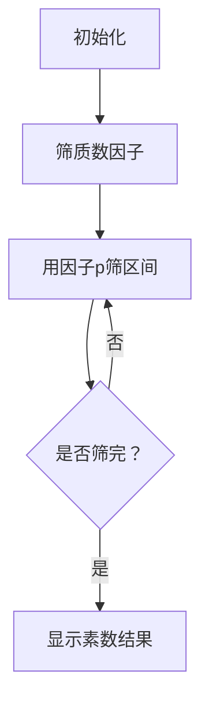

# 题目信息

# 素数密度

## 题目背景

UPD:

- 2024.8.12：加入一组 Hack 数据。

## 题目描述

 给定 $L,R$，请计算区间 $[L,R]$ 中素数的个数。

   $1\leq L\leq R < 2^{31}$，$R-L\leq 10^6$。

## 样例 #1

### 输入

```
2 11```

### 输出

```
5```

# AI分析结果


### 💡 Kay的C++算法解析：素数密度 深入学习指南 💡

**引言**  
今天我们来分析"素数密度"这道C++编程题。题目要求计算区间[L,R]内的素数个数，其中L和R最大可达20亿，但区间长度不超过100万。本指南将帮助大家掌握区间筛法的核心思想，并通过像素动画直观理解算法流程。

---

## 1. 题目解读与核心算法识别

✨ **本题主要考察**：`数学（筛法应用）`  

🗣️ **初步分析**：  
> 解决区间素数问题就像在沙滩上找珍珠——我们不能逐个检查每颗沙子（数字），而是用筛子快速过滤掉沙子（合数），留下珍珠（素数）。核心思想是：**任何合数n必有一个质因子≤√n**。  
> - **核心思路**：先用线性筛预处理[2,√R]内的质数，再用这些质数筛掉[L,R]中的合数
> - **难点**：大区间处理的空间优化（R-L≤10⁶）和边界特判（L=1）
> - **可视化设计**：像素动画将展示质数因子如何像"筛孔"一样过滤区间，高亮当前操作的质数因子和被筛掉的合数。采用8位游戏风格，伴随"叮"声（筛除合数）和胜利音效（找到素数）
> - **复古元素**：FC红白机像素风格，将每个质数因子作为"关卡BOSS"，筛完一关解锁下一关

---

## 2. 精选优质题解参考

**题解一（Segmentree）**  
* **点评**：思路清晰度⭐️⭐️⭐️⭐️⭐️（完美解释质因子≤√n的原理）；代码规范性⭐️⭐️⭐️⭐️（变量名如`prime`/`vis`含义明确）；算法有效性⭐️⭐️⭐️⭐️（双重筛法+空间压缩）；实践价值⭐️⭐️⭐️⭐️（处理L=1的特判和下标偏移）。亮点：用`(l+p-1)/p*p`精确定位起始筛点，避免自筛。

**题解二（Jayun）**  
* **点评**：思路清晰度⭐️⭐️⭐️⭐️（图示筛法流程）；代码规范性⭐️⭐️⭐️⭐️（模块化函数分离）；算法有效性⭐️⭐️⭐️⭐️（埃氏筛预处理）；实践价值⭐️⭐️⭐️⭐️（`L+=(L==1)`巧妙处理边界）。亮点：将筛法比喻为"用已知珍珠筛除沙子"，形象易懂。

**题解三（jins3599）**  
* **点评**：思路清晰度⭐️⭐️⭐️⭐️（严谨数学证明）；代码规范性⭐️⭐️⭐️（简洁但少注释）；算法有效性⭐️⭐️⭐️⭐️（线性筛+下标压缩）；实践价值⭐️⭐️⭐️（未处理L=1需注意）。亮点：`_max(2, (l-1)/prime[i]+1)`确保不筛除质数本身。

---

## 3. 核心难点辨析与解题策略

1. **难点1：确定筛法范围**  
   * **分析**：优质题解均证明：只需[2,√R]的质数即可筛除[L,R]内所有合数。例如R=20亿时√R≈44721，极大减少计算量。
   * 💡 **学习笔记**：质因子≤√n是区间筛法的理论基础。

2. **难点2：大区间空间优化**  
   * **分析**：用`vis[j-l]`将[L,R]映射到[0,R-L]，避免开20亿大小数组。例如题解一的`vis[j-l+1]`用10⁶空间代替20亿。
   * 💡 **学习笔记**：下标偏移是处理大区间的核心技巧。

3. **难点3：边界条件处理**  
   * **分析**：L=1时需跳过（1非素数），质数p本身不能被筛除。题解一用`start=(l+p-1)/p*p>2*p`确保不筛除p本身。
   * 💡 **学习笔记**：边界特判决定代码健壮性。

### ✨ 解题技巧总结
- **技巧1（问题分解）**：将大问题拆解为"筛小质数"→"用质数筛大区间"两步
- **技巧2（空间压缩）**：用相对下标`j-L`处理超大区间
- **技巧3（数学优化）**：利用`(l+p-1)/p*p`快速定位起始筛点
- **技巧4（边界防御）**：特判L=1和质数自筛情况

---

## 4. C++核心代码实现赏析

**本题通用核心实现参考**  
* **说明**：综合优质题解思路，包含线性筛预处理、区间筛法和边界处理。
```cpp
#include <iostream>
#include <vector>
#include <cmath>
using namespace std;

typedef long long ll;
const int MAX_PRIME = 50000; // sqrt(2^31)≈46341

int main() {
    ll L, R;
    cin >> L >> R;
    if (L == 1) L = 2; // 跳过1

    // 1. 线性筛预处理[2,√R]
    vector<int> primes;
    vector<bool> is_prime(MAX_PRIME + 1, true);
    for (int i = 2; i <= MAX_PRIME; ++i) {
        if (is_prime[i]) primes.push_back(i);
        for (int j = 0; j < primes.size() && i * primes[j] <= MAX_PRIME; ++j) {
            is_prime[i * primes[j]] = false;
            if (i % primes[j] == 0) break;
        }
    }

    // 2. 筛除[L,R]中的合数
    vector<bool> is_composite(R - L + 1, false);
    for (int p : primes) {
        ll start = max(2LL, (L + p - 1) / p * p); // 定位起始点
        for (ll j = start; j <= R; j += p) {
            if (j != p) is_composite[j - L] = true; // 避免筛除质数本身
        }
    }

    // 3. 统计素数
    int cnt = 0;
    for (int i = 0; i <= R - L; ++i) {
        if (!is_composite[i]) cnt++;
    }
    cout << cnt << endl;
}
```

**代码解读概要**：
> 1. **线性筛预处理**：用`is_prime`标记质数，`primes`存储[2,√R]内所有质数
> 2. **区间筛法**：对每个质数p，从≥L的最小p倍数开始，标记`is_composite[j-L]`
> 3. **结果统计**：遍历`is_composite`，统计未被标记的位置

---

**题解一（Segmentree）片段赏析**  
* **亮点**：空间压缩和边界处理的典范
* **核心代码**：
```cpp
for(re int i=1;i<=cnt;++i) {
    ll p=prime[i], start=(l+p-1)/p*p>2*p?(l+p-1)/p*p:2*p;
    for(re ll j=start;j<=r;j+=p)
        vis[j-l+1]=1; // 下标偏移
}
```
* **代码解读**：
  > `(l+p-1)/p*p`：计算≥L的最小p倍数（向上取整技巧）  
  > `>2*p`：确保不筛除质数p本身（因p∈[L,R]时可能被误筛）  
  > `vis[j-l+1]`：将大区间映射到小数组，空间复杂度O(R-L)  
* 💡 **学习笔记**：`(a+b-1)/b`是向上取整的标准技巧

**题解二（Jayun）片段赏析**  
* **亮点**：模块化设计和边界特判
* **核心代码**：
```cpp
L += (L == 1); // 处理L=1
for (int p : primes) {
    ll start = max(2LL, (L - 1)/p * p + p); 
    for (ll j = start; j <= R; j += p)
        ans[j - L] = 1;
}
```
* **代码解读**：
  > `L += (L==1)`：将L=1转为L=2，避免单独处理  
  > `(L-1)/p*p + p`：等价于向上取整的数学原理  
* 💡 **学习笔记**：布尔表达式在数值运算中可简化代码

**题解三（jins3599）片段赏析**  
* **亮点**：严密的数学证明和简洁实现
* **核心代码**：
```cpp
for(int i=1;i<=cnt;++i) {
    for(int j=_max(2,(L-1)/prime[i]+1)*prime[i]; j<=R; j+=prime[i])
        ans[j-L]=1;
}
```
* **代码解读**：
  > `(L-1)/prime[i]+1`：向上取整的另一种写法  
  > `_max(2,...)`：确保最小从2*p开始，避免筛除质数  
* 💡 **学习笔记**：`(n-1)/k+1`是向上取整的等价形式

---

## 5. 算法可视化：像素动画演示

**主题**：8位像素风格"素数矿工"  
**核心演示**：质数因子作为"筛矿机"，过滤区间中的"矿石"（数字），留下"宝石"（素数）

**设计思路**：  
> 采用FC红白机风格（16色调色板），用不同颜色区分质数/合数。音效增强操作反馈：  
> - "咔嗒"声：质数因子移动  
> - "叮"声：筛除合数  
> - 胜利音效：关卡完成  

**动画流程**：  


**关键帧步骤**：  
1. **场景初始化**  
   - 顶部：像素化质数因子队列（2,3,5...）  
   - 中部：区间[L,R]的像素块（初始灰色）  
   - 底部：控制面板（开始/暂停/步进/速度条）  

2. **筛质数因子（关卡1）**  
   - 高亮当前质数p（红色闪烁）  
   - 显示公式：`start = max(2p, ⌈L/p⌉·p)`  
   - 从start开始，每p个位置变棕色（合数），伴随"叮"声  

3. **自动演示模式**  
   - 点击"AI运行"：自动按最优速度演示  
   - 屏幕显示：`当前进度: p=13, 已筛除4523合数`  

4. **关卡完成**  
   - 筛完一个p：播放升级音效，p进入"已用队列"  
   - 全部完成：绿色高亮所有素数，显示计数，播放胜利音乐  

**技术实现**：  
- Canvas绘制网格，每帧更新颜色状态  
- 音效触发：筛除合数→Web Audio API播放500Hz短音  
- 数据同步：右侧显示当前操作的C++代码行（高亮）  

---

## 6. 拓展练习与相似问题思考

**通用技巧迁移**：  
区间筛法还可用于：  
1. 区间欧拉函数计算  
2. 区间莫比乌斯函数求解  
3. 区间无平方因子数计数  

**洛谷练习推荐**：  
1. **P3383 【模板】线性筛素数**  
   → 掌握筛法基础，理解质数判定原理  
2. **P3912 素数个数**  
   → 与本题几乎相同，巩固区间筛法  
3. **P1865 A % B Problem**  
   → 区间素数查询进阶，增加前缀和优化  

---

## 7. 学习心得与经验分享

**参考经验（Segmentree）**：  
> "特判L=1容易遗漏，我最初提交因此WA。建议在纸上模拟L=1,R=10的流程"  
**Kay点评**：边界测试是调试核心！建议：  
1. 最小测试：L=1, R=2（应输出1）  
2. 跨界测试：L=999999990, R=1000000000  
3. 性能测试：R-L=10⁶的随机数据  

---

**结语**  
区间筛法是处理大范围素数统计的利器，核心在于"质因子≤√n"的数学性质和空间压缩技巧。通过本指南的像素动画和代码剖析，希望大家能直观理解算法之美。下次我们将探索更复杂的数论问题！💪

---
处理用时：144.62秒