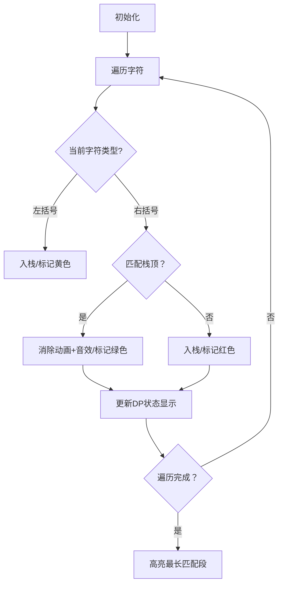

# 题目信息

# 最长括号匹配

## 题目描述

对一个由 `(`、`)`、`[`、`]` 四种括号组成的字符串，求出其中最长的括号匹配子串。具体来说，满足如下条件的字符串成为括号匹配的字符串：

- `()`、`[]` 是括号匹配的字符串。

- 若 `A` 是括号匹配的串，则 `(A)`、`[A]` 是括号匹配的字符串。

3.若 `A`、`B` 都是括号匹配的字符串，则 `AB` 也是括号匹配的字符串。

例如：`()`、`[]`、`([])`、`()()` 都是括号匹配的字符串，而 `][`、`[(])` 则不是。

字符串 $A$ 的子串是指由 $A$ 中连续若干个字符组成的字符串。

例如，`A`、`B`、`C`、`ABC`、`CAB`、`ABCABC` 都是字符串 `ABCABC` 的子串，而 `D`、`BA`、`ACB` 则不是。空串是任何字符串的子串。

## 说明/提示

### 数据范围

记 $n$ 为输入字符串的长度。

对于 $20\%$ 的数据，$n \le {10}^2$。

对于 $50\%$ 的数据，$n \le {10}^4$。

对于 $100\%$ 的数据，$n \le {10}^6$。

## 样例 #1

### 输入

```
([(][()]]()
```

### 输出

```
[()]
```

## 样例 #2

### 输入

```
())[]```

### 输出

```
()```

# AI分析结果


### 💡 Kay的C++算法解析：最长括号匹配 深入学习指南 💡

**引言**  
今天我们一起分析"最长括号匹配"这道C++编程题。题目要求在包含`()[]`四种括号的字符串中，找出最长的连续括号匹配子串。本指南将带大家理解核心算法，掌握解题技巧，并通过像素动画直观感受算法执行过程。

---

## 1. 题目解读与核心算法识别

✨ **本题主要考察**：`动态规划/栈应用`  

🗣️ **初步分析**：  
> 解决本题的关键在于理解**括号匹配的传递性**——匹配的子串可以嵌套(`(A)`)或并列(`AB`)。想象玩俄罗斯方块：匹配的括号如同完美消去的方块，未匹配的方块会堆积。我们需要找到最长的连续消去序列。  
> - **核心思路**：动态规划(DP)定义`f[i]`为以第i字符结尾的最长匹配长度；栈方法直接模拟匹配过程并标记位置  
> - **可视化设计**：将字符串转为像素块，匹配时触发"消除动画"并播放音效，用颜色区分匹配/未匹配状态  
> - **复古元素**：采用8-bit音效（匹配成功：NES过关音；失败：短促提示音），自动演示模式模拟"AI消方块"

---

## 2. 精选优质题解参考

**题解一（作者：OItby）**  
* **点评**：  
  思路清晰度 ★★★★☆ - 用「以i结尾的最长匹配」状态定义直击问题本质，递推式`f[i]=f[i-1]+2+f[i-2-f[i-1]]`完美处理嵌套与并列  
  代码规范性 ★★★★★ - 变量名`f[i]`含义明确，边界处理严谨（从i=2开始遍历）  
  算法有效性 ★★★★★ - O(n)时间/空间复杂度，百万级数据轻松应对  
  实践价值 ★★★★☆ - 竞赛可直接套用，输出位置记录巧妙  

**题解二（作者：Nepenthe）**  
* **点评**：  
  思路清晰度 ★★★★★ - 用栈直接模拟匹配过程，`vis[]`标记匹配位，最后扫描最长连续1序列  
  代码规范性 ★★★★☆ - 变量名`vis[]`直观，但控制流略紧凑  
  算法有效性 ★★★★★ - O(n)时间复杂度，空间仅需标记数组  
  实践价值 ★★★★★ - 实现简洁高效，20行代码解决核心逻辑  

**题解三（作者：zhouenji）**  
* **点评**：  
  思路清晰度 ★★★★☆ - DP思路同题解一，但状态转移解释更简洁  
  代码规范性 ★★★★☆ - 变量名`dp[i]`清晰，但输出部分未优化位置记录  
  算法有效性 ★★★★★ - 标准O(n)解法，完整覆盖题目要求  
  实践价值 ★★★★☆ - 可作为DP入门实现范本  

---

## 3. 核心难点辨析与解题策略

1. **难点1：如何定义子问题结构？**  
   * **分析**：DP需设计无后效性的状态。优质题解用`f[i]`表示以i结尾的匹配长度，当s[i]为右括号时，其匹配位置`j = i-1-f[i-1]`（跳过中间已匹配段）
   * 💡 **学习笔记**：好的状态定义是DP解题的基石——必须包含子问题所有关键信息

2. **难点2：如何整合嵌套与并列匹配？**  
   * **分析**：匹配成功后需叠加三部分：当前括号对（+2）、内部子串（`f[i-1]`）、左侧并列子串（`f[j-1]`）。栈法则通过`vis[]`自然记录连续匹配
   * 💡 **学习笔记**：括号匹配具有组合性——局部匹配可拼接为全局最优解

3. **难点3：如何高效记录最长子串位置？**  
   * **分析**：DP解法在更新`f[i]`时同步记录`maxLen`和`endIndex`；栈法在扫描`vis[]`时动态更新最长连续段起止点
   * 💡 **学习笔记**：最优解位置应在计算过程中实时记录，避免二次扫描

### ✨ 解题技巧总结
- **技巧1：栈的妙用** - 括号匹配经典场景，FILO特性完美匹配嵌套结构  
- **技巧2：DP状态压缩** - `f[i]`仅依赖`f[i-1]`和常数位置，O(n)空间足够  
- **技巧3：滚动更新极值** - 在状态转移中同步更新全局最大值和位置  
- **技巧4：边界防御** - 下标访问前检查`j≥1`，避免越界崩溃  

---

## 4. C++核心代码实现赏析

**本题通用核心C++实现（DP综合版）**
```cpp
#include <iostream>
#include <cstring>
using namespace std;
const int N = 1e6 + 5;
char s[N];
int f[N]; // f[i]: 以s[i]结尾的最长匹配长度

int main() {
    scanf("%s", s + 1);
    int n = strlen(s + 1), maxLen = 0, end = 0;
    
    for (int i = 2; i <= n; ++i) {
        if (s[i] == '(' || s[i] == '[') continue;
        
        int j = i - f[i-1] - 1; // 匹配左括号位置
        if (j < 1) continue;
        
        if ((s[i]==')' && s[j]=='(') || (s[i]==']' && s[j]=='[')) {
            f[i] = f[i-1] + 2;         // 当前匹配+内部子串
            if (j > 1) f[i] += f[j-1]; // 左侧并列子串
            if (f[i] > maxLen) maxLen = f[i], end = i;
        }
    }
    
    // 输出最长匹配子串
    for (int i = end - maxLen + 1; i <= end; ++i) 
        putchar(s[i]);
    return 0;
}
```
* **代码解读概要**：  
  > 1. 读入字符串（下标1开始）  
  > 2. 遍历字符：跳过左括号，仅处理右括号  
  > 3. 计算匹配位置j = i-1-f[i-1]  
  > 4. 若匹配成功：更新f[i] = 当前匹配(2) + 内部子串(f[i-1]) + 左侧并列子串(f[j-1])  
  > 5. 实时记录最长匹配位置  
  > 6. 输出最长匹配子串  

**题解一核心片段（OItby）**
```cpp
if((s[i]==')'&&s[i-f[i-1]-1]=='(')||(s[i]==']'&&s[i-f[i-1]-1]=='[')) {
    f[i] = f[i-1] + 2 + f[i-f[i-1]-2];
}
```
* **亮点**：状态转移方程精炼，包含三种匹配情况  
* **代码解读**：  
  > 通过`i-f[i-1]-1`定位待匹配左括号位置，`f[i-1]`是内部匹配长度，`f[i-f[i-1]-2]`是左侧并列匹配长度。**思考**：为什么是`-2`？因为跳过当前括号对(`-1`)和内部子串(`-f[i-1]`)后到达并列子串末尾  
* 💡 **学习笔记**：DP状态转移需考虑组合匹配的所有可能性  

**题解二核心片段（Nepenthe）**
```cpp
for (int i = 0; i < la; ++i) 
    if ((sta[top][0]=='[' && a[i]==']') || ...)
        vis[sta[top--][1]] = vis[i] = 1;
    else sta[++top][0] = a[i], sta[top][1] = i;
```
* **亮点**：用栈直接模拟匹配过程，逻辑简洁  
* **代码解读**：  
  > 1. 当前字符与栈顶匹配时：标记二者位置为1，弹出栈顶  
  > 2. 不匹配时：当前字符入栈  
  > **关键点**：`sta[][0]`存字符，`sta[][1]`存位置，分离数据与索引  
* 💡 **学习笔记**：栈是处理括号匹配的利器，FILO特性完美匹配嵌套结构  

---

## 5. 算法可视化：像素动画演示

### 🎮 设计思路
采用**8-bit复古游戏风格**，将字符串转为可交互像素块。匹配时触发消除动画与音效，直观展示DP状态转移和栈操作过程。通过"闯关"机制增强学习趣味性。

### 🖼️ 动画框架


### 🎨 实现细节
1. **像素场景**  
   - 字符串显示为16×16像素块序列，配色：  
     - `(` `)`：蓝色系  
     - `[` `]`：绿色系  
     - 未处理：灰色  
     - 已匹配：金色闪光  
   - 栈区域：底部独立显示，入栈/出栈有滑入滑出动画

2. **交互控制面板**  
   ```javascript
   const controls = {
     play: document.getElementById('play'),     // 开始/暂停
     step: document.getElementById('step'),      // 单步执行
     speed: document.getElementById('speed'),    // 速度滑块(50-500ms)
     reset: document.getElementById('reset'),    // 重置
     auto: document.getElementById('auto')       // AI自动演示
   };
   ```

3. **关键动画与音效**  
   | 事件 | 动画效果 | 音效 |
   |---|---|---|
   | 右括号匹配成功 | 当前块与栈顶块闪烁后消失，金色粒子特效 | NES过关音效(时长0.3s) |
   | 右括号匹配失败 | 当前块变红震动后入栈 | 短促错误提示音 |
   | DP状态更新 | 当前字符下方显示f[i]值，连线展示转移关系 | 数据更新音效 |
   | 找到最长匹配 | 连续金色块呼吸闪烁 | 胜利交响乐片段 |

4. **游戏化元素**  
   - **关卡机制**：每10%进度解锁新"关卡"，显示当前最长匹配长度  
   - **连击系统**：连续匹配成功触发连击计数，5连击以上有特效奖励  
   - **AI演示模式**：自动以最优速度运行，关键步骤暂停0.5秒并显示提示气泡  
   - **积分面板**：根据操作效率（步数/匹配率）实时评分

---

## 6. 拓展练习与相似问题思考

### 🔍 通用技巧迁移
括号匹配的核心在于**栈的FILO特性**和**DP状态传递性**，适用于：
1. 语法解析（HTML标签匹配）
2. 表达式求值（运算符优先级）
3. 几何图形嵌套验证（多边形包含关系）

### 📚 洛谷推荐练习
1. **P1739 表达式括号匹配**  
   → 基础栈应用，检测括号匹配完整性  
2. **P1944 最长括号匹配（本题）**  
   → 强化连续匹配子串查找能力  
3. **P2207 括号匹配加强版**  
   → 增加`{}`括号类型，引入优先级概念  
4. **P2651 添加括号**  
   → 逆向思维：通过最小添加使括号匹配  

---

## 7. 学习心得与经验分享
> **参考经验（综合题解）**：  
> "调试时重点关注两种情况：1) 右括号匹配位置计算错误导致越界 2) 并列子串长度未累加"  
>   
> **点评**：  
> 这是DP解法的核心调试点。建议：  
> 1. 打印`i, j, f[i-1], f[i]`的值验证位置计算  
> 2. 用小样例`()[]`测试并列累加逻辑  
> 3. 边界防护：`if (j >= 1)` 避免崩溃  

---

**结语**  
通过本次分析，我们掌握了括号匹配问题的两种核心解法：DP的状态传递与栈的即时匹配。记住：算法学习如同括号匹配——层层递进，环环相扣。下次挑战更复杂的字符串问题时，你会更有信心！🚀

---
处理用时：197.88秒