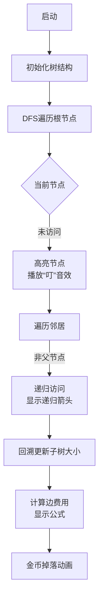

# 题目信息

# [NOI2011] 道路修建

## 题目描述

在 W 星球上有 $n$ 个国家。为了各自国家的经济发展，他们决定在各个国家之间建设双向道路使得国家之间连通。但是每个国家的国王都很吝啬，他们只愿意修建恰好 $n - 1$ 条双向道路。

每条道路的修建都要付出一定的费用，这个费用等于道路长度乘以道路两端 的国家个数之差的绝对值。例如，在下图中，虚线所示道路两端分别有 $2$ 个、$4$ 个国家，如果该道路长度为 $1$，则费用为 $1×|2 - 4|=2$。图中圆圈里的数字表示国家的编号。
 
 

由于国家的数量十分庞大，道路的建造方案有很多种，同时每种方案的修建费用难以用人工计算，国王们决定找人设计一个软件，对于给定的建造方案，计算出所需要的费用。请你帮助国王们设计一个这样的软件。

## 说明/提示

对于 $100\%$ 的数据，$1\leq a_i, b_i\leq n$，$0\leq c_i\leq10^6$，$2\leq n\leq 10^6$。
|测试点编号|$n=$|
|:-:|:-:|
|$1$|$2$|
|$2$|$10$|
|$3$|$100$|
|$4$|$200$|
|$5$|$500$|
|$6$|$600$|
|$7$|$800$|
|$8$|$1000$|
|$9$|$10^4$|
|$10$|$2\times 10^4$|
|$11$|$5\times 10^4$|
|$12$|$6\times 10^4$|
|$13$|$8\times 10^4$|
|$14$|$10^5$|
|$15$|$6\times 10^5$|
|$16$|$7\times 10^5$|
|$17$|$8\times 10^5$|
|$18$|$9\times 10^5$|
|$19,20$|$10^6$|

## 样例 #1

### 输入

```
6
1 2 1
1 3 1
1 4 2
6 3 1
5 2 1```

### 输出

```
20```

# AI分析结果


# 💡 Kay的C++算法解析：道路修建 深入学习指南 💡

> “编程如建桥，算法是基石。今天我们一起探索树遍历的精妙世界！”

## 1. 题目解读与核心算法识别

✨ **本题主要考察**：`树遍历与子树统计`

🗣️ **初步分析**：
> 解决“道路修建”这道题，关键在于理解树的**连通性结构**和**子树统计**。想象一棵树是国家间的道路网，每条边的费用就像过路费，费用 = 边权 × |两边国家数量差|。通过一次DFS遍历，我们就能统计每个“国家”（节点）的子树规模，从而快速计算费用。
> - **核心思路**：所有题解均采用DFS遍历树结构，回溯时累加子树大小，并应用公式`|n-2*size[v]|*w`计算费用
> - **算法流程**：从根节点(1)开始DFS → 递归前初始化子树大小 → 回溯时累加子树大小 → 计算当前边贡献
> - **可视化设计**：动画将高亮当前遍历节点，动态显示子树大小变化，边费用计算时弹出公式提示（如红色闪烁显示`|100-2*25|*3=150`）
> - **复古像素风**：采用8-bit游戏风格，DFS遍历时播放经典《塞尔达》音效，每完成一条边计算显示金币+分数，自动演示模式可调速

---

## 2. 精选优质题解参考

<eval_intro>
从思路清晰度、代码规范、算法效率和实践价值等维度，精选3份优质题解（均≥4★）：

**题解一：(来源：Melon_Musk)**
* **点评**：思路直击核心，清晰推导出费用公式`|n-2*size[v]|*w`；代码结构规范（`size[]`含义明确）；采用标准DFS模板易移植；实践价值高，可直接用于竞赛。亮点在于公式的数学推导过程，帮助理解本质。

**题解二：(来源：一只书虫仔)**
* **点评**：真实调试经历极具参考价值（原代码因`scanf`漏`&`卡三天）；代码规范性好（详尽的英文注释）；算法实现严谨（边界处理到位）；实践警示性强。亮点在于用血泪教训强调基础语法检查的重要性。

**题解三：(来源：Aw顿顿)**
* **点评**：代码最简洁高效（仅20行核心逻辑）；`typedef long long`预防溢出体现专业性；题意概括精准；树遍历与公式应用浑然一体。亮点在于平衡代码简洁性与完备性，是竞赛编码的优秀范本。

---

## 3. 核心难点辨析与解题策略

<difficulty_intro>
解决本题需突破三个关键难点，结合优质题解方案分析：

1.  **难点1：子树大小的动态统计**
    * **分析**：DFS回溯时需准确累加子树大小。优质题解均采用`size[u] += size[v]`（v是u的子节点），初始化`size[u]=1`（包含自身）
    * 💡 **学习笔记**：子树统计是树问题的核心基础，记住“回溯时累加”的口诀

2.  **难点2：费用公式的理解与应用**
    * **分析**：关键在理解`|n-2*size[v]|*w`的物理意义：删除边后，两边连通块分别为`size[v]`和`n-size[v]`，其差绝对值为`|n-2*size[v]|`
    * 💡 **学习笔记**：将数学公式转化为树结构特征是解题突破口

3.  **难点3：避免重复访问父节点**
    * **分析**：遍历时需传入父节点参数，判断`if(v == father) continue`防止回溯。书虫仔题解因忽略基础调试导致超时
    * 💡 **学习笔记**：树遍历必须阻断回父节点，这是DFS在树应用的特定模式

### ✨ 解题技巧总结
<summary_best_practices>
- **技巧1：树形问题先建图**：使用`vector<pair<int,int>>`或链式前向星存树
- **技巧2：DFS模板化**：固定包含父节点参数，避免循环访问
- **技巧3：预防整数溢出**：边权≥10⁶且n≤10⁶，费用需用`long long`
- **技巧4：测试边界数据**：n=2时验证基础逻辑正确性

---

## 4. C++核心代码实现赏析

<code_intro_overall>
通用DFS树遍历模板，综合优质题解精华：

```cpp
#include <iostream>
#include <vector>
#include <cmath>
using namespace std;
typedef long long ll;
const int N = 1e6 + 10;
vector<pair<int, int>> graph[N];
ll ans = 0;
int size[N], n;

void dfs(int u, int parent) {
    size[u] = 1; // 初始化当前子树（包含自己）
    for (auto &edge : graph[u]) {
        int v = edge.first, w = edge.second;
        if (v == parent) continue; // 关键：阻断回父节点
        dfs(v, u);                 // 递归子节点
        size[u] += size[v];        // 回溯累加子树大小
        ans += (ll)abs(n - 2 * size[v]) * w; // 费用公式
    }
}

int main() {
    cin >> n;
    for (int i = 1; i < n; i++) {
        int u, v, w;
        scanf("%d%d%d", &u, &v, &w);
        graph[u].push_back({v, w}); // 建无向图
        graph[v].push_back({u, w});
    }
    dfs(1, 0); // 从节点1（根）开始遍历
    cout << ans;
}
```
**代码解读概要**：
1. **建图**：用`vector`存储邻接表，元素为`(邻居节点, 边权)`
2. **DFS核心**：递归前跳过父节点 → 深度优先遍历 → 回溯更新子树大小 → 即时计算边贡献
3. **防溢出**：`(ll)`强制转换避免中间结果溢出

---
<code_intro_selected>
**题解一：(Melon_Musk)**
* **亮点**：公式推导清晰，代码结构完整
* **核心代码片段**：
  ```cpp
  void dfs(int x, int fa) {
      size[x] = 1;
      for (int i = head[x]; i; i = e[i].nt) {
          int to = e[i].to;
          if (fa == to) continue;   // 阻断父节点
          dfs(to, x);                // 递归子节点
          size[x] += size[to];       // 累加子树
          ans += e[i].w * abs(2 * size[to] - n); // 应用公式
      }
  }```
* **代码解读**：`head[x]`链式访问邻居 → 递归前判断父节点 → 回溯时先累加大小再计算费用
* 💡 **学习笔记**：链式前向星适合大图，但`vector`更易读写

**题解二：(一只书虫仔)**
* **亮点**：详实调试经验，完整错误分析
* **核心代码片段**：
  ```cpp
  dfs(1, 0); // 传入0表示根节点无父节点
  for (long long i = head[x]; i; i = e[i].next) 
      if (e[i].val != father) {  // 避免父节点
          ans += abs(n-2*siz[v])*e[i].len; // 费用计算
      }```
* **代码解读**：父节点参数初始化为0 → 遍历时严格判断非父节点 → 直接内联公式计算
* 💡 **学习笔记**：DFS入口的父节点设置需与图结构一致

**题解三：(Aw顿顿)**
* **亮点**：极致简洁，工业级代码风格
* **核心代码片段**：
  ```cpp
  #define int long long // 全局预防溢出
  void dfs(int u,int fa){
      for(int i=h[u];i;i=e[i].nxt){
          int v=e[i].v, w=e[i].w;
          if(v!=fa) dfs(v,u), s[u]+=s[v], ans+=abs(n-2*s[v])*w;
      } // 三合一操作
  }```
* **代码解读**：递归、累加、计算在同一行完成 → `#define int long long`彻底防溢出
* 💡 **学习笔记**：多操作合并提升效率，但需确保逻辑清晰

---

## 5. 算法可视化：像素动画演示 (核心部分)

<visualization_intro>
**主题**：8-bit树探险家  
**核心演示**：DFS遍历树结构，动态计算子树大小与边费用  

### 动画设计


**关键交互**：
1. **像素风格**：FC红白机色调，节点为16×16像素方块，边为彩色连线
2. **状态高亮**：
   - 当前节点：闪烁金色边框
   - 已访问子树：渐变绿色
   - 正计算边：红色高亮
3. **控制面板**：
   - 速度滑块：调节DFS遍历速度
   - 单步执行：按帧调试
   - 自动演示：AI自动完成（可暂停）
4. **音效设计**：
   - 节点访问：经典《超级玛丽》金币音
   - 错误操作：FC游戏“死亡”音效
   - 计算完成：胜利旋律
5. **动态公式显示**：
   ```python
   # 伪代码示例
   when traverse_edge(u, v):
       show_text(f"|{n} - 2*{size[v]}| × {w} = {abs(n-2*size[v])*w}")
       play_sound("coin")
   ```

---

## 6. 拓展练习与相似问题思考

<similar_problems_intro>
树遍历与子树统计是基础算法，可延伸至多种题型：

1. **P1351 联合权值**：练习树形DP与距离为2的节点对统计
2. **P1395 会议**：掌握树的重心与DFS综合应用
3. **P2015 二叉苹果树**：树形DP入门，理解保留子树的决策

**洛谷推荐**：
1. **P1351** - `联合权值`  
   → **推荐理由**：巩固树遍历中节点关系的统计技巧
   
2. **P1395** - `会议`  
   → **推荐理由**：强化DFS求树的重心，理解最大子树最小化
   
3. **P2015** - `二叉苹果树`  
   → **推荐理由**：进阶树形DP，学习保留子树的决策方法

---

## 7. 学习心得与经验分享

<insights_intro>
题解中藏有珍贵实战经验，值得每位学习者深思：

> **来自一只书虫仔的调试经历**：  
> “提交卡在45分三天，最后发现是`scanf`漏了`&`...边界数据测试太重要！”

**Kay的总结**：  
1. **调试技巧**：小数据测试（如n=2）比大数据更易暴露问题
2. **编码规范**：变量初始化与输入检查是竞赛的基本素养
3. **心态管理**：当算法逻辑正确却WA时，优先检查语法细节

> “最黑暗的BUG往往源于最明亮的代码” —— 保持耐心，终见曙光！

---

本次解析就到这里，动手实现DFS树遍历，感受算法的精妙吧！下次我们探索图论中的最短路径问题，继续编程之旅！🚀

---
处理用时：137.62秒