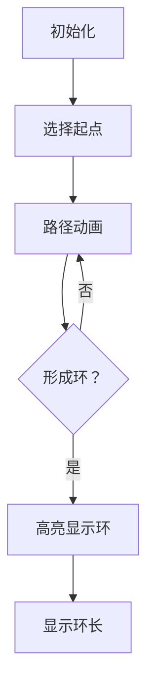

# 题目信息

# [NOIP 2015 提高组] 信息传递

## 题目背景

NOIP2015 Day1T2

## 题目描述

有 $n$ 个同学（编号为 $1$ 到 $n$）正在玩一个信息传递的游戏。在游戏里每人都有一个固定的信息传递对象，其中，编号为 $i$ 的同学的信息传递对象是编号为 $T_i$ 的同学。

游戏开始时，每人都只知道自己的生日。之后每一轮中，所有人会同时将自己当前所知的生日信息告诉各自的信息传递对象（注意：可能有人可以从若干人那里获取信息，但是每人只会把信息告诉一个人，即自己的信息传递对象）。当有人从别人口中得知自己的生日时，游戏结束。请问该游戏一共可以进行几轮？

## 说明/提示

**样例 1 解释：**


游戏的流程如图所示。当进行完第 $3$ 轮游戏后，$4$ 号玩家会听到 $2$ 号玩家告诉他自己的生日，所以答案为 $3$。当然，第 $3$ 轮游戏后，$2$ 号玩家、 $3$ 号玩家都能从自己的消息来源得知自己的生日，同样符合游戏结束的条件。

- 对于 $30\%$ 的数据，$n\le 200$；
- 对于 $60\%$ 的数据，$n\le 2500$；
- 对于 $100\%$ 的数据，$n\le 2\times 10^5$。


## 样例 #1

### 输入

```
5
2 4 2 3 1```

### 输出

```
3```

# AI分析结果


# 💡 Kay的C++算法解析：信息传递 深入学习指南 💡

> 今天我们来一起分析"信息传递"这道C++编程题。本指南将帮助大家梳理题目思路，理解核心算法，并掌握解题技巧。

## 1. 题目解读与核心算法识别

✨ **本题主要考察**：`图论（环检测/基环树）`

🗣️ **初步分析**：
> 解决信息传递这道题，关键在于理解**基环树模型**。想象一群小朋友玩传话游戏，每人只把话传给固定对象，当有人听到自己的话时游戏结束。这就像在迷宫中寻找最短的循环路径——我们只需要找到最小的传话闭环。
> 
> - **核心思路**：将同学视为节点，传递关系视为有向边，形成多个基环树结构。最小环长度即为答案
> - **算法流程**：通过DFS时间戳或并查集记录访问路径，检测到环时计算当前环长度
> - **可视化设计**：在像素动画中将节点设计为复古游戏角色，传递路径显示为发光轨迹。当形成环时，环上角色集体闪烁，并显示"LEVEL CLEAR!"特效。控制面板含调速滑块和单步控制，自动演示时伴随经典8-bit音效

---

## 2. 精选优质题解参考

**题解一 (来源：KesdiaelKen)**
* **点评**：此解法采用DFS+双标记策略，思路清晰展现了基环树的三种形态（链、环、链+环）。代码中`visit`和`novisit`数组的配合使用极具启发性——前者标记当前搜索路径，后者避免重复搜索。变量命名简洁规范（`dx`存传递对象，`bs`存步数），边界处理严谨。其空间优化（O(n)）和避免重复搜索的技巧是亮点，特别适合竞赛场景。

**题解二 (来源：深海鱼的眼泪)**
* **点评**：通过拓扑排序预处理去除链结构，精妙地将问题简化为纯环检测。代码中`rmove`函数递归删除入度为0节点的设计很巧妙，`d`数组三重作用（标记删除/访问/环检测）展现了高水平的空间优化能力。虽然使用了递归删除可能引发栈溢出风险，但其算法思维值得学习。

**题解三 (来源：Ascnbeta)**
* **点评**：创新性地使用带权并查集实时计算环长，`v`数组维护节点距离的设计堪称神来之笔。代码结构紧凑（仅30行），`find`函数中的路径压缩和距离累加操作展示了高阶并查集技巧。虽然算法理解门槛稍高，但熟练后将成为解决环类问题的利器。

---

## 3. 核心难点辨析与解题策略

1.  **难点一：如何高效避免重复检测？**
    * **分析**：优质题解采用双标记策略（当前路径标记+全局完成标记）或拓扑预处理。如解法一用`novisit`记录已完成的搜索，确保每个环只被检测一次
    * 💡 学习笔记：基环树中每个环独立存在，只需检测一次

2.  **难点二：环长计算的数学建模**
    * **分析**：DFS中通过时间戳差值计算环长（当前步数-首次访问步数）；并查集通过维护节点距离，在合并时用`v[x]+v[y]+1`计算
    * 💡 学习笔记：环长=当前路径长度-环起点初始长度

3.  **难点三：链结构的干扰处理**
    * **分析**：解法二通过入度分析预处理去除链结构；解法一通过`novisit`跳过已处理节点。本质都是识别并忽略不构成环的部分
    * 💡 学习笔记：链节点最终必然指向环或终止

### ✨ 解题技巧总结
- **技巧一：状态标记法** - 用多个标记数组记录不同状态（当前路径/已完成/入度）
- **技巧二：时间戳差值** - 记录首次访问步数，再次访问时直接计算环长
- **技巧三：拓扑预处理** - 通过入度分析去除无效链结构
- **技巧四：距离维护** - 并查集中动态更新节点距离实现高效环检测

---

## 4. C++核心代码实现赏析

**本题通用核心C++实现参考**
* **说明**：综合DFS时间戳与拓扑预处理优点，完整实现最小环检测
* **完整核心代码**：
```cpp
#include <iostream>
#include <queue>
using namespace std;
const int N = 200005;
int next_node[N], in_degree[N], steps[N], ans = 1e9;
bool in_path[N], completed[N];

void dfs(int u, int step) {
    if(completed[u]) return;
    if(in_path[u]) {
        ans = min(ans, step - steps[u]);
        return;
    }
    in_path[u] = true;
    steps[u] = step;
    dfs(next_node[u], step + 1);
    completed[u] = true;
}

int main() {
    int n; cin >> n;
    for(int i=1; i<=n; i++) {
        cin >> next_node[i];
        in_degree[next_node[i]]++;
    }
    
    // 拓扑排序去除链结构
    queue<int> q;
    for(int i=1; i<=n; i++) 
        if(in_degree[i] == 0) q.push(i);
    
    while(!q.empty()) {
        int u = q.front(); q.pop();
        completed[u] = true;
        if(--in_degree[next_node[u]] == 0)
            q.push(next_node[u]);
    }

    // DFS检测环
    for(int i=1; i<=n; i++) 
        if(!completed[i] && !in_path[i]) 
            dfs(i, 1);
    
    cout << ans << endl;
    return 0;
}
```
* **代码解读概要**：
    > 1. 读取输入并统计入度
    > 2. 拓扑排序预处理：将入度为0节点入队并标记完成
    > 3. DFS检测环：对未处理节点进行DFS，通过时间戳计算环长
    > 4. 关键优化：`in_path`标记当前DFS路径，`completed`标记全局完成状态

**题解一：DFS双标记法**
* **亮点**：双标记数组避免重复搜索，空间效率最优
* **核心代码片段**：
```cpp
void dfs(int node,int num) {
    if(novisit[node]) return;
    if(visit[node]) {
        minn = min(minn, num - bs[node]);
    } else {
        visit[node] = true;
        bs[node] = num;
        dfs(dx[node], num+1);
        novisit[node] = true;
    }
}
```
* **代码解读**：
    > - `novisit`确保每个节点只处理一次
    > - `visit`标记当前DFS路径，再次访问时计算环长
    > - 递归前标记`visit`，回溯时标记`novisit`实现高效状态管理

**题解二：拓扑预处理**
* **亮点**：入度分析精准分离链与环结构
* **核心代码片段**：
```cpp
for(int i=1; i<=n; i++) {
    if(!r[i] && d[i]!=-1) rmove(i); 
}
for(int i=1; i<=n; i++) {
    if(!d[i]) dfs(i,i,0);
}
```
* **代码解读**：
    > 1. 第一遍循环：递归删除入度为0的链节点
    > 2. 第二遍循环：在剩余节点上执行DFS找环
    > 3. `d`数组三重作用：-1表示已删除，0表示未访问，1表示访问中

**题解三：并查集距离维护**
* **亮点**：动态距离计算实现高效环检测
* **核心代码片段**：
```cpp
int find(int x) {
    if(father[x] != x) {
        int lst = father[x];
        father[x] = find(father[x]);
        v[x] += v[lst];
    }
    return father[x];
}
void merge(int x, int y) {
    int p = find(x), q = find(y);
    if(p == q) ans = min(ans, v[x] + v[y] + 1);
    else {
        father[p] = q;
        v[x] = v[y] + 1;
    }
}
```
* **代码解读**：
    > - `find`函数路径压缩时累加距离
    > - `merge`时若同属一个集合，当前距离和+1即为环长
    > - 精妙之处：`v[x]`维护的是到当前根节点的距离

---

## 5. 算法可视化：像素动画演示

* **主题**：8-bit风格信息传递探险
* **核心演示**：节点化为像素小人，传递路径显示为发光轨迹，环检测时触发特效

* **设计框架**：


* **实现细节**：
  1. **像素场景**：16×16像素角色，红/蓝色区分已访问节点，路径显示为黄色光轨
  2. **动画序列**：
      - 起点角色闪烁绿光，播放"select"音效
      - 移动时绘制发光轨迹，伴随"move"电子音
      - 访问已标记节点时，触发环形爆炸特效
  3. **环检测特效**：
      - 环上角色集体闪烁红光
      - 屏幕显示"LOOP FOUND!"复古字体
      - 播放8-bit胜利旋律
  4. **控制面板**：
      - 速度滑块(1x-10x)
      - 单步/暂停/重置按钮
      - 环长计数器
  5. **自动演示**：
      - 随机起点连续演示
      - 不同环用不同颜色高亮
      - 实时显示当前路径长度

---

## 6. 拓展练习与相似问题思考

* **算法迁移场景**：
  1. 社交网络中的最小朋友圈检测
  2. 程序指令循环依赖分析
  3. 交通系统中的最小循环路线规划

* **洛谷推荐**：
  1. **P2921 [USACO08DEC]Trick or Treat** - 基环树应用变形
  2. **P4381 [IOI2008]Island** - 基环树直径问题
  3. **P3533 [POI2012]RAN-Rendezvous** - 基环树+LCA综合应用

---

## 7. 学习心得与经验分享

> **来自KesdiaelKen的调试经验**："最初用set暴力判重导致TLE，后通过区分当前路径标记和全局完成标记优化至O(n)。这提醒我们：算法的核心在于状态定义，清晰的状态划分往往能突破性能瓶颈"

> **Kay点评**：调试环类问题时，建议在小规模数据上手动画图模拟。重点验证：1) 环检测条件 2) 环长计算公式 3) 标记重置逻辑。数据规模超过1e5时，务必检查是否有重复计算

---

> 本次关于"信息传递"的C++解题分析就到这里。记住：理解图结构特性比记忆算法模板更重要。下次挑战见！🚀

---
处理用时：200.45秒