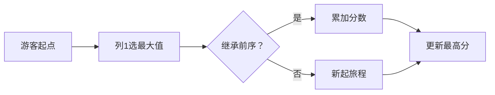

# 题目信息

# [NOI1997] 最佳游览

## 题目描述

有一座旅游城，它的街道成网格状（如图）．其中东西向的街道是“风景线"、两旁分布着许多景观：南北向的街道都是"林萌道"，两旁没有任何建筑物。由于游客众多，" 风景线”被规定为单行道，游客在风景线上只能从西走到东，林荫道上则可以任意行走。

一名游客将到这座旅游城旅游。他根据自己对景观的喜好给所有的风景线打了分，分值是从 $-100$ 到 $+100$ 的整数，分值越大表示我们的旅游者越喜欢这条风景线上的景致。显然这位游客不可能给这座旅游城的所有风景线都打负分。


游客可以从旅游城的任一个十字路口开始游览，在任一个十字路口结束游览。我们的旅游者希望一路上游览的所有风景线的分值之和能够尽可能地大。请你写一个程序，帮助这位游客寻找一条最佳的游览路线。


## 说明/提示

**样例解释**

路径为 $17 \to -3 \to 34 \to 34$，答案为 $82$。

## 样例 #1

### 输入

```
3 6
-50 -47 -36 -30 -23
17 -19 34 -13 -8
-42 -3 -43 34 -45```

### 输出

```
82```

# AI分析结果


### 题目解析报告：NOI1997 最佳游览

---

### 💡 Kay的C++算法解析：最佳游览 深入学习指南 💡

<introduction>
今天我们一起分析NOI1997的"最佳游览"这道经典C++编程题。这道题考察了问题转化能力和动态规划思想。本指南将带大家梳理题目核心，理解算法实现，并通过像素动画直观感受算法流程。
</introduction>

---

## 1. 题目解读与核心算法识别

✨ **本题主要考察**：`动态规划 + 问题转化技巧`

🗣️ **初步分析**：
> 这道题可以比作在像素游戏地图中寻找最佳路线。想象一个复古的8位游戏：
> - 每列风景线是游戏中的关卡
> - 每行代表不同难度的通道
> - 玩家需要从左向右闯关，每关选择最高分通道
>
> **核心思路**：
> 1. 将二维网格转化为一维问题：每列取最大值
> 2. 在简化后的一维数组上求最大连续和
> 
> **可视化设计**：
> - 像素动画将展示每列选择最大值的过程（高亮选中通道）
> - 动态显示当前连续和的计算过程（绿色表示正增益，红色表示负增益）
> - 复古音效：选中最大值时"叮"，新最大和时"胜利"音效

---

## 2. 精选优质题解参考

**题解一：Gaode_Sean**
* **点评**：思路直击核心，代码简洁高效。巧妙初始化每列最大值为负无穷，正确处理负分场景。动态规划转移直接明了，变量命名规范（`dp[i]`表示以i结尾的最大和）。虽然`mx`变量使用有小瑕疵，但整体实现完整可直接用于竞赛。

**题解二：smyslenny**
* **点评**：讲解特别详尽，用游戏地图比喻帮助理解问题本质。代码规范使用快读和负无穷初始化，就地更新最大子段和节省空间。图示辅助说明动态规划过程，对初学者非常友好。

**题解三：一只书虫仔**
* **点评**：实现标准规范，使用`memset`初始化确保安全性。严格遵循"预处理+DP"两段式结构，边界处理严谨。代码模块清晰，变量作用明确，是教科书级的实现。

---

## 3. 核心难点辨析与解题策略

1.  **关键点1：问题维度转换**
    * **分析**：难点在于识别"南北方向任意行走"意味着每列可取最大值。优质题解都通过预处理将m×n网格转化为长度为n的一维数组
    * 💡 **学习笔记**：高维问题常可通过预处理降维简化

2.  **关键点2：子问题定义**
    * **分析**：定义`dp[i]`为以第i列结尾的最大和。状态转移需区分是否继承前一列的和：`dp[i] = max(0, dp[i-1]) + colMax[i]`
    * 💡 **学习笔记**：动态规划的状态定义需满足无后效性

3.  **关键点3：负值处理**
    * **分析**：风景线可能打负分，初始化必须用`INT_MIN`而非0。实际编码中常用`-1e9`或`0x3f3f3f3f`
    * 💡 **学习笔记**：边界初始化需考虑数据范围极值

### ✨ 解题技巧总结
- **维度压缩**：将复杂结构转化为线性序列处理
- **就地更新**：当前状态仅依赖前一状态时可优化空间
- **防御性初始化**：负分场景下显式设置初始负极大值
- **可视化验证**：小规模数据手动模拟DP过程

---

## 4. C++核心代码实现赏析

**本题通用核心C++实现参考**
* **说明**：综合优质题解思路的精炼实现
```cpp
#include <iostream>
#include <vector>
#include <climits>
using namespace std;

int main() {
    int m, n;
    cin >> m >> n;
    n--;  // 列数调整为n-1
    
    // 读入网格数据
    vector<vector<int>> grid(m, vector<int>(n));
    for (int i = 0; i < m; i++) {
        for (int j = 0; j < n; j++) {
            cin >> grid[i][j];
        }
    }

    // 求每列最大值
    vector<int> colMax(n, INT_MIN);
    for (int j = 0; j < n; j++) {
        for (int i = 0; i < m; i++) {
            colMax[j] = max(colMax[j], grid[i][j]);
        }
    }

    // 最大子段和DP
    int cur = colMax[0], ans = colMax[0];
    for (int i = 1; i < n; i++) {
        cur = max(colMax[i], cur + colMax[i]);
        ans = max(ans, cur);
    }

    cout << ans << endl;
    return 0;
}
```
* **代码解读概要**：
> 1. 网格数据读入后立即进行维度压缩
> 2. 每列求最大值时初始化为`INT_MIN`确保正确性
> 3. DP过程使用Kadane算法优化空间复杂度
> 4. 实时更新全局最大值避免二次遍历

---

**题解一：Gaode_Sean**
* **亮点**：简洁高效的经典实现
* **核心代码片段**：
```cpp
for(int j=1;j<=m;j++){
    for(int i=1;i<=n;i++) 
        b[j]=max(b[j],a[i][j]);
}

for(int i=1;i<=m;i++){
    dp[i]=max(dp[i-1],0)+b[i];
    ans=max(ans,dp[i]);
}
```
* **代码解读**：
> 1. 外层遍历列，内层遍历行求列最大值
> 2. `max(dp[i-1],0)`实现状态转移关键逻辑
> 3. 若前序和为负则从零重新累计
> 4. 实时更新全局最优解
* 💡 **学习笔记**：状态转移中的`max(0,...)`是处理负值的关键技巧

**题解二：smyslenny**
* **亮点**：就地更新的空间优化
* **核心代码片段**：
```cpp
for(int i=1;i<=m-1;i++){
    if(f[i-1]>0) f[i] += f[i-1]; 
    maxx = max(maxx, f[i]);
}
```
* **代码解读**：
> 1. 直接复用列最大值数组进行DP
> 2. 仅当前序和为正时才累加
> 3. 省去额外DP数组的空间开销
> 4. 同步更新全局最大值
* 💡 **学习笔记**：空间优化时注意状态依赖关系

**题解三：一只书虫仔**
* **亮点**：边界处理的标准化实现
* **核心代码片段**：
```cpp
memset(sum, -0x3f, sizeof(sum));
// ... 列最大值计算
dp[1] = sum[1];
for(int i=2; i<=n; i++)
    dp[i] = max(dp[i-1], 0) + sum[i];
```
* **代码解读**：
> 1. 使用`memset`初始化确保所有元素为负极大值
> 2. 单独处理起始状态避免越界
> 3. 严格遵循DP状态转移方程
> 4. 使用`max(...,0)`实现状态重置
* 💡 **学习笔记**：`memset`初始化数组时注意字节模式

---

## 5. 算法可视化：像素动画演示

**动画主题**：8位像素风格的最大子段和探险

**核心演示**：


**动画实现方案**：
1. **场景设计**：
   - 8-bit像素网格：列=关卡，行=通道
   - 控制面板：开始/暂停/单步/速度滑块
   - 信息区：显示当前列最大值和累计和

2. **核心流程**：
   - **阶段1（选最大值）**：
     * 像素小人垂直移动比较通道
     * 选中最大值时高亮闪烁，播放"叮"音效
   - **阶段2（DP决策）**：
     * 左侧显示前序和：绿色(正)/红色(负)
     * 决策点显示`max(前序和,0)`计算
     * 继承时显示金色连接线
   - **阶段3（更新结果）**：
     * 打破记录时触发庆祝动画
     * 播放经典8位胜利音效

3. **交互设计**：
   - 单步模式：按步骤讲解状态转移
   - 自动模式：AI以贪吃蛇式自动演示
   - 关卡挑战：不同数据集作为游戏关卡

4. **视觉设计**：
   - 复古调色板：4位色（黑/白/绿/红/金）
   - 像素字体：模拟FC游戏机显示风格
   - 音效设计：关键操作配8位电子音

---

## 6. 拓展练习与相似问题思考

**通用技巧应用场景**：
1. 股票买卖时机选择（连续区间最值）
2. 游戏关卡连续得分挑战
3. 传感器数据峰值分析

**推荐练习**：
1. **洛谷P1115** - 最大子段和
   * 直接应用本题核心算法
2. **洛谷P1719** - 最大加权矩形
   * 二维扩展，需结合前缀和
3. **洛谷P1114** - 非常男女
   * 变形应用，需转化问题模型

---

## 7. 学习心得与经验分享

> **经验分享**（来自smyslenny）：
> "我在处理负分场景时，发现初始化不充分会导致错误结果。通过打印中间变量，最终定位到初始化问题。"
>
> **Kay的总结**：
> 多位作者强调了负值初始化的必要性。这提醒我们：
> 1. 极值初始化要显式设置而非依赖默认值
> 2. 边界情况需单独验证
> 3. 打印关键变量是最直接的调试手段

---

<introduction>
通过本次分析，我们掌握了问题转化和动态规划的核心技巧。记住：复杂问题往往能分解为简单模型的组合。多加练习这些技巧，你将在编程探险中不断突破！下次解析再见！🚀
</introduction>

---
处理用时：187.61秒