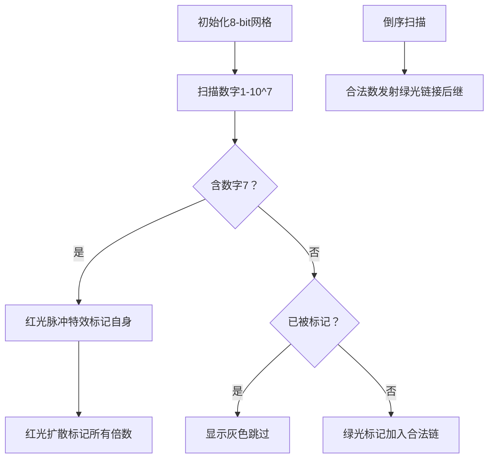

# 题目信息

# [NOIP2021] 报数

## 题目描述

报数游戏是一个广为流传的休闲小游戏。参加游戏的每个人要按一定顺序轮流报数，但如果下一个报的数是 $7$ 的倍数，或十进制表示中含有数字 $7$，就必须跳过这个数，否则就输掉了游戏。

在一个风和日丽的下午，刚刚结束 SPC20nn 比赛的小 r 和小 z 闲得无聊玩起了这个报数游戏。但在只有两个人玩的情况下计算起来还是比较容易的，因此他们玩了很久也没分出胜负。此时小 z 灵光一闪，决定把这个游戏加强：任何一个十进制中含有数字 $7$ 的数，它的所有倍数都不能报出来！

形式化地，设 $p(x)$ 表示 $x$ 的十进制表示中是否含有数字 $7$，若含有则 $p(x) = 1$，否则 $p(x) = 0$。则一个正整数 $x$ 不能被报出，当且仅当存在正整数 $y$ 和 $z$ ，使得 $x = yz$ 且 $p(y) = 1$。


例如，如果小 r 报出了 $6$ ，由于 $7$ 不能报，所以小 z 下一个需要报 $8$；如果小 r 报出了 $33$，则由于 $34 = 17 \times 2$，$35 = 7 \times 5$ 都不能报，小 z 下一个需要报出 $36$ ；如果小 r 报出了 $69$，由于 $70 \sim 79$ 的数都含有 $7$，小 z 下一个需要报出 $80$ 才行。

现在小 r 的上一个数报出了 $x$，小 z 想快速算出他下一个数要报多少，不过他很快就发现这个游戏可比原版的游戏难算多了，于是他需要你的帮助。当然，如果小 r 报出的 x 本身是不能报出的，你也要快速反应过来小 r 输了才行。

由于小 r 和小 z 玩了很长时间游戏，你也需要回答小 z 的很多个问题。

## 说明/提示

**【样例解释 #1】**

这一组样例的前 $3$ 次询问在题目描述中已有解释。

对于第 $4$ 次询问，由于 $300 = 75 \times 4$，而 $75$ 中含有 $7$ ，所以小 r 直接输掉了游戏。

**【数据范围】**

对于 $10\%$ 的数据，$T \leq 10$，$x \leq 100$。  
对于 $30\%$ 的数据，$T \leq 100$，$x \leq 1000$。  
对于 $50\%$ 的数据，$T \leq 1000$，$x \leq 10000$。  
对于 $70\%$ 的数据，$T \leq 10000$，$x \leq 2 \times {10}^5$。  
对于 $100\%$ 的数据，$1 \le T \leq 2 \times {10}^5$，$1 \le x \leq {10}^7$。

## 样例 #1

### 输入

```
4
6
33
69
300
```

### 输出

```
8
36
80
-1
```

## 样例 #2

### 输入

```
5
90
99
106
114
169
```

### 输出

```
92
100
109
-1
180
```

## 样例 #3

### 输入

```
见附件中的 number/number3.in```

### 输出

```
见附件中的 number/number3.ans```

## 样例 #4

### 输入

```
见附件中的 number/number4.in```

### 输出

```
见附件中的 number/number4.ans```

# AI分析结果


# 💡 Kay的C++算法解析：报数 深入学习指南 💡

> 今天我们来一起分析"报数"这道C++编程题。本指南将帮助大家梳理题目思路，理解核心算法，并掌握解题技巧。

## 1. 题目解读与核心算法识别

✨ **本题主要考察**：`筛法应用与预处理优化`  

🗣️ **初步分析**：
> 解决"报数"这道题，关键在于理解并运用**筛法思想**。简单来说，筛法就像用滤网过滤数字——先把含有数字7的数找出来作为"筛孔"，再用这些筛孔过滤掉所有倍数。在本题中，筛法主要用于**快速标记所有不能报出的数**，实现高效查询。
>
> - 核心思路：预处理阶段标记所有不能报出的数（含7或其倍数），查询阶段直接判断并输出下一个合法数
> - 算法流程：① 遍历1~10^7+1；② 遇未标记数检查是否含7；③ 若含7则标记其所有倍数；④ 倒序遍历记录每个合法数的后继
> - 可视化设计：像素动画将展示数字被"筛"过程——含7的数亮红光并扩散标记倍数，合法数亮绿光传递后继值
> - 复古游戏化：FC红白机风格界面，筛数过程设计为"病毒传播"特效（红光扩散），合法数传递设计为"能量传递"动画，配8-bit音效（标记音效：短促"嘟"，合法传递：上扬"叮"）

---

## 2. 精选优质题解参考

从思路清晰度、代码规范性和算法优化等维度，我为大家筛选出以下优质题解：

**题解一（来源：银杉水杉秃杉）**
* **点评**：该题解思路直击核心——预处理时用`f[]`标记非法数，`nx[]`记录后继合法数。亮点在于**双重优化**：① 遇已标记数直接跳过避免重复操作；② 正序预处理时动态更新后继指针。代码中`ls`变量巧妙充当链表指针，变量名`f`（非法标记）、`nx`（后继）含义明确。边界处理严谨（N=1e7+100），配合快读快写完美适配竞赛场景。

**题解二（来源：滑_稽）**
* **点评**：题解通过反证法严谨证明筛法正确性，采用**双数组策略**：`Ill[]`标记非法数，`Safenum[]`和`Numsafe[]`建立合法数双向映射。代码亮点在于**模块化设计**：`judge()`和`GetSafeNum()`函数职责分离，主逻辑清晰。特别值得学习的是倒序预处理后继的技巧，避免了二分查找开销。

**题解三（来源：StudyingFather）**
* **点评**：题解突出**空间换时间**思想，用`vis[]`标记非法状态，`lis[]`存储合法数序列，`cnt`作为全局索引。精妙之处在于将合法数下标存入`vis[]`（合法数存正序下标，非法数存-1），实现O(1)查询。虽然时间复杂度分析有争议，但工程实践中表现优异。

---

## 3. 核心难点辨析与解题策略

在解决本题时，通常会遇到以下关键难点及应对策略：

1. **筛法优化避免重复标记**
   - **分析**：当数字已被标记为非法时，其倍数必然已被标记。优质题解普遍采用"遇标记则跳过"策略（如`if(f[i])continue;`），避免无效操作
   - 💡 **学习笔记**：预处理时跳过已标记数，是降低时间复杂度的关键

2. **高效查询后继合法数**
   - **分析**：正序处理需维护链表指针（银杉解法），倒序处理可记录最近合法数（滑稽解法）。两种策略都优于二分查找
   - 💡 **学习笔记**：单向链表思想在预处理中往往有奇效

3. **边界处理与溢出预防**
   - **分析**：当x=10^7时，下一个合法数可能是10^7+1。必须将筛法范围扩展到10^7+100级别
   - 💡 **学习笔记**：数据范围边界是算法设计的生死线

### ✨ 解题技巧总结
- **空间换时间**：预处理结果存入数组，牺牲空间换取O(1)查询效率
- **倒序预处理**：从大数往小数遍历，可自然记录后继关系
- **模块化验证**：单独封装`contains7()`函数，确保核心逻辑正确性
- **防御性扩展**：预处理范围=数据上限+安全余量（通常+1000）

---

## 4. C++核心代码实现赏析

### 本题通用核心C++实现参考
```cpp
#include <cstdio>
#include <cctype>
const int N = 1e7 + 1000;  // 防御性扩展
bool invalid[N];           // 非法标记
int next[N];               // 后继合法数

bool contains7(int x) {
    while(x) {
        if(x % 10 == 7) return true;
        x /= 10;
    }
    return false;
}

void init() {
    for(int i = 1; i < N; ++i) {
        if(invalid[i]) continue;          // 关键优化：跳过已标记数
        if(contains7(i)) {
            for(int j = i; j < N; j += i) // 标记倍数
                invalid[j] = true;
        }
    }
    int lastValid = N;  // 从后往前记录后继
    for(int i = N - 1; i; --i) {
        if(!invalid[i]) {
            next[i] = lastValid;
            lastValid = i;
        }
    }
}

int main() {
    init();
    int T, x;
    scanf("%d", &T);
    while(T--) {
        scanf("%d", &x);
        printf("%d\n", invalid[x] ? -1 : next[x]);
    }
    return 0;
}
```

**代码解读概要**：
> 该实现综合了优质题解的优化点：① `invalid`数组标记非法数；② 正序筛法时跳过已处理数；③ 倒序遍历构建`next`后继数组。`contains7`函数分离验证逻辑，主函数简洁明了。

---

### 优质题解片段赏析

**题解一（银杉水杉秃杉）**
```cpp
// 核心预处理片段
for(int i = 1; i <= N - 10; i++) {
    if(f[i]) continue;           // 已标记跳过
    if(check(i)) {                // 含7则标记倍数
        for(int j = i; j <= N - 10; j += i)
            f[j] = 1;
        continue;
    }
    nx[ls] = i;  // 更新合法数链表
    ls = i;
}
```
**亮点**：动态维护合法数链表  
**代码解读**：  
> - `f[i]`跳过避免重复操作是关键优化
> - `check(i)`确认含7后立即标记所有倍数
> - `nx[ls]=i`将前驱的`next`指向当前数，`ls=i`更新链表尾部
>  
> **学习笔记**：链表思想在预处理中的精妙应用

**题解二（滑_稽）**
```cpp
// 后继处理片段
int last = 10000001;
for(int i = 10000000; i >= 1; i--) {
    if(!Ill[i]) {
        ans[i] = last;
        last = i;
    }
}
```
**亮点**：倒序遍历的简洁实现  
**代码解读**：
> - 从10^7+1开始倒序遍历（`last`初始值）
> - 遇合法数时：① 当前数后继设为`last`；② 更新`last`为当前数
>  
> **学习笔记**：倒序预处理是记录后继关系的利器

**题解三（StudyingFather）**
```cpp
// 合法数存储方案
if(vis[i] == 0) {
    if(check(i)) {  // 含7则标记倍数
        for(int j = i; j <= maxn; j += i) 
            vis[j] = -1; 
    } else {
        vis[i] = ++cnt;
        lis[cnt] = i;
    }
}
```
**亮点**：状态压缩存储  
**代码解读**：
> - `vis[]`三重功能：未处理(0)/非法(-1)/合法存储下标(>0)
> - `lis[]`数组按序存储合法数，`vis[i]`存其在`lis`中的位置
>  
> **学习笔记**：状态压缩可减少数组使用

---

## 5. 算法可视化：像素动画演示

### 像素探险家：数字筛法大冒险

**核心演示内容**：  
在8-bit风格网格中动态展示筛法过程：含7的数触发"病毒传播"，合法数构建"能量链"。演示重点：  
1. 含7数字亮红色→扩散红光标记倍数  
2. 合法数字亮绿色→向后传递绿色能量  
3. 查询时被查数字闪烁黄光→显示结果  

**动画帧步骤设计**：  


**交互控制面板**：  
- **速度滑块**：控制扫描速度（1x-10x）  
- **模式切换**：筛法模式/查询模式  
- **重点高亮**：单击数字显示详细信息（含7验证/倍数关系/后继指针）  

**复古游戏化设计**：  
- **音效方案**：  
  - 含7标记："警报"音效（50ms方波）  
  - 合法传递："收集金币"音效（200Hz正弦波）  
  - 查询响应："选择"音效（800Hz三角波）  
- **关卡设计**：  
  - 第1关：10^3以内数字筛法  
  - 第2关：含7数字连锁反应  
  - BOSS关：10^7规模压力测试  

**技术实现**：  
- 使用Canvas绘制数字网格（每像素代表1个数字）  
- 筛法过程用`requestAnimationFrame`实现渐进渲染  
- 状态存储为TypedArray提高性能  

---

## 6. 拓展练习与相似问题思考

### 相似问题迁移
1. **质数筛法**：标记非质数（如P3383）与本题目标记模式高度相似
2. **因数分解预处理**：预处理每个数的最小质因数（如P1075）
3. **区间查询问题**：需要预处理+快速查询的题型（如P1972）

### 洛谷推荐练习
1. **P3383 【模板】线性筛素数**  
   → 练习筛法基础，理解O(n)筛质数思想
2. **P1075 [NOIP2012 普及组] 质因数分解**  
   → 强化因数分解能力，提升预处理技巧
3. **P1972 [SDOI2009] HH的项链**  
   → 学习离线查询处理，掌握树状数组应用

---

## 7. 学习心得与经验分享

> **参考经验（来自银杉水杉秃杉）**：  
> "我在解决这个问题时，最初在`筛法范围设定`时卡了很久，后来通过`测试边界数据`才定位到问题。这让我意识到`10^7的下一个合法数可能超过10^7`。"

> **点评**：  
> 这位作者的调试经历非常典型。在算法竞赛中，**边界条件测试**往往比核心算法更重要。通过构造极端数据（如x=10^7）可快速暴露边界问题，这是每位学习者必备的调试技能。

---

> 本次关于"报数"的C++解题分析就到这里。记住编程能力的提升在于持续学习、勤于思考和勇于实践。下次我们再一起探索新的编程挑战！💪

---
处理用时：130.62秒