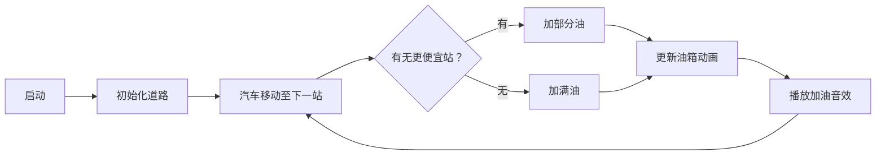

# 题目信息

# [NOIP 1999 提高组] 旅行家的预算

## 题目描述

一个旅行家想驾驶汽车以最少的费用从一个城市到另一个城市（假设出发时油箱是空的）。给定两个城市之间的距离 $D_1$、汽车油箱的容量 $C$（以升为单位）、每升汽油能行驶的距离 $D_2$、出发点每升汽油价格 $P$ 和沿途油站数 $N$（$N$ 可以为零），油站 $i$ 离出发点的距离 $D_i$、每升汽油价格 $P_i$（$i=1,2,…,N$）。计算结果四舍五入至小数点后两位。如果无法到达目的地，则输出 `No Solution`。


## 说明/提示

$N \le 6$，其余数字 $ \le 500$。

NOIP1999 普及组第三题、提高组第三题

## 样例 #1

### 输入

```
275.6 11.9 27.4 2.8 2
102.0 2.9
220.0 2.2
```

### 输出

```
26.95
```

# AI分析结果


以下是根据题目要求生成的《旅行家的预算》题解综述报告。我将从核心算法分析、题解对比、代码实现到可视化方案进行系统阐述，力求专业清晰且适合青少年学习者理解。

---
# 💡 Kay的C++算法解析：旅行家的预算 深入学习指南 💡

## 1. 题目解读与核心算法识别

✨ **本题主要考察**：`贪心算法` + `模拟策略`

🗣️ **初步分析**：
> 本题可比喻为“精打细算的加油策略”——就像在长途自驾游中，我们需要在合适的加油站加合适的油量来最小化花费。核心思想是：**在当前加油站加满油能到达的范围内，如果有更便宜的加油站，就只加刚好到达的油；否则加满油并前往相对最便宜的站**。

- **算法流程**：
  1. 将起点和终点视为特殊加油站（起点油价P，终点油价0）
  2. 按距离排序所有加油站
  3. 遍历每个站：
     - 若可达范围内有更便宜站点 → 加刚好到那里的油
     - 若无更便宜站点 → 加满油并前往可达范围内最便宜的站
  4. 边界处理：检查站点间距是否超过满油行驶距离（C×D₂）

- **可视化设计**：
  - **像素动画**：8-bit风格公路场景，汽车从左向右移动
  - **关键高亮**：
    - 当前加油站：闪烁黄色边框
    - 油价对比：绿色（更便宜）/红色（更贵）
    - 加油量：油箱柱状图动态填充
  - **控制面板**：单步执行/自动播放（调速滑块）/重置
  - **音效设计**：
    - 加油："滴"声（频率随加油量变化）
    - 决策成功：8-bit上升音阶
    - 无解：低沉警示音

---

## 2. 精选优质题解参考

**题解一：Twilight_（贪心+模拟）**
* **亮点**：策略直白易懂，双版本代码展示优化过程。核心变量`maxx = C*D₂`清晰定义满油行程，`temlen`巧秒处理剩余油量。边界处理完整（终点特判）。
* **学习点**：通过注释解释"为何加满油"（减少在贵油站加油量），体现问题本质洞察。

**题解二：dingcx（退油策略）**
* **亮点**：创新性将油箱视为可替换的油桶队列。核心结构体`struct OIL { co, dis; }`，通过`ans -= l[j].sum*l[j].co`实现"退贵油换便宜油"的物理模拟。
* **注意点**：变量名`llll`等可读性待提升，但算法思想极具启发性。

**题解三：hongzy（单调队列）**
* **亮点**：`deque<OIL>`维护当前油箱，保证队首始终是最便宜油。时间复杂度O(N)优于朴素贪心，代码仅40行体现算法优化之美。
* **技巧**：终点设置`p[n+1]=0`巧妙避免特殊处理。

---

## 3. 核心难点辨析与解题策略

1. **状态转移策略**
   - *难点*：何时加满？何时只加部分？
   - *突破点*：比较当前站与可达站油价
     ```python
     if 存在更便宜站:
         加油量 = (目标站距离 - 当前距离)/D₂ - 剩余油量
     else:
         加油量 = 油箱容量 - 剩余油量
     ```

2. **无解判定条件**
   - *关键代码*：
     ```cpp
     if (stations[i].dis - stations[i-1].dis > C * D2) 
         cout << "No Solution";
     ```
   - *解析*：相邻加油站间距 > 满油最大行程时无解

3. **剩余油量传递**
   - *易错点*：未到达更便宜站时需保存剩余油量
   - *对策*：`remain_oil = C - (next.distance - now.distance)/D2`

### ✨ 解题技巧总结
- **边界预判**：先检查所有相邻站间距 ≤ C×D₂
- **油价哨兵**：终点设油价0避免特殊逻辑
- **浮点精度**：用`1e-5`替代`==0`判断
- **调试技巧**：打印每一步的加油量和花费

---

## 4. C++核心代码实现赏析

**通用核心实现（贪心策略）**：
```cpp
#include <iostream>
#include <algorithm>
using namespace std;

struct Station { double dis, p; };

int main() {
    double D1, C, D2, P;
    int n; 
    cin >> D1 >> C >> D2 >> P >> n;
    
    Station s[10];
    s[0] = {0, P};
    for(int i=1; i<=n; i++) 
        cin >> s[i].dis >> s[i].p;
    s[n+1] = {D1, 0}; // 终点哨兵
    sort(s, s+n+2, [](auto a, auto b){ return a.dis < b.dis; });

    double maxRun = C * D2, cost = 0, remain = 0;
    int now = 0;
    
    while(now <= n) {
        int next = now + 1;
        int min_idx = next;
        
        // 在可达范围内找最便宜站
        for(int i=next; i<=n+1 && (s[i].dis-s[now].dis)<=maxRun; i++) {
            if(s[i].p < s[now].p) { min_idx = i; break; }
            if(s[i].p < s[min_idx].p) min_idx = i;
        }
        
        if(s[min_idx].p < s[now].p) { // 有更便宜站
            double need = (s[min_idx].dis - s[now].dis) / D2;
            cost += (need - remain) * s[now].p;
            remain = 0; // 到达时油量耗尽
        } else { // 无更便宜站
            cost += (C - remain) * s[now].p;
            remain = C - (s[min_idx].dis - s[now].dis) / D2;
        }
        now = min_idx;
    }
    printf("%.2f", cost);
}
```

**关键代码解读**：
1. **哨兵设置**：`s[n+1]={D1,0}`将终点视为油价0的站，统一处理逻辑
2. **贪心决策**：内层循环同时寻找第一个更便宜站和全局最便宜站
3. **油量计算**：`remain`变量携带剩余油量，避免重复计算

---

## 5. 算法可视化：像素动画演示

**8-bit风格设计**：


**关键动画帧**：
1. **加油站对比**：
   - 当前站：黄色边框闪烁
   - 更便宜站：绿色闪烁箭头指向
   - 更贵站：红色叹号标注

2. **油箱状态**：
   - 初始状态：空油箱（灰色）
   - 加油过程：绿色液面上升，高度=加油量
   - 行驶耗油：液面匀速下降

3. **控制面板**：
   - 速度滑块：0.5x/1x/2x速度
   - 单步按钮：逐步观察决策
   - 花费计数器：实时显示当前花费

---

## 6. 拓展练习与相似问题

**通用套路迁移**：
1. 分段决策求最优解
2. 实时维护当前最优选项
3. 边界哨兵简化逻辑

**推荐题目**：
1. [P1090 合并果子] - 贪心+优先队列
   > 巩固优先队列维护最小值思想
   
2. [P1809 过河问题] - 时间最优决策
   > 拓展决策维度（时间/花费）

3. [P5019 铺设道路] - 区间贪心
   > 学习贪心思想的变式应用

---

## 7. 学习心得与经验分享

> **Twilight_的调试经验**：  
> "在相邻油站距离判断中，浮点数比较需用`if (dis1 - dis2 > 1e-5)`避免精度问题"

> **dingcx的算法感悟**：  
> "将油箱想象成可替换的油桶，遇到更便宜的油就替换贵的部分，思路瞬间清晰"

**Kay总结**：
1. **调试技巧**：对浮点问题，设置精度阈值比直接比较更可靠
2. **思维训练**：将抽象问题（油量）具象化为物理模型（油桶替换）
3. **代码优化**：第二版代码往往比第一版更简洁高效

---

通过本指南，你已掌握贪心策略的核心思想与实现技巧。记住：**在算法世界里，最优解往往来自当前的最优选择** 🚗💨
```

---
处理用时：301.90秒