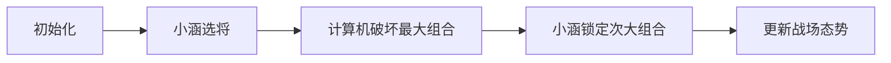

# 题目信息

# [NOIP 2010 普及组] 三国游戏

## 题目描述

小涵很喜欢电脑游戏，这些天他正在玩一个叫做《三国》的游戏。

在游戏中，小涵和计算机各执一方，组建各自的军队进行对战。游戏中共有 $N$ 位武将（$N$ 为偶数且不小于 $4$），任意两个武将之间有一个“默契值”，表示若此两位武将作为一对组合作战时，该组合的威力有多大。游戏开始前，所有武将都是自由的（称为自由武将，一旦某个自由武将被选中作为某方军队的一员，那么他就不再是自由武将了），换句话说，所谓的自由武将不属于任何一方。

游戏开始，小涵和计算机要从自由武将中挑选武将组成自己的军队，规则如下：小涵先从自由武将中选出一个加入自己的军队，然后计算机也从自由武将中选出一个加入计算机方的军队。接下来一直按照“小涵 $\to$ 计算机 $\to$ 小涵 $\to\dots$ ”的顺序选择武将，直到所有的武将被双方均分完。然后，程序自动从双方军队中各挑出一对默契值最高的武将组合代表自己的军队进行二对二比武，拥有更高默契值的一对武将组合获胜，表示两军交战，拥有获胜武将组合的一方获胜。

已知计算机一方选择武将的原则是尽量破坏对手下一步将形成的最强组合，它采取的具体策略如下：任何时刻，轮到计算机挑选时，它会尝试将对手军队中的每个武将与当前每个自由武将进行一一配对，找出所有配对中默契值最高的那对武将组合，并将该组合中的自由武将选入自己的军队。 下面举例说明计算机的选将策略，例如，游戏中一共有$6$个武将，他们相互之间的默契值如下表所示：

| 武将编号 |  1   |  2   |  3   |  4   |  5   |  6   |
| :------: | :--: | :--: | :--: | :--: | :--: | :--: |
|  **1**   |      | $5$  | $28$ | $16$ | $29$ | $27$ |
|  **2**   | $5$  |      | $23$ | $3$  | $20$ | $1$  |
|  **3**   | $28$ | $23$ |      | $8$  | $32$ | $26$ |
|  **4**   | $16$ | $3$  | $8$  |      | $33$ | $11$ |
|  **5**   | $29$ | $20$ | $32$ | $33$ |      | $12$ |
|  **6**   | $27$ | $1$  | $26$ | $11$ | $12$ |      |

双方选将过程如下所示：

|        | 小涵 | 轮到计算机时可选的自由武将 |  计算机    |  计算机选将说明    |
| :----: | :--: | :----------: | :--: | :--: |
| 第一轮 | $5$ | $1,2,3,4,6$ | $\color{magenta}4$ | 小涵手中的 $5$ 号武将与 $4$ 号的默契值最高，所以计算机选择 $4$ 号。 |
| 第二轮 | $5,3$ | $1,2,6$ | $4,\color{magenta}1$ |  小涵手中的 $5$ 号和 $3$ 号武将与自由武将中配对可产生的最大默契值为 $29$，是由 $5$ 号与 $1$ 号配对产生的，所以计算机选择 $1$ 号。  |
| 第三轮 | $5,3,6$ | $2$ | $4,1,\color{magenta}2$ |      |

小涵想知道，如果计算机在一局游戏中始终坚持上面这个策略，那么自己有没有可能必胜？如果有，在所有可能的胜利结局中，自己那对用于比武的武将组合的默契值最大是多少？  

假设整个游戏过程中，对战双方任何时候均能看到自由武将队中的武将和对方军队的武将。为了简化问题，保证对于不同的武将组合，其默契值均不相同。


## 说明/提示

**数据范围**

对于 $ 40\%$ 的数据有 $N≤10$。

对于 $ 70\%$ 的数据有 $ N≤18$。

对于 $100\%$ 的数据有 $4\le N≤500$。保证对于不同的武将组合，其默契值均不相同。

NOIP2010 普及组 第四题

## 样例 #1

### 输入

```
6 
5 28 16 29 27 
23 3 20 1 
8 32 26 
33 11 
12 
```

### 输出

```
1
32

```

## 样例 #2

### 输入

```
8 
42 24 10 29 27 12 58 
31 8 16 26 80 6 
25 3 36 11 5 
33 20 17 13 
15 77 9 
4 50 
19 ```

### 输出

```
1
77```

# AI分析结果


### 💡 Kay的C++算法解析：三国游戏 深入学习指南 💡

**引言**  
今天我们来分析NOIP 2010普及组"三国游戏"这道经典题目。本指南将带大家深入理解博弈论与贪心的巧妙结合，并通过像素动画直观展示算法流程。让我们开始吧！

---

### 1. 题目解读与核心算法识别  
✨ **本题主要考察**：`贪心策略`（融合博弈思想）  

🗣️ **初步分析**：  
> 解决本题的关键在于识破计算机的"破坏性策略"。想象你和对手轮流拿水果，对手总是抢走你最喜欢的那个，这时你的最优策略是**预先瞄准次优选项中最好的那个**。在本题中：
> - 计算机永远会抢走小涵所选武将的最大默契搭档
> - 小涵的策略是：确保自己能拿到所有武将的次大默契值中的最大值
> - 可视化设计将用**8位像素风格**呈现武将选择过程：  
>   - 红色高亮显示计算机破坏的最大默契组合  
>   - 绿色闪烁展示小涵获得的次大默契组合  
>   - 每步操作伴随FC音效（选择声"叮"，成功声"胜利旋律"）
>   - AI自动演示模式将如"三国演义"般自动推演全过程

---

### 2. 精选优质题解参考  
**题解一（作者：wjyyy）**  
* **点评**：通过对称矩阵图示清晰展示"最大组合必然被拆散"的核心洞见（图示中红色标注最大默契值，绿色标注次大值）。代码采用`sort`高效获取次大值，变量命名规范（`a[i][n-1]`直指次大值），边界处理严谨（N≤500时O(n²)复杂度合理）。亮点在于用数形结合化解抽象博弈问题，如同解开九连环般精妙。  

**题解二（作者：封禁用户）**  
* **点评**：创新性引入巴什博弈类比，将抽象策略转化为"拿石头游戏"的具象模型。虽然reverse操作非必要，但通过`mo[i][n-1]`获取次大值的核心思路正确。实践价值体现在用博弈框架降低理解门槛，如同给算法披上故事的外衣。

**题解三（作者：__stdcall）**  
* **点评**：给出严谨数学证明（反证法验证次大值最优性），如同解开数学定理般层层递进。代码亮点在于**免排序获取次大值**：通过动态维护`m1`(最大值)和`m2`(次大值)，空间效率更优。特别适合追求算法本质的学习者钻研。

---

### 3. 核心难点辨析与解题策略  
1. **难点：识破计算机的破坏策略**  
   * **分析**：计算机并非随机选将，而是针对性破坏当前最优组合。这要求我们预先推算计算机的行为模式，如同下棋时预判对手的下一步
   * 💡 **学习笔记**：理解对手策略是制胜第一步  

2. **难点：证明次大值策略最优**  
   * **分析**：当最大组合被拆散后，战场仅剩次大值组合。通过反证法可证：若存在更大组合，其必为某个武将的最大组合，但最大组合已被计算机策略封锁
   * 💡 **学习笔记**：次大值中的最大值是可达最优解  

3. **难点：高效计算次大值**  
   * **分析**：对每个武将的搭档排序取`a[i][n-1]`是最简实现（O(n² log n)）。优化方向：遍历时动态维护最大值/次大值（O(n²)），适合竞技编程
   * 💡 **学习笔记**：根据数据规模选择实现策略  

#### ✨ 解题技巧总结  
- **策略预演**：在纸上模拟计算机行为，验证策略可行性  
- **维度转换**：将默契矩阵视为对称图，化线性思维为平面思维  
- **边界防御**：特别注意矩阵对角线无效值（`i==j`）的处理  
- **即时验证**：用样例数据（如6武将）逐步调试验证  

---

### 4. C++核心代码实现赏析  
**本题通用核心实现**  
```cpp
#include <iostream>
#include <algorithm>
using namespace std;
const int N=510;
int a[N][N];

int main() {
    int n, ans=0;
    cin >> n;
    for(int i=1; i<n; i++)
        for(int j=i+1; j<=n; j++) {
            cin >> a[i][j];
            a[j][i] = a[i][j]; // 构建对称矩阵
        }
    
    for(int i=1; i<=n; i++) {
        sort(a[i]+1, a[i]+n+1); // 每行升序排序
        ans = max(ans, a[i][n-1]); // 取次大值更新答案
    }
    cout << "1\n" << ans; // 必有解
    return 0;
}
```
**代码解读概要**：  
> 1. 构建对称矩阵存储武将默契值  
> 2. 对每个武将的所有搭档默契值排序  
> 3. 取次大值（排序后倒数第二个）中的最大值  
> 4. 输出必胜结论"1"和最大次大值  

**题解一核心片段赏析**  
```cpp
sort(a[i]+1, a[i]+1+n);
ans = ans>a[i][n-1] ? ans : a[i][n-1];
```
* **亮点**：三目运算符实现优雅更新  
* **代码解读**：  
  > 对第`i`行排序后，`a[i][n-1]`恰为次大值——因为最大值在`a[i][n]`，但会被计算机破坏。如同在宝箱中主动放弃最耀眼的宝石，选择第二璀璨的那颗  
* 💡 **学习笔记**：排序是化无序为有序的利器  

**题解三核心片段赏析**  
```cpp
int m1=-1, m2=-1; // 最大值/次大值
for(int j=1; j<=n; j++) if(i!=j) {
    if(a[i][j]>m1) { m2=m1; m1=a[i][j]; }
    else if(a[i][j]>m2) m2=a[i][j];
}
```
* **亮点**：免排序动态维护极值  
* **代码解读**：  
  > 遍历中实时更新：当发现新最大值时，原最大值降级为次大值；发现比次大值大但小于最大值的数时更新次大值。如同擂台比武，实时记录冠亚军  
* 💡 **学习笔记**：动态维护避免冗余计算  

---

### 5. 算法可视化：像素动画演示  
**主题**：8位像素风"三国武将争夺战"  

**核心演示流程**：  


**像素化实现细节**：  
1. **战场渲染**：
   - 武将用16x16像素三国人物（曹操/刘备等造型）
   - 默契值用彩虹色连线表示（红=最高，黄=次高）
   - 控制面板含步进/调速/重置按钮（FC手柄风格）

2. **动态演示**：  
   ```python
   while 有自由武将:
       小涵选将 → 像素武将闪烁绿光 + "选择"音效
       计算机锁定其最大搭档 → 红线连接 + "破坏"音效
       小涵立即选择次大搭档 → 黄线连接 + "确认"音效
       更新已选区域（小涵阵营变绿，计算机变红）
   ```

3. **游戏化设计**：  
   - 每成功获得一个次大组合得10分，破坏敌方组合得5分
   - 终极对决画面：双方最佳组合PK，显示默契值对比
   - 背景音乐：8位芯片版《滚滚长江东逝水》

4. **教学提示**：  
   > "注意！计算机正在破坏你的最大组合..."  
   > "漂亮！这个次大组合已是当前最优选择"  

---

### 6. 拓展练习与相似问题  
**相似问题迁移**：  
1. 巴什博弈（石头游戏）：P1007 独木桥  
2. 交替最优策略：P2123 皇后游戏  
3. 组合优化问题：P1080 国王游戏  

**洛谷推荐**：  
1. **P1007 独木桥**  
   🗣️ 通过士兵相遇转身的巧思，深化对"最优策略相对性"的理解  
2. **P1247 取火柴游戏**  
   🗣️ Nim博弈的经典呈现，培养博弈问题形式化能力  
3. **P1288 取数游戏**  
   🗣️ 环形结构的贪心策略，训练边界情形处理能力  

---

### 7. 学习心得与经验分享  
> **来自wjyyy的调试经验**：  
> "最初在矩阵对角线处理上卡壳，通过打印中间矩阵发现未正确处理`i==j`的情形"  
>  
> **Kay的总结**：  
> 1. 二维问题常转化为对称矩阵处理  
> 2. 贪心策略需通过小规模数据验证  
> 3. 变量命名要体现语义（如`maxVal`优于`m1`）  

---

**结语**  
通过本次分析，我们揭开了博弈策略的神秘面纱——最高明的胜利有时在于主动放弃最优解。记住，编程如对弈，预判对手往往比盲目进攻更重要。下次遇到类似问题，不妨想想："我的次优解在哪里？" Keep coding, warriors! 💪

---
处理用时：126.40秒