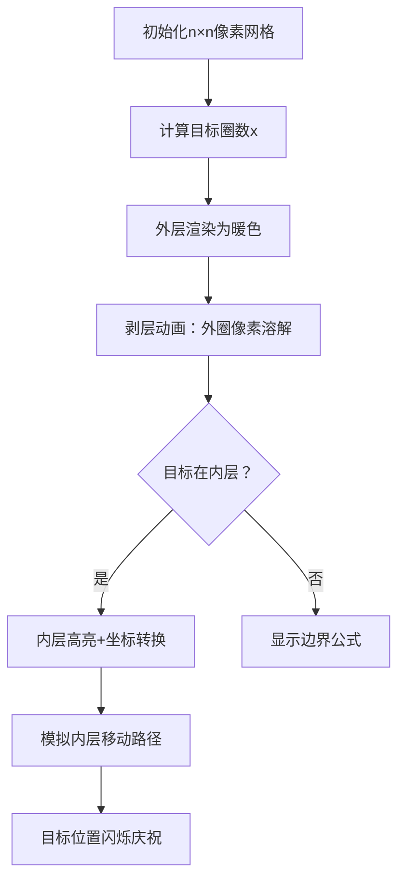

# 题目信息

# [NOIP 2014 普及组] 螺旋矩阵

## 题目背景

NOIP2014 普及组 T3

## 题目描述

一个 $n$ 行 $ n$ 列的螺旋矩阵可由如下方法生成：


从矩阵的左上角（第 $1$ 行第 $1$ 列）出发，初始时向右移动；如果前方是未曾经过的格子，则继续前进，否则右转；重复上述操作直至经过矩阵中所有格子。根据经过顺序，在格子中依次填入 $1, 2, 3, \dots, n^2$，便构成了一个螺旋矩阵。


下图是一个 $n = 4$ 时的螺旋矩阵。

$$\begin{pmatrix}
 1 &    2  &   3   &  4 \\
12 &   13  &  14   &  5 \\
11 &   16  &  15   &  6 \\
10 &    9  &   8   &  7 \\
\end{pmatrix}$$

现给出矩阵大小 $n$ 以及 $i$ 和 $j$，请你求出该矩阵中第 $i$ 行第 $j$ 列的数是多少。


## 说明/提示

【数据说明】

对于 $50\%$ 的数据，$1 \leqslant n \leqslant 100$;

对于 $100\%$ 的数据，$1 \leqslant n \leqslant 30,000,1 \leqslant i \leqslant n,1 \leqslant j \leqslant n$。


## 样例 #1

### 输入

```
4 2 3```

### 输出

```
14```

# AI分析结果


# 💡 Kay的C++算法解析：螺旋矩阵 深入学习指南 💡

今天我们来一起分析"螺旋矩阵"这道C++编程题。本指南将帮助大家梳理题目思路，理解核心算法，并掌握解题技巧。

## 1. 题目解读与核心算法识别

✨ **本题主要考察**：`数学规律应用` + `递归/递推优化`

🗣️ **初步分析**：
> 解决螺旋矩阵问题就像剥洋葱🧅，关键在于发现矩阵的分层规律。想象矩阵由多层套叠的正方形组成，每层数字连续填充。核心技巧是：
>   - **定位目标所在层**：通过计算目标位置到边界的距离确定层数
>   - **分层计算**：外层数字总量可公式计算，内层位置可递归或直接求解
>   - **边界处理**：当目标位于当前层边界时，直接使用位置公式
>
> 可视化设计思路：
>  - 像素动画将展示矩阵分层效果，用不同颜色区分各层
>  - 高亮目标位置所在层，动态演示剥层过程
>  - 关键变量：圈数`x`、内层矩阵大小`m`、起始值`start`
>  - 复古元素：8-bit消除音效（剥层时）、胜利音效（找到目标时）、AI自动演示模式

---

## 2. 精选优质题解参考

**题解一：CaiZi (数学公式法)**
* **点评**：
  这份题解采用数学推导直接计算，思路惊艳✨。通过严格公式推导实现O(1)时间复杂度，代码简洁高效（仅10行）。亮点在于：
  - 精确计算圈数`x = min{i-1, j-1, n-i, n-j}`
  - 分类讨论目标位置在"上/右边"或"下/左边"两种情况
  - 使用`4*x*n-4*x*x`巧算外层总数
  - 边界处理严谨，适合竞赛直接使用

**题解二：Anguei (递归法)**
* **点评**：
  递归解法思路清晰易懂，完美展现"剥洋葱"思想。代码规范（变量名`work`语义明确），亮点包括：
  - 边界情况处理直观：四种边界公式简洁准确
  - 递归逻辑直白：`work(n-2,i-1,j-1)+4*(n-1)`体现分层思想
  - 作者心得：从暴力TLE到递归AC的调试经历，提醒注意递归深度问题

**题解三：WsW_ (单层模拟法)**
* **点评**：
  创新性地仅模拟目标所在层，平衡了效率和可读性。亮点在于：
  - 空间优化：仅用`dir`方向数组，无需存储完整矩阵
  - 时间优化：外层总量公式计算，内层最多模拟4n步
  - 边界处理：方向切换逻辑`t++`配合坐标检查
  - 实践价值：避免递归栈溢出风险，适合大矩阵场景

---

## 3. 核心难点辨析与解题策略

1.  **难点：避免O(n²)暴力模拟**
    * **分析**：直接构建完整矩阵需O(n²)时间/空间，必然超时。优质解法均采用分层思想，通过数学公式或局部模拟优化
    * 💡 **学习笔记**：识别问题中的重复模式（螺旋分层）是优化关键

2.  **难点：精确计算圈数**
    * **分析**：圈数`x = min(i-1, j-1, n-i, n-j)`决定了剥层次数。需理解该公式源于目标到四边的最小距离
    * 💡 **学习笔记**：矩阵问题常转化为几何关系（距离/位置）

3.  **难点：边界公式推导**
    * **分析**：不同边界的数字增长方向不同（上→右递增，下←左递减）。需通过小矩阵验证公式：
      - 上边：`start + (j - x - 1)`
      - 右边：`start + (n-2x-1) + (i-x-1)`
    * 💡 **学习笔记**：画5×5矩阵手算验证可避免公式错误

### ✨ 解题技巧总结
- **分层分解法**：将复杂矩阵分解为独立计算层
- **数学归纳法**：从特例（小矩阵）推导通用公式
- **方向模拟技巧**：使用`dir[4][2]`数组实现螺旋转向
- **递归转递推**：大矩阵场景优先考虑数学公式法

---

## 4. C++核心代码实现赏析

**本题通用核心C++实现参考**
* **说明**：综合数学公式法与单层模拟法优点，兼顾效率与可读性
* **完整核心代码**：
```cpp
#include <iostream>
#include <algorithm>
using namespace std;

int main() {
    long long n, i, j;
    cin >> n >> i >> j;
    long long x = min({i-1, j-1, n-i, n-j});
    long long start = 4 * x * (n - x);  // 外层总数
    
    // 调整到内层坐标系
    long long m = n - 2 * x;
    long long r = i - x, c = j - x;
    
    if (r == 1) cout << start + c;  // 上边
    else if (c == m) cout << start + m - 1 + r;  // 右边
    else if (r == m) cout << start + 2*m - 1 + (m - c);  // 下边
    else cout << start + 3*m - 2 + (m - r);  // 左边
    return 0;
}
```
* **代码解读概要**：
  > 1. 计算圈数`x`和外层总数`start`
  > 2. 坐标转换：将`(i,j)`映射到内层`m×m`矩阵的`(r,c)`
  > 3. 根据位置所在边选用对应公式
  > 4. 时间复杂度O(1)，空间O(1)，完美满足30000×30000数据

**题解一：CaiZi 公式法片段**
```cpp
x = min({i-1, j-1, n-i, n-j});
if(i==x+1||j==n-x) 
    cout<<4*x*n-4*x*x-2*x+i+j-1;
else 
    cout<<4*x*n-4*x*x-6*x+4*n-i-j-1;
```
* **亮点**：极致简洁的O(1)解法
* **代码解读**：
  > 问：如何理解第一个公式？
  > 答：当目标在"上/右边"，数字=外层总数+目标到内层左上角的曼哈顿距离
  >
  > 问：`-4*x*x`的意义？
  > 答：这是外层总数公式的推导关键：∑[4(n-2k)] = 4x(n-x)
* 💡 **学习笔记**：数学推导能力是算法高阶素养

**题解二：Anguei 递归片段**
```cpp
int work(int n, int i, int j) {
    if (i == 1) return j;
    if (j == n) return n + i - 1;
    if (i == n) return 3 * n - 2 - j + 1;
    if (j == 1) return 4 * n - 4 - i + 2;
    return work(n - 2, i - 1, j - 1) + 4 * (n - 1);
}
```
* **亮点**：递归逻辑如"洋葱剥层"般直观
* **代码解读**：
  > 问：为何递归时`n-2`而非`n-1`？
  > 答：因为每层剥掉后，矩阵边长减2（左右各少一列）
  >
  > 问：`4*(n-1)`的意义？
  > 答：当前层的数字总数 = 4*(边长-1)
* 💡 **学习笔记**：递归深度=圈数≈n/2，需警惕栈溢出

**题解三：WsW_ 单层模拟片段**
```cpp
int layer = min({n-i, n-j, i-1, j-1});
i -= layer; j -= layer;  // 坐标映射
int sum = n*n - (n-2*layer)*(n-2*layer);  // 外层总数

// 模拟内层起点(1,1)到目标(i,j)
int dir[4][2] = {{0,1}, {1,0}, {0,-1}, {-1,0}};
for(int x=1,y=1,t=0; x!=i || y!=j; ){
    sum++;
    int nx = x + dir[t][0], ny = y + dir[t][1];
    if(nx<1||ny<1||nx>m||ny>m) t = (t+1)%4;  // 碰壁转向
    else { x = nx; y = ny; }
}
cout << sum + 1;
```
* **亮点**：平衡数学计算与过程模拟
* **代码解读**：
  > 问：`n-2*layer`的含义？
  > 答：内层边长 = 原边长 - 2×圈数
  >
  > 问：方向数组如何实现螺旋？
  > 答：`dir`按"右→下→左→上"顺序，`t`控制当前方向
* 💡 **学习笔记**：方向数组是网格类问题的通用技巧

---

## 5. 算法可视化：像素动画演示

**主题**：8-bit像素风"螺旋探险"  
**核心演示**：分层剥洋葱过程 + 目标位置追踪

### 设计思路
> 复古像素风格还原FC游戏体验，通过：
> - 颜色区分层：外层暖色(红/橙)→内层冷色(蓝/绿)
> - 音效提示：剥层"咔哒"声、转向"嘀"声、成功"胜利旋律"
> - 游戏化进程：每剥一层视为过关，显示当前圈数

### 动画帧步骤


### 交互控制面板
```plaintext
+---------------------------+
| [开始] [暂停] [单步]      |
| 速度：|==========| 快慢   |
| 模式：手动  AI自动演示    |
+---------------------------+
```
- **AI演示模式**：自动按最优路径剥层并移动，类似"贪吃蛇AI"
- **关键帧特效**：
  - 当前层溶解：外层像素块逐格消失并显示数字
  - 路径追踪：像素小人沿螺旋路径移动到目标
  - 公式同步：屏幕底部显示实时计算公式

---

## 6. 拓展练习与相似问题思考

### 螺旋矩阵思想迁移
1. **旋转矩阵**：LeetCode 48 - 旋转图像（分层旋转）
2. **蛇形矩阵**：NOI 1.8 蛇形填充数组（方向数组应用）
3. **分形结构**：POJ 2083 Fractal（递归分层构造）

### 洛谷推荐
1. **P5731 蛇形方阵**  
   → 同类矩阵填充，巩固方向数组技巧
2. **P1498 南蛮图腾**  
   → 分层递归思想进阶训练
3. **P1160 队列安排**  
   → 数据结构模拟螺旋过程（循环链表）

---

## 7. 学习心得与经验分享

> **Anguei的调试经验**：  
> *"最初用暴力构建完整矩阵，50% TLE。观察小矩阵发现分层规律，调试时验证了n=5/6的边界公式"*  
>  
> **Kay的总结**：  
> 调试螺旋矩阵问题的黄金法则：  
> 1. 先手算3×3、4×4小矩阵  
> 2. 用Excel辅助验证公式  
> 3. 警惕递归深度（n>10000慎用）  
> 4. 数学公式法优先，但需严格验证边界

---

通过本次分析，我们掌握了螺旋矩阵的核心解法与优化技巧。记住：算法学习如同螺旋上升，每一次探索都在为更高层次的理解奠基。下次算法冒险再见！🚀

---
处理用时：235.20秒