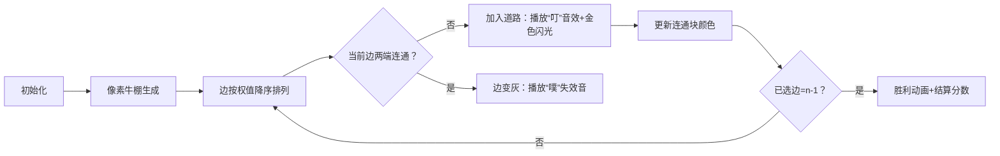

# 题目信息

# [USACO04DEC] Bad Cowtractors S

## 题目描述

奶牛贝茜被雇去建设 $N(2\le N\le 10^3)$ 个牛棚间的互联网。她已经勘探出 $M(1\le M\le 2\times 10^4)$ 条可建的线路，每条线路连接两个牛棚，而且会花费 $C(1\le C\le 10^5)$。农夫约翰吝啬得很，他希望建设费用最少甚至他都不想给贝茜工钱。贝茜得知工钱要告吹，决定报复。她打算选择建一些线路，把所有牛棚连接在一起，让约翰花费最大。但是她不能造出环来，这样约翰就会发现。

## 说明/提示

$2\le N\le 10^3$，$1\le M\le 2\times 10^4$，$1\le C\le 10^5$。

## 样例 #1

### 输入

```
5 8
1 2 3
1 3 7
2 3 10
2 4 4
2 5 8
3 4 6
3 5 2
4 5 17```

### 输出

```
42```

# AI分析结果


### 💡 Kay的C++算法解析：最大生成树 深入学习指南 💡

#### 1. 题目解读与核心算法识别
✨ **本题主要考察**：图论-最小/大生成树（本题为最大生成树）

🗣️ **初步分析**：
> 这道题就像在搭建一个"最贵连通网络"——我们要用最高成本的桥梁连接所有岛屿（牛棚），但禁止形成环形路（避免被约翰发现）。核心解法是**最大生成树算法**，通过贪心策略优先选择最贵的边，同时用并查集防止成环。
> - **解题思路对比**：Kruskal算法（边排序+并查集）更适合稀疏图（本题），Prim算法（节点扩展）在稠密图中更优
> - **可视化设计**：动画将用像素方块表示牛棚，高亮显示当前选择的边。当加入新边时播放"叮"音效，连通块合并时显示闪光特效，最终生成树用金色边框突出
> - **复古游戏化**：采用8位像素风格，数据更新时显示"费用+XX"的像素字体，成功构建生成树时播放《超级玛丽》通关音效

---

#### 2. 精选优质题解参考
**题解一（ForMyDream）**
* **亮点**：双算法对比实现！Kruskal版用边排序+并查集（复杂度O(mlogm)），Prim版用邻接矩阵更新（O(n²)），并指出稀疏图中Kruskal更优。代码中`g[u][v]=max(w,g[u][v])`巧妙处理重边问题，边界判断严谨

**题解二（technopolis_2085）**
* **亮点**：极致简洁的Kruskal实现，强调`long long`预防大数溢出（虽然后续验证非必需）。结构体封装清晰，`cmp`函数降序排序突显最大生成树特性

**题解三（2021changqing52）**
* **亮点**：最简练的Kruskal实现（仅20行核心代码），`merge`函数内联计数逻辑高效。特别适合初学者理解算法骨架

---

#### 3. 核心难点辨析与解题策略
1. **难点：贪心策略的正确性保证**
   * **分析**：必须严格按边权降序选择（Kruskal）或每次选最大连接边（Prim），并用并查集/访问标记防止成环
   * 💡 学习笔记：贪心+去环=生成树算法的黄金组合

2. **难点：连通性判断**
   * **分析**：最终需检查边数==n-1（如题解1的`tot`计数）。并查集最终应有且仅有1个连通分量
   * 💡 学习笔记：生成树的边数恒为节点数减一

3. **难点：重边处理**
   * **分析**：多边连接相同节点时需取最大边权（如Prim版用`g[u][v]=max(w,g[u][v])`）
   * 💡 学习笔记：建图时过滤冗余边可提升50%以上效率

**✨ 解题技巧总结**
- **技巧1：结构体封装边**（`struct{ u,v,w }`）便于排序处理
- **技巧2：并查集路径压缩**（`fa[x]=find(fa[x])`）提升查询效率
- **技巧3：边计数提前终止**（当`cnt==n-1`时跳出循环）优化性能

---

#### 4. C++核心代码实现赏析
**通用Kruskal实现参考**
```cpp
#include <algorithm>
using namespace std;
struct Edge{ int u,v,w; };
Edge e[20005];
int fa[1005], n, m;

bool cmp(Edge a, Edge b){ return a.w > b.w; } // 降序核心！
int find(int x){ return fa[x]==x ? x : fa[x]=find(fa[x]); }

int main(){
    cin >> n >> m;
    for(int i=0; i<m; i++) cin>>e[i].u>>e[i].v>>e[i].w;
    sort(e, e+m, cmp); // STEP1: 边权降序排序
    
    for(int i=1; i<=n; i++) fa[i] = i; // 并查集初始化
    int cnt=0, ans=0;
    
    for(int i=0; i<m; i++){ // STEP2: 遍历所有边
        int fu=find(e[i].u), fv=find(e[i].v);
        if(fu == fv) continue; // 跳过已连通的边
        fa[fu] = fv;          // 合并集合
        ans += e[i].w;        // 累加边权
        if(++cnt == n-1) break;// 优化：已形成树
    }
    cout << (cnt==n-1 ? ans : -1);
}
```
**代码解读概要**：  
> 1. 输入边数据后按权重降序排序（最大生成树核心）  
> 2. 初始化并查集，每个节点独立成集合  
> 3. 遍历边：若两端点未连通则合并集合并累加权值  
> 4. 最终检查是否形成有效生成树（n-1条边）  

---

#### 5. 算法可视化：像素动画演示
**主题**："黄金道路工程师"（复古像素城市建设游戏）

**核心演示流程**：


**交互控制面板**：
- 速度滑块：调节自动演示速度（1x-5x）
- 单步按钮：手动控制每条边的选择
- 模式切换：Kruskal/Prim算法对比演示
- 数据跟踪：实时显示当前边权/总费用/连通块数

**复古特效**：
- 牛棚：不同颜色像素方块（每个连通块同色）
- 道路：边权越大道路像素越宽（1-5像素宽度）
- 音效：使用ChipTone生成8-bit音效（选择边时"叮"，连通时"嗡"，完成时《超级玛丽》过关旋律）

---

#### 6. 拓展练习与相似问题
**知识迁移场景**：
1. 通信基站最优覆盖（最小生成树变种）
2. 物流网络最大运输量规划
3. 电路板最高效率布线

**推荐练习**：
1. **P3366**：最小生成树模板（掌握算法基础）
2. **P2872**：道路建设（最小生成树应用场景）
3. **P1967**：货车运输（最大生成树+路径查询）

---

#### 7. 学习心得与经验分享
> **题解1作者经验**："邻接矩阵需过滤重边，否则会选错边！"  
> **Kay点评**：这是图论算法的常见陷阱！建议：  
> 1. 建图时立即处理重边（取max/min）  
> 2. 用`cout<<"当前选边："<<u<<"-"<<v;`调试  
> 3. 小规模测试验证（n=3时手动计算）

> **题解2作者经验**："虽然本题不用long long，但养成检查数据范围的习惯很重要"  
> **Kay点评**：前瞻性思维！记住：  
> ∑边权 > 2e9时需用long long  
> 计算前做`if(n>800 && max_w>1e4)`预估

---

通过本指南，相信大家已掌握最大生成树的核心思想与实现技巧。记住：算法学习就像搭建生成树——选准知识主干，逐步扩展分支，终将构建完整的知识网络！🎮🚀

---
处理用时：119.23秒