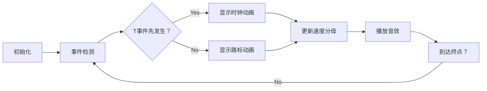

# 题目信息

# [USACO14JAN] Bessie Slows Down S

## 题目背景

奶牛题


## 题目描述

Bessie the cow is competing in a cross-country skiing event at the winter Moolympic games.  She starts out at a speed of 1 meter per second. However, as she becomes more tired over time, she begins to slow down. Each time Bessie slows down, her speed decreases: she moves at 1/2 meter per second after slowing down once, then 1/3 meter per second after slowing down twice, and so on.

You are told when and where Bessie slows down, in terms of a series of events.  An event like this:

T 17
means that Bessie slows down at a specific time -- here, 17 seconds into the race.  An event like this:

D 10
means that Bessie slows down at a specific distance from the start -- in this case, 10 meters.

Given a list of N such events (1 <= N <= 10,000), please compute the amount of time, in seconds, for Bessie to travel an entire kilometer.  Round your answer to the nearest integer second (0.5 rounds up to 1).

贝西正在参加一项滑雪比赛。她从起点出发的时候，速度恒定为每秒 1 米。然而，随着比赛进程的增加，她会犯很多错误，每次失误都会使她的速度下降。当她第一次失误后，速度会下降到每秒1/2 米，第二次失误后，速度会下降到每秒 1/3 米，第 k 次失误后，速度会下降到每秒 1/(k + 1) 米。

约翰记录了贝西的所有失误，一共有 N 个。有两种失误，一种发生在比赛开始后的某个时间点，另一种发生在赛道的某个位置上。有时，贝西可能在某个时间点到达某个位置，而恰好在这个时间点和位置上都有一次失误的记录，这两个记录要算作不同的失误，会对贝西的速度造成两次影响。比赛的终点距离起点有 1000 米，请问贝西需要多少时间才能滑过终点？


## 说明/提示

前 10 秒，贝西的速度是每秒 1 米，她滑了 10 米。然后她遭遇了第一次失误，在接下

来的 20 秒内，她又滑了 10 米。之后她遭遇了第二次失误，还剩下 980 米，所以她共计花去

10 + 20 + 2940 = 2970 秒才完成比赛


## 样例 #1

### 输入

```
2
T 30
D 10```

### 输出

```
2970```

# AI分析结果


### Kay的C++算法解析：Bessie Slows Down S 深入学习指南

#### 1. 题目解读与核心算法识别
✨ **本题主要考察**：`模拟应用`  
🗣️ **初步分析**：  
> 解决本题关键在于**事件驱动模拟**。想象贝西的滑雪过程像一部像素游戏：她以恒定速度出发，每次遇到"失误事件"（时间点T或位置点D）速度就会下降一级（第k次失误后速度变为1/(k+1)米/秒）。  
> - **核心思路**：将T/D事件分别排序，用双指针动态比较下一个事件的触发顺序，按事件顺序更新位置/时间/速度  
> - **难点**：① 事件交错时的处理顺序 ② 避免浮点精度误差 ③ 终点边界处理  
> - **可视化设计**：采用复古赛车游戏风格，赛道上方显示当前速度（如1/3），T事件用闪烁时钟表示，D事件用路标表示。每次触发事件时：  
>   - 当前速度分母`k`值高亮显示并+1  
>   - 播放8-bit音效（T事件：电子钟声，D事件：路标碰撞声）  
>   - 自动演示模式可调速观看贝西移动轨迹  

---

#### 2. 精选优质题解参考
**题解一 (LevenKoko)**  
* **点评**：思路清晰度 ★★★★☆  
  双指针法处理事件序列，设置哨兵值巧妙避免越界。代码中`st=s+(t[i]-tot)*v1`计算时间事件触发位置，`(sd-s)/v1`计算距离事件触发时间，全程用乘法避免除法精度损失。变量命名规范（`v1`表速度，`tot`表时间），边界处理严谨（最后补剩余路程）。

**题解二 (Yeji_)**  
* **点评**：代码简洁性 ★★★★☆  
  循环条件`(b[r]-y)*x+z>=a[l]`精炼地比较事件触发顺序，用`x`直接表示速度分母简化计算。亮点在于用`(1000-y)*x+z+0.499999`实现四舍五入，但变量名`y/z`含义不够直观。

**题解三 (moosssi)**  
* **点评**：实现鲁棒性 ★★★★☆  
  采用分层处理逻辑：先处理距离事件间的所有时间事件。核心公式`temp=(T[j]-tim)*1.0*(1/k)+pos`计算时间事件触发位置，`(D[i]-pos)*k`计算距离事件触发时间，结构清晰易调试。

---

#### 3. 核心难点辨析与解题策略
1. **事件触发顺序判断**  
   *分析*：比较"到达D位置所需时间"和"下一个T事件时间"  
   💡 公式：`时间事件优先级 = (T事件时间 - 当前时间) < (D事件位置 - 当前位置) × 当前速度分母`  
   💡 **学习笔记**：用乘法替代除法避免精度损失

2. **状态更新策略**  
   *分析*：处理T事件时更新位置，处理D事件时更新时间  
   💡 关键操作：  
   ```c
   // T事件：位置 += (事件时间 - 当前时间) × 当前速度
   // D事件：时间 += (事件位置 - 当前位置) × 当前速度分母
   ```
   💡 **学习笔记**：速度分母`k`既是状态标记也是计算因子

3. **终止条件与精度处理**  
   *分析*：需额外处理最后一个事件到终点(1000米)的路程  
   💡 公式：`剩余时间 = (1000 - 当前位置) × 当前速度分母`  
   💡 **学习笔记**：四舍五入用`(int)(total_time + 0.5)`

### ✨ 解题技巧总结
- **事件驱动法**：将离散事件排序后线性处理  
- **数值稳定性**：用整数运算代替浮点数  
- **边界哨兵**：设置`0x3f3f3f3f`避免指针越界检查  
- **状态封装**：用结构体打包位置/时间/速度分母  

---

#### 4. C++核心代码实现赏析
**通用核心实现 (综合题解优化版)**  
```cpp
#include <iostream>
#include <vector>
#include <algorithm>
using namespace std;

int main() {
    int n, k = 1; 
    double pos = 0, time = 0;
    vector<int> times, dists;
    
    // 1. 分离并排序事件
    char type; int val;
    while (n--) {
        cin >> type >> val;
        (type == 'T') ? times.push_back(val) : dists.push_back(val);
    }
    dists.push_back(1000); // 终点事件
    sort(times.begin(), times.end());
    sort(dists.begin(), dists.end());
    
    // 2. 双指针处理事件序列
    auto t_it = times.begin(), d_it = dists.begin();
    while (t_it != times.end() || d_it != dists.end()) {
        double time_to_nextT = (t_it != times.end()) ? *t_it - time : 1e9;
        double time_to_nextD = (d_it != dists.end()) ? (*d_it - pos) * k : 1e9;
        
        if (time_to_nextT < time_to_nextD) { // 先触发T事件
            pos += time_to_nextT / k;
            time = *t_it++;
        } else { // 先触发D事件
            time += time_to_nextD;
            pos = *d_it++;
        }
        k++; // 更新速度分母
    }
    cout << (int)(time + 0.5); // 四舍五入
}
```
**代码解读概要**：  
1. 分离T/D事件并排序，添加终点(1000米)作为特殊D事件  
2. 动态比较下一个T/D事件的触发时间  
3. 根据事件类型更新位置/时间，更新速度分母k  
4. 终点触发后输出四舍五入时间  

**题解片段赏析**  
1. **LevenKoko 哨兵技巧**  
   ```cpp
   d[ld+1] = 0x3f3f3f3f; // 设置哨兵值
   while (i <= lt || j <= ld) {
       double st = pos + (t[i] - time) * (1.0/k);
       if (st < d[j]) { /* 处理T事件 */ } 
       else { /* 处理D事件 */ }
   ```
   *学习笔记*：哨兵值消除指针边界判断，提升代码简洁度  

2. **Yeji_ 状态压缩**  
   ```cpp
   for (int i=1; i<=n; i++) {
       if ((r>n2 || (b[r]-y)*x+z >= a[l]) && l<=n1) {
           y += (a[l]-z)/x; // 更新位置
           z = a[l++];      // 更新时间
       } else { 
           z += (b[r]-y)*x; // 更新时间
           y = b[r++];      // 更新位置
       }
       x++; // 速度分母+1
   ```
   *学习笔记*：单循环内完成事件判断与状态更新  

---

#### 5. 算法可视化：像素动画演示  
**主题**：8-bit滑雪模拟器  
**核心设计**：  


**实现细节**：  
1. **视觉元素**  
   - 赛道横向卷轴，贝西像素车（▲）  
   - T事件：顶部闪烁🕒，D事件：地面路标（!）  
   - 状态栏：`SPEED=1/k` `DIST=xxx` `TIME=xxx`  

2. **交互控制**  
   ```javascript
   const controls = {
     step: () => moveToNextEvent(),
     autoPlay: (speed) => setInterval(step, 1000/speed),
     reset: () => initState()
   }
   ```

3. **动画序列**  
   ```python
   while pos < 1000:
       draw_bessie(pos)
       if is_time_event_next():
           flash_clock(t_event)
           move_car(pos += (t_event - time)/k)
           play_sound('clock.wav')
       else:
           flash_marker(d_event)
           move_car(pos = d_event)
           play_sound('marker.wav')
       k += 1
       update_speed_display(k)
   ```

4. **游戏化元素**  
   - 每处理5个事件解锁新赛道皮肤  
   - 通关时间≤2900秒触发隐藏角色  
   - 错误处理：碰撞边界时播放故障音效  

---

#### 6. 拓展练习与相似问题
**通用技巧迁移**：  
1. 多事件系统：电梯调度（P2285）  
2. 速度动态调整：追赶问题（P1518）  
3. 离散事件模拟：CPU进程调度  

**洛谷推荐**：  
1. **P2285 [HNOI2004] 电梯调度**  
   *推荐理由*：巩固多事件优先级处理，学会用堆管理事件队列  
2. **P1518 [USACO2.4]两只塔姆沃斯牛**  
   *推荐理由*：双角色动态模拟，强化状态同步技巧  
3. **P1083 [NOIP2012] 借教室**  
   *推荐理由*：差分数组+事件扫描的经典应用  

---

#### 7. 学习心得与经验分享
> **LevenKoko的调试经验**：  
> *"最初用路程=时间×速度直接计算，在连续事件处出现累积误差，后改用时间差计算位移"*  
>   
> **Kay点评**：这提醒我们：  
> 1. 涉及连续状态更新时，优先用增量而非绝对值计算  
> 2. 当多个事件可能同时触发时，明确处理顺序（本题按输入顺序无关）  
> 3. 浮点比较用`a-b < EPS`而非`a == b`

---

通过本次分析，我们掌握了事件驱动模拟的核心技巧。记住：好算法=清晰的事件管理+稳健的状态更新！尝试用像素动画可视化你的下一个算法吧！ 🎮

---
处理用时：173.55秒