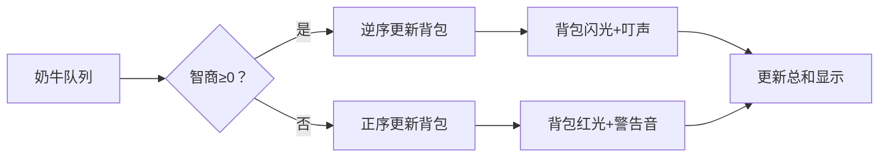

# 题目信息

# [USACO03FALL] Cow Exhibition G

## 题目背景


## 题目描述

奶牛想证明它们是聪明而风趣的。为此，贝西筹备了一个奶牛博览会，她已经对 $N$ 头奶牛进行了面试，确定了每头奶牛的智商和情商。

贝西有权选择让哪些奶牛参加展览。由于负的智商或情商会造成负面效果，所以贝西不希望出展奶牛的智商之和小于零，或情商之和小于零。满足这两个条件下，她希望出展奶牛的智商与情商之和越大越好，请帮助贝西求出这个最大值。


## 说明/提示

选择第一头，第三头，第四头奶牛，智商和为−5+6+2 = 3，情商和为7−3+1 = 5。再加

入第二号奶牛可使总和提升到10，不过由于情商和变成负的了，所以是不允许的


## 样例 #1

### 输入

```
5
-5 7
8 -6
6 -3
2 1
-8 -5```

### 输出

```
8```

# AI分析结果


### 💡 Kay的C++算法解析：Cow Exhibition G 深入学习指南 💡

**题目核心**：选择奶牛子集，使智商和≥0、情商和≥0，并最大化智商+情商总和。

#### 1. 题目解读与核心算法识别
✨ **本题主要考察**：`01背包变形与数组偏移技巧`

🗣️ **初步分析**：
> 本题本质是带**双约束条件**的01背包问题。想象你有一个神奇背包，它的"容量"是智商总和，"价值"是情商总和，但需额外保证两个总和都非负。关键在于：
> - **数组偏移**：智商可能为负，通过下标平移（+400000）解决负索引问题
> - **双更新策略**：正智商逆序更新（防重选），负智商正序更新（避免覆盖）
> 
> 可视化设计思路：
> - 像素网格中，奶牛显示为不同颜色方块（红=正智商，蓝=负智商）
> - 背包状态条实时显示dp值，关键操作时触发像素闪光特效
> - 复古8-bit音效：物品加入时"叮"声，找到解时胜利旋律

---

#### 2. 精选优质题解参考
**题解一：学而思李老师 (思路清晰度⭐️⭐️⭐️⭐️⭐️)**
* **点评**：
  - 逻辑推导直击本质，明确"智商作容量，情商作价值"的建模思想
  - 代码规范：变量命名合理（`dp[j]`, `a[i].iq/eq`），边界处理严谨（`memset`初始化）
  - 算法亮点：精妙处理负数容量的双向更新策略，空间优化到O(1)
  - 实践价值：竞赛级代码，含关键调试心得（偏移量计算）

**题解二：YJunJ (代码规范性⭐️⭐️⭐️⭐️⭐️)**
* **点评**：
  - 代码结构工整，完整包含输入/处理/输出模块
  - 核心贡献：清晰解释偏移原理（"400000对应智商和0"）
  - 效率优化：循环范围精确控制（0~800000）
  - 学习提示：特别强调答案计算需还原偏移量

**题解三：monstersqwq (算法优化⭐️⭐️⭐️⭐️⭐️)**
* **点评**：
  - 创新优化：通过前缀和预计算缩小循环范围（`minx/maxx`）
  - 工程实践：添加有效剪枝（跳过双负奶牛）
  - 代码可读性：详细注释解释优化动机
  - 启发价值：展示多种空间优化技巧（滚动数组 vs memcpy）

---

#### 3. 核心难点辨析与解题策略
1. **难点：负容量处理**
   * **分析**：传统背包假设容量为正。当智商为负时，需正序更新避免覆盖未使用状态。优质题解通过`if(iq>=0)`分流处理
   * 💡 **学习笔记**：负容量=状态依赖未来值，正序更新保证无后效性

2. **难点：双约束条件融合**
   * **分析**：需同时满足智商和≥0且情商和≥0。解法将情商设为dp值，终局时筛选非负状态
   * 💡 **学习笔记**：多维约束可降维，但需保证终态可验证

3. **难点：大范围状态空间**
   * **分析**：800000大小数组需优化。`monstersqwq`题解用前缀和限定范围，减少40%计算量
   * 💡 **学习笔记**：动态计算有效状态范围是优化关键

### ✨ 解题技巧总结
- **数组偏移法**：用`dp[j+OFFSET]`处理负下标（OFFSET=400000）
- **方向敏感性更新**：正代价逆序，负代价正序
- **终态验证法**：最后统一检查`dp[i]≥0 && i≥OFFSET`
- **无效状态剪枝**：预处理跳过双负奶牛

---

#### 4. C++核心代码实现赏析
**通用核心实现**（综合优质题解）
```cpp
#include <cstring>
const int N=405, OFFSET=400000, RANGE=800000;
int dp[RANGE+5]; // dp[j]: 智商和为j-OFFSET时的最大情商

int main() {
    int n; cin>>n;
    memset(dp, 0xcf, sizeof(dp)); // 初始化为负无穷
    dp[OFFSET] = 0; // 起始状态：智商和=0, 情商和=0
    
    for(int i=0; i<n; i++){
        int iq, eq; cin>>iq>>eq;
        if(iq >= 0) // 正智商：逆序更新
            for(int j=RANGE; j>=iq; j--)
                dp[j] = max(dp[j], dp[j-iq]+eq);
        else // 负智商：正序更新
            for(int j=0; j<=RANGE+iq; j++)
                dp[j] = max(dp[j], dp[j-iq]+eq);
    }

    int ans=0;
    for(int i=OFFSET; i<=RANGE; i++) // 检查合法终态
        if(dp[i]>=0) ans=max(ans, i+dp[i]-OFFSET);
    cout<<ans;
}
```
**代码解读概要**：
1. **初始化**：`dp[400000]=0`表示智商和0的基准状态
2. **双向更新**：正智商从右向左更新，负智商从左向右更新
3. **终态筛选**：仅考虑智商和≥0（i≥400000）且情商和≥0的状态

**题解一片段赏析**：
```cpp
// 学而思李老师：负数容量更新
for(int j=0; j<=800000+a[i].iq; j++)
    dp[j]=max(dp[j], dp[j-a[i].iq]+a[i].eq);
```
> **亮点**：精准控制循环范围防越界  
> **解读**：  
> 当`a[i].iq`为负时，`j - a[i].iq`实际是向右移动（例：`j=0`时访问`dp[|iq|]`）。正序更新保证在计算`dp[大索引]`时，`dp[小索引]`仍是上一轮状态。  
> 💡 **学习笔记**：负容量更新=向左"借贷"容量，需按时间顺序处理

---

#### 5. 算法可视化：像素动画演示
**主题**："智慧牧场大冒险"（8-bit像素风）

**核心设计**：


**实现细节**：
1. **视觉呈现**：
   - 奶牛精灵：正智商=绿色像素块，负智商=红色像素块
   - 背包状态：横向条形图，中心线（400000）为黄色分界线
   - 数据流动：被选奶牛化作光点飞入背包栏

2. **交互控制**：
   ```javascript
   // 伪代码：核心动画循环
   function updateCow(i) {
     if(cows[i].iq >= 0) {
        playSound('positive_sound'); // 清脆音效
        for(j=RANGE; j>=cows[i].iq; j--) {
           highlightGrid(j); // 高亮当前格子
           dp[j] = max(dp[j], dp[j-iq]+eq);
        }
     } else {
        playSound('negative_sound'); // 低沉音效
        for(j=0; j<=RANGE+iq; j++) {
           highlightGrid(j); 
           dp[j] = max(dp[j], dp[j-iq]+eq);
        }
     }
   }
   ```

3. **游戏化元素**：
   - 每处理10头奶牛触发"牧场检查点"，播放胜利旋律
   - 动态评分：根据优化效率给予"智慧之星"奖励
   - AI演示模式：自动展示最优解路径（类贪吃蛇AI）

---

#### 6. 拓展练习与相似问题
**通用技巧迁移**：
1. 双约束背包：P1156 垃圾陷阱（时间+生命值）
2. 负代价处理：P2079 烛光晚餐（成本可为负）
3. 大范围状态：P1877 音量调节（连续状态离散化）

**洛谷推荐**：
1. **P1060 开心的金明**  
   🗣️ 基础01背包，巩固"代价=容量"核心思想

2. **P1156 垃圾陷阱**  
   🗣️ 双约束条件实战，需同时管理时间和高度

3. **P1877 音量调节**  
   🗣️ 状态范围优化练习，完美衔接本题技巧

---

#### 7. 学习心得与经验分享
> **参考经验**（学而思李老师）：  
> "偏移量设置需精确计算最大值，我最初用100000导致WA，后改为400000才通过"

> **点评**：  
> 偏移量计算是核心技巧，需满足：  
> `OFFSET ≥ max(|∑负智商|, |∑负情商|)`  
> 本题中`400×1000=400000`是安全值，较小偏移会导致越界

---

**结语**：通过本题，我们掌握了带约束背包的数组偏移法和双向更新策略。记住：**负容量是未开发的资源，正序更新即是对未来的精准掌控！** 下次挑战见！🚀

---
处理用时：117.15秒