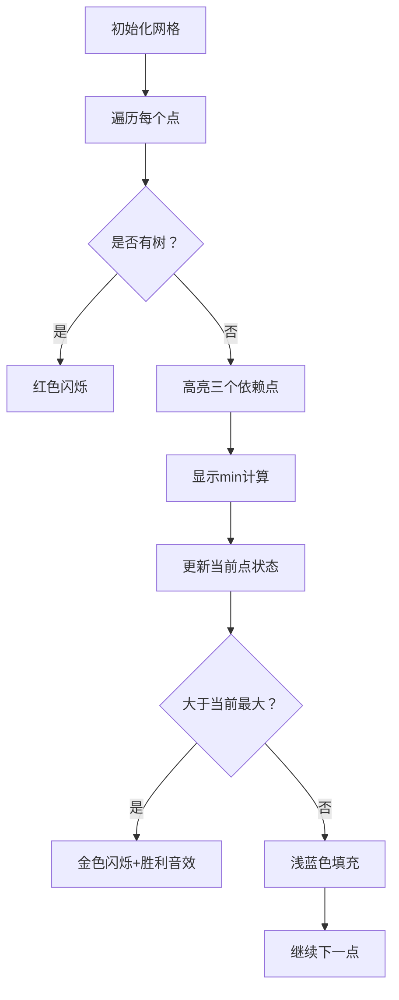

# 题目信息

# [USACO5.3] 巨大的牛棚Big Barn

## 题目背景

（USACO 5.3.4）


## 题目描述

FJ 有一个大小为 $n\times n$ 的农场（$1\le n\le 1000$），他想要在他的农场上建造一座正方形大牛棚。他的农场中有 $t$ 棵果树（$1\le t\le10000$），但他为了不破坏果树，就想找一个空旷无树的地方修建牛棚。你的任务是计算并输出，在他的农场中，不需要砍树却能够修建的最大正方形牛棚的边长。当然，牛棚的边必须和水平轴和垂直轴平行。

考虑下面的农场，`.` 表示没有树的方格，`#` 表示有树的方格。
```plain
0 1 2 3 4 5 6 7 8
1 . . . . . . . .
2 . # . . . # . .
3 . . . . . . . .
4 . . . . . . . .
5 . . . . . . . .
6 . . # . . . . .
7 . . . . . . . .
8 . . . . . . . .
```
最大的牛棚是边长为 $5$ 的，可以建造在农场右下角的两个位置其中一个。


## 说明/提示

题目翻译来自NOCOW。

USACO Training Section 5.3


## 样例 #1

### 输入

```
8 3

2 2

2 6

6 3```

### 输出

```
5```

# AI分析结果


# 💡 Kay的C++算法解析：巨大的牛棚Big Barn 深入学习指南 💡

## 1. 题目解读与核心算法识别

✨ **本题主要考察**：动态规划 (Dynamic Programming)

🗣️ **初步分析**：
> 解决"巨大的牛棚"这道题，关键在于运用动态规划(DP)。简单来说，动态规划就像搭积木，用小积木的状态推导出大积木的状态。在本题中，我们用一个二维数组记录每个位置能形成的最大正方形边长，通过三个相邻位置的状态推导当前状态。

- 题解思路：主流解法是用DP数组`dp[i][j]`表示以`(i,j)`为右下角的最大正方形边长。核心状态转移方程：`dp[i][j] = min(dp[i-1][j], dp[i][j-1], dp[i-1][j-1]) + 1`（当该位置无树时）
- 可视化设计：采用8位像素风格，网格中不同颜色表示空地、树木、当前计算点及三个依赖点（左、上、左上）。动画将高亮当前点及三个相邻点，显示状态转移过程，伴随"叮"声提示状态更新，发现更大正方形时播放胜利音效。

---

## 2. 精选优质题解参考

**题解一：(来源：旗木五五开)**
* **点评**：此解思路清晰，直接点明DP状态定义和转移方程，并用矩阵示例辅助理解。代码规范，变量命名合理（`a`数组标记树木位置，`f`数组存储状态），边界处理完善（初始化`a`数组为1）。虽然头文件过多但不影响逻辑，是竞赛实战的优秀参考。

**题解二：(来源：Jayun)**
* **点评**：此解亮点在于用对比方式解释为什么用`min`而非`max`，通过错误示例强化理解。代码简洁规范，注释到位，初始化`f`数组为1的处理巧妙。提供Pascal版本代码，体现多语言思维，实践价值高。

**题解三：(来源：顾z)**
* **点评**：采用悬线法提供不同解题视角，维护left/right/up三个数组。虽比DP复杂，但拓展性强，适合解决矩形问题。代码结构清晰，有详细注释和相关题目推荐，具有较高学习价值。

---

## 3. 核心难点辨析与解题策略

1.  **状态转移的理解**
    * **分析**：为什么取左、上、左上三个方向的最小值？因为正方形边长受限于最短的"短板"，只有三个方向都能扩展，当前点才能形成更大的正方形。
    * 💡 **学习笔记**：DP的状态转移需保证状态无后效性，当前状态完全由子问题决定。

2.  **边界条件处理**
    * **分析**：对于第一行/列，当`i=1`或`j=1`时，若该位置无树，边长只能为1（无法向左/上扩展）。可通过初始化`dp[0][*]=dp[*][0]=0`简化处理。
    * 💡 **学习笔记**：DP的边界初始化直接影响状态转移的正确性。

3.  **空间优化技巧**
    * **分析**：当`n`较大时，可用滚动数组优化空间。观察状态转移发现当前行只依赖前一行，只需保存两行数据。
    * 💡 **学习笔记**：DP的空间优化要抓住状态依赖关系，减少冗余存储。

### ✨ 解题技巧总结
- **状态定义技巧**：选择能完整描述子问题且具备无后效性的状态定义（如本题以右下角为基准点）
- **预处理优化**：先标记树木位置，避免DP过程中反复判断
- **遍历顺序**：DP通常需要特定的遍历顺序（本题需从左到右、从上到下）
- **调试技巧**：打印中间DP矩阵（如5x5小规模），验证状态转移

---

## 4. C++核心代码实现赏析

**本题通用核心C++实现参考**
```cpp
#include <iostream>
#include <cstring>
#include <algorithm>
using namespace std;

const int N = 1005;
int n, t;
bool hasTree[N][N]; // 标记是否有树
int dp[N][N];      // dp[i][j]表示以(i,j)为右下角的最大正方形边长

int main() {
    cin >> n >> t;
    memset(hasTree, 0, sizeof(hasTree));
    memset(dp, 0, sizeof(dp));

    while (t--) {
        int x, y;
        cin >> x >> y;
        hasTree[x][y] = true;
    }

    int ans = 0;
    for (int i = 1; i <= n; i++) {
        for (int j = 1; j <= n; j++) {
            if (hasTree[i][j]) {
                dp[i][j] = 0;
            } else {
                dp[i][j] = min({dp[i-1][j], dp[i][j-1], dp[i-1][j-1]}) + 1;
                ans = max(ans, dp[i][j]);
            }
        }
    }
    cout << ans << endl;
    return 0;
}
```

**代码解读概要**：该实现首先标记树木位置，然后遍历网格。对于每个位置，如果有树则dp值=0；否则取左、上、左上三个方向dp值的最小值+1。同时维护最大边长ans。

---

**题解一：(旗木五五开)**
* **亮点**：简洁直接的DP实现，巧妙初始化a数组
* **核心代码片段**：
```cpp
for(int i=1; i<=n; i++)
    for(int j=1; j<=n; j++)
        if(a[i][j]) // 空地才执行
            f[i][j]=min(min(f[i][j-1],f[i-1][j]),f[i-1][j-1])+1;
```
* **代码解读**： 
  > 1. 外层循环遍历行，内层循环遍历列
  > 2. `if(a[i][j])`判断当前位置是否为空地（注意作者用0表示树）
  > 3. 状态转移：通过两次`min`调用取三个方向的最小值
* 💡 **学习笔记**：二维DP常需双重循环遍历状态空间

**题解二：(Jayun)**
* **亮点**：复用f数组同时标记树木位置和存储状态
* **核心代码片段**：
```cpp
for(int i=1;i<=n;i++)     
    for(int j=1;j<=n;j++)
        if(f[i][j]==0) continue; // 遇到树跳过
        else {
            f[i][j]=min(min(f[i-1][j],f[i][j-1]),f[i-1][j-1])+1;
            ans=max(ans,f[i][j]);
        }
```
* **代码解读**：
  > 1. 初始化时已将树木位置设为0，空地设为1
  > 2. 遇到0（树）直接跳过，避免无效计算
  > 3. 在DP循环中实时更新最大值，减少后续遍历
* 💡 **学习笔记**：复用数组可节省内存，但需注意状态含义转换

**题解三：(顾z)**
* **亮点**：悬线法解决最大子矩阵问题
* **核心代码片段**：
```cpp
for(int i=1;i<=n;i++)
    for(int j=1;j<=n;j++)
    {
        if(i>1 && res[i][j]==0 && res[i-1][j]==0) {
            left[i][j]=max(left[i][j],left[i-1][j]);
            right[i][j]=min(right[i][j],right[i-1][j]);
            up[i][j]=up[i-1][j]+1;
        }
        int a=right[i][j]-left[i][j]+1;
        int b=min(a,up[i][j]);
        ans=max(ans,b);
    }
```
* **代码解读**：
  > 1. 维护left/right/up三个数组记录延伸边界
  > 2. 当当前位置和上方位置均无障碍时更新状态
  > 3. 正方形边长取横向长度和纵向高度的最小值
* 💡 **学习笔记**：悬线法可解决更一般的矩形问题

-----

## 5. 算法可视化：像素动画演示

**主题**："农场建造者" - 在像素网格上动态展示DP状态转移

**核心演示内容**：
1. 8位像素风格农场网格（1000x1000按比例缩小）
   - 空地：浅绿色像素块
   - 树木：深绿色像素块（带树形图案）
   - 当前计算点：闪烁黄色边框
   - 依赖点（左/上/左上）：蓝色边框
2. DP状态值实时显示在像素块上方
3. 状态转移时显示min计算过程

**动画流程**：


**交互控制**：
- 单步执行：按空格键逐步观察
- 速度滑块：调整动画速度（0.5x-5x）
- 模式切换：自动演示/手动步进
- 视角追踪：自动聚焦当前计算点

**游戏化元素**：
- 每完成一行播放"升级"音效
- 发现更大正方形时播放"胜利"旋律
- 最终展示最大正方形（金色边框+闪光效果）

**技术实现**：
- Canvas绘制网格（每个像素块20x20）
- 状态依赖关系用箭头连接
- 使用Web Audio API播放8-bit音效

---

## 6. 拓展练习与相似问题思考

**通用思路迁移**：
1. 最大矩形问题（如P4147 玉蟾宫）
2. 带障碍物的路径规划（如P1002 过河卒）
3. 01矩阵中的模式匹配（如P1736 创意吃鱼法）

**练习推荐（洛谷）**：
1. **P1387 最大正方形**  
   → 同类问题直接练习
2. **P1736 创意吃鱼法**  
   → 变形DP，状态设计更复杂
3. **P4147 玉蟾宫**  
   → 悬线法应用，求最大矩形
4. **P2701 巨大的牛棚**  
   → 本题，可尝试不同解法

---

## 7. 学习心得与经验分享

> **经验摘录 (旗木五五开)**：  
> "树砍掉不就不用这么麻烦了么。。。 (实际代码中仍需遵守题意)"

> **点评**：  
> 看似玩笑的吐槽提醒我们：算法实现必须严格遵循题目约束。在竞赛中，审清题意（如本题"不能砍树"）往往比算法本身更重要。

> **经验摘录 (Jayun)**：  
> "用jio指头想想就能知道，f[i][j]是由左、上、左上方向来的"

> **点评**：  
> 生动的表述强调DP的核心思想——当前状态由子问题推导而来。动手画3x3网格模拟能有效理解状态转移。

---

本次关于"巨大的牛棚"的解析就到这里。记住：理解状态转移的本质比记忆代码更重要！下次挑战见！🚀

---
处理用时：218.18秒