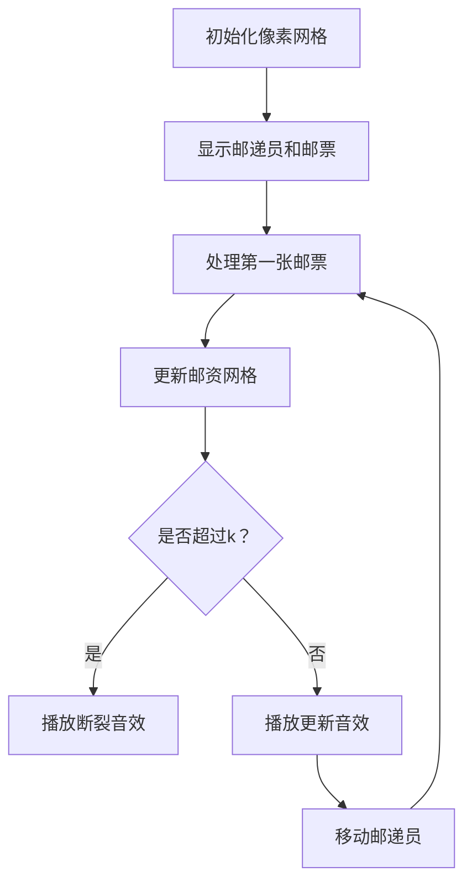

# 题目信息

# [USACO3.1] 邮票 Stamps

## 题目描述

给一组 $n$ 枚邮票的面值集合和一个上限 $k$ —— 表示信封上能够贴 $k$ 张邮票。请求出最大的正整数 $m$，满足 $1$ 到 $m$ 的面值都可以用不超过 $k$ 张邮票表示出来。


## 说明/提示

#### 样例输入输出 1 解释

有 $1$ 分和 $3$ 分的邮票；你最多可以贴 $5$ 张邮票。很容易贴出 $1$ 到 $5$ 分的邮资（用 $1$ 分邮票贴就行了），接下来的邮资也不难：


- $6 = 3 + 3$。
- $7 = 3 + 3 + 1$。
- $8 = 3 + 3 + 1 + 1 $。
- $9 = 3 + 3 + 3 $。
- $10 = 3 + 3 + 3 + 1 $。
- $11 = 3 + 3 + 3 + 1 + 1 $。
- $12 = 3 + 3 + 3 + 3 $。
- $13 = 3 + 3 + 3 + 3 + 1$。


然而，使用 $5$ 枚 $1$ 分或者 $3$ 分的邮票根本不可能贴出 $14$ 分的邮资。因此，答案为 $13$。

#### 数据规模与约定

对于 $100\%$ 的数据，保证 $1 \leq k \leq 200$，$1 \leq n \leq 50$，$1 \leq a_i \leq 10^4$。

#### 说明

题目翻译来自 NOCOW。

## 样例 #1

### 输入

```
5 2
1 3```

### 输出

```
13```

# AI分析结果


# 💡 Kay的C++算法解析：[USACO3.1] 邮票 Stamps 深入学习指南 💡

**引言**  
今天我们一起分析"邮票 Stamps"这道C++编程题。本指南将帮助大家理解如何用动态规划解决连续邮资问题，掌握完全背包技巧，并通过像素动画直观感受算法执行过程。

---

## 1. 题目解读与核心算法识别

✨ **本题主要考察**：`动态规划（完全背包）`  

🗣️ **初步分析**：  
> 解决邮票问题就像用积木搭建连续数字塔。我们有不同面值的邮票（积木块），每次最多使用k张（限高），目标是搭建从1开始最长的连续数字塔（邮资）。  
> - **核心思路**：使用动态规划记录每个邮资所需的最少邮票数。状态定义为`dp[i]`表示凑出面值i所需的最少邮票数  
> - **关键难点**：状态转移时需保证邮票数≤k，且要找到连续邮资的断裂点  
> - **可视化设计**：动画将展示邮资网格的更新过程，高亮当前处理的邮票面值和新更新的邮资格子，用像素方块颜色深浅表示邮票使用数量  
> - **复古元素**：采用8-bit像素风格，邮递员角色移动更新邮资，伴随"叮"的音效标记更新，"胜利"音效标记连续邮资增长  

---

## 2. 精选优质题解参考

**题解一（作者：QQ红包 赞55）**  
* **点评**：思路清晰直击完全背包本质，代码规范（变量名`f[j]`含义明确），采用一维DP数组优化空间复杂度至O(M)。边界处理严谨（`f[0]=0`初始化），循环终止条件高效，可直接用于竞赛。  

**题解二（作者：ysner 赞25）**  
* **点评**：详解状态转移方程推导过程，提供完整DP决策分析（样例分步演示），虽未实际使用排序优化但分析具有教学启发性。代码可读性强，实践价值高。  

**题解三（作者：Priori_Incantatem 赞13）**  
* **点评**：创新性使用提前终止循环优化（当`f[i]>k`立即跳出），显著减少不必要的计算。代码简洁高效，空间边界计算合理（maxv=k*max_stamp）。  

---

## 3. 核心难点辨析与解题策略

1. **状态定义准确性**  
   * **分析**：`dp[i]`需精确表示"凑出面值i的最小邮票数"。优质解法都明确定义`dp[0]=0`作为基准状态，其他初始化为极大值（`0x3f3f3f3f`）  
   * 💡 **学习笔记**：好的状态定义是DP成功的基石  

2. **状态转移方程推导**  
   * **分析**：转移方程`dp[j] = min(dp[j], dp[j-stamp]+1)`体现了完全背包特性。需注意两点：(1)j需≥stamp (2)更新后需≤k  
   * 💡 **学习笔记**：状态转移就是"用当前邮票扩展可能邮资"的数学表达  

3. **连续邮资断裂点检测**  
   * **分析**：从i=1开始顺序扫描dp数组，第一个`dp[i]>k`的位置即为断裂点，答案为i-1  
   * 💡 **学习笔记**：顺序扫描保证连续性检测的可靠性  

### ✨ 解题技巧总结
- **技巧1：空间优化**：使用一维DP数组替代二维，注意内层循环顺序（正序更新）  
- **技巧2：边界剪枝**：计算最大可能邮资(k*max_stamp)避免无效循环  
- **技巧3：常量初始化**：用`0x3f3f3f3f`表示"无穷大"既安全又高效  

---

## 4. C++核心代码实现赏析

**本题通用核心C++实现参考**  
* **说明**：综合优质题解优化，包含边界剪枝和空间优化  
* **完整核心代码**：
```cpp
#include <iostream>
#include <cstring>
#include <algorithm>
using namespace std;
const int MAXV = 2000000; 

int main() {
    int k, n;
    cin >> k >> n;
    int stamps[55], max_stamp = 0;
    for (int i = 0; i < n; i++) {
        cin >> stamps[i];
        max_stamp = max(max_stamp, stamps[i]);
    }
    
    int max_sum = max_stamp * k + 5; // 计算最大邮资边界
    int dp[MAXV] = {};
    memset(dp, 0x3f, sizeof(dp));
    dp[0] = 0;

    for (int i = 0; i < n; i++) {
        for (int j = stamps[i]; j <= max_sum; j++) {
            if (dp[j - stamps[i]] + 1 <= k) {
                dp[j] = min(dp[j], dp[j - stamps[i]] + 1);
            }
        }
    }

    int ans = 0;
    while (dp[ans + 1] <= k) ans++;
    cout << ans << endl;
    return 0;
}
```
* **代码解读概要**：  
  1. 读入邮票数据并计算最大面值  
  2. 初始化dp数组（`dp[0]=0`，其余为`0x3f`）  
  3. 完全背包核心循环：对每种邮票面值，正序更新可能邮资  
  4. 顺序扫描找到最大连续邮资  

---

**题解一核心代码片段**  
```cpp
for (i=1;i<=n;i++) {
    scanf("%d",&a);
    for (j=a;j<=2000000;j++)
        if (f[j-a]+1<=k) 
            f[j]=min(f[j],f[j-a]+1);
}
```
* **亮点**：简洁高效的完全背包实现  
* **代码解读**：  
  > 外层遍历邮票种类，内层从当前邮票面值开始正序更新。关键条件`f[j-a]+1<=k`确保邮票数不超限，`min()`函数保证记录最小邮票数  
* 💡 **学习笔记**：正序更新是解决完全背包问题的关键特征  

**题解三核心代码片段**  
```cpp
for(int i=1;i<=Maxm;i++) {
    f[i]=inf;
    for(int j=1;j<=n;j++)
        if(i-a[j]>=0) f[i]=min(f[i],f[i-a[j]]+1);
    if(f[i]==inf || f[i]>m) break; // 提前终止
    ans++;
}
```
* **亮点**：动态更新答案的提前终止优化  
* **代码解读**：  
  > 在DP过程中同步检测连续邮资，当遇到第一个无法凑出的邮资立即跳出循环。优势在于避免后续无效计算，尤其适合大范围数据  
* 💡 **学习笔记**：将结果检测融入DP过程可提升算法效率  

---

## 5. 算法可视化：像素动画演示

**主题**：8-bit像素邮递员的背包之旅  
**核心演示**：完全背包更新过程与连续邮资检测  

### 设计细节


1. **场景设计**：
   - 顶部：邮票选择区（不同颜色像素块代表不同面值）
   - 中部：邮资网格（0→max_sum），每个格子显示当前邮资和邮票数
   - 底部：控制面板（开始/暂停/单步/速度条）

2. **动态演示**：
   - **初始化**：邮资网格全灰（？），0号格绿色（dp[0]=0）
   - **邮票处理**：
     * 选择邮票时高亮该邮票块
     * 更新邮资：j从stamp开始，j-stamp格→j格产生绿色流动箭头
     * 成功更新：格子变浅绿（数值减少）或深绿（首次到达）
     * 播放"叮"音效
   - **连续检测**：邮递员从1号格向右移动，连续邮资显示为金色光带

3. **游戏化元素**：
   - 每扩展10个连续邮资触发"COMBO"特效
   - 断裂点显示"GAME OVER"并展示最终分数（连续邮资值）
   - 背景音乐：8-bit风格循环旋律

4. **交互控制**：
   - 单步执行：观察每个状态更新细节
   - 自动演示：调整速度看整体流程
   - 重置：初始化状态重新开始

**实现要点**：用Canvas绘制网格，setInterval控制动画帧，颜色变化使用rgba渐变，音效用Web Audio API实现。

---

## 6. 拓展练习与相似问题思考

**通用技巧迁移**：  
完全背包思想可应用于：  
1. 硬币找零问题（最小硬币数）  
2. 物品组合问题（特定和的方法数）  
3. 资源最优分配问题  

**洛谷题目推荐**：  
1. **P1616 疯狂的采药**  
   🗣️ 经典完全背包问题，巩固"正序更新"核心技巧  
2. **P1679 神奇的四次方数**  
   🗣️ 类似最小邮票数，学习预处理物品列表  
3. **P2722 总分**  
   🗣️ 完全背包变体，掌握价值最大化场景  

---

## 7. 学习心得与经验分享

> 本次分析的题解中未发现明确的作者个人心得分享，但优质题解呈现了以下通用经验：  
> - **调试技巧**：初始化`dp[0]=0`避免状态转移起点错误  
> - **优化意识**：最大邮资=最大面值×k是重要的剪枝边界  
> - **代码简洁**：一维DP替代二维时注意更新顺序  

---

**结语**  
通过本次对邮票问题的深度解析，相信大家已掌握动态规划解决完全背包问题的核心方法。记住：定义准确的状态 + 设计高效的转移 = 成功的DP算法。下次遇到类似问题，不妨回想像素邮递员的背包之旅哦！💪

---
处理用时：178.63秒