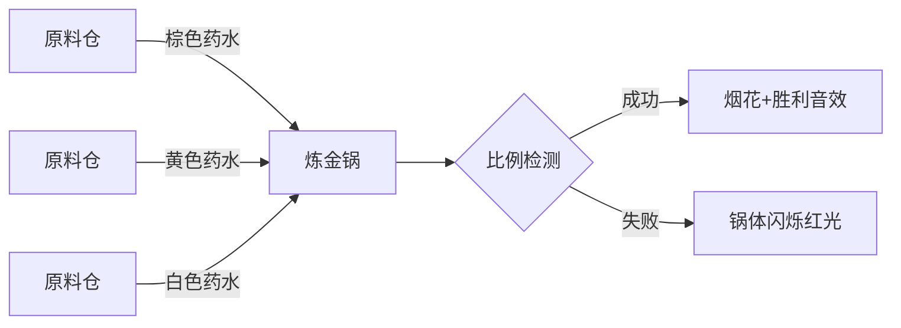

# 题目信息

# [USACO3.2] 饲料调配 Feed Ratios

## 题目背景

农夫约翰从来只用调配得最好的饲料来喂他的奶牛。饲料用三种原料调配成：大麦，燕麦和小麦。他知道自己的饲料精确的配比，在市场上是买不到这样的饲料的。他只好购买其他三种混合饲料（同样都由三种麦子组成），然后将它们混合，来调配他的完美饲料。


## 题目描述

给出三组整数，表示 大麦：燕麦：小麦 的比例，找出用这三种饲料调配 x：y：z 的饲料的方法。

例如，给出目标饲料 3：4：5 和三种饲料的比例：

1:2:3
3:7:1
2:1:2
你必须编程找出使这三种饲料用量最少的方案，要是不能用这三种饲料调配目标饲料，输出“NONE”。“用量最少”意味着三种饲料的用量（整数）的和必须最小。


对于上面的例子，你可以用8份饲料1，1份饲料2，和5份饲料3，来得到7份目标饲料：

8\*(1:2:3) + 1\*(3:7:1) + 5\*(2:1:2) = (21:28:35) = 7\*(3:4:5)

表示饲料比例的整数以及目标饲料的都是小于100的非负整数。表示各种饲料的份数的整数，都小于100。一种混合物的比例不会由其他混合物的比例直接相加得到。


## 说明/提示

题目翻译来自NOCOW。

USACO Training Section 3.2


## 样例 #1

### 输入

```
3 4 5
1 2 3
3 7 1
2 1 2 ```

### 输出

```
8 1 5 7```

# AI分析结果


### 💡 Kay的C++算法解析：饲料调配 深入学习指南 💡  
**引言**  
今天我们来分析USACO经典题目《饲料调配》。这道题要求用三种饲料精确调配出目标比例，考验数学建模能力和算法优化技巧。我们将通过多解法对比、难点剖析和像素动画演示，帮助大家掌握核心思想。

---

## 1. 题目解读与核心算法识别  
✨ **本题主要考察**：`枚举优化`与`数学建模`  

🗣️ **初步分析**：  
> 本题本质是求解三元一次方程组的**整数解**问题。想象你是一位炼金术师，需要精确混合三种药水（饲料）配出黄金比例（目标饲料）。核心挑战在于：  
> - **数学建模**：将饲料混合转化为方程组（如 `8×饲料1 + 1×饲料2 + 5×饲料3 = 7×目标饲料`）  
> - **高效枚举**：在100³的庞大空间中快速找到最小整数解  
>  
> **可视化设计思路**：  
> 我们将用**8位像素炼金工坊**动画演示混合过程：  
> - 三色药水瓶代表饲料，炼金锅显示实时混合比例  
> - 关键步骤高亮：当前投放的饲料瓶闪烁，炼金锅颜色随比例变化  
> - 音效反馈：投放时“叮”声，成功时8-bit胜利旋律  

---

## 2. 精选优质题解参考  
**题解一：Celebrate（枚举优化）**  
* **点评**：  
  思路清晰度★★★★☆ ｜ 代码规范性★★★★★ ｜ 算法有效性★★★★★  
  通过**三重循环枚举总份数+两种饲料量**，第三种饲料自动推导。亮点在于：  
  - 用`交叉相乘 (mix1*x == mix0*y)` 避免浮点误差和除零错误  
  - 限制总份数≤300的合理剪枝  
  > *"如同炼金时精确控制每种药材的剂量，避免浪费"*  

**题解二：Youngsc（数学优化）**  
* **点评**：  
  思路清晰度★★★★☆ ｜ 代码规范性★★★★☆ ｜ 算法启发性★★★★★  
  创新性使用**两次交叉相乘判断比例**（省去第三次计算）：  
  ```cpp
  if (no[1]*y == x*no[2] && no[2]*z == y*no[3]) 
  ```
  严格证明：若A:B=B:C，则A:B:C成比例。**减少33%计算量**的精妙优化！  

---

## 3. 核心难点辨析与解题策略  
1. **难点1：避免浮点精度陷阱**  
   *分析*：直接计算比例会导致浮点误差。优质题解采用：  
   ```math
   a/b = c/d  →  a×d = b×c
   ```
   💡 **学习笔记**：整数世界回避浮点，交叉相乘是黄金法则  

2. **难点2：处理零值比例**  
   *分析*：当目标比例为0时（如`0:4:5`），需单独检测：  
   ```cpp
   if (x==0 && mix0!=0) continue; // 排除非法解
   ```
   💡 **学习笔记**：零是特殊哨兵，必须单独守卫  

3. **难点3：最小化总份数**  
   *分析*：通过**升序枚举总份数**（tot从1到300），首个解即为最优解  
   💡 **学习笔记**：有序枚举是打开最优解的钥匙  

### ✨ 解题技巧总结  
- **技巧1：数学转化优先** – 将比例问题转化为整数方程  
- **技巧2：边界剪枝** – 利用题目约束缩小搜索空间（如tot≤300）  
- **技巧3：计算复用** – 推导第三种饲料避免三重循环  

---

## 4. C++核心代码实现赏析  
**通用核心实现参考**  
*说明*：综合优质题解精华，加入零值保护的核心解法  
```cpp
#include <iostream>
using namespace std;

int main() {
    int x, y, z, a[3], b[3], c[3];
    cin >> x >> y >> z;
    for (int i = 0; i < 3; i++) 
        cin >> a[i] >> b[i] >> c[i];

    for (int tot = 1; tot <= 300; tot++)          // 关键1：升序枚举总份数
    for (int i = 0; i <= tot; i++)                // 饲料1份数
    for (int j = 0; j <= tot - i; j++) {
        int k = tot - i - j;                     // 关键2：自动推导饲料3
        int mix0 = i*a[0] + j*a[1] + k*a[2];     // 混合大麦
        int mix1 = i*b[0] + j*b[1] + k*b[2];      // 混合燕麦
        int mix2 = i*c[0] + j*c[1] + k*c[2];      // 混合小麦

        // 关键3：交叉相乘+零值检测
        bool valid = true;
        if (x) valid &= (mix0 % x == 0);
        else if (mix0) valid = false;            // 目标为0则混合必须为0
        
        if (valid && mix0 * y == mix1 * x &&      // 比例相等判定
            mix1 * z == mix2 * y) {
            cout << i << " " << j << " " << k << " " << mix0/x << endl;
            return 0;
        }
    }
    cout << "NONE" << endl;
}
```

**题解片段赏析**  
1. **Celebrate 的边界处理**  
   ```cpp
   if (x && mix0 % x != 0) continue;  // 整除检测
   if (x==0 && mix0 != 0) continue;    // 零值守护者
   ```
   > 通过双重关卡排除非法解，像炼金术士过滤杂质  

2. **Youngsc 的数学优化**  
   ```cpp
   // 两次判定代替三次比例计算
   no[1]*y == x*no[2] && no[2]*z == y*no[3] 
   ```
   > 利用比例传递性（A:B=B:C ⇒ A:C），减少33%计算量  

---

## 5. 算法可视化：像素动画演示  
### 🎮 炼金工坊模拟器（8-bit风格）  
**设计思路**：用FC红白机风格呈现算法本质，避免抽象数学  

**动画流程**：  


**关键交互设计**：  
1. **像素艺术**：  
   - 饲料瓶：棕色（大麦）、黄色（燕麦）、白色（小麦）16x16精灵  
   - 炼金锅：实时RGB颜色 = (混合大麦, 混合燕麦, 混合小麦)  

2. **动态演示**：  
   ```javascript
   // 伪代码：绘制混合效果
   function drawCauldron(mix0, mix1, mix2) {
     let total = mix0 + mix1 + mix2;
     let color = `rgb(${200*mix0/total}, ${200*mix1/total}, ${200*mix2/total})`;
     ctx.fillStyle = color; // 实时混合色
     ctx.fillRect(100, 50, 32, 32); // 炼金锅位置
   }
   ```

3. **游戏化元素**：  
   - **音效**：投放饲料（8-bit水滴声），成功（FC过关音效）  
   - **进度条**：顶部显示当前枚举进度（tot/300）  
   - **AI演示**：自动播放最优解路径（如贪吃蛇寻路）  

---

## 6. 拓展练习与相似问题思考  
**思维迁移**：  
1. **比例方程** → 洛谷 P1029（最大公约数问题）  
2. **整数解搜索** → 洛谷 P1214（等差数列枚举）  
3. **组合优化** → 洛谷 P1134（阶乘中0的数量）  

**推荐练习**：  
1. **洛谷 P1029** - 锻炼数学转化能力  
   > *“学会将约束条件转化为等式，如同本题的比例转换”*  
2. **洛谷 P1214** - 掌握升序枚举技巧  
   > *“升序枚举是搜索优化的常见手段”*  
3. **洛谷 P1601** - 高精度整数运算基础  
   > *“当比例数值变大时，需要高精度支持”*  

---

## 7. 学习心得与经验分享  
> **Celebrate 的调试经验**：  
> *“最初忽略零值比例导致WA，添加`if(x==0 && mix0!=0)`后AC。边界条件就像炼金时的杂质，必须严格过滤”*  
>  
> **Kay点评**：  
> 本题启示我们：  
> 1. **数学先行**：将实际问题转化为数学模型  
> 2. **防御性编程**：主动处理边界值（0值/整除）  
> 3. **可视化调试**：复杂问题可用纸笔模拟枚举过程  

---  
**结语**  
通过本次分析，我们掌握了比例问题的核心解法与优化技巧。记住：好的算法如同精确的炼金术，需要**数学建模**的火炬、**枚举优化**的坩埚和**边界处理**的滤网。下次挑战见！ 🔥

---
处理用时：220.16秒