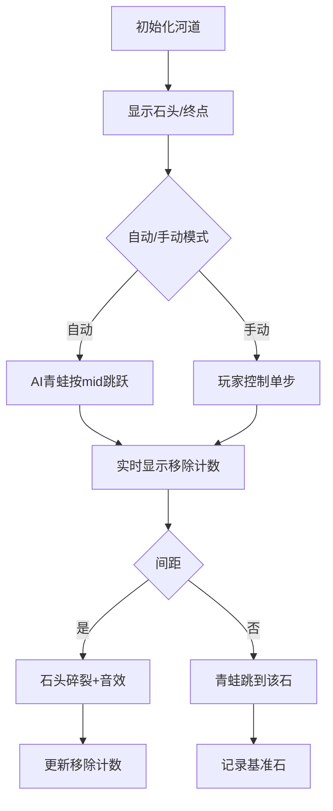

# 题目信息

# [USACO06DEC] River Hopscotch S

## 题目描述

Every year the cows hold an event featuring a peculiar version of hopscotch that involves carefully jumping from rock to rock in a river. The excitement takes place on a long, straight river with a rock at the start and another rock at the end, L units away from the start (1 ≤ L ≤ 1,000,000,000). Along the river between the starting and ending rocks, N (0 ≤ N ≤ 50,000) more rocks appear, each at an integral distance Di from the start (0 < Di < L).

To play the game, each cow in turn starts at the starting rock and tries to reach the finish at the ending rock, jumping only from rock to rock. Of course, less agile cows never make it to the final rock, ending up instead in the river.

Farmer John is proud of his cows and watches this event each year. But as time goes by, he tires of watching the timid cows of the other farmers limp across the short distances between rocks placed too closely together. He plans to remove several rocks in order to increase the shortest distance a cow will have to jump to reach the end. He knows he cannot remove the starting and ending rocks, but he calculates that he has enough resources to remove up to M rocks (0 ≤ M ≤ N).

FJ wants to know exactly how much he can increase the shortest distance \*before\* he starts removing the rocks. Help Farmer John determine the greatest possible shortest distance a cow has to jump after removing the optimal set of M rocks.

奶牛跳房子：从N块石头中移除M块，使得间距最小值最大。


## 说明/提示

Before removing any rocks, the shortest jump was a jump of 2 from 0 (the start) to 2. After removing the rocks at 2 and 14, the shortest required jump is a jump of 4 (from 17 to 21 or from 21 to 25).


## 样例 #1

### 输入

```
25 5 2
2
14
11
21
17```

### 输出

```
4```

# AI分析结果


### 💡 Kay的C++算法解析：River Hopscotch S 深入学习指南 💡

#### 1. 题目解读与核心算法识别
✨ **本题主要考察**：二分答案 + 贪心  
🗣️ **初步分析**：  
> 这道题如同在河道上调整石头位置，让最窄的跳跃缝隙尽可能变宽。核心思路是**二分答案**：先猜一个最小跳跃距离（mid），再用**贪心算法**验证是否能用≤M次移除达成目标。  

- **核心流程**：  
  1. 对石头位置排序（关键！）  
  2. 二分搜索最小跳跃距离（0 ~ L）  
  3. 贪心验证：遍历石头，若间距<mid则移除，统计移除数  
- **可视化设计**：  
  采用8位像素风河道场景，石头变为像素方块。高亮当前检测的石头间距，移除时播放"碎裂"音效，成功时终点石头发光。控制面板支持调速/单步执行，自动模式如"青蛙AI"逐步跳跃演示。

#### 2. 精选优质题解参考
**题解一 (来源：seek_my_calling)**  
* **点评**：思路直击二分本质，代码简洁高效。亮点在于：  
  - 贪心函数`count()`用双指针实现移除计数（O(n)复杂度）  
  - 边界处理严谨（终点`a[n+1]=l`）  
  - 二分写法规范，`ans`实时记录可行解  

**题解二 (来源：yuyer)**  
* **点评**：提供两种贪心实现视角，教学性强。亮点：  
  - 对比"统计保留石"和"统计移除石"两种思路  
  - 主循环`while(tl<=tr)`确保二分收敛性  
  - 强调`sort()`的必要性（易错点）  

**题解三 (来源：墨舞灵纯)**  
* **点评**：工业级代码规范，亮点：  
  - 用`last`变量显式记录保留的上个石头位置  
  - 函数封装清晰（`check()`独立验证逻辑）  
  - 二分边界`[0, L+1]`处理零石头情况  

#### 3. 核心难点辨析与解题策略
1. **难点：贪心验证的实现**  
   *分析*：需平衡移除计数与距离更新。优质解法用双指针：`j`记录最后保留的石头，若`a[i]-a[j]<mid`则移除当前石（计数+1），否则更新`j=i`  
   💡 **学习笔记**：双指针是贪心模拟的核心装备  

2. **难点：二分边界设定**  
   *分析*：左边界=0（最小距离），右边界=L（最大距离）。注意当`N=0`时直接输出L，避免无效计算  
   💡 **学习笔记**：二分前先问"答案可能的最小/最大值是多少？"  

3. **难点：易错点规避**  
   *分析*：三大高频错误——  
   - 未排序（导致贪心失效）  
   - 漏终点（应设`a[n+1]=l`）  
   - 贪心时距离计算错误（应用`a[i]-a[j]`而非累加）  
   💡 **学习笔记**：排序！终点！减法！——默念三遍  

✨ **解题技巧总结**  
- **二分框架标准化**：  
  ```c
  while(left <= right) {
    mid = (left+right)/2;
    if(check(mid)) { ans=mid; left=mid+1; }
    else right=mid-1;
  }
  ```
- **贪心双指针模板**：  
  ```c
  int j=0, remove=0;
  for(int i=1; i<=n+1; i++) {
    if(a[i]-a[j] < mid) remove++;
    else j = i; 
  }
  ```
- **防御性编程**：输入后立即排序，并显式添加终点坐标  

#### 4. C++核心代码实现赏析
**通用核心实现参考**  
```cpp
#include <iostream>
#include <algorithm>
using namespace std;

int L, n, m, a[50005];

bool check(int mid) {
    int last = 0, cnt = 0;
    for (int i = 1; i <= n + 1; i++) {
        if (a[i] - a[last] < mid) cnt++; // 需移除
        else last = i; // 保留当前石
    }
    return cnt <= m; // 移除数≤m则可行
}

int main() {
    cin >> L >> n >> m;
    for (int i = 1; i <= n; i++) cin >> a[i];
    sort(a + 1, a + n + 1);  // 关键！排序
    a[n + 1] = L;            // 添加终点

    int left = 0, right = L, ans = 0;
    while (left <= right) {
        int mid = (left + right) / 2;
        if (check(mid)) { ans = mid; left = mid + 1; }
        else right = mid - 1;
    }
    cout << ans;
    return 0;
}
```
**代码解读概要**：  
1. 输入后立即排序石头位置  
2. 终点`a[n+1]=L`作为特殊石头处理  
3. 二分框架搜索最大可行距离  
4. `check()`函数用双指针贪心验证  

---  
**题解一核心片段赏析**  
```cpp
int count(int mid) {
    int j=0, x=0; // j: 最后保留的石头索引
    for(int i=1; i<=n+1; i++) {
        if(a[i]-a[j] < mid) x++; // 移除计数
        else j=i; // 更新保留石
    }
    return x;
}
```
💡 **学习笔记**：移除计数时隐含动态更新基准石，避免重复计算  

**题解二片段对比**  
```cpp
// 方法1：统计保留石
int check1(int mid) {
    int j=0, c=0; // c: 保留石计数
    for(int i=1; i<=n+1; i++)
        if(a[i]-a[j] >= mid) { c++; j=i; }
    return (n+1 - c) <= m; // 总石数-保留数=移除数
}
```
💡 **学习笔记**：两种视角本质相同，保留石更易理解跳跃连续性  

#### 5. 算法可视化：像素动画演示
**主题**：8位像素风《青蛙过河》模拟  
**核心交互设计**：  


**关键动画细节**：  
1. **像素元素**：  
   - 青蛙：绿色像素精灵  
   - 可移除石：黄色闪烁方块  
   - 基准石：蓝色固定方块  
2. **音效系统**：  
   - 移除石："咔嚓"碎裂声 (Web Audio API)  
   - 成功跳跃：8bit水滴声  
   - 关卡通过：FC胜利音乐  
3. **教学提示**：  
   - 当前检测间距显示为红色连线  
   - 旁白框解释："正在检测间距：17→21=4"  
4. **游戏化设计**：  
   - 每10个石头为1关卡  
   - 连续正确决策得连击分  
   - 实时显示历史最优解  

#### 6. 拓展练习与相似问题思考
**技巧迁移场景**：  
1. 最小化最大等待时间（时间序列划分）  
2. 网络延迟优化（带宽分配）  
3. 农田灌溉系统设计（最小覆盖半径）  

**洛谷推荐**：  
1. **P2678 跳石头**  
   🗣️ 双倍经验！移除石头使最小间距最大，数据更强  
2. **P1316 丢瓶盖**  
   🗣️ 变式训练：改为保留指定瓶盖使最小间距最大  
3. **P4343 自动刷题机**  
   🗣️ 二分答案进阶：需结合代码行数分析  

#### 7. 学习心得与经验分享
> **经验 (来自多篇题解)**：  
> "忘记排序导致WA全灭...二分题务必先检查数据有序性！"  
>   
> **Kay总结**：  
> 三大调试锦囊：  
> 1. 打印排序后数组验证  
> 2. 边界测试（n=0/m=0）  
> 3. 单步追踪贪心计数  

---  
**结语**：二分答案如同"猜数游戏+可行性验证"的组合拳，掌握框架后能解决一大类最值问题。动手实现可视化demo会大幅提升算法直觉！下次见啦~ 🐸

---
处理用时：98.31秒