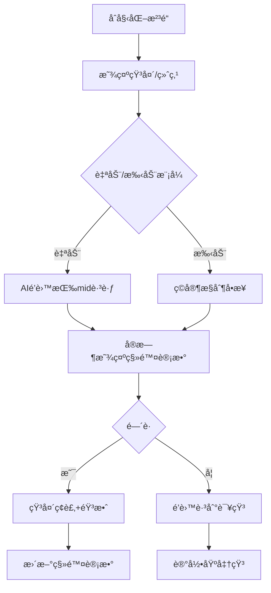

# 题目信æ¯

# [USACO06DEC] River Hopscotch S

## 题目æè¿°

Every year the cows hold an event featuring a peculiar version of hopscotch that involves carefully jumping from rock to rock in a river. The excitement takes place on a long, straight river with a rock at the start and another rock at the end, L units away from the start (1 ≤ L ≤ 1,000,000,000). Along the river between the starting and ending rocks, N (0 ≤ N ≤ 50,000) more rocks appear, each at an integral distance Di from the start (0 < Di < L).

To play the game, each cow in turn starts at the starting rock and tries to reach the finish at the ending rock, jumping only from rock to rock. Of course, less agile cows never make it to the final rock, ending up instead in the river.

Farmer John is proud of his cows and watches this event each year. But as time goes by, he tires of watching the timid cows of the other farmers limp across the short distances between rocks placed too closely together. He plans to remove several rocks in order to increase the shortest distance a cow will have to jump to reach the end. He knows he cannot remove the starting and ending rocks, but he calculates that he has enough resources to remove up to M rocks (0 ≤ M ≤ N).

FJ wants to know exactly how much he can increase the shortest distance \*before\* he starts removing the rocks. Help Farmer John determine the greatest possible shortest distance a cow has to jump after removing the optimal set of M rocks.

奶牛跳房å­ï¼šä»Nå—石头中移除Må—，使得间è·æœ€å°å€¼æœ€å¤§ã€‚


## 说æ˜/æ示

Before removing any rocks, the shortest jump was a jump of 2 from 0 (the start) to 2. After removing the rocks at 2 and 14, the shortest required jump is a jump of 4 (from 17 to 21 or from 21 to 25).


## 样例 #1

### 输入

```
25 5 2
2
14
11
21
17```

### 输出

```
4```

# AI分æ结æœ


### 💡 Kayçš„C++算法解æ：River Hopscotch S æ·±å…¥å­¦ä¹ æŒ‡å— ğŸ’¡

#### 1. 题目解读ä¸æ ¸å¿ƒç®—法识别
✨ **本题主è¦è€ƒå¯Ÿ**：二分答案 + 贪心  
ğŸ—£ï¸ **åˆæ­¥åˆ†æ**：  
> è¿™é“题如åŒåœ¨æ²³é“上调整石头ä½ç½®ï¼Œè®©æœ€çª„的跳跃ç¼éš™å°½å¯èƒ½å˜å®½ã€‚核心æ€è·¯æ˜¯**二分答案**：先猜一个最å°è·³è·ƒè·ç¦»ï¼ˆmid），å†ç”¨**贪心算法**验è¯æ˜¯å¦èƒ½ç”¨â‰¤M次移除达æˆç›®æ ‡ã€‚  

- **核心æµç¨‹**：  
  1. 对石头ä½ç½®æ’åºï¼ˆå…³é”®ï¼ï¼‰  
  2. 二分æœç´¢æœ€å°è·³è·ƒè·ç¦»ï¼ˆ0 ~ L）  
  3. 贪心验è¯ï¼šéå†çŸ³å¤´ï¼Œè‹¥é—´è·<mid则移除，统计移除数  
- **å¯è§†åŒ–设计**：  
  采用8ä½åƒç´ é£æ²³é“场景，石头å˜ä¸ºåƒç´ æ–¹å—。高亮当å‰æ£€æµ‹çš„石头间è·ï¼Œç§»é™¤æ—¶æ’­æ”¾"ç¢è£‚"音效，æˆåŠŸæ—¶ç»ˆç‚¹çŸ³å¤´å‘光。æ§åˆ¶é¢æ¿æ”¯æŒè°ƒé€Ÿ/å•æ­¥æ‰§è¡Œï¼Œè‡ªåŠ¨æ¨¡å¼å¦‚"é’è›™AI"é€æ­¥è·³è·ƒæ¼”示。

#### 2. 精选优质题解å‚考
**题解一 (æ¥æºï¼šseek_my_calling)**  
* **点评**：æ€è·¯ç›´å‡»äºŒåˆ†æœ¬è´¨ï¼Œä»£ç ç®€æ´é«˜æ•ˆã€‚亮点在äºï¼š  
  - 贪心函数`count()`用åŒæŒ‡é’ˆå®ç°ç§»é™¤è®¡æ•°ï¼ˆO(n)å¤æ‚度）  
  - 边界处ç†ä¸¥è°¨ï¼ˆç»ˆç‚¹`a[n+1]=l`）  
  - 二分写法规范，`ans`å®æ—¶è®°å½•å¯è¡Œè§£  

**题解二 (æ¥æºï¼šyuyer)**  
* **点评**：æ供两ç§è´ªå¿ƒå®ç°è§†è§’，教学性强。亮点：  
  - 对比"统计ä¿ç•™çŸ³"å’Œ"统计移除石"两ç§æ€è·¯  
  - 主循ç¯`while(tl<=tr)`ç¡®ä¿äºŒåˆ†æ”¶æ•›æ€§  
  - 强调`sort()`çš„å¿…è¦æ€§ï¼ˆæ˜“错点）  

**题解三 (æ¥æºï¼šå¢¨èˆçµçº¯)**  
* **点评**：工业级代ç è§„范，亮点：  
  - 用`last`å˜é‡æ˜¾å¼è®°å½•ä¿ç•™çš„上个石头ä½ç½®  
  - 函数å°è£…清晰（`check()`独立验è¯é€»è¾‘）  
  - 二分边界`[0, L+1]`处ç†é›¶çŸ³å¤´æƒ…况  

#### 3. 核心难点辨æä¸è§£é¢˜ç­–ç•¥
1. **难点：贪心验è¯çš„å®ç°**  
   *分æ*：需平衡移除计数ä¸è·ç¦»æ›´æ–°ã€‚优质解法用åŒæŒ‡é’ˆï¼š`j`记录最åä¿ç•™çš„石头，若`a[i]-a[j]<mid`则移除当å‰çŸ³ï¼ˆè®¡æ•°+1），å¦åˆ™æ›´æ–°`j=i`  
   💡 **学习笔记**：åŒæŒ‡é’ˆæ˜¯è´ªå¿ƒæ¨¡æ‹Ÿçš„核心装备  

2. **难点：二分边界设定**  
   *分æ*：左边界=0（最å°è·ç¦»ï¼‰ï¼Œå³è¾¹ç•Œ=L（最大è·ç¦»ï¼‰ã€‚注æ„当`N=0`时直æ¥è¾“出L，é¿å…无效计算  
   💡 **学习笔记**：二分å‰å…ˆé—®"答案å¯èƒ½çš„最å°/最大值是多少？"  

3. **难点：易错点规é¿**  
   *分æ*：三大高频错误——  
   - 未æ’åºï¼ˆå¯¼è‡´è´ªå¿ƒå¤±æ•ˆï¼‰  
   - æ¼ç»ˆç‚¹ï¼ˆåº”设`a[n+1]=l`）  
   - 贪心时è·ç¦»è®¡ç®—错误（应用`a[i]-a[j]`而é累加）  
   💡 **学习笔记**：æ’åºï¼ç»ˆç‚¹ï¼å‡æ³•ï¼â€”â€”é»˜å¿µä¸‰é  

✨ **解题技巧总结**  
- **二分框æ¶æ ‡å‡†åŒ–**：  
  ```c
  while(left <= right) {
    mid = (left+right)/2;
    if(check(mid)) { ans=mid; left=mid+1; }
    else right=mid-1;
  }
  ```
- **贪心åŒæŒ‡é’ˆæ¨¡æ¿**：  
  ```c
  int j=0, remove=0;
  for(int i=1; i<=n+1; i++) {
    if(a[i]-a[j] < mid) remove++;
    else j = i; 
  }
  ```
- **防御性编程**：输入åç«‹å³æ’åºï¼Œå¹¶æ˜¾å¼æ·»åŠ ç»ˆç‚¹åæ ‡  

#### 4. C++核心代ç å®ç°èµæ
**通用核心å®ç°å‚考**  
```cpp
#include <iostream>
#include <algorithm>
using namespace std;

int L, n, m, a[50005];

bool check(int mid) {
    int last = 0, cnt = 0;
    for (int i = 1; i <= n + 1; i++) {
        if (a[i] - a[last] < mid) cnt++; // 需移除
        else last = i; // ä¿ç•™å½“å‰çŸ³
    }
    return cnt <= m; // 移除数≤m则å¯è¡Œ
}

int main() {
    cin >> L >> n >> m;
    for (int i = 1; i <= n; i++) cin >> a[i];
    sort(a + 1, a + n + 1);  // 关键ï¼æ’åº
    a[n + 1] = L;            // 添加终点

    int left = 0, right = L, ans = 0;
    while (left <= right) {
        int mid = (left + right) / 2;
        if (check(mid)) { ans = mid; left = mid + 1; }
        else right = mid - 1;
    }
    cout << ans;
    return 0;
}
```
**代ç è§£è¯»æ¦‚è¦**：  
1. 输入åç«‹å³æ’åºçŸ³å¤´ä½ç½®  
2. 终点`a[n+1]=L`ä½œä¸ºç‰¹æ®ŠçŸ³å¤´å¤„ç†  
3. 二分框æ¶æœç´¢æœ€å¤§å¯è¡Œè·ç¦»  
4. `check()`函数用åŒæŒ‡é’ˆè´ªå¿ƒéªŒè¯  

---  
**题解一核心片段èµæ**  
```cpp
int count(int mid) {
    int j=0, x=0; // j: 最åä¿ç•™çš„石头索引
    for(int i=1; i<=n+1; i++) {
        if(a[i]-a[j] < mid) x++; // 移除计数
        else j=i; // æ›´æ–°ä¿ç•™çŸ³
    }
    return x;
}
```
💡 **学习笔记**：移除计数时éšå«åŠ¨æ€æ›´æ–°åŸºå‡†çŸ³ï¼Œé¿å…é‡å¤è®¡ç®—  

**题解二片段对比**  
```cpp
// 方法1：统计ä¿ç•™çŸ³
int check1(int mid) {
    int j=0, c=0; // c: ä¿ç•™çŸ³è®¡æ•°
    for(int i=1; i<=n+1; i++)
        if(a[i]-a[j] >= mid) { c++; j=i; }
    return (n+1 - c) <= m; // 总石数-ä¿ç•™æ•°=移除数
}
```
💡 **学习笔记**：两ç§è§†è§’本质相åŒï¼Œä¿ç•™çŸ³æ›´æ˜“ç†è§£è·³è·ƒè¿ç»­æ€§  

#### 5. 算法å¯è§†åŒ–：åƒç´ åŠ¨ç”»æ¼”示
**主题**：8ä½åƒç´ é£ã€Šé’蛙过河》模拟  
**核心交互设计**：  


**关键动画细节**：  
1. **åƒç´ å…ƒç´ **：  
   - é’蛙：绿色åƒç´ ç²¾çµ  
   - å¯ç§»é™¤çŸ³ï¼šé»„色闪çƒæ–¹å—  
   - 基准石：è“è‰²å›ºå®šæ–¹å—  
2. **音效系统**：  
   - 移除石："咔嚓"ç¢è£‚声 (Web Audio API)  
   - æˆåŠŸè·³è·ƒï¼š8bit水滴声  
   - å…³å¡é€šè¿‡ï¼šFCèƒœåˆ©éŸ³ä¹  
3. **教学æ示**：  
   - 当å‰æ£€æµ‹é—´è·æ˜¾ç¤ºä¸ºçº¢è‰²è¿çº¿  
   - æ—白框解释："正在检测间è·ï¼š17→21=4"  
4. **游æˆåŒ–设计**：  
   - æ¯10个石头为1å…³å¡  
   - è¿ç»­æ­£ç¡®å†³ç­–å¾—è¿å‡»åˆ†  
   - å®æ—¶æ˜¾ç¤ºå†å²æœ€ä¼˜è§£  

#### 6. 拓展练习ä¸ç›¸ä¼¼é—®é¢˜æ€è€ƒ
**技巧è¿ç§»åœºæ™¯**：  
1. 最å°åŒ–最大等待时间（时间åºåˆ—划分）  
2. 网络延迟优化（带宽分é…）  
3. 农田çŒæº‰ç³»ç»Ÿè®¾è®¡ï¼ˆæœ€å°è¦†ç›–åŠå¾„）  

**洛谷æ¨è**：  
1. **P2678 跳石头**  
   ğŸ—£ï¸ åŒå€ç»éªŒï¼ç§»é™¤çŸ³å¤´ä½¿æœ€å°é—´è·æœ€å¤§ï¼Œæ•°æ®æ›´å¼º  
2. **P1316 丢瓶盖**  
   ğŸ—£ï¸ å˜å¼è®­ç»ƒï¼šæ”¹ä¸ºä¿ç•™æŒ‡å®šç“¶ç›–使最å°é—´è·æœ€å¤§  
3. **P4343 自动刷题机**  
   ğŸ—£ï¸ äºŒåˆ†ç­”æ¡ˆè¿›é˜¶ï¼šéœ€ç»“åˆä»£ç è¡Œæ•°åˆ†æ  

#### 7. 学习心得ä¸ç»éªŒåˆ†äº«
> **ç»éªŒ (æ¥è‡ªå¤šç¯‡é¢˜è§£)**：  
> "忘记æ’åºå¯¼è‡´WAå…¨ç­...二分题务必先检查数æ®æœ‰åºæ€§ï¼"  
>   
> **Kay总结**：  
> 三大调试锦囊：  
> 1. 打å°æ’åºåæ•°ç»„éªŒè¯  
> 2. 边界测试（n=0/m=0）  
> 3. å•æ­¥è¿½è¸ªè´ªå¿ƒè®¡æ•°  

---  
**结语**：二分答案如åŒ"猜数游æˆ+å¯è¡Œæ€§éªŒè¯"的组åˆæ‹³ï¼ŒæŒæ¡æ¡†æ¶å能解决一大类最值问题。动手å®ç°å¯è§†åŒ–demo会大幅æå‡ç®—法直觉ï¼ä¸‹æ¬¡è§å•¦~ ğŸ¸

---
处ç†ç”¨æ—¶ï¼š98.31秒