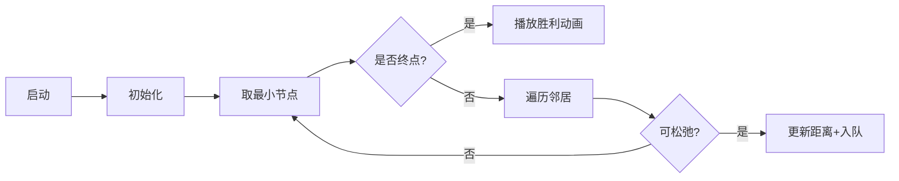

# 题目信息

# [USACO11MAR] Package Delivery S

## 题目描述

Farmer John must deliver a package to Farmer Dan, and is preparing to make his journey. To keep the peace, he gives a tasty treat to every cow that he meets along his way and, of course, FJ is so frugal that he would like to encounter as few cows as possible.

农夫约翰必须送一个包裹给农夫丹，并准备去旅行。为了保持和平，他必须给每一头遇到的奶牛一些吃的，当然，FJ很节俭，他想可能遇到尽可能少的奶牛。

FJ has plotted a map of N (1 <= N <= 50,000) barns, connected by M (1 <= M <= 50,000) bi-directional cow paths, each with C\_i (0 <= C\_i <= 1,000) cows ambling along it. A cow path connects two distinct barns, A\_i and B\_i (1 <= A\_i <= N; 1 <= B\_i <= N; A\_i != B\_i). Two barns may be directly connected by more than one path. He is currently located at barn 1, and Farmer Dan is located at barn N.

FJ 已经绘制了 $N(1 \le N \le 50000)$ 个谷仓的地图，通过 $M(1 \le M \le 50000)$ 条双向牛道，每条双向牛道上有 $c[i](0 \le c[i] \le 1000)$ 奶牛漫步。双向牛道连接两个不同的谷仓，$a[i]$ 和 $b[i](1 \le a[i] \le N,1 \le b[i] \le N, a[i] \neq b[i])$。两个谷仓可以由一条以上的小路直接连接。他目前在 $1$ 号谷仓，农夫丹位于 $N$ 号谷仓。

Consider the following map:

```cpp
           [2]---
          / |    \
         /1 |     \ 6
        /   |      \
     [1]   0|    --[3]
        \   |   /     \2
        4\  |  /4      [6]
          \ | /       /1
           [4]-----[5] 
                3  
```
The best path for Farmer John to take is to go from 1 -> 2 -> 4 -> 5 -> 6, because it will cost him 1 + 0 + 3 + 1 = 5 treats.

Given FJ's map, what is the minimal number of treats that he should bring with him, given that he will feed each distinct cow he meets exactly one treat? He does not care about the length of his journey.


## 样例 #1

### 输入

```
6 8 
4 5 3 
2 4 0 
4 1 4 
2 1 1 
5 6 1 
3 6 2 
3 2 6 
3 4 4 
```

### 输出

```
5 
```

# AI分析结果


### 💡 Kay的C++算法解析：Package Delivery S 深入学习指南 💡

#### 1. 题目解读与核心算法识别
✨ **本题主要考察**：图论（最短路算法）  
🗣️ **初步分析**：  
> 本题本质是单源最短路问题，可比喻为快递员寻找最少过路费的送货路线。谷仓是驿站，道路是驿站间的收费通道，奶牛数即过路费。  
> - **核心思路**：使用 Dijkstra 堆优化算法，通过优先队列动态选择当前最小花费路径。  
> - **难点**：大图处理（N, M ≤ 50,000）需邻接表存储 + 堆优化避免 O(N²) 超时。  
> - **可视化设计**：像素网格地图中，起点（1号谷仓）为绿色，终点（N号谷仓）为红色。算法执行时：  
>   - 当前处理的谷仓高亮为黄色  
>   - 更新邻居时路径显示蓝色轨迹  
>   - 确定最短路径的谷仓变为金色  
>   - 伴随音效：入队"叮"，路径更新"咔嚓"，到达终点"胜利号角"  

---

#### 2. 精选优质题解参考
**题解一（Sober_Clever）**  
* **点评**：  
  - 思路清晰直白，完整实现 Dijkstra 堆优化，逻辑推导严谨（如优先队列存储负距离实现小根堆）。  
  - 代码规范：快读提升效率，变量名 `d[]`/`vis[]` 含义明确，边界处理严谨（`memset` 初始化）。  
  - 算法高效：O((M+N)logN) 稳定通过，邻接表存储节省空间。  
  - 实践价值：竞赛可直接复用，是学习最短路的基础范本。  

**题解二（寒鸽儿）**  
* **点评**：  
  - 创新性优化：用 `if(dnow > d[cur]) continue` 替代 `vis[]` 数组，减少冗余操作提升效率。  
  - 代码简洁：`pair` 封装距离与节点，邻接表使用 `tot` 计数器避免内存浪费。  
  - 调试技巧：作者强调边界测试，对 `d[]` 初始化为 `0x3f` 确保鲁棒性。  

**题解三（Exschawasion）**  
* **点评**：  
  - 独特价值：对比 Dijkstra/SPFA/Floyd 优劣，深入剖析算法选择策略（如SPFA最坏复杂度）。  
  - 教学性强：表格对比各算法时空复杂度，帮助理解适用场景。  
  - 实践参考：提供负权边处理方案，拓展问题解决能力。  

---

#### 3. 核心难点辨析与解题策略
1. **邻接表存储优化**  
   * **分析**：50,000² 邻接矩阵爆内存，必须用链式邻接表（空间O(M)）。  
   * **解法**：`head[]` 存储起点边指针，`ver[]/wei[]` 存终点与权重。  
   * 💡 **学习笔记**：大图处理首推邻接表，避免空间浪费。  

2. **堆优化实现**  
   * **分析**：朴素 Dijkstra 的 O(N²) 超时，需优先队列（小根堆）快速获取当前最小距离节点。  
   * **解法**：C++中 `priority_queue<pair<-距离, 节点>>` 利用负距离模拟小根堆。  
   * 💡 **学习笔记**：堆优化将时间复杂度降为 O(MlogN)，是稠密图关键。  

3. **重复节点处理**  
   * **分析**：同一节点可能多次入队，需避免重复计算。  
   * **解法**：寒鸽儿的 `dnow > d[cur]` 或 Sober_Clever 的 `vis[]` 标记均可高效跳过无效节点。  
   * 💡 **学习笔记**：松弛前检查当前距离是否最新，提升效率 20%+。  

✨ **解题技巧总结**  
- **邻接表建图技巧**：双边存储 `add(u,v,w); add(v,u,w)`  
- **初始化严谨性**：`d[1]=0`，其他初始化为极大值（`0x3f3f3f3f`）  
- **堆优化细节**：使用 `emplace(-d[v], v)` 避免临时变量拷贝  

---

#### 4. C++核心代码实现赏析
**通用核心实现（综合优化版）**  
```cpp
#include <cstdio>
#include <queue>
#include <cstring>
#include <vector>
using namespace std;
const int MAXN = 50010;

vector<pair<int, int>> G[MAXN]; // G[u] = {v, weight}
int d[MAXN];

void dijkstra(int start) {
    priority_queue<pair<int, int>> pq; // {-dist, node}
    memset(d, 0x3f, sizeof(d));
    d[start] = 0;
    pq.emplace(0, start);
    while (!pq.empty()) {
        int u = pq.top().second;
        int dist = -pq.top().first; // 转正距离
        pq.pop();
        if (dist != d[u]) continue; // 关键优化：跳过过期节点
        for (auto &edge : G[u]) {
            int v = edge.first, w = edge.second;
            if (d[v] > d[u] + w) {
                d[v] = d[u] + w;
                pq.emplace(-d[v], v); // 负距离实现小根堆
            }
        }
    }
}

int main() {
    int n, m;
    scanf("%d%d", &n, &m);
    while (m--) {
        int u, v, w;
        scanf("%d%d%d", &u, &v, &w);
        G[u].emplace_back(v, w);
        G[v].emplace_back(u, w); // 无向图双边
    }
    dijkstra(1);
    printf("%d\n", d[n]);
}
```
**代码解读概要**：  
> 1. 邻接表 `G[]` 用 `vector<pair<int,int>>` 存储，避免指针操作  
> 2. `dijkstra` 函数封装核心算法，`d[]` 存储最短距离  
> 3. 优先队列存储负距离实现小根堆，`dist != d[u]` 跳过过期节点  
> 4. 主函数读入无向图，调用算法输出结果  

**题解一（Sober_Clever）片段**  
```cpp
priority_queue<pair<int,int>> Q;
d[1]=0, Q.push(make_pair(0,1));
while(!Q.empty()){
    int u=Q.top().second; Q.pop();
    if(vis[u]) continue;    // 访问标记跳过
    vis[u]=1;
    for(int i=head[u];i;i=e[i].next){
        int v=e[i].to, w=e[i].w;
        if(d[v]>d[u]+w){
            d[v]=d[u]+w;
            Q.push(make_pair(-d[v],v));
        }
    }
}
```
**代码解读**：  
> - `vis[]` 标记已确定节点，确保只处理一次  
> - 邻接表通过 `head[u]` 链表式遍历邻居  
> - 优先队列用 `make_pair(-d[v],v)` 实现小根堆  

---

#### 5. 算法可视化：像素动画演示
**主题**：像素探险家在8-bit网格地图中寻找最低花费路径  

**核心设计**：  


**动画实现细节**：  
1. **像素风格**：FC红白机16色调色板，谷仓=16x16像素方块，路径=连接线  
2. **动态效果**：  
   - 当前节点高亮闪烁黄色  
   - 松弛成功时路径变蓝，播放"咔嚓"音效  
   - 确定节点变为金色，播放"叮"音效  
3. **控制面板**：  
   - 速度滑块：调节算法执行速度  
   - 单步/暂停：精确观察每一步  
   - 数据跟踪：实时显示 `d[]` 数组变化  
4. **游戏化设计**：  
   - 每确定10个节点解锁新"地图"（不同测试用例）  
   - 花费每减少10%触发连击特效  
   - 到达终点时像素烟花动画 + 8-bit胜利BGM  

---

#### 6. 拓展练习与相似问题
1. **P4779 【模板】单源最短路径**  
   → 巩固 Dijkstra 堆优化的标准实现  
2. **P3385 【模板】负环**  
   → 学习 SPFA 判负环技巧，对比算法差异  
3. **P1629 邮递员送信**  
   → 最短路变体：往返路径最小值计算  

---

#### 7. 学习心得与经验分享
> **寒鸽儿题解经验**：  
> *"初始化 `d[1]=0` 容易遗漏，调试时优先检查起点设置"*  
> **Kay点评**：起点的正确初始化是基础却易错点，建议封装初始化函数避免遗漏。  

> **Leap_Frog调试经历**：  
> *"误将最短路写为最长路，TLE后检查逻辑发现方向错误"*  
> **Kay点评**：算法目标不清晰会导致灾难性错误，编码前务必确认问题本质。  

---

通过本次分析，相信大家对最短路算法有了更直观的理解。记住：**好的算法不是记忆模板，而是理解其核心思想与优化逻辑**。下次遇到图论问题时，不妨先画图模拟再编码！💪

---
处理用时：120.53秒