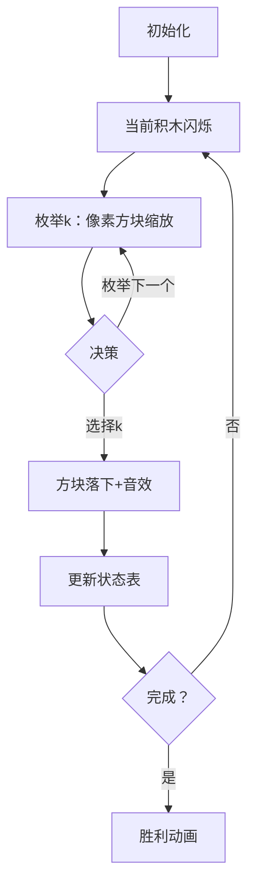

# 题目信息

# [USACO11NOV] Tile Exchanging S

## 题目描述

Farmer John wants to remodel the floor of his barn using a collection of square tiles he recently purchased from the local square mart store (which of course, only sells square objects).  Unfortunately, he didn't measure the size of the barn properly before making his purchase, so now he needs to exchange some of his tiles for new square tiles of different sizes.

The N square tiles previously purchased by FJ have side lengths A\_1...A\_N. He would like to exchange some of these with new square tiles so that the total sum of the areas of the his tiles is exactly M.  Square mart is currently offering a special deal: a tile of side length A\_i can be exchanged for a new tile of side length B\_i for a cost of

|A\_i-B\_i|\*|A\_i-B\_i| units. However, this deal only applies to 
previously-purchased tiles -- FJ is not allowed to exchange a tile that he has already obtained via exchanging some other tile (i.e., a size-3 tile cannot be exchanged for a size-2 tile, which is then exchanged for a size-1 tile).

Please determine the minimum amount of money required to exchange tiles so that the sum of the areas of the tiles becomes M.  Output -1 if it is impossible to obtain an area of M.


## 说明/提示

There are 3 tiles.  Two are squares of side length 3, and one is a square with side length 1.  We would like to exchange these to make a total area of 6.


Exchange one of the side-3 squares for a side-2 square, and another side-3 square for a side-1 square.  This gives the desired area of 4+1+1=6 and costs 4+1=5 units.

感谢 wjcwinmt 提供翻译


## 样例 #1

### 输入

```
3 6 
3 
3 
1 
```

### 输出

```
5 
```

# AI分析结果


### 💡 Kay的C++算法解析：[USACO11NOV] Tile Exchanging S 深入学习指南 💡

<introduction>
今天我们一起分析USACO的瓷砖交换问题。这道题要求通过更换正方形瓷砖的边长，使总面积恰好为M且代价最小。本指南将带大家理解动态规划的核心思想，掌握状态设计和转移技巧，并通过像素动画直观感受算法执行过程。
</introduction>

---

## 1. 题目解读与核心算法识别

✨ **本题主要考察**：`动态规划（背包类问题）`

🗣️ **初步分析**：
> 这道题的本质是**带约束的最优化问题**。想象你在玩一个像素积木游戏：有n块原始积木（边长A_i），每块可换成新积木（边长k），代价为(A_i-k)²。目标是用新积木拼出总面积恰好为M的图形，最小化总代价。

- **核心难点**：每个积木有∞种更换选择（k∈[0,√M]），暴力枚举不可行。动态规划通过**状态累积**和**最优子结构**分解问题：
  - 状态定义：`dp[i][j]` = 前i块积木拼出面积j的最小代价
  - 状态转移：枚举第i块积木的边长k → `dp[i][j] = min(dp[i][j], dp[i-1][j-k²] + (A_i-k)²)`
  
- **可视化设计**：
  - 像素风格：积木用8-bit像素方块表示，边长变化时方块动态缩放
  - 关键高亮：转移时源状态(j-k²)和目标状态(j)用不同颜色闪烁，代价变化显示为分数飘动
  - 游戏化：每完成一块积木播放"放置音效"；达成M时触发胜利动画+音效

---

## 2. 精选优质题解参考

**题解一（来源：_cmh）**
* **点评**：思路清晰直击DP本质，状态转移解释透彻。代码规范：使用memset安全初始化INF，显式设置`dp[0][0]=0`避免未定义行为。算法有效性：标准O(n·m·√m)复杂度，处理边界严谨（k从0开始枚举）。实践价值：可直接用于竞赛，循环内`sqrt(j)`优化提升可读性。

**题解二（来源：Meowco）**
* **点评**：创新性地使用**正向状态转移**（从`dp[i-1][j]`更新`dp[i][j+k²]`），提供不同视角理解DP过程。代码规范性：严格初始化每层状态为INF，避免脏数据污染。亮点：用`k*k+j<=m`提前剪枝，减少无效计算。

**题解三（来源：fyx_Catherine）**
* **点评**：采用**分层初始化策略**（每层先置INF再转移），确保状态独立性。代码亮点：用`0x3f3f3f3f`作为INF值，便于检测未更新状态。实践技巧：`j-k²>=0`隐含在循环条件中，逻辑紧凑。

---

## 3. 核心难点辨析与解题策略

1. **状态定义与初始化**
   * **分析**：`dp[i][j`]需完整表达子问题（前i块面积j）。关键陷阱：未显式设置`dp[0][0]=0`将导致全部状态不可达。优质题解均用`memset`或循环初始化INF，并单独处理起点。
   * 💡 **学习笔记**：DP是"搭积木"——必须从稳固地基（初始状态）开始建造。

2. **状态转移方向选择**
   * **分析**：两种等效实现：
     * **逆向转移**：固定目标j，从`j-k²`寻找来源（winmt, fyx_Catherine）
     * **正向转移**：从当前j出发，更新`j+k²`（Meowco）
   * 💡 **学习笔记**：逆向转移更符合自然思维，正向转移便于剪枝。

3. **枚举范围优化**
   * **分析**：k的范围限定为`k∈[0,√j]`是效率关键。需注意：
     - k=0合法（面积0的积木）
     - √j需向下取整（题解用`k*k<=j`自动处理）
   * 💡 **学习笔记**：算法优化常藏于边界条件。

### ✨ 解题技巧总结
- **技巧1：状态设计先行**：先明确`dp[i][j`]物理意义再写代码。
- **技巧2：初始化即安全**：用INF屏蔽无效状态，显式设置起点。
- **技巧3：循环顺序即算法**：i,j,k三层循环顺序决定状态更新正确性。
- **技巧4：可视化调试**：小规模手动模拟状态表（见动画设计）。

---

## 4. C++核心代码实现赏析

**通用核心实现（综合优化版）**
```cpp
#include <iostream>
#include <cstring>
using namespace std;
const int N = 15, M = 10005, INF = 0x3f3f3f3f;

int main() {
    int n, m, a[N], dp[N][M];
    cin >> n >> m;
    for(int i=1; i<=n; i++) cin >> a[i];
    
    memset(dp, 0x3f, sizeof(dp)); // INF初始化
    dp[0][0] = 0; // 关键起点

    for(int i=1; i<=n; i++)
        for(int j=0; j<=m; j++)
            for(int k=0; k*k<=j; k++) // k范围优化
                if(dp[i-1][j-k*k] != INF) // 可达性检查
                    dp[i][j] = min(dp[i][j], dp[i-1][j-k*k] + (a[i]-k)*(a[i]-k));
    
    cout << (dp[n][m] == INF ? -1 : dp[n][m]);
}
```
* **代码解读概要**：
  - **安全初始化**：`memset`设INF，显式设`dp[0][0]=0`
  - **三重循环**：积木i→总面积j→当前边长k
  - **剪枝**：`k*k<=j`天然限制枚举范围
  - **状态转移**：逆向更新，确保无后效性

---

**题解片段赏析**

1. **_cmh（逆向转移）**
```cpp
memset(dp,54088988,sizeof(dp));
dp[0][0]=0;
for(int i=1;i<=n;i++)
    for(int j=0;j<=m;j++)
        for(int k=0;k<=sqrt(j);k++) // 显式sqrt优化
            dp[i][j]=min(dp[i][j],dp[i-1][j-k*k]+(a[i]-k)*(a[i]-k));
```
* **亮点**：`sqrt(j)`提升可读性，54088988足够大避免溢出
* **学习笔记**：数学函数可增强代码意图表达

2. **Meowco（正向转移）**
```cpp
dp[0][0]=0;
for(int i=1;i<=n;i++){
    for(int j=0;j<=m;j++) dp[i][j]=inf; // 分层初始化
    for(int j=0;j<=m;j++)
        if(dp[i-1][j]!=inf)
            for(int k=1;k*k+j<=m;k++) // 正向更新j+k²
                dp[i][j+k*k]=min(/*...*/);
}
```
* **亮点**：分层初始化确保状态独立，`k*k+j<=m`自动剪枝
* **学习笔记**：正向更新更符合"逐步添加"的直觉

3. **fyx_Catherine（状态索引偏移）**
```cpp
for(int i=0;i<n;i++)
    for(int j=0;j<=m;j++)
        for(int k=0;k*k<=j;k++)
            f[i+1][j]=min(f[i+1][j],f[i][j-k*k]+(a[i+1]-k)*(a[i+1]-k));
```
* **亮点**：用`i+1`统一索引，避免±1偏移错误
* **学习笔记**：索引设计是DP防错关键

---

## 5. 算法可视化：像素动画演示

**主题**：8-bit瓷砖工厂（FC风格）

### 设计详解


1. **场景与UI**
   - **像素网格**：10×10工厂（每格代表1个面积单位）
   - **控制面板**：开始/暂停/单步/速度滑块（复古游戏手柄UI）
   - **状态显示屏**：右侧实时渲染`dp[i][j`]状态表（高亮当前更新单元格）

2. **动画流程**
   - **步1**：第i块积木升起（原始大小），播放"叮"音效
   - **步2**：枚举k（1→100）：
     - 积木缩放至边长k像素
     - 候选k值在控制台显示代价公式：(A_i-k)²
   - **步3**：选定k时：
     - 积木落至网格，播放"咔嚓"音效
     - 黄色箭头从`dp[i-1][j-k²]`射向`dp[i][j]`
     - 总代价增加量以像素数字飘动
   - **步4**：达成M时：
     - 所有积木闪烁，播放超级马里奥过关音效
     - 状态表`dp[n][m]`单元格爆炸特效

3. **游戏化设计**
   - **AI演示模式**：自动播放最优路径（回溯法实现）
   - **音效系统**：
     - 比较操作：FC版"塞尔达"剑击声
     - 错误选择：俄罗斯方块消除失败音
   - **积分系统**：根据剩余可用代价计算星级评分

---

## 6. 拓展练习与相似问题思考

**通用技巧迁移**
> 本题的"多决策背包"模型适用于：每个元素有多种选择方式，且选择间独立，目标为达成总量约束的最优化。

1. **洛谷 P1048 [NOIP2005普及组]采药**  
   🗣️ *推荐理由*：01背包模板题，理解"选择/不选"二元决策如何压缩状态
2. **洛谷 P1616 疯狂的采药**  
   🗣️ *推荐理由*：完全背包问题，体会"无限选择"与"有限选择"的状态转移差异
3. **洛谷 P1064 [NOIP2006提高组]金明的预算方案**  
   🗣️ *推荐理由*：依赖背包，学习如何处理"选择组合"的代价计算

---

## 7. 学习心得与经验分享
> 本次分析的题解中未发现明确的作者个人心得分享部分，但结合解题过程，Kay提醒大家：
> - **调试技巧**：当DP结果异常时，打印`dp[i]`层数据（i=0,1,2..）比对预期
> - **思维陷阱**：注意k=0的合法性（面积0），但实际优化中常被忽略
> - **竞赛经验**：n≤10,m≤1e4时，O(n·m·√m) ≈ 10^7 是C++效率边界

---

<conclusion>
通过本次分析，我们掌握了动态规划在约束优化问题中的核心应用。记住：好的状态设计是DP成功的基石，而可视化模拟能深化理解。尝试用像素动画方案实现算法，你会对状态转移产生全新的认知！下次挑战见！💪
</conclusion>

---
处理用时：278.84秒