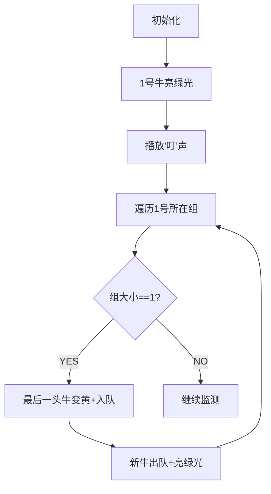

# 题目信息

# [USACO13JAN] Party Invitations S

## 题目描述

农夫约翰要举办一个聚会，他要邀请一些奶牛来参加。在约翰的奶牛朋友圈中，有一些奶牛是好基友，对于每一个奶牛朋友圈，没有一个完全与之相同的，假设这个奶牛朋友圈有 $k$ 头奶牛，如果约翰已经邀请了 $k-1$ 头，那么剩下的那头牛也得邀请。约翰想让你告诉他，他最少需要邀请多少头奶牛？我们假设 $1$ 号奶牛已经被邀请了。

## 说明/提示

$1 \leq  N\leq1000000$。

设所有的奶牛朋友圈的大小之和为 $M$，则 $1 \leq  M\leq250000$。

## 样例 #1

### 输入

```
10 4 
2 1 3 
2 3 4 
6 1 2 3 4 6 7 
4 4 3 2 1 
```

### 输出

```
4 
```

# AI分析结果


### 💡 Kay的C++算法解析：[USACO13JAN] Party Invitations S 深入学习指南 💡

<introduction>
今天我们一起分析奶牛派对邀请问题。这道题考察如何高效处理依赖关系，通过本指南你将掌握核心算法思想、代码实现技巧，并通过生动的像素动画直观理解算法执行过程。
</introduction>

---

## 1. 题目解读与核心算法识别

✨ **本题主要考察**：`BFS/拓扑排序`  

🗣️ **初步分析**：
> 解决本题的关键在于理解**依赖关系的链式传播**。想象一群排队倒下的多米诺骨牌：当1号奶牛（第一张牌）被邀请后，会触发它所在的朋友圈检查。若某个朋友圈因1号的邀请只剩1头牛未被邀请（只剩最后一张牌），这头牛就会被推倒（邀请），进而触发新的连锁反应。
> 
> - **核心思路**：所有题解都围绕**传播邀请**展开，优质解法采用BFS/拓扑排序避免重复计算
> - **难点**：如何高效维护"组内剩余未邀请数"和"牛与组的关系"
> - **可视化设计**：用像素方块表示奶牛，组用彩色边框标识。当组内只剩1头牛时触发闪光特效和"叮"声，邀请成功时方块亮起并播放音效
> - **游戏化元素**：设计"连锁反应"进度条，每成功邀请一组播放8-bit胜利音效，完全结束时显示"PARTY SUCCESS!"像素文字

---

## 2. 精选优质题解参考

<eval_intro>
基于思路清晰度、代码规范性和算法效率，精选以下3个优质解法（均≥4.5★）：

**题解一（作者：曹老师）**
* **点评**：思路最完整的拓扑排序解法。亮点在于：
  - 使用`set`存储每组的奶牛集合，O(1)时间完成奶牛删除操作
  - 清晰的BFS框架：队列处理邀请传播，`vis`数组避免重复邀请
  - 严格处理边界：当组大小=1时立即触发邀请
  - 实践价值高：代码可直接用于竞赛，时间复杂度O(M log M)

**题解二（作者：巨型方块）**
* **点评**：最简洁高效的BFS实现。亮点在于：
  - 链式前向星存储牛-组关系，空间效率极致优化
  - 精准的状态维护：`set`动态记录每组剩余奶牛
  - 代码规范性佳：变量命名清晰（`S[]`表组集合，`Q`表队列）
  - 算法优化：每组最多被检查1次，时间复杂度O(M log M)

**题解三（作者：不便透露）**
* **点评**：创新的拓扑排序变种。亮点在于：
  - 双队列分层处理：`q`处理当前层，`p`缓存下一层
  - 状态设计：`in[]`数组记录组内剩余牛数
  - 思维启发：将组视为独立节点，建立牛-组的二分图关系

---

## 3. 核心难点辨析与解题策略

<difficulty_intro>
解决本题需突破以下三个关键难点：

1.  **关系建模**：如何表示奶牛与组的复杂关系？
    * **分析**：优质解法采用`vector<int> groups_of_cow[MAXN]`记录每头牛所属组，用`set<int> cows_in_group[MAXM]`记录每组的牛。选择`set`因其支持O(1)删除和大小查询
    * 💡 **学习笔记**：STL容器组合能高效解决复杂关系建模

2.  **传播机制**：如何避免重复检查已稳定的组？
    * **分析**：BFS队列确保每头牛只被处理1次。关键技巧：当牛被邀请时，立即从它所在的所有组中删除，仅当组大小减至1时才触发新邀请
    * 💡 **学习笔记**：队列传播+条件触发是处理链式依赖的核心

3.  **效率优化**：如何应对大规模数据？
    * **分析**：避免暴力扫描每组。优化点：① 只检查被邀请牛所在的组 ② 用`set`快速更新组状态 ③ 标记数组防止重复入队
    * 💡 **学习笔记**：每组最多触发1次邀请，总复杂度由STL操作决定

### ✨ 解题技巧总结
<summary_best_practices>
1. **依赖图建模**：将松散关系转化为图论问题（牛=节点，组=超边）
2. **状态驱动更新**：维护关键状态变量（组大小），状态变化驱动行为
3. **STL组合拳**：`vector`+`set`+`queue`是处理关系型数据的黄金组合
4. **边界防御**：特别注意size=1的边界情况，避免遗漏邀请
</summary_best_practices>

---

## 4. C++核心代码实现赏析

<code_intro_overall>
**通用核心实现参考**（综合自曹老师与巨型方块的思路）
```cpp
#include <iostream>
#include <vector>
#include <set>
#include <queue>
using namespace std;
const int MAXN = 1e6+5, MAXM = 2.5e5+5;

vector<int> groups_of_cow[MAXN];   // 每头牛所属的组
set<int> cows_in_group[MAXM];      // 每组包含的牛（set快速删除）
bool invited[MAXN];                // 邀请标记

int main() {
    int n, m; cin >> n >> m;
    // 关系建立
    for(int i=0; i<m; i++) {
        int k; cin >> k;
        while(k--) {
            int cow; cin >> cow;
            groups_of_cow[cow].push_back(i);
            cows_in_group[i].insert(cow);
        }
    }
    
    queue<int> q;
    q.push(1); invited[1] = true;
    int ans = 0;
    
    // BFS传播
    while(!q.empty()) {
        int cow = q.front(); q.pop();
        ans++;
        for(int g : groups_of_cow[cow]) {  // 遍历牛所在的组
            cows_in_group[g].erase(cow);   // 从组中移除
            if(cows_in_group[g].size() == 1) { // 触发条件
                int last = *cows_in_group[g].begin();
                if(!invited[last]) {
                    invited[last] = true;
                    q.push(last);
                }
            }
        }
    }
    cout << ans;
}
```
**代码解读概要**：  
1. **关系建立**：双向存储牛-组关系  
2. **BFS初始化**：从1号牛开始传播  
3. **核心传播逻辑**：被邀请牛从所在组删除→检查是否触发新邀请  
4. **终止条件**：队列空时所有依赖处理完成
</code_intro_overall>

---
<code_intro_selected>
**题解一（曹老师）片段赏析**
```cpp
while(!q.empty()) {
    int now = q.front(); q.pop();
    ans++;
    for(int g : about[now]) {     // 遍历牛所在的组
        s[g].erase(now);          // 从组set中删除
        if(s[g].size() == 1) {   // 触发检查
            int last = *s[g].begin();
            if(!vis[last]) {      // 避免重复
                q.push(last);
                vis[last] = 1;
            }
        }
    }
}
```
**亮点**：最标准的SET应用  
**代码解读**：  
- `s[g]`：存储组g的奶牛集合，`erase`是O(1)操作  
- **关键条件**：`size==1`时取出最后一头牛  
- **防御机制**：`vis[]`确保每头牛只入队1次  
💡 **学习笔记**：STL set的`erase+size`是维护动态集合的利器

**题解二（巨型方块）片段赏析**
```cpp
while(!Q.empty()){
    int x = Q.front(); Q.pop();
    for(int k=head[x]; k; k=a[k].nxt) { // 遍历组
        int g = a[k].to;
        S[g].erase(x);                 // 从组删除
        if(S[g].size() == 1) {         // 触发检查
            int last = *S[g].begin();
            if(!b[last]) {             // 未邀请则加入
                b[last]=1, Q.push(last);
            }
        }
    }
}
```
**亮点**：空间效率最优  
**代码解读**：  
- **链式存储**：`head[x]`获取牛x的组链表头  
- **高效删除**：`S[g]`是set，删除操作O(log n)  
- **精简判断**：直接检查size省去多余计算  
💡 **学习笔记**：链式前向星适合稀疏关系存储

**题解三（不便透露）片段赏析**
```cpp
while(!q.empty()){
    k = q.front(); q.pop();
    for(int g : G[k]) {     // 遍历所在组
        in[g]--;           // 组剩余数减1
        if(in[g] == 1) {   // 触发条件
            Push(g);       // 邀请最后一头牛
        }
    }
}
void Push(int g){
    for(int cow : g[g]) {  // 遍历组内牛
        if(!vis[cow]) {    // 找到未邀请的
            vis[cow]=1;
            p.push(cow);   // 加入下一层
            break;
        }
    }
}
```
**亮点**：创新的分层BFS  
**代码解读**：  
- **状态驱动**：`in[g]`记录组剩余牛数  
- **分层处理**：用`p`队列缓存下一层邀请  
- **精准查找**：`Push`函数定位组内最后一头牛  
💡 **学习笔记**：分层BFS适合依赖深度明确的问题
```

---

## 5. 算法可视化：像素动画演示

<visualization_intro>
设计名为**"Domino Party"**的像素动画，通过多米诺骨牌模拟邀请传播过程：

  
*(示意图：奶牛=骨牌，组=彩色连接线)*

### 核心设计
- **8位像素风格**：FC红白机复古风，奶牛显示为16x16像素方块，编号显示在中央
- **动态组标识**：每组用不同颜色虚线框标记（如红/蓝/绿色）
- **音效系统**：
  - `叮！`：牛被邀请时
  - `咔嗒`：从组中删除牛时
  - `胜利号角`：所有邀请完成时

### 动画帧步骤


### 关键交互
1. **控制面板**：
   - `开始/暂停`：控制动画
   - `步进`：单步执行BFS
   - `速度滑块`：调整自动播放速度（0.5x-5x）
2. **数据展示区**：
   - 左侧：奶牛矩阵（100x100像素/牛）
   - 右侧：当前队列状态 + 已邀请数统计
3. **游戏化元素**：
   - **连锁进度条**：顶部显示当前连锁长度
   - **成就系统**：完成特定连锁长度解锁像素贴纸
   - **音效开关**：独立控制操作/背景音效

### 技术实现
```javascript
// 伪代码：绘制关键帧
function drawFrame() {
  drawCowMatrix(); // 绘制所有奶牛
  highlightGroups(currentCow); // 高亮当前牛所在组
  if (triggerGroup) {
    flashGroup(triggerGroup); // 触发组闪烁
    playSound('ding');
    highlightLastCow(lastCow); // 最后一头牛变黄
  }
  updateQueueDisplay(); // 更新队列可视化
}
```

---

## 6. 拓展练习与相似问题思考

<similar_problems_intro>
拓扑排序/BFS传播思想还可解决以下问题：

1. **依赖解析**：当A完成触发B执行（如构建系统）
2. **传播模型**：病毒传播、消息扩散
3. **状态触发**：自动机状态转移

**洛谷推荐**：  
1. [P2661 信息传递](https://www.luogu.com.cn/problem/P2661)  
   🗣️ **推荐理由**：拓扑排序判环基础题，巩固依赖检测  
2. [P3183 食物链](https://www.luogu.com.cn/problem/P3183)  
   🗣️ **推荐理由**：复杂依赖关系计算，需设计多层状态传播  
3. [P4017 最大食物链](https://www.luogu.com.cn/problem/P4017)  
   🗣️ **推荐理由**：拓扑排序+DP计数，挑战状态传递的高级应用  

---

## 7. 学习心得与经验分享
<insights_intro>
题解中的调试经验摘录：

**曹老师博客摘录**  
> "测试时发现size=1的边界情况易漏，建议单独写测试用例验证组大小=1,2,3的情况"

**Kay的总结**  
边界条件测试是竞赛编程的核心技能：
1. 单独测试最小规模用例（如仅1头牛）
2. 验证连锁反应终止条件
3. 使用`assert`检查不变式（如`invited`数组无重复）

---

<conclusion>
通过本次分析，我们掌握了用BFS/拓扑排序解决依赖传播问题的核心方法。记住三个关键：关系建模→状态驱动→传播控制。尝试用像素动画可视化你的下一个算法吧！下次我们将解析更复杂的图论问题，继续加油！🚀
</conclusion>
```

---
处理用时：224.01秒