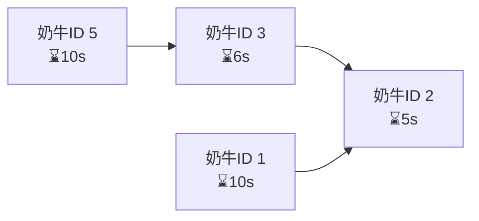

# 题目信息

# [USACO13FEB] Milk Scheduling S

## 题目描述

Farmer John's N cows (1 <= N <= 10,000) are conveniently numbered 1..N. Each cow i takes T(i) units of time to milk.  Unfortunately, some cows must be milked before others, owing to the layout of FJ's barn.  If cow A must be milked before cow B, then FJ needs to completely finish milking A before he can start milking B.

In order to milk his cows as quickly as possible, FJ has hired a large number of farmhands to help with the task -- enough to milk any number of cows at the same time.  However, even though cows can be milked at the same time, there is a limit to how quickly the entire process can proceed due to the constraints requiring certain cows to be milked before others.  Please help FJ compute the minimum total time the milking process must take.

农民约翰有N头奶牛(1<=N<=10,000)，编号为1...N。每一头奶牛需要T(i)单位的时间来挤奶。不幸的是，由于FJ的仓库布局，一些奶牛要在别的牛之前挤奶。比如说，如果奶牛A必须在奶牛B前挤奶，FJ就需要在给奶牛B挤奶前结束给奶牛A的挤奶。


为了尽量完成挤奶任务，FJ聘请了一大批雇工协助任务——同一时刻足够去给任意数量的奶牛挤奶。然而，尽管奶牛可以同时挤奶，但仍需要满足以上的挤奶先后顺序。请帮助FJ计算挤奶过程中的最小总时间。


## 说明/提示

There are 3 cows.  The time required to milk each cow is 10, 5, and 6, respectively.  Cow 3 must be fully milked before we can start milking cow 2.


Cows 1 and 3 can initially be milked at the same time.  When cow 3 is finished with milking, cow 2 can then begin.  All cows are finished milking after 11 units of time have elapsed.


## 样例 #1

### 输入

```
3 1 
10 
5 
6 
3 2 
```

### 输出

```
11 
```

# AI分析结果


### 💡 Kay的C++算法解析：Milk Scheduling S 深入学习指南 💡

**引言**  
今天我们来分析USACO的「Milk Scheduling S」问题。这道题要求优化奶牛挤奶顺序，核心是处理任务间的依赖关系并计算最短完成时间。本指南将带你理解拓扑排序的关键应用，掌握动态规划思想，并通过像素动画直观感受算法执行过程。

---

## 1. 题目解读与核心算法识别  
✨ **本题主要考察**：`拓扑排序（关键路径）`  

🗣️ **初步分析**：  
> 就像组装乐高时某些零件必须优先拼装，奶牛挤奶的先后顺序形成「依赖链条」。拓扑排序能帮我们理清这些依赖关系，而关键路径（最长耗时路径）决定了整体最短时间——如同最慢的组装步骤决定整个模型完成时间。  
> - **核心思路**：将奶牛视为节点，依赖关系作为有向边，形成有向无环图（DAG）。关键路径长度（所有节点完成时间的最大值）即答案。
> - **算法流程**：  
>   1. 计算每个节点的入度（前驱数量）  
>   2. 入度为0的节点入队（可立即执行的挤奶任务）  
>   3. 动态更新后继节点完成时间：`dp[v] = max(dp[v], dp[u] + t[v])`  
> - **可视化设计**：像素方块表示奶牛，进度条显示完成时间。关键路径节点用红色闪烁标记，队列变化用流动动画展示，伴随8-bit音效强化操作反馈（如入队"叮"声、路径更新高音）。

---

## 2. 精选优质题解参考  
**题解一（Datura_）**  
* **点评**：思路清晰展现拓扑排序框架：初始化入度→入队起点→动态更新后继。代码中`tot[v]=max(tot[v],tot[u]+t[v])`精准捕捉关键路径思想。变量名`tot`（总时间）、`g`（邻接表）简洁直观，边界处理严谨（入度归零判断），竞赛实践性强。  

**题解二（Ginger_he）**  
* **点评**：亮点在于明确解释"最小时间=最长路径"的底层逻辑，强化问题转化思维。代码使用`f[i]`记录节点完成时间，逻辑与题解一等效但更强调DP思想，注释虽少但变量命名自解释性强（`r`→入度）。  

**题解三（y2823774827y）**  
* **点评**：采用链式前向星存图节省空间，独创`before[v]`变量暂存前驱最大完成时间。代码注释详细解释`pay[u]=before[u]+t[u]`的推导过程，适合学习者理解更新机制。调试心得"数组大小需谨慎"极具参考价值。

---

## 3. 核心难点辨析与解题策略  
1. **难点1：依赖关系抽象为图结构**  
   * **分析**：需将文字约束（A必须在B前）转化为有向边。优质题解用`vector<int> g[MAXN]`或链式前向星高效存储图。  
   * 💡 **学习笔记**：约束条件即拓扑边，建图是解题第一步。  

2. **难点2：关键路径的动态更新**  
   * **分析**：每个节点的完成时间需取所有前驱的最大值。代码中`dp[v]=max(dp[v],dp[u]+t[v])`实现递推，`queue`确保更新顺序正确。  
   * 💡 **学习笔记**：动态规划思想——当前状态由前驱状态推导。  

3. **难点3：并行处理的模拟**  
   * **分析**：入度归零的节点代表可并行任务。队列机制天然支持多任务并行模拟，无需额外处理。  
   * 💡 **学习笔记**：拓扑排序的队列隐式实现并行调度。  

### ✨ 解题技巧总结  
- **问题抽象法**：将现实约束转化为图论模型（节点/边）  
- **增量更新**：拓扑排序中动态维护`dp`数组，避免全局重算  
- **边界防御**：初始化时显式设置`dp[i]=t[i]`（无前驱节点）  
- **效率优化**：邻接表存图（O(N+M)复杂度）优于暴力搜索  

---

## 4. C++核心代码实现赏析  
**通用核心实现（综合优化版）**  
```cpp
#include <iostream>
#include <vector>
#include <queue>
using namespace std;
const int MAXN = 10001;

int main() {
    int n, m, t[MAXN], inDegree[MAXN] = {0}, dp[MAXN] = {0}, ans = 0;
    vector<int> graph[MAXN]; 
    // 输入处理
    cin >> n >> m;
    for (int i = 1; i <= n; i++) cin >> t[i];
    while (m--) {
        int a, b; cin >> a >> b;
        graph[a].push_back(b);
        inDegree[b]++;
    }
    // 拓扑排序+DP
    queue<int> q;
    for (int i = 1; i <= n; i++) 
        if (!inDegree[i]) { dp[i] = t[i]; q.push(i); }
    
    while (!q.empty()) {
        int u = q.front(); q.pop();
        ans = max(ans, dp[u]);
        for (int v : graph[u]) {
            dp[v] = max(dp[v], dp[u] + t[v]);
            if (--inDegree[v] == 0) q.push(v);
        }
    }
    cout << ans;
}
```
**代码解读概要**：  
1. **建图阶段**：`graph`存储依赖关系，`inDegree`记录入度  
2. **初始化队列**：入度为零的节点直接设置完成时间  
3. **动态更新**：弹出队首节点，更新其后继的完成时间并减少入度  
4. **结果收集**：全局`ans`维护关键路径长度  

---

**分题解代码精析**  
**题解一核心片段**  
```cpp
// 初始化入度为零的节点
for(int i=1; i<=n; i++) 
    if(d[i]==0) { tot[i]=t[i]; q.push(i); }

while(!q.empty()) {
    int u = q.front(); q.pop();
    for(int v : g[u]) {
        d[v]--;
        tot[v] = max(tot[v], tot[u] + t[v]); // 动态更新
        if(d[v]==0) q.push(v);
    }
}
```
* **亮点**：用`tot`数组替代`dp`，命名直指"总耗时"本质  
* **学习笔记**：更新条件`d[v]--`后立即检查入度归零，确保无前驱依赖时立刻处理  

**题解三链式前向星实现**  
```cpp
// 链式前向星存图
void addEdge(int u, int v) {
    to[++cnt] = v;
    nxt[cnt] = head[u];
    head[u] = cnt;
}
// 拓扑中更新前驱
for (int i=head[u]; i; i=nxt[i]) {
    int v = to[i];
    before[v] = max(before[v], pay[u]); // 暂存前驱最大值
    if (--ru[v]==0) {
        pay[v] = before[v] + t[v]; // 入度归零时计算最终值
        q.push(v);
    }
}
```
* **亮点**：`before[]`分离前驱计算与最终赋值，逻辑更清晰  
* **学习笔记**：链式前向星用`head/nxt`模拟指针，空间效率极高  

---

## 5. 算法可视化：像素动画演示  
### 🎮 像素农场调度模拟器  
**主题**：8-bit风格奶牛挤奶工厂  
**核心交互设计**：  


**动态演示流程**：  
1. **初始化场景**：  
   - 像素奶牛按ID排列，头顶显示挤奶时间  
   - 右侧队列面板显示`[1,3]`（初始入度为零节点）  

2. **关键帧演示**：  
   - **帧1**：奶牛1、3的进度条开始填充（绿色），播放"叮"声  
   - **帧2**：奶牛3完成→连接奶牛2的箭头高亮，更新`dp[2]=max(0+5, 6+5)=11`  
   - **帧3**：奶牛2进度条变红闪烁（关键路径），播放高音提示  

3. **游戏化元素**：  
   - 控制面板：步进/暂停/速度滑块（0.5x-2x）  
   - 音效反馈：入队（8-bit "叮"）、路径更新（上升音阶）、完成（胜利和弦）  
   - 成就系统：每完成关键路径节点，显示"★ 关键步骤！"  

**技术实现**：  
- Canvas绘制奶牛像素图（32x32px）  
- `requestAnimationFrame`驱动进度条动画  
- 音效：Web Audio API生成方波音效  

---

## 6. 拓展练习与相似问题思考  
**通用技巧迁移**：  
拓扑排序求关键路径适用于：  
1. 项目工序规划（工序依赖）  
2. 课程安排（先修课约束）  
3. 任务调度系统（资源分配）  

**洛谷推荐题目**：  
1. **P1113 杂务**  
   🗣️ 直接应用关键路径，巩固拓扑排序框架  
2. **P1137 旅行计划**  
   🗣️ 在DAG上求最长路径，强化DP状态转移  
3. **P4017 最大食物链计数**  
   🗣️ 拓扑排序与路径计数结合，拓展应用场景  

---

## 7. 学习心得与经验分享  
> **作者 y2823774827y 的调试经验**：  
> "链式前向星的`head`数组未初始化导致越界访问——看似简单的题也可能暗藏陷阱。"  
>   
> **Kay点评**：  
> 这提醒我们：  
> 1. 图论问题务必初始化存储结构  
> 2. 变量命名避免单字母（如`r`→`inDegree`更易读）  
> 3. 在`queue`操作前验证入度是否为零，避免逻辑闭环  

---

**结语**  
通过拓扑排序寻找关键路径，我们高效解决了并行任务调度问题。记住：将复杂依赖抽象为图结构，用动态规划逐步推导，是处理此类问题的核心心法。继续用代码探索算法之美吧！🚀

---
处理用时：216.05秒