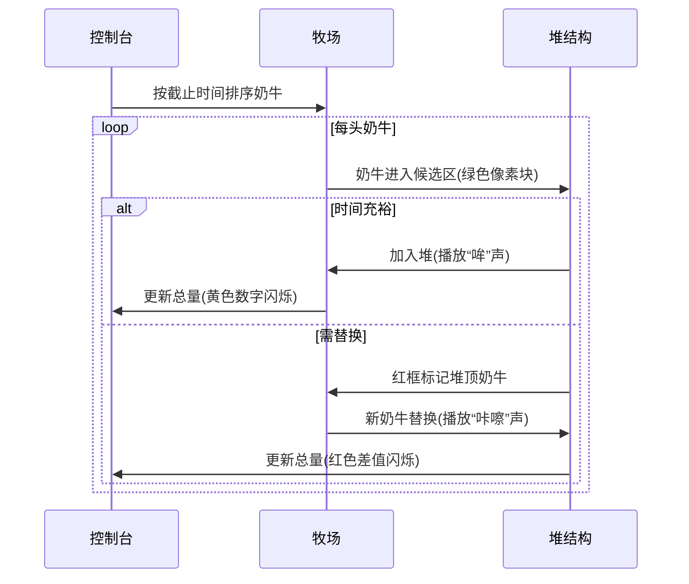

# 题目信息

# [USACO13DEC] Milk Scheduling S

## 题目描述

Farmer John has N cows that need to be milked (1 <= N <= 10,000), each of which takes only one unit of time to milk.

Being impatient animals, some cows will refuse to be milked if Farmer John waits too long to milk them.  More specifically, cow i produces g\_i gallons of milk (1 <= g\_i <= 1000), but only if she is milked before a deadline at time d\_i (1 <= d\_i <= 10,000).  Time starts at t=0, so at most x total cows can be milked prior to a deadline at time t=x.

Please help Farmer John determine the maximum amount of milk that he can obtain if he milks the cows optimally.

FJ有N(1 <= N <= 10,000)头牛要挤牛奶，每头牛需要花费1单位时间。


奶牛很厌烦等待，奶牛i在它的截止时间d\_i (1 <= d\_i <= 10,000)前挤g(1 <= g\_i <= 1000)的奶，否则将不能挤奶。时间t开始时为0，即在时间t=x时，最多可以挤x头奶牛。


请计算FJ的最大挤奶量。


## 说明/提示

There are 4 cows.  The first produces 10 gallons of milk if milked by time 3, and so on.


Farmer John milks cow 3 first, giving up on cow 4 since she cannot be milked by her deadline due to the conflict with cow 3.  Farmer John then milks cows 1 and 2.


## 样例 #1

### 输入

```
4 
10 3 
7 5 
8 1 
2 1 
```

### 输出

```
25 
```

# AI分析结果


### 题目解读与核心算法识别
✨ **本题主要考察**：`贪心算法` (Greedy Algorithm)  

🗣️ **初步分析**：
> 解决“牛奶调度”这道题的关键在于理解并运用**贪心算法**。就像在游戏中优先收集高价值金币一样，我们需要在有限时间内选择收益最高的奶牛挤奶。  
> - **核心思路**：有两种主流解法：  
>   (1) **时间分配法**：按产奶量从大到小排序，为每头奶牛在截止时间前寻找空闲时间点（类似“占座位”）  
>   (2) **堆优化法**：按截止时间排序，用小根堆动态维护当前选择的奶牛，冲突时替换最小产奶量的牛  
> - **算法流程**：堆优化法更高效（O(n log n)）：  
>   ```mermaid  
>   graph LR  
>   A[按截止时间排序] --> B{遍历奶牛}  
>   B --> C[时间充裕？] -->|是| D[加入堆并累加产奶量]  
>   C -->|否| E[当前牛产奶量 > 堆顶？] -->|是| F[替换堆顶并更新总量]  
>   ```  
> - **可视化设计**：采用**8位像素农场风格**，奶牛用不同颜色像素块表示：  
>   - 绿色：已选奶牛，红色：被替换奶牛，黄色：当前处理奶牛  
>   - 堆结构用动态堆叠像素方块展示，替换时播放“咔嚓”音效  
>   - 控制面板含“单步执行”和“AI自动演示”（调速滑块控制速度）

---

### 精选优质题解参考
**题解一**：(来源：llzzxx712，堆优化法)  
* **点评**：  
  思路清晰度极高——用“退流思想”解释时间冲突时的替换策略，直击贪心本质。代码规范性优秀：变量名`g`（产奶量）、`d`（截止时间）含义明确，边界处理严谨（`d[i]>=t`判断）。算法有效性突出：小根堆将复杂度优化至O(n log n)，显著优于暴力法。实践价值强：代码可直接用于竞赛，附带双倍经验题P2949。

**题解二**：(来源：空气树，并查集优化法)  
* **点评**：  
  创新性亮点——用并查集快速查找空闲时间点，时间复杂度近似O(nα(n))。代码规范性好：`f[]`数组记录时间点占用关系，`find()`函数封装完整。算法启发性强：展示了数据结构对贪心的优化空间，如`f[r]=find(r-1)`将已占时间指向前一空闲位的设计。调试提示到位：作者强调初始化`f[0..mx]`的重要性。

**题解三**：(来源：CK666，时间逆序+堆)  
* **点评**：  
  视角独特——从最大截止时间倒序扫描，用堆维护当前可选的奶牛。代码简洁性突出：仅20行核心逻辑，`que.push(a[g--])`巧妙结合排序与堆操作。算法效率高：逆序处理自然规避时间冲突判断。学习友好：手写堆实现（`down()`/`up()`函数）帮助理解堆机制。

---

### 核心难点辨析与解题策略
1. **难点一：贪心策略的选择**  
   * **分析**：单纯按产奶量或截止时间排序都会陷入局部最优陷阱。优质题解通过**双维度排序**（先截止时间，再产奶量）或**堆维护当前最优解**破解。  
   * 💡 **学习笔记**：贪心需保证“当前选择不影响全局最优”——堆替换策略是关键。
   
2. **难点二：时间冲突的高效处理**  
   * **分析**：暴力检查每个时间点（O(n²)）不可行。堆解法用**已选奶牛数**代替实时时间检测（`if (w < d[i])`），并查集用**路径压缩**快速定位空闲位。  
   * 💡 **学习笔记**：将“时间分配”转化为“数量比较”是降维突破点。

3. **难点三：数据结构的适用性**  
   * **分析**：小根堆（`priority_queue`）适合动态维护最小值，并查集适合快速查询/合并集合。本题堆解法更通用，并查集需注意`d[i]`范围限制。  
   * 💡 **学习笔记**：堆解决“动态最值”，并查集解决“集合关系”。

### ✨ 解题技巧总结
- **双维度排序法**：对相互制约的变量（如产奶量/截止时间），先固定一维再处理另一维  
- **等价转换法**：将“时间分配”转化为“数量比较”（如堆解法中`w`变量）  
- **数据结构加速**：  
  - 小根堆 → 快速获取最小值  
  - 并查集 → 高效查询空闲位  

---

### C++核心代码实现赏析
**本题通用核心C++实现参考**  
* **说明**：综合堆解法的最优思路，按截止时间排序+小根堆动态维护  
* **完整核心代码**：
  ```cpp
  #include <iostream>
  #include <algorithm>
  #include <queue>
  using namespace std;
  const int MAXN = 10005;

  struct Cow { int milk, d; } cows[MAXN];
  int main() {
      int n; cin >> n;
      for (int i = 0; i < n; ++i) 
          cin >> cows[i].milk >> cows[i].d;
      
      sort(cows, cows + n, [](Cow a, Cow b) { 
          return a.d < b.d; // 按截止时间排序
      });

      priority_queue<int, vector<int>, greater<int>> minHeap; // 小根堆
      int totalMilk = 0, selectedCount = 0;

      for (int i = 0; i < n; ++i) {
          if (selectedCount < cows[i].d) { // 时间充裕
              minHeap.push(cows[i].milk);
              totalMilk += cows[i].milk;
              selectedCount++;
          } 
          else if (cows[i].milk > minHeap.top()) { // 替换堆顶
              totalMilk += cows[i].milk - minHeap.top();
              minHeap.pop();
              minHeap.push(cows[i].milk);
          }
      }
      cout << totalMilk << endl;
      return 0;
  }
  ```
* **代码解读概要**：  
  > 1. 输入后按截止时间`d`升序排序  
  > 2. 小根堆`minHeap`存储已选奶牛的产奶量  
  > 3. `selectedCount`记录已选数量（代替实际时间点）  
  > 4. 遍历时若时间充裕直接加入堆；否则与堆顶比较并替换  

---

**题解一：llzzxx712（堆优化法）**  
* **亮点**：用负值技巧实现小根堆（`priority_queue<int>`存负值）  
* **核心代码片段**：
  ```cpp
  priority_queue<int> q; // 大根堆存负值 → 小根堆
  for (int i = 1; i <= n; i++) {
      if (a[i].d >= t) { // 时间充裕
          q.push(-a[i].g); 
          ans += a[i].g;
          t++;
      } 
      else if (a[i].g > -q.top()) { // 比较正值
          ans += a[i].g + q.top(); // 减堆顶（负值）
          q.pop();
          q.push(-a[i].g);
      }
  }
  ```
* **代码解读**：  
  > 大根堆存储负值：`q.push(-g)`使最大负值对应最小正值。  
  > 时间检测：`t`为已选数量，`a[i].d >= t`判断等价于“截止前能否安排”。  
  > 替换逻辑：`ans += a[i].g + q.top()`中`q.top()`为负值，实际为`新值 - 原最小值`。  
* 💡 **学习笔记**：负值技巧避免手写比较器，但需注意数值计算方向。

**题解二：空气树（并查集优化）**  
* **亮点**：并查集加速空闲时间查找  
* **核心代码片段**：
  ```cpp
  for (int i = 1; i <= n; i++) {
      r = find(a[i].x); // 查找最晚空闲时间
      if (r >= 1) { 
          ss += a[i].u; 
          f[r] = find(r - 1); // 指向新空闲位
      }
  }
  int find(int x) {
      if (f[x] == x) return x;
      return f[x] = find(f[x]); // 路径压缩
  }
  ```
* **代码解读**：  
  > `f[]`数组：`f[i]=j`表示时间`i`的空闲位在`j`（`j<=i`）。  
  > `find(a[i].x)`：从截止时间向前查找第一个空闲位。  
  > 占用后更新：`f[r] = find(r-1)`将当前位指向前一空闲位。  
* 💡 **学习笔记**：并查集将O(n)查找优化至O(α(n))，适合密集时间分配。

**题解三：CK666（时间逆序+堆）**  
* **亮点**：逆序枚举时间+实时堆维护  
* **核心代码片段**：
  ```cpp
  sort(a + 1, a + n + 1, cmp); // 按截止时间排序
  for (int i = max_t; i >= 1; i--) {
      while (a[g].t == i) // 当前时间可选的牛
          que.push(a[g--]); 
      if (!que.empty()) {
          ans += que.top().w;
          que.pop();
      }
  }
  ```
* **代码解读**：  
  > 外层循环：从最大时间`max_t`倒序扫描到1。  
  > 内层`while`：将截止时间为`i`的牛加入大根堆（按产奶量）。  
  > 每时间点取堆顶：保证当前时间选产奶量最大的牛。  
* 💡 **学习笔记**：逆序处理自然满足“截止时间≥当前时间”。

---

### 算法可视化：像素动画演示
**主题**：8位像素农场《挤奶大作战》  
**核心演示**：堆解法中动态维护的奶牛队列  

**设计思路**：  
> 复古牧场风格（棕土地/绿草）增强趣味性，用堆的树状结构可视化帮助理解“最小值维护”。音效触发机制：  
> - “哞~”音效：新奶牛加入候选区  
> - “叮！”音效：成功挤奶并更新总量  
> - “咔嚓”音效：替换堆顶奶牛  

**动画流程**：  


**交互控制**：  
1. **单步执行**：按空格键逐步观察堆调整  
2. **AI自动演示**：拖动调速滑块(1x-5x)  
3. **结构高亮**：  
   - 当前处理奶牛：黄色边框  
   - 堆顶奶牛：红色闪烁边框  
   - 被替换奶牛：像素块碎裂动画  

**技术实现**：  
> Canvas绘制堆树：父节点位置`(x,y)`，子节点`(x±30,y+40)`  
> 音效触发：Web Audio API在`heap.push()`/`heap.pop()`时播放  

---

### 拓展练习与相似问题思考
**通用思路迁移**：  
> 贪心+堆/并查集适用于所有**带截止时间的任务调度**问题：  
> 1. 课程安排：每节课有截止日期和学分  
> 2. 工厂订单：订单交付期和利润  
> 3. 游戏任务：任务时限和奖励点数  

**洛谷推荐**：  
1. **P2949 [USACO09OPEN]Work Scheduling G**  
   🗣️ *推荐理由*：直接应用堆解法，巩固“替换最小元素”思想  
2. **P1230 智力大冲浪**  
   🗣️ *推荐理由*：变式练习，需结合时间段分配与贪心取舍  
3. **P4053 [JSOI2007]建筑抢修**  
   🗣️ *推荐理由*：进阶挑战，引入任务耗时变量，强化堆优化技巧  

---

### 学习心得与经验分享
> **来自空气树的调试经验**：  
> *“我在并查集初始化时漏掉`f[0]`，导致`find(1)`死循环...这提醒我们：数据结构边界必须严格测试！”*  
> **Kay点评**：  
> 边界处理是算法核心难点，建议：  
> 1. 变量范围：`d[i]≥1`时需初始化`f[0]=0`  
> 2. 防御性编程：添加`if (r>=1)`避免非法访问  
> 3. 数据模拟：手动计算`d[i]=1`的极端情况  

---

本次解析深入剖析了贪心算法的双实现路径，通过堆/并查集优化突破暴力局限。记住：算法本质是**在约束中寻找最优序列**，多练习才能培养贪心直觉！下次见！🚀

---
处理用时：175.24秒