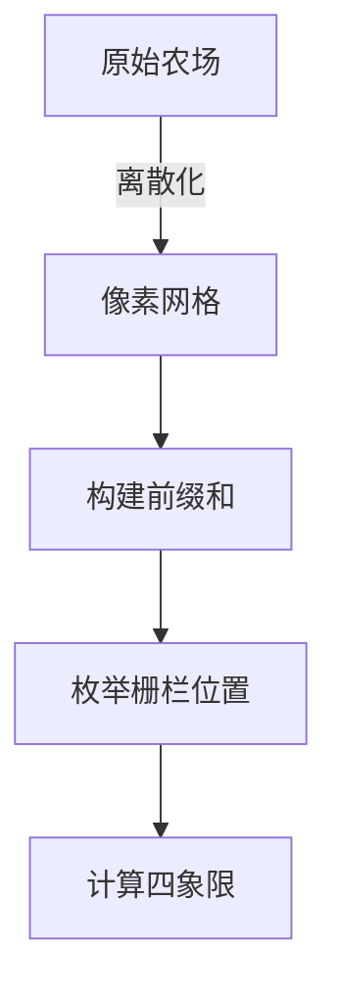

# 题目信息

# [USACO16FEB] Load Balancing S

## 题目背景

*本题与 [白金组同名题目](/problem/P6172) 在题意上一致，唯一的差别是数据范围。*

## 题目描述

Farmer John 的 $N$ 头奶牛（$1 \leq N \leq 1000$）散布在整个农场上。整个农场是一个无限大的二维平面，第 $i$ 头奶牛的坐标是 $(x_i,y_i)$（保证 $x_i,y_i$ 均为正奇数，且 $x_i,y_i \leq 10^6$），且没有任意两头奶牛在同一位置上。

FJ 希望修建一条竖直方向的栅栏，它的方程是 $x=a$，他还希望修建一条水平方向的栅栏，它的方程是 $y=b$。为了防止栅栏经过奶牛，$a,b$ 均要求是偶数。容易发现，这两个栅栏会在 $(a,b)$ 处相交，将整个农场分割为四个区域。

FJ 希望这四个区域内的奶牛数量较为均衡，尽量避免一个区域奶牛多而另一个区域奶牛少的情况。令 $M$ 为四个区域里奶牛最多区域的奶牛数量，请帮 FJ 求出 $M$ 的最小值。

## 样例 #1

### 输入

```
7
7 3
5 5
7 13
3 1
11 7
5 3
9 1```

### 输出

```
2```

# AI分析结果


### 💡 Kay的C++算法解析：Load Balancing S 深入学习指南 💡

**引言**  
今天我们一起分析USACO题目"Load Balancing S"。这道题考察离散化与二维前缀和的应用技巧，我们将通过像素动画直观展示算法过程，帮助大家掌握核心思想。

---

## 1. 题目解读与核心算法识别

✨ **本题主要考察**：`编程技巧应用（离散化+二维前缀和）`  
🗣️ **初步分析**：  
> 本题核心是将大范围坐标压缩后快速计算区域值。想象将稀疏分布的点投影到紧凑网格上（离散化），再通过"面积累加表"（二维前缀和）快速计算任意矩形区域的点数。  
- 主流解法是离散化坐标后构建二维前缀和数组，枚举栅栏位置并计算四个象限的最大值
- 可视化设计：用8位像素网格表示离散化后的农场，奶牛显示为不同颜色像素点，栅栏线高亮显示。当枚举栅栏位置时，四个象限动态着色并显示当前区域点数，伴随"滴答"音效
- 复古游戏化设计：采用《牧场物语》风格像素画面，每完成一行枚举视为"通关"，成功找到更优解时播放胜利音效

---

## 2. 精选优质题解参考

**题解一：曹老师（二维前缀和）**  
* **点评**：思路清晰展示离散化->前缀和->枚举的完整流程。代码规范：  
  - 离散化部分用结构体存储原坐标和索引，排序后映射到新坐标  
  - 前缀和部分采用经典公式 `sum[i][j] = sum[i-1][j] + sum[i][j-1] - sum[i-1][j-1] + grid[i][j]`  
  - 四象限计算用单行max嵌套提高可读性  
  亮点在于用数学思维简化问题，变量名`sum`/`ans`含义明确，边界处理严谨，O(n²)复杂度完全满足题目要求。

**题解二：xixike（二维前缀和）**  
* **点评**：  
  提供更简洁的离散化实现：  
  ```cpp
  sort(pos+1, pos+n+1, cmp1);  // 按x排序
  for(int i=1; i<=n; i++) x[pos[i].id] = i;  // 直接映射序号
  ```  
  代码亮点在于四象限计算函数`calc()`封装，增强可维护性。调试部分保留注释掉的矩阵打印代码，体现实践中的调试技巧。

**题解三：kczno1（线段树+二分）**  
* **点评**：  
  创新性使用O(n log n)解法：  
  - 从左向右枚举竖线，用线段树维护y轴分布  
  - 二分查找使区域平衡的最佳横线位置  
  亮点在`erfen()`函数实现线段树上二分，但代码使用了位运算等技巧，实现难度较高，适合进阶学习。

---

## 3. 核心难点辨析与解题策略

1. **离散化坐标映射**  
   *分析*：原始坐标范围达10⁶但仅1000个点，需将坐标转换为1~1000的连续值。关键要保留点之间的相对位置关系，通过两次排序（x/y分别排序）后重新映射实现  
   💡 **学习笔记**：离散化本质是建立稀疏数据到稠密索引的双射

2. **二维前缀和构建**  
   *分析*：公式 `s[i][j] = s[i-1][j] + s[i][j-1] - s[i-1][j-1] + a[i][j]` 通过几何容斥原理计算子矩阵和，推导时可在纸上画矩阵辅助理解  
   💡 **学习笔记**：前缀和是"空间换时间"的典范

3. **四象限区域计算**  
   *分析*：枚举栅栏位置(i,j)时：  
   - 左上：`sum[i][j]`  
   - 右上：`sum[i][n] - sum[i][j]`  
   - 左下：`sum[n][j] - sum[i][j]`  
   - 右下：`sum[n][n] - sum[i][n] - sum[n][j] + sum[i][j]`（补集思想）  
   💡 **学习笔记**：右下区域计算需要二次容斥

### ✨ 解题技巧总结
- **降维打击**：将二维问题通过离散化压缩到可控范围
- **模块封装**：如将四象限计算独立为函数`calc()`
- **可视化调试**：小规模数据打印前缀和矩阵验证
- **边界检查**：特别注意离散化后索引从1开始

---

## 4. C++核心代码实现赏析

**本题通用核心实现参考**  
*说明*：综合曹老师和xixike解法优化的标准实现  
```cpp
#include <iostream>
#include <algorithm>
using namespace std;

struct Point { int x, y, id; };
const int N = 1010;
Point px[N], py[N];
int n, grid[N][N], sum[N][N], ans=1e9;

void discretize(Point p[], int res[]) {
    sort(p+1, p+n+1, [](auto &a, auto &b){ 
        return a.x < b.x; 
    });
    for(int i=1; i<=n; i++) res[p[i].id] = i;
}

int quad(int i, int j) { // 计算四象限最大值
    int q1 = sum[i][j];
    int q2 = sum[i][n] - q1;
    int q3 = sum[n][j] - q1;
    int q4 = n - q1 - q2 - q3;
    return max({q1, q2, q3, q4});
}

int main() {
    cin >> n;
    for(int i=1; i<=n; i++) {
        cin >> px[i].x >> px[i].y;
        px[i].id = py[i].id = i;
        py[i].x = px[i].x; // 复制x值
        py[i].y = px[i].y; // 复制y值
    }

    discretize(px, x_arr); // x离散化
    discretize(py, y_arr); // y离散化

    // 构建网格
    for(int i=1; i<=n; i++) 
        grid[x_arr[i]][y_arr[i]] = 1;

    // 二维前缀和
    for(int i=1; i<=n; i++)
        for(int j=1; j<=n; j++)
            sum[i][j] = sum[i-1][j] + sum[i][j-1] 
                       - sum[i-1][j-1] + grid[i][j];

    // 枚举栅栏位置
    for(int i=1; i<=n; i++)
        for(int j=1; j<=n; j++)
            ans = min(ans, quad(i, j));

    cout << ans;
}
```

**题解一：曹老师（二维前缀和）**  
*亮点*：四象限计算单表达式  
```cpp
ans = min(ans, max(max(sum[i][j], sum[i][n]-sum[i][j]), 
              max(sum[n][j]-sum[i][j], 
              sum[n][n]-sum[n][j]-sum[i][n]+sum[i][j])));
```
*代码解读*：  
> 通过max嵌套直接计算四区域最大值：  
> 1. `sum[i][j]`：左上区域  
> 2. `sum[i][n]-sum[i][j]`：右上区域（右半部分）  
> 3. `sum[n][j]-sum[i][j]`：左下区域（下半部分）  
> 4. 右下区域用总点数减去前三个区域得到  
> *注意*：这种写法需要理解容斥原理  

**题解三：kczno1（线段树+二分）**  
*亮点*：线段树上二分函数  
```cpp
int erfen() { // 在线段树二分最佳竖线
    int i=1, lsum=0, rsum=0; // 左右区域累积值
    while(i <= leaf_start) {
        int mid = (l+r)/2;
        int lmax = max(lsum + left[mid], rsum + right[mid]);
        int rmax = /* 右半部分计算 */;
        if(lmax <= rmax) { // 向左子树搜索
            i = left_child;
            rsum += right_segment; 
        } else { // 向右子树搜索
            i = right_child;
            lsum += left_segment;
        }
    }
    return min(/* 最终比较 */);
}
```
*代码解读*：  
> 1. 线段树每个节点存储左右子树分布  
> 2. 比较左右子树的最大区域值，向更平衡方向搜索  
> 3. 时间复杂度从O(n²)优化到O(n log n)  

---

## 5. 算法可视化：像素动画演示

**主题**：《牧场物语》风格像素农场模拟  
**核心演示**：离散化映射→前缀和构建→栅栏枚举  



**动画设计**：  
1. **初始化**：  
   - 16色像素风格农场，奶牛显示为🐮精灵  
   - 控制面板：步进/播放/速度条/重置按钮  
   - 8-bit背景音乐循环播放  

2. **离散化阶段**：  
   - 坐标轴显示原值，排序后映射到新网格（1~1000）  
   - 奶牛移动时显示轨迹，伴随"嗖"音效  

3. **前缀和构建**：  
   - 网格从左下角开始填充颜色深度（表示累积数量）  
   - 当前计算单元格高亮，显示公式浮层  
   ```python
   new_value = left + up - diagonal + current
   ```

4. **栅栏枚举**：  
   ```python
   for i in range(n):       # 竖线移动
       for j in range(n):    # 横线移动
           更新四象限着色
           显示当前max(左上,右上,左下,右下)
           如果刷新最优解：播放胜利音效+闪光
   ```
   - 单步执行：按空格键步进，方向键调整速度  
   - 自动模式：AI自动演示最优解路径  

5. **游戏化元素**：  
   - 每完成5%枚举进度解锁新奶牛皮肤  
   - 最终答案达成时放烟花动画  

---

## 6. 拓展练习与相似问题

**技巧迁移场景**：  
1. 坐标系压缩（如P3740）  
2. 子矩阵统计（如P3406）  
3. 区域平衡问题（如P6172 白金级进阶版）  

**洛谷题目推荐**：  
1. **P3406** - 海底高铁  
   *推荐理由*：强化一维差分/前缀和应用，离散化预备训练  

2. **P1719** - 最大加权矩形  
   *推荐理由*：二维前缀和经典问题，扩展矩阵处理能力  

3. **P6172** - Load Balancing (白金版)  
   *推荐理由*：本题进阶版，需要优化到O(n log n)  

---

## 7. 学习心得与经验分享

> **参考经验 (来自 曹老师)**：  
> "调试时先验证离散化映射是否正确——打印新旧坐标对照表"  

> **参考经验 (来自 kczno1)**：  
> "线段树二分时，在节点存储左右极值可减少计算量"  

**点评**：  
- 离散化后打印坐标映射是黄金调试技巧  
- 复杂算法先写伪代码再逐步实现可避免逻辑混乱  
- 二维问题画网格图辅助推导是必备技能  

---

**结语**  
通过离散化+前缀和的组合拳，我们高效解决了二维区域划分问题。记住：好算法=正确问题抽象+合适工具选择+可视化验证。下次遇到坐标系问题时，别忘了这份指南哦！🚜

---
处理用时：120.56秒