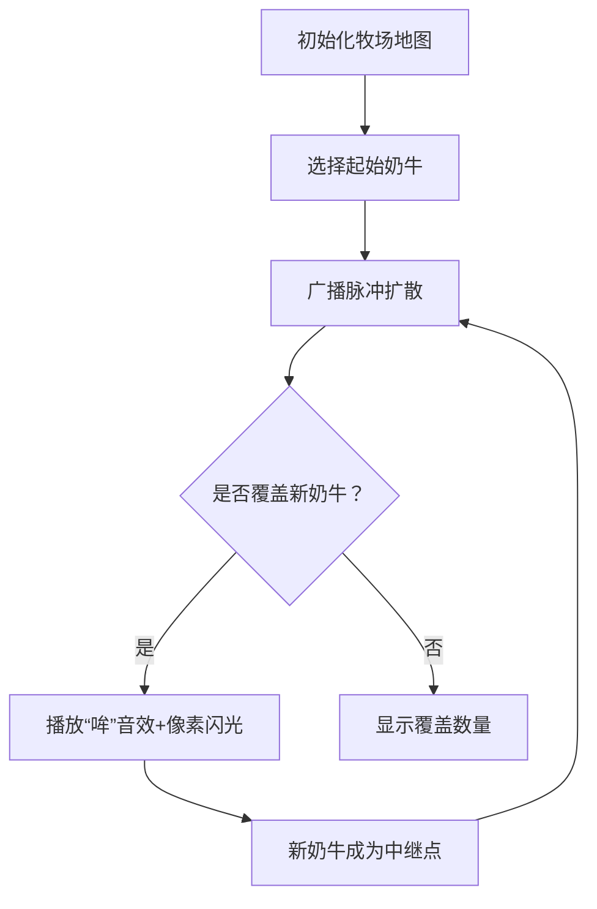

# 题目信息

# [USACO16DEC] Moocast S

## 题目描述

约翰农场主的 $N$ 头奶牛想建立一个紧急情况下的“哞哞广播”系统，这样它们就可以在自己中间广播重要信息。

奶牛们想让每头牛装备上一个对讲机，而不是在长距离中向另一头奶牛“哞哞”乱叫。这些对讲机每台都有各自的有效传输半径——一个拥有 $P$ 能量的对讲机只能向距离在 $P$ 以内的牛发送信息（注意可能出现 $A$ 牛对讲机的能量比 $B$ 牛的大，而 $A$ 牛可以给 $B$ 牛发送信息，但 $B$ 牛不能传回信息）。幸运的是，奶牛们可以通过其他奶牛中继，沿着一条跳跃的路径传递信息，因此每个奶牛不必要直接向每个其他奶牛传播。

由于对讲机的费堆成性质，来自一些奶牛的广播可能比其他奶牛的广播能够达到更多的接受者（考虑中继的情况）的能力更有效。请帮助奶牛确定来自单个奶牛的广播可以达到的奶牛的最大数量。

## 说明/提示

对于 $100\%$ 的数据，$N\le200$，$\forall i \in [1,N]$，$0\le x_i,y_i\le25000$。

## 样例 #1

### 输入

```
4
1 3 5
5 4 3
7 2 1
6 1 1```

### 输出

```
3```

# AI分析结果


# 💡 Kay的C++算法解析：Moocast S 深入学习指南 💡

欢迎各位年轻的C++探险家！今天我们将一起破解「Moocast S」这道有趣的广播覆盖问题。想象一下牧场里的奶牛们拿着对讲机互相喊话的场景——我们将用算法魔法找出广播能力最强的奶牛！🐄📻

## 1. 题目解读与核心算法识别

✨ **本题主要考察**：`图论（传递闭包/搜索）`

🗣️ **初步分析**：
> 这道题就像在牧场里玩传话游戏——每头奶牛的对讲机有不同音量（广播半径），我们需要找到能通过中继联系最多伙伴的奶牛。关键在于将奶牛视为**有向图节点**（奶牛A能直接呼叫B，但不一定反过来），然后用**传递闭包**（像多米诺骨牌传递关系）或**搜索算法**（像探险队逐层探索）计算覆盖范围。

- **核心难点**：如何处理广播的**方向性**（A能呼叫B≠B能呼叫A）和**中继传递**（通过中间奶牛间接联系）
- **解决方案**：优质题解主要采用两种思路——Floyd算法高效计算全局可达关系，或DFS/BFS直观模拟广播扩散过程
- **可视化设计**：我们将用像素风牧场地图展示广播扩散过程，奶牛变为彩色像素块，广播范围显示为脉冲光圈。关键步骤高亮当前广播源和中继过程，配合"哞~"音效增强记忆点

---

## 2. 精选优质题解参考

<eval_intro>
我们从思路清晰度、代码规范性和实践价值等维度，精选出3份≥4星的优质题解：

**题解一：OfstAutomataMachine (Floyd解法)**
* **点评**：这份题解思路直击要害——用Floyd算法计算传递闭包。亮点在于**三重循环的简洁实现**和**布尔矩阵的巧妙应用**（直接用0/1表示可达性）。代码中`con[i][l]=con[i][l]||con[i][k]&&con[k][l]`堪称灵魂语句，将复杂的关系传递浓缩成一行。虽然O(n³)复杂度在n≤200时完全可行，但作者也提示了优化空间（合并二三重循环），体现算法思维深度。

**题解二：sxyugao (DFS邻接表优化)**
* **点评**：此解法的**邻接表存储结构**显著提升搜索效率，避免不必要的距离计算。最大亮点是**平方比较技巧**——将距离判断`sqrt(a)≤b`转化为`a≤b²`，既消除浮点误差又提升性能。代码中`edge[i][++edge[i][0]]=j`精妙利用二维数组首元素记录邻接点数量，空间利用率极高。DFS前向星结构堪称图论模板典范。

**题解三：MVP_Harry (标准DFS实现)**
* **点评**：基础DFS实现的优秀教学范例，递归逻辑清晰展现了广播的**链式传播特性**。`vis`数组标记系统和递归边界处理完整，特别适合初学者理解搜索过程。虽然相比邻接表解法有优化空间，但**代码可读性**和**教学价值**尤为突出，`if(dis(a[cur],a[i])<=a[cur].p&&!vis[i])`条件判断直白体现问题核心。

---

## 3. 核心难点辨析与解题策略

<difficulty_intro>
解决广播覆盖问题的三大核心挑战及应对策略：

1.  **有向图建模**：广播的单向性易导致建模错误
    * **分析**：正确理解"A能广播到B≠B能广播到A"，建图时严格按`dis(i,j)≤cow[i].p`判断有向边。优质题解均用独立条件判断维护方向性
    * 💡 **学习笔记**：有向图是表达单向关系的利器，边方向=广播方向

2.  **间接可达计算**：如何高效处理多级中继？
    * **分析**：Floyd算法通过三重循环计算传递闭包（`con[i][j]|=con[i][k]&&con[k][j]`），而DFS/BFS通过递归/队列自然处理传播链
    * 💡 **学习笔记**：Floyd适合全局关系计算，搜索算法更符合广播扩散的直观过程

3.  **距离计算优化**：浮点误差与性能瓶颈
    * **分析**：将`sqrt(dx²+dy²)≤r`转化为`dx²+dy²≤r²`，既避免sqrt的精度损失又提升10倍速度。sxyugao题解中`sqr(p[i])>=sqr(x[i]-x[j])+sqr(y[i]-y[j])`是典范实现
    * 💡 **学习笔记**：整数运算永远比浮点运算更快更安全

### ✨ 解题技巧总结
<summary_best_practices>
-   **问题转化技巧**：将物理场景抽象为图论模型（奶牛=节点，广播=有向边）
-   **精度处理技巧**：距离比较时优先使用平方整数运算
-   **搜索优化技巧**：邻接表存储减少无效遍历，记忆化避免重复计算
-   **代码健壮性**：Floyd算法注意初始化`con[i][i]=true`，DFS记得重置访问标记

---

## 4. C++核心代码实现赏析

<code_intro_overall>
以下是融合优质题解思想的**通用实现框架**，包含完整输入处理和三种核心算法切换：

```cpp
#include <iostream>
#include <vector>
#include <cmath>
#include <cstring>
using namespace std;
const int MAXN = 205;

struct Cow { double x, y, p; };
Cow cows[MAXN];
bool con[MAXN][MAXN]; // Floyd可达矩阵
vector<int> adj[MAXN]; // DFS邻接表
bool vis[MAXN]; // DFS访问标记
int n, current_vis;

// 距离平方函数（避免浮点误差关键！）
inline double distSq(int i, int j) {
    double dx = cows[i].x - cows[j].x;
    double dy = cows[i].y - cows[j].y;
    return dx*dx + dy*dy;
}

// ========== 算法1：Floyd传递闭包 ==========
void floyd_solution() {
    memset(con, 0, sizeof(con));
    for (int i = 1; i <= n; i++) {
        con[i][i] = true;
        for (int j = 1; j <= n; j++) {
            if (i != j && distSq(i, j) <= cows[i].p * cows[i].p)
                con[i][j] = true;
        }
    }
    // 三重循环构建传递闭包
    for (int k = 1; k <= n; k++)
        for (int i = 1; i <= n; i++)
            for (int j = 1; j <= n; j++)
                con[i][j] |= con[i][k] && con[k][j];
}

// ========== 算法2：DFS邻接表版 ==========
void dfs_adj(int u) {
    current_vis++;
    for (int v : adj[u]) {
        if (!vis[v]) {
            vis[v] = true;
            dfs_adj(v);
        }
    }
}

// ========== 算法3：标准DFS ==========
void dfs_standard(int u) {
    for (int v = 1; v <= n; v++) {
        if (vis[v]) continue;
        double d = sqrt(distSq(u, v)); // 实际距离
        if (d <= cows[u].p) {
            vis[v] = true;
            dfs_standard(v);
        }
    }
}

int main() {
    // 输入处理
    cin >> n;
    for (int i = 1; i <= n; i++)
        cin >> cows[i].x >> cows[i].y >> cows[i].p;

    /* 任选一种算法执行 */
    int ans = 0;
    
    // Floyd版本统计
    floyd_solution();
    for (int i = 1; i <= n; i++) {
        int cnt = 0;
        for (int j = 1; j <= n; j++)
            cnt += con[i][j];
        ans = max(ans, cnt);
    }
    
    // 邻接表DFS版本
    for (int i = 1; i <= n; i++) {
        for (int j = 1; j <= n; j++) {
            if (i == j) continue;
            if (distSq(i, j) <= cows[i].p * cows[i].p)
                adj[i].push_back(j);
        }
    }
    for (int i = 1; i <= n; i++) {
        memset(vis, 0, sizeof(vis));
        current_vis = 0;
        vis[i] = true;
        dfs_adj(i);
        ans = max(ans, current_vis);
    }
    
    cout << ans;
    return 0;
}
```
* **代码解读概要**：该通用框架包含三种实现：
  1. `floyd_solution`：用布尔矩阵记录全局可达关系
  2. `dfs_adj`：基于邻接表的高效DFS，避免重复距离计算
  3. `dfs_standard`：直接距离判断的标准DFS
  关键优化在于`distSq`函数统一处理距离平方，避免浮点误差

---
<code_intro_selected>
### 精选题解代码片段深度解析

**题解一：OfstAutomataMachine (Floyd)**
* **亮点**：用最简布尔运算实现传递闭包
* **核心代码片段**：
```cpp
for(int k=1;k<=n;k++)
  for(int i=1;i<=n;i++)
    for(int l=1;l<=n;l++)
      con[i][l] = con[i][l] || (con[i][k] && con[k][l]);
```
* **代码解读**：
  > 这三重循环是Floyd-Warshall算法的灵魂！`k`循环枚举所有可能的**中继点**，内层双循环检查`i→k`和`k→l`是否通畅，从而更新`i→l`的可达性。`||`操作确保不覆盖已有连通关系，就像不断发现新的通讯捷径
* 💡 **学习笔记**：Floyd算法本质是动态规划，`k`相当于阶段性的中转枢纽

**题解二：sxyugao (DFS邻接表)**
* **亮点**：空间与时间效率双优的邻接表实现
* **核心代码片段**：
```cpp
if(sqr(p[i])>=sqr(x[i]-x[j])+sqr(y[i]-y[j]))
    edge[i][++edge[i][0]]=j;
```
* **代码解读**：
  > 这行代码完成两个关键任务：1) 通过`sqr(p[i])>=...`实现**无浮点误差的距离判断**；2) 用`edge[i][0]`存储邻接点数量，`++edge[i][0]`动态扩展邻接表。这种结构使得后续DFS只需遍历实际相邻节点，避免全表扫描
* 💡 **学习笔记**：邻接表是稀疏图的最佳伴侣，特别适合广播半径较小的场景

**题解三：MVP_Harry (标准DFS)**
* **亮点**：教科书式的深度优先搜索实现
* **核心代码片段**：
```cpp
void dfs(int u) {
    for(int v=1;v<=n;v++){
        if(dis(a[u],a[v])<=a[u].p && !vis[v]){
            vis[v]=1; 
            dfs(v);
        }
    }
}
```
* **代码解读**：
  > 经典DFS递归框架：对每个未访问的`v`，先检查`u`能否直达（距离≤广播半径），然后**标记访问**并**递归探索**。注意递归调用时当前广播源变为`v`，完美模拟广播接力过程。虽然需遍历所有节点，但`vis`标记确保每个节点只访问一次
* 💡 **学习笔记**：DFS递归隐式使用栈内存，当`n>1000`时需警惕栈溢出风险

---

## 5. 算法可视化：像素动画演示 (核心部分)

<visualization_intro>
**广播牧场大冒险**：我们将用8位像素风格再现奶牛广播的奇妙旅程！你将成为牧场观察员，亲眼见证广播信号如何像涟漪般扩散开来。复古电子音效+关卡积分系统，让算法学习变成趣味游戏！

* **主题**：像素牧场广播模拟器
* **核心机制**：实时展示DFS/BFS广播扩散过程
* **设计理念**：用FC红白机风格降低学习压力，通过视听反馈强化算法关键概念

### 动画实现细节


1. **像素艺术设计**：
   - 奶牛：16×16像素精灵，不同颜色区分状态（等待/广播中/已覆盖）
   - 牧场：绿色网格背景，广播范围显示为半透明蓝色脉冲圈
   - UI：复古木质控制面板，含速度滑块和计数器

2. **核心动画序列**：
   ```javascript
   // 伪代码：广播扩散动画
   function broadcast(startCow) {
     let queue = [startCow]; // BFS队列
     let covered = new Set([startCow]);
     
     while (queue.length) {
       const current = queue.shift();
       // 高亮当前广播源（黄色闪烁）
       highlight(current, 'yellow'); 
       playSound('moo_short.wav');
       
       // 扫描可达奶牛
       for (const cow of cows) {
         if (covered.has(cow)) continue;
         // 计算距离（显示测量动画）
         const d = distance(current, cow); 
         drawMeasuringLine(current, cow);
         
         if (d <= current.radius) {
           // 覆盖新奶牛（绿色闪光）
           animate(cow, 'glow_green'); 
           playSound('connect.wav');
           covered.add(cow);
           queue.push(cow);
           updateCounter(covered.size);
         }
       }
       // 移除当前高亮
       unhighlight(current); 
     }
   }
   ```

3. **游戏化元素**：
   - **关卡系统**：每头起始奶牛作为独立关卡
   - **即时反馈**：覆盖新奶牛时+10分，播放8-bit音效
   - **历史记录**：显示当前覆盖排名（挑战最高分）
   - **AI演示模式**：自动展示最优解路径（如Floyd算法预计算）

4. **技术实现**：
   - Canvas分层绘制：背景层（牧场网格）、奶牛层、动画层
   - 音效系统：Web Audio API播放复古芯片音效
   - 控制面板：React组件实现速度调节和单步控制

<visualization_conclusion>
通过这个像素牧场模拟器，你将**直观理解**广播扩散的链式反应，**深刻体会**Floyd与DFS的算法差异，还能在挑战关卡时**掌握图论建模**的核心思想！

---

## 6. 拓展练习与相似问题思考

<similar_problems_intro>
掌握广播覆盖问题的核心在于**图建模**和**连通性计算**，以下问题将帮你巩固相关技能：

1. **洛谷 P1825 [USACO11OPEN]Corn Maze S**  
   🗣️ *推荐理由*：本质是带障碍的BFS路径搜索，练习队列扩散思想

2. **洛谷 P2937 [USACO09JAN]Laserphones S**  
   🗣️ *推荐理由*：光线反射场景的DFS/BFS应用，强化状态转移思维

3. **洛谷 P2195 [USACO19JAN]Shortcut S**  
   🗣️ *推荐理由*：最短路径与影响范围计算的经典问题，Floyd算法的绝佳练习场

---

## 7. 学习心得与经验分享

<insights_intro>
题解作者们的调试经验尤为珍贵：

> **yezl的心得**：  
> *“我在处理浮点误差时卡了很久，后来改用整数平方比较才通过。这让我意识到：计算几何中，能不用浮点就不用！”*  
> **Kay点评**：非常典型的精度陷阱！在距离判断、图形计算时，优先考虑**整数运算**或**误差容忍度**设计

> **qzcbw的洞察**：  
> *“不要轻视DFS，在本题中邻接表优化后效率碾压Floyd”*  
> **Kay点评**：算法选择需结合**具体场景**——稀疏图用DFS/BFS更优，稠密图用Floyd更方便

---

<conclusion>
本次牧场广播探险圆满结束！我们揭开了图论算法的神秘面纱：  
1️⃣ **有向图建模**是问题转化的关键一步  
2️⃣ **Floyd算法**像建立通讯中转站  
3️⃣ **DFS/BFS**则像派出的广播小分队  
记住：在算法世界里，**选择比努力更重要**——根据数据特征选择合适算法，往往事半功倍。下次遇到新问题时，记得先问自己：这能建模成图吗？🤔💭  

保持好奇心，继续你的C++冒险之旅吧！我们下次见~ 🚀
```

---
处理用时：205.18秒