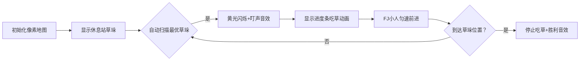

# 题目信息

# [USACO18FEB] Rest Stops S

## 题目描述

Farmer John 和他的私人教练 Bessie 正在攀登温哥华山。为了他们的目的（以及你的目的），这座山可以表示为一条长度为 $L$ 米的长直步道（$1 \leq L \leq 10^6$）。Farmer John 将以每米 $r_F$ 秒的恒定速度徒步（$1 \leq r_F \leq 10^6$）。由于他正在锻炼耐力，他不会在途中休息。

然而，Bessie 被允许在休息站休息，她可能会在那里找到一些美味的草。当然，她不能随便停下来！步道上有 $N$ 个休息站（$1 \leq N \leq 10^5$）；第 $i$ 个休息站距离步道起点 $x_i$ 米（$0 < x_i < L$），并且有一个美味值 $c_i$（$1 \leq c_i \leq 10^6$）。如果 Bessie 在第 $i$ 个休息站休息 $t$ 秒，她会获得 $c_i \cdot t$ 的美味单位。

当不在休息站时，Bessie 将以每米 $r_B$ 秒的固定速度徒步（$1 \leq r_B \leq 10^6$）。由于 Bessie 年轻且健康，$r_B$ 严格小于 $r_F$。

Bessie 希望最大化她摄入的美味草量。但她担心 Farmer John；她认为如果在徒步的任何时刻她在步道上落后于 Farmer John，他可能会失去继续前进的动力！

请帮助 Bessie 找到在确保 Farmer John 完成徒步的情况下，她能获得的最大总美味单位。

## 说明/提示

在这个例子中，Bessie 最优的策略是在 $x=7$ 的休息站休息 $7$ 秒（获得 $14$ 个美味单位），然后在 $x=8$ 的休息站再休息 $1$ 秒（获得 $1$ 个美味单位，总共 $15$ 个美味单位）。

## 样例 #1

### 输入

```
10 2 4 3
7 2
8 1```

### 输出

```
15```

# AI分析结果


### 💡 Kay的C++算法解析：[USACO18FEB] Rest Stops S 深入学习指南 💡

**引言**  
今天我们来分析这道关于Bessie和Farmer John登山的趣味题。本指南将帮助大家掌握贪心算法的应用技巧，理解如何通过高效选择休息站来最大化美味值收获。

---

## 1. 题目解读与核心算法识别

✨ **本题主要考察**：`贪心算法`（Greedy）  

🗣️ **初步分析**：  
> 解决本题的关键在于运用贪心策略——就像在自助餐厅优先挑选最贵的食材。Bessie应**优先选择当前可访问的美味值最高**的休息站停留，直到被Farmer John追上。  
> - **核心思路**：将所有休息站按美味值降序排序，依次选择位置在之前所选站点之后的站点，计算停留时间（由速度差决定）  
> - **算法流程**：  
>   1. 排序休息站（美味值降序）  
>   2. 记录最后停留位置`last_pos=0`  
>   3. 遍历休息站，若当前位置 > last_pos：  
>      - 停留时间 = (当前位置 - last_pos) × (FJ速度 - Bessie速度)  
>      - 累加美味值 = 停留时间 × 当前美味值  
>      - 更新last_pos  
> - **可视化设计**：  
>   - 像素小人Bessie/FJ沿横轴移动，休息站显示为不同高度的像素柱（高度=美味值）  
>   - 选中休息站时闪烁黄光，停留时间用进度条动画展示  
>   - 音效：选中时"叮！"，吃草时"咔嚓"咀嚼音，完成时8-bit胜利旋律  

---

## 2. 精选优质题解参考

**题解一：pzc2004（排序贪心法）**  
* **点评**：  
  思路清晰直白——通过排序明确优先级，代码变量命名规范（`a2`记录累计时间），边界处理严谨。亮点在于用`(a[i].a*v1 - a[i].a*v2 - a2)`精确计算可停留时间，避免重复计算。实践价值极高，可直接用于竞赛。

**题解二：Lolierl（后缀最大值法）**  
* **点评**：  
  创新性地用后缀最大值替代排序，时间复杂度优化至O(n)。代码中`s[i]`数组记录位置i之后的最优休息站，通过逆序扫描高效生成。亮点在于空间换时间的思想，适合大数据量场景，代码简洁但需理解后缀处理逻辑。

**题解三：木木！（单调队列法）**  
* **点评**：  
  采用单调队列维护最优休息站序列，处理已排序输入时效率达O(n)。核心在于`while(head && ci[i]>=ci[q[head]]) --head`的队列更新逻辑。亮点是结合数据结构优化贪心过程，适合动态更新场景。

---

## 3. 核心难点辨析与解题策略

1. **难点：如何避免重复计算停留时间？**  
   * **分析**：若直接选择所有高美味值站点，可能重复计算重叠时间段。优质解法通过记录上次停留位置`last_pos`，仅计算位置递增区间的时间差  
   * 💡 **学习笔记**：贪心需保证决策的**无后效性**——每次选择只依赖前次状态  

2. **难点：如何高效选择最优休息站？**  
   * **分析**：暴力扫描需O(n²)。线性解法通过**后缀最大值**（逆序扫描）或**单调队列**（维护递减序列）将效率优化至O(n)  
   * 💡 **学习笔记**：当输入有序时，单调队列是维护极值的利器  

3. **难点：时间计算与溢出处理**  
   * **分析**：速度差（≥1e6）×距离（≥1e6）×美味值（≥1e6）易爆int。所有优质题解均使用`long long`  
   * 💡 **学习笔记**：涉及大数乘法时，优先选用`long long`防溢出  

### ✨ 解题技巧总结
- **技巧1：预处理优化**——通过排序/后缀最大值预处理数据，将选择复杂度降至O(1)  
- **技巧2：状态无后效设计**——用`last_pos`记录前次选择，确保每次决策独立  
- **技巧3：边界防御**——全程使用`long long`，循环中检查位置递增关系  

---

## 4. C++核心代码实现赏析

**通用核心实现（综合后缀最大值法）**  
```cpp
#include <iostream>
using namespace std;
const int MAXN = 1e6 + 5;

long long l, n, rf, rb, ans;
int t[MAXN], s[MAXN]; // t[x]:美味值, s[x]:x位置后最优站点

int main() {
    cin >> l >> n >> rf >> rb;
    for (int i = 0; i < n; ++i) {
        int x, c; cin >> x >> c;
        t[x] = max(t[x], c); // 同位置保留最大值
    }
    
    // 逆序扫描求后缀最大值位置
    for (int i = l-1; i >= 0; --i) 
        s[i] = (t[i] >= t[s[i+1]]) ? i : s[i+1];
    
    int last = 0;
    while (s[last]) {
        int pos = s[last];
        ans += 1LL * (pos - last) * (rf - rb) * t[pos];
        last = pos;
    }
    cout << ans;
}
```
**代码解读概要**：  
1. `t[x]`存储位置x的最大美味值  
2. `s[i]`记录从位置i开始的最优休息站位置  
3. 贪心过程：从起点开始，跳跃到下一个最优站点累加美味值  

---

**题解一：pzc2004（排序贪心）**  
```cpp
sort(a+1, a+n+1, cmp); // 按美味值降序排序
for (long long i=1; i<=n; i++) {
    if (a[i].a*v2 + a2 <= a[i].a*v1) { // 检查是否可停留
        ans += (a[i].a*v1 - a[i].a*v2 - a2) * a[i].b;
        a2 = a[i].a*v1 - a[i].a*v2; // 更新已停留时间
    }
}
```
**亮点**：通过`a2`精确控制停留时间窗口  
**学习笔记**：时间差计算是贪心的核心数学工具  

**题解二：Lolierl（后缀最大值）**  
```cpp
for (int i = l-1; i >= 1; i--)
    s[i] = (t[s[i+1]] > t[i]) ? s[i+1] : i; 

while (s[x+1]) {
    ans += 1LL * (s[x+1] - x) * (rf-rb) * t[s[x+1]];
    x = s[x+1];
}
```
**亮点**：逆序扫描一次完成最优站点筛选  
**学习笔记**：后缀处理是线性贪心的常用技巧  

**题解三：木木！（单调队列）**  
```cpp
for (int i=1; i<=n; ++i) {
    while (head && ci[i] >= ci[q[head]]) --head; // 维护单调性
    q[++head] = i;
}
for (int i=1; i<=head; ++i) // 按队列顺序计算
    ans += 1LL*(xi[q[i]]-xi[q[i-1]])*(f-b)*ci[q[i]];
```
**亮点**：单调队列动态维护最优序列  
**学习笔记**：队列头部永远存放当前最优选项  

---

## 5. 算法可视化：像素动画演示

**主题**：8-bit风格登山贪心挑战  
**核心演示**：Bessie在速度差允许时间内最大化采摘高价值"像素草"  



**交互设计**：  
1. **控制面板**：  
   - 开始/暂停 ▶️⏸️  
   - 单步执行 ⏯️（观察每次选择）  
   - 速度滑块 🐢→🐇  
2. **动态元素**：  
   - 草垛高度 = 美味值（颜色区分价值区间）  
   - Bessie吃草时显示倒计时进度条  
   - FJ头顶实时显示位置坐标  
3. **音效方案**：  
   - 选择草垛：NES风格"叮"声  
   - 吃草过程：循环"咔嚓"咀嚼音  
   - 完成停留：马里奥硬币音效  
4. **AI演示模式**：  
   - 自动播放完整贪心路径  
   - 右侧同步显示决策日志：  
     `选择 x=7 美味值=2 停留7秒 → 收获14单位`

---

## 6. 拓展练习与相似问题思考

**通用思路迁移**：  
贪心选择当前最优解的思路适用于：  
1. 区间调度问题（如选择最多不重叠会议）  
2. 分配问题（如饼干分配满足最多孩子）  
3. 路径优化（如加油站最小加油次数）  

**洛谷题目推荐**：  
1. **P1090 合并果子**  
   → 练习贪心+优先队列的经典模型  
2. **P1223 排队接水**  
   → 贪心策略优化平均等待时间  
3. **P5019 铺设道路**  
   → 贪心处理区间覆盖问题  

---

## 7. 学习心得与经验分享

> **来自题解的共性经验**：  
> "务必使用`long long`！三个10⁶相乘会爆int"  
> → 多位作者因未用long long导致WA  

**Kay的总结**：  
- **调试技巧**：在贪心算法中，优先打印关键变量（如`last_pos`, `time_used`）验证状态转移  
- **思维陷阱**：贪心策略必须验证**无后效性**和**局部最优性**  
- **最佳实践**：大数运算前进行数量级估算，主动选用`long long`  

---

**结语**  
通过这道题，我们掌握了贪心算法的核心思想：像吃自助餐一样，永远优先选择当前最佳选项！希望大家在后续问题中能灵活运用预处理、状态记录等技巧。下次登山时，别忘了用贪心策略最大化你的美味值收获哦！🚩

---
处理用时：117.68秒