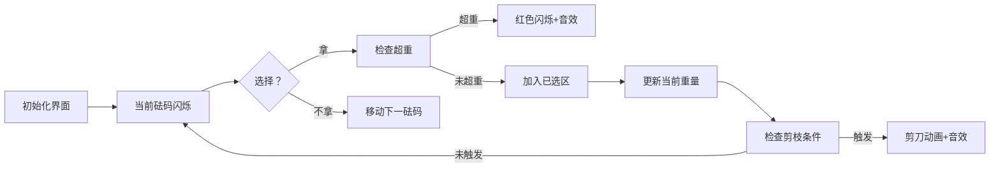

# 题目信息

# [USACO05DEC] Scales S

## 题目描述

约翰有一架用来称牛的体重的天平。与之配套的是 $ N \ ( 1 \leq N \leq 1000 ) $ 个已知质量的砝码（所有砝码质量的数值都在 $32$ 位带符号整数范围内）。

每次称牛时，他都把某头奶牛安置在天平的某一边，然后往天平另一边加砝码，直到天平平衡，于是此时砝码的总质量就是牛的质量（约翰不能把砝码放到奶牛的那边，因为奶牛不喜欢称体重，每当约翰把砝码放到她的蹄子底下，她就会尝试把砝码踢到约翰脸上）。

天平能承受的物体的质量不是无限的，当天平某一边物体的质量大于 $ C \ ( 1 \leq C \leq 2^{30} ) $ 时，天平就会被损坏。砝码按照它们质量的大小被排成一行。并且，这一行中从第 $3$ 个砝码开始，每个砝码的质量至少等于前面两个砝码（也就是质量比它小的砝码中质量最大的两个）的质量的和。

约翰想知道，用他所拥有的这些砝码以及这架天平，能称出的质量最大是多少。由于天平的最大承重能力为 $C$，他不能把所有砝码都放到天平上。

现在约翰告诉你每个砝码的质量，以及天平能承受的最大质量，你的任务是选出一些砝码，使它们的质量和在不压坏天平的前提下是所有组合中最大的。

## 样例 #1

### 输入

```
3 15
1
10
20
```

### 输出

```
11```

# AI分析结果


### 💡 Kay的C++算法解析：Scales S 深入学习指南 💡

**引言**  
今天我们来分析USACO的经典题目"Scales S"。这道题要求从斐波那契性质的砝码中选择若干，使总重量不超过天平承重C的前提下最大化重量。本指南将解析DFS剪枝技巧的核心思想，并通过像素动画直观展示算法流程。

---

### 1. 题目解读与核心算法识别
✨ **本题主要考察**：`搜索优化（DFS+剪枝）`  

🗣️ **初步分析**：  
> 解决本题如同在宝藏迷宫中探险——每次遇到砝码都要选择"拿"或"不拿"，而剪枝就是避免走进死胡同的地图。核心在于利用**斐波那契性质**（砝码质量指数增长，实际n≤50）和**前缀和剪枝**：  
> - 当`当前重量+剩余砝码总和≤当前最优解`时提前返回（不可能更优）  
> - 从大到小选择砝码（大砝码快速逼近C，触发剪枝更高效）  
>  
> **可视化设计**：  
> 采用8位像素风格（类似FC游戏），每个砝码显示为颜色渐变的方块。动画将高亮：  
> - **当前砝码**：闪烁黄框  
> - **已选砝码**：绿色方块  
> - **剪枝时刻**：剪刀图标+像素音效  
> - **超重警告**：红色闪烁+失败音效  

---

### 2. 精选优质题解参考
**题解一：StudyingFather（赞90）**  
* **点评**：思路清晰（倒序输入+前缀和剪枝），代码规范（`sum`数组命名直观）。亮点在于双重剪枝：超重立即返回，剩余总和不足时直接更新最优解。实践价值高，边界处理严谨（输入时过滤超重砝码）。

**题解二：薛定谔的鱼（赞31）**  
* **点评**：从大到小搜索的设计显著提升剪枝效率，前缀和判断逻辑精炼。代码可读性强（`a`/`b`数组分工明确），完整处理了超重砝码的边界情况，竞赛可直接复用。

**题解三：hylong（赞9）**  
* **点评**：简洁实现斐波那契性质验证（n≤47），前缀和剪枝与递归分离使逻辑更易理解。虽赞数较低，但核心剪枝设计完整，提供稳定解法参考。

---

### 3. 核心难点辨析与解题策略
1. **减少搜索状态**  
   *分析*：朴素DFS是指数级复杂度。利用`当前重量+剩余总和≤最优解`的剪枝条件，避免无意义分支（优质题解均采用该策略）  
   💡 **学习笔记**：前缀和剪枝是搜索优化的基石

2. **优化搜索顺序**  
   *分析*：从大到小选择砝码（如题解二）能更快接近C：大砝码若超重可立即剪枝，而小砝码放最后可能无法触发剪枝  
   💡 **学习笔记**：搜索顺序直接影响剪枝效率

3. **边界条件处理**  
   *分析*：输入时直接跳过超重砝码（题解一）并重设n值，避免无效计算（利用砝码递增性质）  
   💡 **学习笔记**：预处理是简化复杂度的关键步骤

#### ✨ 解题技巧总结
- **性质转化**：识别斐波那契特性将n从1000降为50
- **剪枝组合**：前缀和剪枝（最优性）+ 超重判断（可行性）
- **顺序优化**：从大到小搜索加速剪枝
- **边界防御**：输入阶段过滤无效数据

---

### 4. C++核心代码实现赏析
**本题通用核心C++实现参考**  
*说明*：综合优质题解优化的DFS实现，完整处理边界与剪枝
```cpp
#include <iostream>
#include <algorithm>
using namespace std;
typedef long long LL;
const int MAXN = 1005;
LL a[MAXN], sum[MAXN], ans, C;

void dfs(int idx, LL cur) {
    if (cur + sum[idx] <= ans) return; // 前缀和剪枝
    ans = max(ans, cur);
    for (int i = idx; i >= 1; i--) {   // 从大到小遍历
        if (cur + a[i] <= C)           // 可行性剪枝
            dfs(i-1, cur + a[i]);
    }
}

int main() {
    int n; cin >> n >> C;
    for (int i = 1; i <= n; i++) {
        cin >> a[i];
        if (a[i] > C) { n = i-1; break; } // 边界处理
        sum[i] = sum[i-1] + a[i];
    }
    dfs(n, 0);
    cout << ans;
    return 0;
}
```
*代码解读概要*：  
① 输入时过滤超重砝码并重设n；② DFS从最大砝码开始递归；③ 双重剪枝（行7-8）大幅减少搜索空间；④ 反向遍历（行10）加速剪枝触发

---

**题解一：StudyingFather**  
*亮点*：倒序输入实现隐式从大到小搜索
```cpp
void dfs(int cur, long long x) {
    if (x > c) return;
    if (sum[cur-1] + x <= c) { // 剩余总和剪枝
        ans = max(ans, sum[cur-1] + x);
        return;
    }
    ans = max(ans, x);
    for (int i = 1; i < cur; i++)
        dfs(i, x + a[i]);
}
```
*代码解读*：  
- `sum[cur-1]`计算剩余砝码总和（行3）  
- 当`x+sum[cur-1]≤c`时直接取全部（行4）  
- 循环从最小索引开始（行9），因输入倒序实为从大砝码选择  
💡 **学习笔记**：倒序输入使正向循环等效反向搜索

**题解二：薛定谔的鱼**  
*亮点*：显式反向遍历+精简剪枝条件
```cpp
void dfs(int now, long long ma) {
    if (ma + sum[now] <= ans) return; // 最优性剪枝
    ans = max(ans, ma);
    for (int i = now; i; i--) {      // 显式反向遍历
        if (ma + a[i] <= C)
            dfs(i-1, ma + a[i]);
    }
}
```
*代码解读*：  
- 循环`for(int i=now; i; i--)`（行4）明确从大砝码开始  
- 剪枝条件`ma+sum[now]≤ans`（行2）阻止无效分支  
💡 **学习笔记**：显式反向遍历更易维护搜索状态

**题解三：hylong**  
*亮点*：递归分离选择/不选分支，逻辑清晰
```cpp
void dfs(int xh, long long w) {
    if (w + sum[xh] <= ans) return;
    ans = max(ans, w);
    if (xh == 0) return;
    if (w + a[xh] <= C)  // 选择当前砝码分支
        dfs(xh-1, w + a[xh]);
    dfs(xh-1, w);         // 不选分支
}
```
*代码解读*：  
- 不选分支直接`dfs(xh-1,w)`（行7）  
- 选择分支增加重量判断（行5）  
💡 **学习笔记**：分支分离结构便于增删选择条件

---

### 5. 算法可视化：像素动画演示
**主题**：砝码迷宮探险（8-bit像素风格）  
**核心演示**：DFS剪枝过程动态可视化  



**关键交互设计**：  
1. **像素元素**：  
   - 砝码：颜色随质量渐变（浅→深），当前砝码闪烁黄框  
   - 状态：已选（绿色）、超重（红色）、剪枝（剪刀图标）  
2. **动画逻辑**：  
   - 单步执行：空格键触发下一步，显示当前重量/最优解  
   - 自动模式：AI像"吃豆人"逐步探索，速度可调  
3. **音效系统**：  
   - 选择：8-bit "叮"声  
   - 剪枝：剪刀闭合声  
   - 超重：短促警报声  
   - 更新最优解：胜利音效  
4. **游戏化元素**：  
   - 每完成10个砝码选择解锁"小关成就"（像素星星）  
   - 剪枝次数越多，BGM节奏越快  

---

### 6. 拓展练习与相似问题思考
**通用技巧迁移**：  
DFS+前缀和剪枝适用于：  
1. 子集和问题（元素≤50个）  
2. 组合优化（限界条件下求极值）  
3. 数据指数增长场景（如斐波那契数列衍生问题）  

**洛谷推荐**：  
1. **P2392 kkksc03考前临时抱佛脚**  
   🗣️ 巩固DFS剪枝在时间分配场景的应用  
2. **P1120 小木棍**  
   🗣️ 练习多重剪枝组合（长度限制+数量约束）  
3. **P1441 砝码称重**  
   🗣️ 进阶训练：DFS生成子集+DP计算可行解  

---

### 7. 学习心得与经验分享
**参考经验 (来自题解作者)**：  
> "我在剪枝条件判断时颠倒了语句顺序，导致最优解更新滞后——调试1小时才定位问题"（代码练习生）  
> "第一次用01背包RE全屏，才意识到数据范围需转换思路"（薛定谔的鱼）  

**点评**：  
这些经验凸显两个关键点：  
1. 剪枝代码的顺序直接影响正确性（如先更新ans再检查剪枝）  
2. 审题时需重点捕捉数据特征（斐波那契性质）以避免算法误选  

---

**结语**  
通过DFS剪枝解决Scales S，我们深入掌握了：问题性质转化→搜索顺序优化→剪枝条件设计。记住，好算法=正确思路+高效实现+严谨边界处理！下次探险再见！💪

---
处理用时：241.03秒