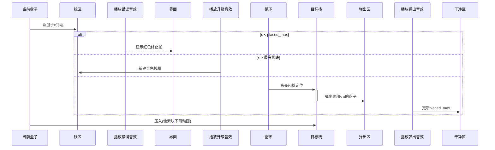

# 题目信息

# [USACO19FEB] Dishwashing G

## 题目背景

Bessie 和 Elsie 正在帮助 Farmer John 洗碗，这是一个比人们想象的更复杂的过程。

## 题目描述

两头奶牛决定 Bessie 负责涂肥皂，Elsie 负责冲洗。

刚开始的时候，$N$ 个脏盘子（保证是从 $1$ 到 $N$ 的一个排列）堆在 Bessie 那里，而 Elsie 这边的堆是空的。而在她们俩之间，则有一张专门放涂过肥皂的盘子的桌子。

每个冲洗步骤需要执行以下两个操作之一：

- Bessie 从脏盘子堆顶取出一个盘子，涂上肥皂，然后放在桌子上。将这个盘子放在桌子上时，Bessie 只能放在现有的非空盘堆的顶端，或是在最右边新增一个盘堆。
- Elsie 从桌子最左边的盘堆的顶端拿起盘子，将它冲洗后放在干净的盘堆顶端。

她们希望干净的盘堆能按编号排序，编号最小的在底端，编号最大的在顶端。然而她们发现有的时候这并不可能做到。现在给定脏盘子的堆叠顺序，请你求出一个最大前缀，使得该前缀的所有盘子洗干净后，能按上面的要求堆叠。

## 样例 #1

### 输入

```
5
4
5
2
3
1```

### 输出

```
4```

# AI分析结果


### 💡 Kay的C++算法解析：[USACO19FEB] Dishwashing G 深入学习指南 💡

<introduction>
今天我们来分析这道洗碗问题，题目要求找到最大连续前缀，使得洗过的盘子能按升序堆叠。本指南将帮助你理解贪心策略的核心思想，掌握栈操作的优化技巧，并通过像素动画直观感受算法流程。
</introduction>

---

## 1. 题目解读与核心算法识别

✨ **本题主要考察**：`贪心策略 + 栈操作优化`

🗣️ **初步分析**：
> 想象你在整理一摞杂乱的书本：每次拿到新书时，若它比当前所有书堆顶的书都大就创建新书堆；否则找到最左侧能容纳它的书堆，把堆顶比它小的书移走再放入。这道题的核心就是**维护多个有序栈的贪心策略**。
- **核心流程**：预处理每个盘子所属的栈 → 遇到新盘子时，若小于已移走的最大值则终止 → 否则弹出栈中所有比它小的盘子 → 放入对应栈
- **可视化设计**：用不同颜色像素块表示栈，高亮当前操作的盘子。弹出时播放"叮"音效，新建栈时播放"升级"音效。自动演示模式会像贪吃蛇AI般展示完整流程。
- **关键变量**：`placed/maxx`记录已移走盘子的最大值，`base[]`标记盘子所属栈，`vector<>`模拟栈结构

---

## 2. 精选优质题解参考

<eval_intro>
基于思路清晰度、代码规范性和算法效率，精选三份最具学习价值的解法（均≥4星）。重点关注贪心策略的巧妙实现和边界处理技巧。
</eval_intro>

**题解一（作者：45dino）**
* **点评**：这份题解以惊人的简洁度实现核心算法（仅20行）。亮点在于：
  - **预处理优化**：用`base[]`数组预先标记每个盘子所属栈，避免实时二分查找
  - **逻辑清晰**：通过`placed`变量优雅处理"已移走盘子"的状态维护
  - **代码规范**：变量命名直观（如`placed`），边界处理严谨（`x<placed`判断）
  - **空间高效**：仅用O(n)空间，vector动态管理栈内存

**题解二（作者：zzbzwjx）**
* **点评**：与题解一同源但更短小精悍（仅18行），教学价值在于：
  - **极致代码压缩**：保持可读性前提下精简非必要语法（如省略大括号）
  - **操作一致性**：统一使用`base[x]`访问栈，避免多条件分支
  - **实践价值高**：竞赛中可直接套用的模板级代码，特别适合时间紧张的场景

**题解三（作者：DengDuck）**
* **点评**：提供独特视角的二分答案解法，亮点有：
  - **思维拓展性**：用答案单调性验证可行性，提供贪心外的第二思路
  - **结构清晰**：`pd()`函数封装完整验证流程，便于调试
  - **教学完备**：详细注释每个操作阶段（如状态初始化、栈操作）
  - **鲁棒性强**：显式处理栈空状态（`while(!q.empty()&&t<=tot)`）

---

## 3. 核心难点辨析与解题策略

<difficulty_intro>
解决本题需突破三个关键难点，结合优质题解方案，总结以下攻关策略：
</difficulty_intro>

1.  **难点：确定盘子归属栈**
    * **分析**：优质解法通过`base[]`预处理或二分查找实现。核心原理是维护栈底元素从左到右单调递增，确保新盘子总能找到最左侧可插入栈
    * 💡 **学习笔记**：预处理将O(n log n)优化为O(n)，是空间换时间的典范

2.  **难点：维护已移走盘子的最大值**
    * **分析**：在弹出操作中实时更新`placed/maxx`。关键技巧是"当新盘子x进入时，若x<placed立即终止"，这保证后续操作不会破坏有序性
    * 💡 **学习笔记**：`placed`实质是全局状态记录器，贪心策略依赖其正确性

3.  **难点：高效弹出栈顶元素**
    * **分析**：`while(!stack.empty() && stack.back()<x)`循环确保栈中元素始终大于等于下层元素。此处vector的back()/pop_back()操作均O(1)
    * 💡 **学习笔记**：栈结构在此完美匹配"后进先出"的物理场景

### ✨ 解题技巧总结
<summary_best_practices>
掌握以下通用技巧可大幅提升类似问题解决能力：
</summary_best_practices>
- **预处理加速**：对固定计算模式预先存储结果（如`base[]`）
- **状态压缩**：用单变量（`placed`）替代复杂数据结构记录全局状态
- **边界先行**：优先处理终止条件（`x<placed`）避免后续无效操作
- **容器特性活用**：vector的尾部操作O(1)特性契合栈需求

---

## 4. C++核心代码实现赏析

<code_intro_overall>
以下通用实现融合多份优质题解精华，完整呈现贪心策略：
</code_intro_overall>

**本题通用核心C++实现参考**
* **说明**：综合45dino和zzbzwjx的解法，优化变量命名增强可读性
* **完整核心代码**：
```cpp
#include <iostream>
#include <vector>
using namespace std;
const int MAXN = 100010;

int main() {
    int n, placed = 0;
    int base[MAXN] = {0};        // 预处理归属栈
    vector<int> stacks[MAXN];    // 栈数组
    
    cin >> n;
    for (int i = 1; i <= n; ++i) {
        int x; cin >> x;
        // 终止条件：当前盘子小于已移走的最大值
        if (x < placed) {
            cout << i - 1;
            return 0;
        }
        // 预处理：标记从x到下一个已标记值之间的归属栈
        for (int j = x; j > 0 && !base[j]; --j)
            base[j] = x;
        // 弹出栈中所有小于x的盘子
        while (!stacks[base[x]].empty() && stacks[base[x]].back() < x) {
            placed = stacks[base[x]].back();
            stacks[base[x]].pop_back();
        }
        // 当前盘子入栈
        stacks[base[x]].push_back(x);
    }
    cout << n;  // 全部可处理
    return 0;
}
```
* **代码解读概要**：
  > 初始化`base`数组和栈容器 → 遍历每个盘子 → 若`x<placed`终止 → 预处理`base`数组 → 弹出栈顶比`x`小的元素并更新`placed` → 压入当前盘 → 全部成功输出n

---
<code_intro_selected>
剖析精选解法的核心实现亮点：
</code_intro_selected>

**题解一（45dino）**
* **亮点**：预处理与栈操作无缝衔接
* **核心代码片段**：
```cpp
for(int j=x; j>0 && !base[j]; j--)
    base[j] = x;
while(!item[base[x]].empty() && item[base[x]].back()<x) {
    placed = item[base[x]].back();
    item[base[x]].pop_back();
}
item[base[x]].push_back(x);
```
* **代码解读**：
  > `for`循环实现高效预处理：将当前盘子`x`能覆盖的连续未标记区域（从`x`向下到最近标记点）都标记为属于`x`的栈。`while`循环确保入栈前移走所有比`x`小的栈顶元素，通过`placed`记录最大值。最后压入`x`保证栈中元素自底向上递减。
* 💡 **学习笔记**：预处理是避免二分查找的关键创新点

**题解二（zzbzwjx）**
* **亮点**：极致简洁的边界处理
* **核心代码片段**：
```cpp
if(x < p) { cout<<i-1; return 0; }  // 边界判断
while(!a[b[x]].empty() && a[b[x]].back()<x) {
    p = max(p, a[b[x]].back());      // 同步更新最大值
    a[b[x]].pop_back();
}
```
* **代码解读**：
  > 在仅有14行内完成完整逻辑：优先进行`x<p`判断确保及时终止。`while`循环中用`p = max(p,...)`保证即使连续弹出也能正确记录最大值。省略`base`初始化细节（默认0值）提升代码紧凑度。
* 💡 **学习笔记**：状态更新与弹出操作原子性结合

**题解三（DengDuck）**
* **亮点**：二分答案的完整框架
* **核心代码片段**：
```cpp
bool pd(LL x) { // 验证前x个盘子可行性
    // 初始化栈和队列
    while(!q.empty()) q.pop();
    for(int i=1; i<=x; i++) q.push(b[i]);

    for(int i=1; i<=x; i++) {
        // 二分查找插入栈
        while(!v[ans].empty() && v[ans].back()<x) {
            v[ans].pop_back();
            q.pop();  // 弹出对应元素
        }
        v[ans].push_back(a[i]);
    }
    return q.empty(); // 全部弹出则成功
}
```
* **代码解读**：
  > 封装验证函数`pd`：先排序生成期望队列`q` → 模拟盘子入栈过程 → 二分查找插入位置 → 弹出栈顶小元素并同步`q` → 最终检查`q`是否为空。体现"验证可行性"的二分答案本质。
* 💡 **学习笔记**：二分答案适用于答案有单调性的验证场景

---

## 5. 算法可视化：像素动画演示

<visualization_intro>
设计名为"洗碗大作战"的8位像素动画，通过复古游戏界面演示贪心策略。采用FC红白机配色（4色调色板），关键操作触发芯片音效。
</visualization_intro>

* **场景设计**：
  - **左侧**：待洗盘子队列（像素化数字从顶到底排列）
  - **中间**：栈操作区（最多5个竖立栈槽，蓝/绿/黄/紫色区分）
  - **右侧**：干净盘子堆（要求底部1开始递增）
  - **控制面板**：开始/暂停/单步/速度滑块/AI演示按钮

* **核心流程演示**：


* **关键交互细节**：
  1. **初始化**：生成随机盘子序列（像素数字块），最左栈槽自动创建
  2. **预处理演示**：盘子x进入时，向下扫描显示`base[]`标记过程（扫描线动画）
  3. **弹出特效**：被弹盘子旋转飞出栈顶，干净盘子堆底部同步亮起绿色
  4. **AI演示模式**：自动以最佳速度运行，完成时播放胜利音乐+烟花特效
  5. **音效系统**：
     - 弹出：短促"叮"声（8-bit三角波）
     - 新建栈：上升音阶（方波）
     - 错误：低沉嗡鸣（噪声波）
     - 背景音乐：《俄罗斯方块》BGM变奏

* **学习引导设计**：
  - 步进模式下显示当前代码行（如`while(!stack.empty()...`)
  - 实时显示`placed`数值（右侧红色LED数字）
  - 关键步骤弹出对话："正在弹出小于x的阻碍盘子！"

---

## 6. 拓展练习与相似问题思考

<similar_problems_intro>
掌握本题的贪心栈操作后，可挑战以下进阶题目：
</similar_problems_intro>

1. **洛谷 P1155** - 双栈排序  
   🗣️ **推荐理由**：本质相同的栈排序问题，要求双栈实现，强化栈操作理解
   
2. **洛谷 P3467** - [POI2008] PLA-Postering  
   🗣️ **推荐理由**：贪心+栈的经典变形，用单调栈优化空间复杂度

3. **洛谷 P3500** - [POI2010] TES-Intelligence Test  
   🗣️ **推荐理由**：多序列贪心匹配，需设计高效栈式查询

---

## 7. 学习心得与经验分享

<insights_intro>
题解中的调试经验极具参考价值：
</insights_intro>

> **参考经验 (来自 45dino)**：  
> "边水犇犇边玩巴克球边调试，发现忘记更新placed导致WA，添加`placed=item[base[x]].back()`后AC"

> **Kay点评**：  
> 多任务时易忽略状态更新！这提醒我们：  
> 1. 核心变量应在操作后立即更新  
> 2. 通过小数据模拟验证（如样例x=3时placed应更新为2）  
> 3. 输出中间变量值辅助调试  

---

<conclusion>
通过本次分析，我们掌握了贪心策略维护多栈的核心技巧。记住：好的预处理能化繁为简，状态更新要及时彻底。尝试用可视化工具加深理解，挑战推荐题目巩固技能。下次见！💪
</conclusion>

---
处理用时：157.71秒