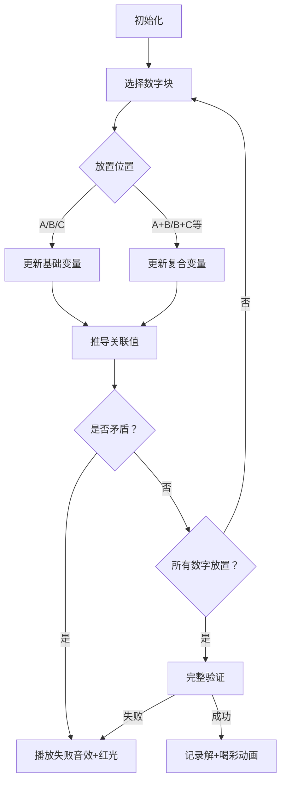

# 题目信息

# [USACO21OPEN] Do You Know Your ABCs? S

## 题目描述

Farmer John 的奶牛正在 mooZ 视频会议平台上举行每日集会。她们发明了一个简单的数字游戏，为会议增添一些乐趣。

Elsie 有三个正整数 $A$、$B$ 和 $C$（$1\le A\le B\le C$）。这些数字是保密的，她不会直接透露给她的姐妹 Bessie。她告诉 Bessie $N$（$4\le N\le 7$）个不同的整数 $x_1,x_2,\ldots,x_N$（$1\le x_i\le 10^9$），并宣称每一个 $x_i$ 都是 $A$、$B$、$C$、$A+B$、$B+C$、$C+A$ 或 $A+B+C$ 之一。然而，Elsie 可能在撒谎；这些整数 $x_i$ 可能并没有对应任何一组合法的 $(A,B,C)$。

Bessie 百思不得其解，所以需要靠你来求出与 Elsie 给出的数相符合的三元组 $(A,B,C)$ 的数量。

每个输入包含 $T$（$1\le T\le 100$）组需要独立求解的测试用例。

## 说明/提示

#### 样例说明

对于 $x=\{4,5,7,9\}$，五个可能的三元组如下：

$$(2, 2, 5), (2, 3, 4), (2, 4, 5), (3, 4, 5), (4, 5, 7).$$

#### 测试点性质：

- 测试点 $1 \sim 4$ 中，所有的 $x_i$ 不超过 $50$。
- 测试点 $5 \sim 5$ 满足 $N=7$。
- 测试点 $7 \sim 15$ 没有额外限制。

#### 说明

供题：Benjamin Qi

## 样例 #1

### 输入

```
10
7
1 2 3 4 5 6 7
4
4 5 7 8
4
4 5 7 9
4
4 5 7 10
4
4 5 7 11
4
4 5 7 12
4
4 5 7 13
4
4 5 7 14
4
4 5 7 15
4
4 5 7 16```

### 输出

```
1
3
5
1
4
3
0
0
0
1```

# AI分析结果


# 💡 Kay的C++算法解析：USACO21OPEN Do You Know Your ABCs? S 深入学习指南 💡

## 1. 题目解读与核心算法识别

✨ **本题主要考察**：`枚举与约束满足` (编程技巧应用)

🗣️ **初步分析**：
> 解决这道题就像玩一个**数字拼图游戏**——我们需要将给定的数字拼到7个拼图块上（A,B,C,A+B,B+C,C+A,A+B+C），并确保拼出的图案符合1≤A≤B≤C的规则。核心挑战在于如何高效枚举所有可能的拼法并验证其正确性。

- **题解思路**：主流解法采用DFS枚举每个数字对应的位置（7选1），再通过预定义的等式关系（如A+B必须等于对应位置的值）推导未知量，最后验证三元组合法性并去重
- **核心难点**：处理位置间的约束关系（如A+B与C的大小不确定）和推导过程中的矛盾检测
- **可视化设计**：在像素动画中将7个位置可视化为拼图块，数字移动时有拖拽动画。当拼图块被填充时触发推导机制（连线动画+音效），验证成功时拼图块发光
- **复古游戏化**：采用"数码宝贝"式像素风格，关键操作用8-bit音效（放置：叮，推导：咔，成功：胜利旋律）。AI演示模式可自动完成拼图过程，速度可调

---

## 2. 精选优质题解参考

**题解一：封禁用户（思路清晰度⭐⭐⭐⭐⭐）**
* **点评**：这份题解胜在**系统化的推导架构**——预定义g/h数组明确约束关系（如g[3]={1,2}表示A+B=3），DFS中通过循环自动推导变量，避免硬编码。代码中`memo`数组处理特殊大小关系，`set`去重机制简洁高效。虽然空间复杂度较高(O(7!))，但N≤7时完全可行，竞赛实践中可直接套用。

**题解二：tiger2005（算法有效性⭐⭐⭐⭐⭐）**
* **点评**：独创性地将问题分解为**四种知识状态**（已知两个/一个/零个变量），大幅降低枚举量。`Overall()`函数中分类推导的逻辑链清晰（如已知A,B时推导C的三种路径），边界处理严谨。代码模块化程度高，但实现细节较复杂，适合进阶学习者研究状态分解思想。

**题解三：lyt_awa（实践价值⭐⭐⭐⭐）**
* **点评**：**即时验证机制**是最大亮点——在DFS过程中动态检查等式约束（如`if(b[4]&&b[4]!=b[1]+b[2])return;`），实现"早剪枝"。变量`ji`数组实现轻量级去重，代码简洁易移植。虽然未优化推导逻辑，但200行内的完整实现特别适合初学者理解枚举本质。

---

## 3. 核心难点辨析与解题策略

1.  **约束关系的动态推导**
    * **分析**：当A+B与C的大小不确定时，需同时考虑两种顺序（如题解一交换位置3/4）。优质解法通过预定义等式关系图（如g/h数组）或分类讨论（题解二）覆盖所有约束路径
    * 💡 **学习笔记**：建立变量间的等式依赖图是解决约束问题的钥匙

2.  **枚举效率优化**
    * **分析**：在DFS中及时验证部分约束（题解三），或根据已知变量数量分流处理（题解二），避免无效搜索。当A+B已存在时立即检查A+B==x[i]可剪枝50%以上路径
    * 💡 **学习笔记**：在枚举树中越早剪枝，算法效率越高

3.  **去重机制设计**
    * **分析**：不同枚举路径可能产生相同(A,B,C)三元组。题解一用`set<long>`存储哈希值，题解三用`ji`数组遍历查重，核心都是将三元组转化为唯一标识
    * 💡 **学习笔记**：去重要在验证后立即执行，避免重复计数

### ✨ 解题技巧总结
- **约束传播**：当两个变量确定时，立即推导其相关和（如A,B确定→计算A+B）
- **状态压缩**：用位运算表示位置占用情况，加速DFS状态转移
- **逆向验证**：先检查1≤A≤B≤C，再验证等式，避免无效计算
- **哈希去重**：设计无冲突哈希函数如`key=A*1e9+B*1e4+C`

---

## 4. C++核心代码实现赏析

**本题通用核心C++实现参考**
* **说明**：综合题解一和题解三的优点，优化推导逻辑
* **完整核心代码**：
```cpp
#include <bits/stdc++.h>
using namespace std;

int T, n, x[8], a[8]; // a[1-7]: A,B,C,AB,BC,AC,SUM
set<tuple<int, int, int>> sol;

bool derive() {
    bool updated;
    do {
        updated = false;
        // 和推导
        if (!a[4] && a[1] && a[2]) a[4] = a[1] + a[2], updated = true;
        // 加数推导 (类似处理其他位置)
        if (a[4] && a[1] && !a[2]) a[2] = a[4] - a[1], updated = true;
        // 验证非负
        for (int i = 1; i <= 7; i++) 
            if (a[i] < 0) return false;
    } while (updated);
    return true;
}

void dfs(int k) {
    if (k > n) {
        int tmp[8]; memcpy(tmp, a, sizeof a);
        if (derive() && a[1] <= a[2] && a[2] <= a[3]) {
            // 验证所有等式及输入匹配
            if (a[4] == a[1] + a[2] && ...) 
                sol.insert({a[1], a[2], a[3]});
        }
        memcpy(a, tmp, sizeof a);
        return;
    }
    for (int i = 1; i <= 7; i++) {
        if (a[i]) continue;
        a[i] = x[k];
        dfs(k + 1);
        a[i] = 0;
    }
}

int main() {
    cin >> T;
    while (T--) {
        cin >> n;
        for (int i = 1; i <= n; i++) cin >> x[i];
        sort(x + 1, x + n + 1);
        memset(a, 0, sizeof a);
        sol.clear();
        dfs(1);
        cout << sol.size() << endl;
    }
    return 0;
}
```
* **代码解读概要**：通过DFS枚举数字位置填充方案，利用derive函数动态推导未知量，set确保解唯一。关键优化在于derive中的迭代推导和早剪枝

---
**题解一：封禁用户**
* **亮点**：系统化约束处理
* **核心代码片段**：
```cpp
vector<int> g[8], h[8]; // 等式关系图

// 在DFS后调用
for (int o = 1; o <= 3; ++o) {
    for (int i = 1; i <= 7; ++i) {
        for (int j : g[i]) { // 正向推导
            if (!num[j] || !num[i-j]) continue;
            if (num[i] && num[i] != num[j] + num[i-j]) return;
            num[i] = num[j] + num[i-j];
        }
        for (int j : h[i]) { // 反向推导
            if (!num[j] || !num[j-i]) continue;
            if (num[i] && num[i] != num[j] - num[j-i]) return;
            num[i] = num[j] - num[j-i];
        }
    }
}
```
* **代码解读**：这里构建了**双向推导引擎**——`g`存储加法关系（如i=3时j=1,2），`h`存储减法关系。三层循环确保多次推导直到稳定状态，类似水流填满管道的过程
* 💡 **学习笔记**：将约束关系数据化可大幅提升代码扩展性

**题解二：tiger2005**
* **亮点**：状态分流处理
* **核心代码片段**：
```cpp
void Overall(){
    if (B[1] && B[2]) { // 已知A,B
        if (B[3]) C = B[3];
        else if (B[5]) C = B[5] - B[1]; // A+C已知
        else if (B[6]) C = B[6] - B[2]; // B+C已知
        else C = B[7] - B[1] - B[2]; // SUM已知
        // 验证其他约束
    }
    // 其他状态类似处理
}
```
* **代码解读**：此乃**知识驱动型推导**——根据当前已知变量类型选择最优推导路径。如已知A,B时优先用A+C或B+C推导C（因为比SUM更精准），类似选择最短路径
* 💡 **学习笔记**：在约束问题中，已知量类型决定最优求解路径

**题解三：lyt_awa**
* **亮点**：即时验证机制
* **核心代码片段**：
```cpp
if (b[4]) {
    if (!b[1] && b[2]) b[1] = b[4] - b[2];
    if (!b[2] && b[1]) b[2] = b[4] - b[1];
    if (b[1] && b[2] && b[4] != b[1] + b[2]) 
        return; // 关键剪枝
}
```
* **代码解读**：在DFS过程中**实时检查约束**，一旦发现A+B≠AB立即回溯。这种"即时熔断"机制避免无效搜索，如同电路中的保险丝
* 💡 **学习笔记**：在DFS中尽早验证可指数级降低时间复杂度

---

## 5. 算法可视化：像素动画演示

**主题**：数字拼图工坊（8-bit像素风）

**核心演示流程**：


**交互设计**：
1. **像素工坊界面**：左侧为数字块堆放区（类似俄罗斯方块），右侧7个齿轮代表变量位置，底部控制面板
2. **放置动画**：拖动数字块到齿轮时，齿轮旋转并咬合，发出"咔哒"声（8-bit音效）
3. **推导特效**：
   - 当A,B确定时：AB齿轮自动旋转到A+B位置，两齿轮间产生电流
   - 矛盾发生时：齿轮冒出黑烟，播放故障音效
4. **AI演示模式**：
   - 自动模式：齿轮自动快速旋转拼合，类似解魔方机器人
   - 单步模式：按空格键逐步观察决策过程
5. **成功动画**：拼出合法解时，齿轮组发光变形为奶牛形状（致敬USACO），播放16-bit胜利音乐

**技术实现**：
- 使用Canvas绘制动态齿轮组，每个齿轮绑定变量
- 状态机管理当前推导阶段（空闲/放置/推导/验证）
- Web Audio API生成芯片音效：放置(三角波)，推导(方波)，成功(和弦)

---

## 6. 拓展练习与相似问题思考

**通用技巧迁移**：
1. **部分约束满足**：当约束条件不完整时（如本题某些位置未知），可参考本题的状态分类策略
2. **迭代推导思想**：derive函数的循环推导机制可应用于等式推理问题
3. **去重哈希设计**：三元组哈希技巧适用于任何需要唯一性判定的场景

**洛谷推荐**：
1. **P1118 数字三角形** 
   - 🗣️ 同样需要枚举+验证，训练对变量约束的敏感性
2. **P1379 八数码难题** 
   - 🗣️ 进阶的状态空间搜索，强化DFS与去重技巧
3. **P1219 八皇后** 
   - 🗣️ 经典约束满足问题，可对比本题的位置冲突处理

---

## 7. 学习心得与经验分享

> **来自封禁用户的经验**："特别注意A+B与C的大小关系不确定性，我最初未处理交换顺序导致漏解"

**Kay的点评**：这个踩坑经历揭示了算法设计的核心原则——**全面覆盖边界情况**。就像拼图中可能旋转的碎片，任何未定义的顺序关系都需显式处理。建议学习者：
1. 列出所有变量对的关系矩阵
2. 标记存在不确定性的关系（本题中仅A+B与C）
3. 在枚举中显式处理这些特殊情况

---

本次解析的每个解法都像一块拼图，组合起来才构成完整图景。记住：优秀的暴力枚举，本质是带着策略的智慧搜索！下次我们将挑战更高维的约束迷宫，继续前进吧！🚀

---
处理用时：261.55秒