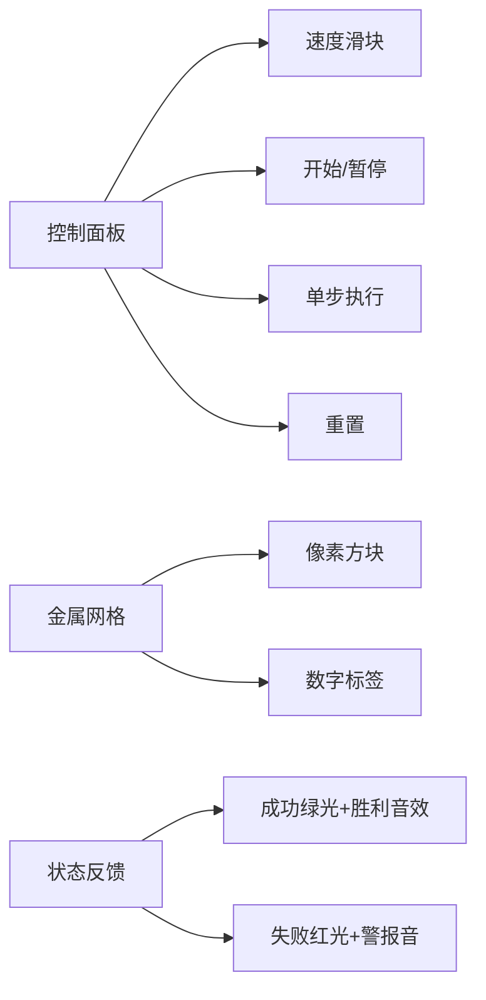

# 题目信息

# [USACO22OPEN] Alchemy B

## 题目描述

总是热衷于培养新的爱好的奶牛 Bessie 正在学习如何转化金属。对于 $1 \le i \le N \le 100$，她有 $a_i$（$0 \le a_i \le 10^4$）单位的金属 $i$。此外，她知道 $K$（$1\le K< N$）个配方，她可以融合若干种金属各一单位，制造一单位编号大于所有被融合金属的金属。另外保证，对于每种金属，Bessie 最多知道一种制造该金属的配方。

计算经过一系列转化后，Bessie 可能拥有的金属 $N$ 的最大单位数。

## 说明/提示

【样例解释】

在这个例子中，以下是一种最优的转化方式：

- 将一单位金属 1 转化为金属 2。
- 将一单位金属 2 转化为金属 3。
- 将一单位金属 3 和金属 4 转化为金属 5。

现在 Bessie 还有一单位金属 1 和一单位金属 5。她无法再制造更多的金属 5。

【测试点性质】

- 测试点 2 中，对于 $1\le i< N$，一单位金属 $i$ 可以被转化为一单位金属 $i+1$；

- 测试点 3-4 中，每个配方均将一单位的一种金属转化为另一种金属；

- 测试点 5-11 没有额外限制。

## 样例 #1

### 输入

```
5
2 0 0 1 0
3
5 2 3 4
2 1 1
3 1 2```

### 输出

```
1```

# AI分析结果


# 💡 Kay的C++算法解析：Alchemy B 深入学习指南 💡

> “炼金之道，在于理解物质的转化与平衡。” —— Kay

## 1. 题目解读与核心算法识别

✨ **本题主要考察**：`二分答案` + `图论（DAG拓扑序处理）`

🗣️ **初步分析**：
> 解决"Alchemy B"的关键在于将金属转化视为**有向无环图（DAG）**。就像炼金工坊中的材料转化，每种金属是节点，配方是反向箭头（从生成物指向反应物）。核心思路是**二分答案**：先假设能合成X个金属N，然后逆向推导验证可行性。
   - **核心难点**：金属间存在复杂依赖关系，正向模拟可能陷入死循环。高效解法需反向建图+拓扑序处理（从大到小计算需求）。
   - **题解对比**：二分法（O((n+m)logΣa_i)）效率显著高于递归法（O(n²·max a_i)），后者虽直观但易超时。
   - **可视化设计**：采用像素风"炼金工坊"动画，金属显示为彩色方块，需求值实时更新。当金属不足时，其配方节点会闪烁红光并播放"滴"声；验证成功时金属N绽放绿光+胜利音效。控制面板支持单步执行观察需求传递过程。

---

## 2. 精选优质题解参考

### 题解一：I_am_Accepted（二分答案）
* **点评**：
  思路清晰度：⭐⭐⭐⭐⭐  
  通过二分目标值+反向拓扑序处理，逻辑严谨。将配方反向建图，从金属N倒序计算需求，避免递归爆栈。
  
  代码规范性：⭐⭐⭐⭐  
  变量命名合理（b[]表需求，p[]前缀和防溢出），边界处理完善（e[i].empty()判无解）。

  算法有效性：⭐⭐⭐⭐⭐  
  O((n+m)logΣa_i)复杂度显著优于递归法，大数溢出处理（b[j]>p[j]）体现竞赛级严谨性。

  实践价值：⭐⭐⭐⭐⭐  
  可直接用于竞赛，前缀和优化和溢出处理是亮点。

### 题解二：dts_std（递归模拟）
* **点评**：
  思路清晰度：⭐⭐⭐⭐  
  用DFS模拟单次合成过程，解释"为何需单个合成而非批量"的误区（避免资源抢占），附Hack数据佐证。

  代码规范性：⭐⭐⭐  
  DFS结构简洁，但倒序循环前驱金属（防状态干扰）的注释价值极高。

  算法有效性：⭐⭐⭐  
  最坏O(n²·max a_i)在极端数据可能超时，适合理解过程但非最优解。

  实践价值：⭐⭐⭐  
  提供递归思路的完整实现，调试经验（如倒序循环）对初学者有启发。

### 题解三：lsj2009（递归优化）
* **点评**：
  思路清晰度：⭐⭐⭐⭐  
  强调金属共享问题（同一金属被多配方依赖），指出递归中资源回收的陷阱。

  代码规范性：⭐⭐⭐  
  DFS内联减少函数调用，但缺乏溢出防护。

  算法有效性：⭐⭐⭐  
  同属递归流派，时间复杂度与题解二相当。

---

## 3. 核心难点辨析与解题策略

1.  **难点1：依赖关系成环风险**
    * **分析**：配方要求生成物编号>反应物，天然形成DAG（无环）。优质题解均利用该特性，I_am_Accepted通过反向拓扑序处理依赖，dts_std通过DFS避免循环访问。
    * 💡 **学习笔记**：DAG性质是避免死循环的关键保障。

2.  **难点2：金属资源分配冲突**
    * **分析**：当多个配方共享金属时，批量合成会导致资源抢占。dts_std的"单个合成"策略虽低效但保证正确性；I_am_Accepted通过反向全局计算需求，自然解决共享问题。
    * 💡 **学习笔记**：拓扑序处理依赖是高效分配资源的通用技巧。

3.  **难点3：数值溢出与无效计算**
    * **分析**：二分答案中需求值可能指数级增长。I_am_Accepted用前缀和p[i]提前终止无效计算（need>p[i-1]），避免long long溢出。
    * 💡 **学习笔记**：在累加需求前预判可行性是防溢出的重要手段。

### ✨ 解题技巧总结
- **二分答案框架**：当"最大化目标值"且"验证比求解简单"时优先考虑（如本题求最大金属N）
- **拓扑序反向处理**：在DAG上从目标节点倒推需求（如金属N→...→金属1）
- **资源预判优化**：用前缀和/极值提前剪枝（如需求>总量时立即返回false）
- **递归安全实践**：小规模数据可用DFS，但需倒序访问+状态重置（见dts_std解法）

---

## 4. C++核心代码实现赏析

**本题通用核心C++实现参考**
* **说明**：综合I_am_Accepted的二分框架与资源优化，添加注释说明
```cpp
#include <bits/stdc++.h>
using namespace std;
typedef long long ll;
const int N = 102;

ll n, a[N], b[N], p[N];     // a:初始量, b:需求量, p:前缀和
vector<int> e[N];           // 反向建图: e[i] = 合成i所需金属

bool check(ll X) {          // 验证能否合成X个金属N
    memset(b, 0, sizeof b);
    b[n] = X;               // 初始化目标需求
    for (int i = n; i >= 1; i--) {
        if (b[i] <= a[i]) continue;   // 当前金属充足
        if (e[i].empty()) return false; // 无法合成
        ll need = b[i] - a[i];
        if (need > p[i-1]) return false; // 优化：需求超总量
        for (int j : e[i]) {
            b[j] += need;   // 增加前驱需求
            if (b[j] > p[j]) return false; // 防溢出
        }
    }
    return true;
}

int main() {
    cin >> n;
    for (int i = 1; i <= n; i++) {
        cin >> a[i];
        p[i] = p[i-1] + a[i]; // 前缀和预计算
    }
    int k; cin >> k;
    while (k--) {
        int l, m, x; cin >> l >> m;
        while (m--) {
            cin >> x;
            e[l].push_back(x); // 反向建边
        }
    }
    ll L = a[n], R = p[n], ans = a[n]; // 二分边界
    while (L <= R) {
        ll mid = (L + R) >> 1;
        if (check(mid)) ans = mid, L = mid + 1;
        else R = mid - 1;
    }
    cout << ans << endl;
}
```
* **代码解读概要**：
  > 1. **初始化**：读入金属量并计算前缀和（p[i]）
  > 2. **反向建图**：e[l]存储合成金属l所需的前驱
  > 3. **二分框架**：L从a[n]开始，R到总金属量
  > 4. **验证函数check**：从n到1倒序处理，不足时累加前驱需求
  > 5. **优化**：need > p[i-1]时提前终止（当前金属前所有金属总量）

---

### 题解一：I_am_Accepted（二分答案）
* **亮点**：反向拓扑序处理 + 溢出防护
* **核心代码片段**：
  ```cpp
  Rof(i,n,1) {                  // 从n到1倒序
    if(b[i]<=a[i]) continue;
    if(e[i].empty()) return 0;
    if(b[i]-a[i]>p[i-1]) return 0; // 前缀和防溢出
    for(int j:e[i]) b[j] += b[i]-a[i];
  }
  ```
* **代码解读**：
  > 1. **倒序处理**：确保计算i时所有依赖i的金属已处理完
  > 2. **需求传递**：b[j] += (b[i]-a[i]) 将缺口传递给前驱
  > 3. **防溢出**：p[i-1]是金属1到i-1的总量，need超过它说明无解
  > 💡 **学习笔记**：前缀和剪枝是避免无效计算的关键技巧

### 题解二：dts_std（递归模拟）
* **亮点**：DFS状态机实现单次合成
* **核心代码片段**：
  ```cpp
  bool dfs(int x) {
    if (a[x]) { a[x]--; return true; }
    if (e[x].empty()) return false;
    for (int i = e[x].size()-1; i >= 0; i--) // 倒序访问！
      if (!dfs(e[x][i])) return false;
    return true; 
  }
  // 主函数: while(dfs(n)) ans++;
  ```
* **代码解读**：
  > 1. **递归基**：当前金属存在时直接消耗并返回成功
  > 2. **倒序递归前驱**：从后向前访问配方，避免先合成金属被后续消耗
  > 3. **全成功才返回**：任一前驱合成失败则整体失败
  > 💡 **学习笔记**：递归中倒序访问前驱是避免状态污染的有效手段

---

## 5. 算法可视化：像素动画演示

**主题**：8-bit炼金工坊模拟器  
**核心演示**：二分答案的验证过程（check函数）

### 动画设计


1. **场景构建**：
   - 顶部：控制面板（FC风格按钮）
   - 中部：5×20金属网格（编号1-100），每个金属显示：
     ```css
     .metal {
         width: 32px; height: 32px;
         border: 2px solid #333;
         font: 10px 'Press Start 2P';
     }
     ```
   - 底部：当前二分区间 [L, R] 和验证目标mid

2. **关键动画帧**：
   - **初始化**：金属按初始量a[i]显示颜色（蓝=充足，灰=不足）
   - **需求传递**：当处理金属i时：
     - 若b[i]≤a[i]：方块闪烁绿色
     - 若不足：方块变红，播放"滴"声，需求缺口need以像素火焰特效流向配方金属
   - **溢出判定**：当need>p[i-1]时，屏幕闪烁红光+警报音
   - **验证成功**：金属N方块放大，绽放绿光+胜利音效

3. **游戏化元素**：
   - **音效设计**：
     - 需求更新：8-bit "滴"声（Web Audio生成方波）
     - 验证成功：FC《塞尔达》宝藏获得音效
     - 失败：NES《恶魔城》受伤音效
   - **进度系统**：每成功验证一个mid解锁新配方图鉴

4. **伪代码逻辑**：
```javascript
function drawFrame() {
  if (currentMetal > 0) {
    highlight(currentMetal, "yellow"); 
    if (b[currentMetal] <= a[currentMetal]) {
      playSound("confirm");
      flash(currentMetal, "green");
    } else {
      playSound("warning");
      let need = b[currentMetal] - a[currentMetal];
      for (let j of e[currentMetal]) {
        animateFlow(currentMetal, j, need); // 像素火焰流向动画
        b[j] += need;
      }
    }
    currentMetal--;
  }
}
```

---

## 6. 拓展练习与相似问题思考

1. **通用技巧迁移**：
   - 二分答案框架 → 最大值最小化/可行性问题
   - DAG拓扑序处理 → 依赖型资源分配问题
   - 反向建图 → 目标导向型问题

2. **洛谷推荐**：
   - **P2920 [USACO08NOV]Time Management**  
     🗣️ 同款二分答案+拓扑序思想，安排任务截止时间
   - **P2891 [USACO07OPEN]Dining G**  
     🗣️ 图论建模进阶，练习多资源分配
   - **P4376 [USACO18OPEN]Milking Order G**  
     🗣️ DAG拓扑排序经典题，理解本题反向建图的延伸应用

---

## 7. 学习心得与经验分享

> **来自dts_std的调试经验**：  
> “我在批量合成金属时得到错误答案，后改为单个合成才通过。这让我意识到：**当多个配方共享资源时，局部最优≠全局最优**”

**Kay的总结**：  
该经验揭示了贪心算法的典型陷阱。在依赖复杂的场景中，**拓扑序全局处理**（如二分法）比**逐步试探**（递归）更能保证正确性。调试时可绘制依赖图辅助分析，例如：
```
金属5 ← 金属3+4
金属3 ← 金属1+2
金属4 ← 金属1+2
```
若同时合成金属3和4，金属1和2可能被超额消耗。

---

> 炼金术的精髓在于平衡与转化，算法亦如此。保持好奇，持续探索！ 🔥

---
处理用时：226.08秒