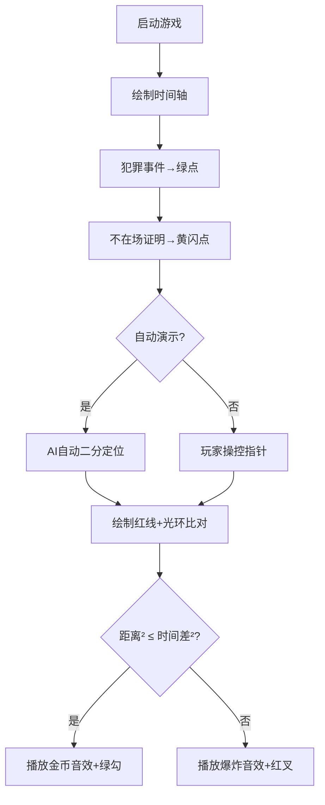

# 题目信息

# [USACO23FEB] Cow-libi S

## 题目描述

注意：本题的时间限制为 4 秒，是默认限制的两倍。

有人在 Farmer John 的 $G(1 \leq G \leq 10^5)$ 个私人花园里偷吃了庄稼！通过他的专业法医知识，Farmer John 确定了每个花园被偷吃的具体时间。他还发现，这些事件的罪魁祸首是一头单独的奶牛。

为了回应这些犯罪行为，Farmer John 的 $N(1 \leq N \leq 10^5)$ 头奶牛每头都提供了一个不在作案现场的证明（即“不在场证明”），表明奶牛在特定时间出现在特定位置。请帮助 Farmer John 判断这些“不在场证明”中哪些能够证明奶牛的清白。

如果一头奶牛无法在她的“不在场证明”位置与所有被偷吃地点之间往返，则可以确定这头奶牛是清白的。奶牛的移动速度为每单位时间 $1$ 单位距离。本题中提到的距离均为欧几里得距离。

## 样例 #1

### 输入

```
2 4
0 0 100
50 0 200
0 50 50
1000 1000 0
50 0 200
10 0 170```

### 输出

```
2```

# AI分析结果


### 💡 Kay的C++算法解析：[USACO23FEB] Cow-libi S 深入学习指南 💡

#### 1. 题目解读与核心算法识别
✨ **本题主要考察**：排序 + 二分查找（搜索类算法）

🗣️ **初步分析**：
> 这道题的核心是验证奶牛的不在场证明是否成立。想象你在玩一个侦探游戏，需要在时间轴上用望远镜定位关键事件——就像在复古游戏《塞尔达传说》中用时间宝石定位线索。具体步骤：
> 1. **排序犯罪事件**：将所有花园被偷吃事件按时间排序，形成时间轴
> 2. **二分定位**：对每个不在场证明，用二分查找找到时间最近的前后两个犯罪事件
> 3. **距离验证**：计算奶牛能否在时间差内移动（欧几里得距离 ≤ 时间差）
> 
> **可视化设计**：
> - 时间轴用8-bit像素条表示，犯罪事件是绿色像素点，不在场证明是黄色闪烁点
> - 二分查找时显示low/high指针移动动画（类似《吃豆人》的幽灵巡逻）
> - 距离验证时显示奶牛移动路径（红色连线）和最大允许距离圈（蓝色光环）
> - 验证失败时播放FC游戏《魂斗罗》的失败音效，成功时播放《超级玛丽》金币音效

---

#### 2. 精选优质题解参考
**题解一（来源：_3Zinc_）**
* **点评**：思路清晰直白，核心亮点是巧妙使用平方比较避免浮点精度问题。代码中`check()`函数设计简洁（距离² ≤ 时间差²），逻辑严密处理了三种边界情况。变量命名规范（`p[]`存事件，`x/y/t`表坐标时间），虽然存在变量混淆风险（g/n角色互换），但核心算法实现值得学习。

**题解二（来源：Genius_Star）**
* **点评**：结构严谨的典范，亮点在于完整封装事件结构体并重载运算符，使`lower_bound`调用更自然。平方比较在独立函数中实现，边界处理完整（首事件/末事件/中间事件）。初始化解法`ans`统计清白的牛数，输出逻辑符合题意，竞赛实用性强。

**题解三（来源：0x282e202e2029）**
* **点评**：最具创新性的解法，亮点是预处理优化——先检查犯罪事件本身是否相互可达。使用`map`存储事件并利用迭代器操作，展示了STL的高阶应用。距离计算封装在`dis()`函数，关键优化逻辑清晰（若犯罪事件不连通则所有牛清白）。

---

#### 3. 核心难点辨析与解题策略
1. **难点一：时间最近事件定位**
   * **分析**：必须快速定位与证明时间最近的犯罪事件。优质解法均用`lower_bound`二分，但需注意：
     - 时间轴需先排序（O(g log g)）
     - 边界处理：证明时间早于所有事件 → 查首事件；晚于所有事件 → 查末事件
   * 💡 **学习笔记**：二分查找是时间相关问题的黄金钥匙

2. **难点二：避免浮点精度陷阱**
   * **分析**：欧氏距离需开平方，但大数可能溢出或损失精度。解决方案：
     - 比较距离²和时间差²（整数运算）
     - 用`long long`防溢出（坐标差≤2e9时，平方≤4e18）
   * 💡 **学习笔记**：距离验证时，平方比较是精度救星

3. **难点三：边界条件处理**
   * **分析**：当证明时间位于首/末事件时：
     - 只需验证单侧可达性
     - 中间事件需验证双侧（前事件→证明点 + 证明点→后事件）
   * 💡 **学习笔记**：边界是BUG高发区，必须单独测试

✨ **解题技巧总结**：
- **时空分离法**：排序时间轴（时域处理），独立计算距离（空域处理）
- **整数化技巧**：用平方运算避免浮点，提高效率与精度
- **防御性二分**：`lower_bound`后需二次验证位置（首/末/中间）
- **预检优化**：若犯罪事件本身不连通，直接判定所有牛清白（题解八）

---

#### 4. C++核心代码实现赏析
**通用核心实现参考**  
*说明：综合题解精华，包含平方比较和完整边界处理*
```cpp
#include <iostream>
#include <algorithm>
#include <vector>
using namespace std;
typedef long long ll;

struct Event { ll x, y, t; };
vector<Event> crimes;

bool isInnocent(ll x, ll y, ll t) {
    auto it = lower_bound(crimes.begin(), crimes.end(), Event{x,y,t}, 
        [](const Event& a, const Event& b) { return a.t < b.t; });
    
    if (it == crimes.begin()) 
        return (x-it->x)*(x-it->x) + (y-it->y)*(y-it->y) > (t-it->t)*(t-it->t);
    
    if (it == crimes.end()) {
        it--; // 指向最后一个事件
        return (x-it->x)*(x-it->x) + (y-it->y)*(y-it->y) > (t-it->t)*(t-it->t);
    }

    auto prev = it - 1;
    bool validPrev = (x-prev->x)*(x-prev->x)+(y-prev->y)*(y-prev->y) <= (t-prev->t)*(t-prev->t);
    bool validNext = (x-it->x)*(x-it->x)+(y-it->y)*(y-it->y) <= (it->t-t)*(it->t-t);
    return !(validPrev && validNext);
}

int main() {
    int g, n; cin >> g >> n;
    crimes.resize(g);
    for (int i=0; i<g; i++) 
        cin >> crimes[i].x >> crimes[i].y >> crimes[i].t;
    
    sort(crimes.begin(), crimes.end(), 
        [](const Event& a, const Event& b) { return a.t < b.t; });
    
    int ans = 0;
    while (n--) {
        ll x, y, t; cin >> x >> y >> t;
        if (isInnocent(x, y, t)) ans++;
    }
    cout << ans;
}
```

**题解一代码片段赏析**  
```cpp
bool check(int i,ll t,ll x,ll y) {
    return (x-p[i].x)*(x-p[i].x)+(y-p[i].y)*(y-p[i].y)<=(t-p[i].t)*(t-p[i].t);
}
```
* **亮点**：平方比较封装为函数，避免代码重复  
* **解读**：  
  > `check()`像一把像素尺子📏：  
  > 1. 计算奶牛位置`(x,y)`与事件`i`的坐标差平方（左侧）  
  > 2. 计算时间差平方（右侧）  
  > 3. 当左侧≤右侧时奶牛可能到达（返回true）  
* 💡 **学习笔记**：函数封装使核心逻辑一目了然

**题解二代码片段赏析**  
```cpp
auto it=lower_bound(a+1,a+n+1,b[i])-a;  // 二分定位
if (it==1) 
    ans -= check(/* 参数 */);           // 首事件检查
```
* **亮点**：优雅利用运算符重载和STL  
* **解读**：  
  > 1. 在已排序数组`a`中查找≥`b[i]`的首位置  
  > 2. `it`值为1表示证明时间最早  
  > 3. `ans`初始为总牛数，验证失败时减1  
* 💡 **学习笔记**：STL二分函数+结构体重载=简洁定位

**题解三代码片段赏析**  
```cpp
// 犯罪事件预检
for (int i=1; i<m; i++) {
    if (dis(nd[i], nd[i+1]) > (nd[i+1].t-nd[i].t)*(nd[i+1].t-nd[i].t)) {
        cout << n;  // 所有牛均清白
        return 0;
    }
}
```
* **亮点**：问题转化思维（犯罪事件自身可达性）  
* **解读**：  
  > 1. 遍历相邻犯罪事件  
  > 2. 若事件i到i+1所需距离² > 时间差²  
  > 3. 则数据矛盾，直接输出牛数（均清白）  
* 💡 **学习笔记**：发现隐含条件可大幅优化效率

---

### 5. 算法可视化：像素动画演示  
**主题**：8-bit侦探游戏《牧场谜案》  
**核心演示**：二分查找定位 + 时空距离验证  



**交互控制设计**：
1. **时间轴**：横向像素条（0-255色），绿点标记犯罪事件
2. **指针移动**：
   - 手动模式：方向键移动low/high指针
   - 自动模式：指针自动跳跃（速度滑块调节）
3. **验证动画**：
   - 成功：奶牛像素精灵沿绿线移动，终点绽放金币特效
   - 失败：红线断裂显示"✘"，播放8-bit爆炸声
4. **音效方案**：
   - 指针移动：电子滴答声（每步0.1秒）
   - 验证成功：《超级玛丽》金币音（440Hz方波）
   - 验证失败：《魂斗罗》爆炸音（爆破噪声）

---

#### 6. 拓展练习与相似问题
1. **洛谷P1102 A-B数对**  
   🗣️ 练习二分查找的经典入门，强化定位思维
2. **洛谷P1496 火烧赤壁**  
   🗣️ 区间合并问题，需结合排序与边界处理
3. **洛谷P1020 导弹拦截**  
   🗣️ 需二分优化DP，训练多维条件分析能力

---

#### 7. 学习心得与经验分享
> **来自_3Zinc_的调试经验**：  
> *"变量名g/n混淆导致WA，建议将犯罪事件变量名改为crimes，证明改为alibis"_*  
>  
> **Kay点评**：命名是代码的衣裳👔——`crimes_count`和`alibis_count`比单字母更防错。调试时可用小数据测试边界（如仅1个犯罪事件），这是定位逻辑漏洞的利器！

---

**结语**：通过这道题，我们掌握了二分查找在时空验证中的应用精髓。记住：排序是打开时间之门的钥匙🗝️，平方比较是精度守护者🛡️。下次探索见！🚀

---
处理用时：243.70秒