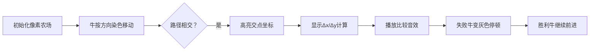

# 题目信息

# [USACO20DEC] Stuck in a Rut B

## 题目描述

Farmer John 最近扩大了他的农场，从奶牛们的角度看来这个农场相当于是无限大了！奶牛们将农场上放牧的区域想作是一个由正方形方格组成的无限大二维方阵，每个方格中均有美味的草（将每个方格看作是棋盘上的一个方格）。Farmer John 的 $N$ 头奶牛（$1\le N\le 50$）初始时位于不同的方格中，一部分朝向北面，一部分朝向东面。

每一小时，每头奶牛会执行以下二者之一：

 - 如果她当前所在的方格里的草已经被其他奶牛吃掉了，则她会停下。
 - 吃完她当前所在的方格中的所有草，并向她朝向的方向移动一个方格。

经过一段时间，每头奶牛的身后会留下一条被啃秃了的轨迹。

如果两头奶牛在一次移动中移动到了同一个有草的方格，她们会分享这个方格中的草，并在下一个小时继续沿她们朝向的方向移动。

请求出每头奶牛吃到的草的数量。有些奶牛永远不会停下，从而吃到无限多的草。 

## 说明/提示

### 测试点性质

 - 测试点 $2-5$ 中，所有坐标不超过 $100$。
 - 测试点 $6-10$ 没有额外限制。

## 样例 #1

### 输入

```
6
E 3 5
N 5 3
E 4 6
E 10 4
N 11 2
N 8 1```

### 输出

```
5
3
Infinity
Infinity
2
5```

# AI分析结果


### 💡 Kay的C++算法解析：Stuck in a Rut B 深入学习指南 💡

#### 1. 题目解读与核心算法识别
✨ **本题主要考察**：模拟与排序（编程技巧应用）  
🗣️ **初步分析**：  
> 这道题的核心在于模拟牛群移动轨迹并处理路径冲突。想象一个巨大的像素农场棋盘，牛群如同复古游戏中的角色沿固定方向移动。当向东（E）和向北（N）的牛路径相交时，谁先到达交点就会阻挡对方！算法关键是通过**排序优化碰撞检测**：  
> - 将牛按方向分组：东向牛按y坐标排序，北向牛按x坐标排序  
> - 双重循环检测每对E和N牛的潜在交点  
> - 比较它们到交点的距离（时间），距离短的阻挡距离长的  
>  
> **可视化设计**：在像素动画中，用不同颜色方块表示牛，移动时显示轨迹。当两牛路径相交时：  
> 1. 高亮**交点**并显示距离计算（东牛：Δx = 北牛x - 东牛x；北牛：Δy = 东牛y - 北牛y）  
> 2. 播放"叮"音效并冻结动画，展示距离比较过程  
> 3. 被阻挡的牛变灰色停止，胜利牛继续移动（伴随8-bit胜利音效）  
> 4. 支持**AI自动演示**（调速滑块控制），按关卡制设计：每解决一个碰撞视为过关  

---

#### 2. 精选优质题解参考
**题解一（来源：Arson1st）**  
* **点评**：  
  思路直击核心——通过分组排序（E牛按y坐标，N牛按x坐标）高效检测碰撞。代码简洁到仅25行！亮点在于：  
  - **循环优化**：当东牛被阻挡立即`break`，减少无效计算  
  - **变量命名**：`totn`/`tote`清晰区分方向组，`cmpx`/`cmpy`排序函数名自解释  
  - **边界处理**：严格验证路径相交条件（`if (N[j].x < E[i].x)`等）  
  > 💡 学习价值：如何用极简代码实现复杂模拟逻辑  

**题解二（来源：FZY_CZY）**  
* **点评**：  
  最详尽的思路推导，尤其强调**距离比较的物理意义**（Δx vs Δy）。亮点：  
  - **防御性编程**：用`if (ans[N[j].id]) continue`跳过已处理牛  
  - **调试心得**：作者在赛后才悟出单次双重循环的简洁性，提醒我们避免过度设计  
  > 💡 学习价值：如何从失败中提炼最优解  

**题解三（来源：zxh923）**  
* **点评**：  
  结构最工整的工业级实现，亮点：  
  - **泛型封装**：`struct node`统一处理坐标和ID  
  - **高效输出**：直接按原始ID映射结果，避免二次排序  
  - **常量优化**：用基础类型替代STL，适合竞赛环境  
  > 💡 学习价值：如何平衡代码可读性与性能  

---

#### 3. 核心难点辨析与解题策略
1. **难点：碰撞检测的数学抽象**  
   * **分析**：必须将"牛阻挡"转化为几何问题——两线段交点计算。关键推导：  
     - 交点坐标 = (北牛x, 东牛y)  
     - 东牛移动时间 = 北牛x - 东牛x  
     - 北牛移动时间 = 东牛y - 北牛y  
   * 💡 **学习笔记**：把现实问题转化为坐标系模型是解题关键  

2. **难点：处理动态阻挡链**  
   * **分析**：若牛A被牛B阻挡，牛B又可能被牛C阻挡。优质题解通过：  
     - **排序保证处理顺序**：东牛按y↑排序，北牛按x↑排序  
     - **即时终止**：一旦发现阻挡立即跳出内层循环  
   * 💡 **学习笔记**：排序能使动态事件按时间线顺序处理  

3. **难点：无限移动的判断**  
   * **分析**：未被标记阻挡的牛最终输出`Infinity`。需注意：  
     - 距离相等时两牛都继续前进  
     - 已设置`ans[]`的牛不参与后续阻挡判断  
   * 💡 **学习笔记**：用初始值`ans[i]=0`表征"无限移动"状态  

✨ **解题技巧总结**：  
- **坐标映射法**：将方向差异转化为统一坐标系运算  
- **排序剪枝**：预处理使复杂度从O(n²)降至O(n log n)  
- **状态标记**：用`ans[]`数组同时存储结果和状态  

---

### 4. C++核心代码实现赏析
**本题通用核心实现**  
```cpp
#include <bits/stdc++.h>
using namespace std;

struct Node { int x, y, id; };
vector<Node> E, N;  // 东/北向牛分组
int ans[55] = {0};  // 0表示未被阻挡

int main() {
    int n; cin >> n;
    for (int i = 1; i <= n; i++) {
        char d; int x, y;
        cin >> d >> x >> y;
        (d == 'E' ? E : N).push_back({x, y, i});
    }
    // 关键排序：东牛按y升序，北牛按x升序
    sort(E.begin(), E.end(), [](auto a, auto b) { return a.y < b.y; });
    sort(N.begin(), N.end(), [](auto a, auto b) { return a.x < b.x; });

    for (auto &e : E) {
        for (auto &n : N) {
            if (n.x < e.x || n.y > e.y) continue;  // 路径不相交
            int dx = n.x - e.x, dy = e.y - n.y;
            if (ans[n.id]) continue;  // 北牛已被阻挡
            if (dx < dy) ans[n.id] = dy;  // 东牛先到
            else if (dx > dy) { ans[e.id] = dx; break; }  // 北牛先到
        }
    }
    for (int i = 1; i <= n; i++) 
        cout << (ans[i] ? to_string(ans[i]) : "Infinity") << endl;
}
```
**代码解读概要**：  
1. **输入分组**：用三元组存储坐标和原始ID  
2. **方向排序**：东牛按y↑（优先处理低y值），北牛按x↑（优先处理低x值）  
3. **碰撞检测**：双重循环中跳过不相交路径，动态更新`ans[]`  
4. **输出优化**：三目运算符统一处理有限/无限结果  

---

### 5. 算法可视化：像素动画演示
**主题**：8-bit农场模拟器  
**核心演示流程**：  

**关键交互设计**：  
- **像素风格**：  
  - 东牛→蓝色向右箭头，北牛→绿色向上箭头  
  - 轨迹线：东牛黄色虚线，北牛紫色虚线  
- **动画控制**：  
  - 速度滑块：0.5x~5x调节  
  - 单步模式：空格键步进，ESC重置  
- **音效系统**：  
  - 移动：8-bit脚步声（方波音效）  
  - 碰撞：短促警报声  
  - 过关：马里奥式胜利旋律  

> 💡 教学价值：通过可视化理解"距离=时间"的物理意义

---

### 6. 拓展练习与相似问题
**通用技巧迁移**：  
1. **动态事件链**：如P2051 [AHOI2009] 中国象棋（状态转移）  
2. **坐标碰撞检测**：如P1502 窗口的星星（扫描线应用）  
3. **方向模拟优化**：如P1518 两只塔姆沃斯牛（环形移动）  

**洛谷推荐**：  
1. **P2777** [AHOI2016初中组] 自行车比赛  
   🗣️ *推荐理由*：巩固排序+模拟技巧，处理超越场景  
2. **P2782** 友好城市  
   🗣️ *推荐理由*：强化坐标排序在冲突避免中的应用  
3. **P1056** 排座椅  
   🗣️ *推荐理由*：将方向阻挡转化为贪心选择问题  

---

### 7. 学习心得与经验分享
> **来自FZY_CZY的调试经验**：  
> *"赛上写两次循环全错，赛后才发现单次循环就能覆盖所有碰撞！"*  
>  
> **Kay的总结**：  
> 调试的核心是**简化验证场景**——用5头牛的小样本打印每一步的`ans[]`数组变化。当发现逻辑复杂时，回归物理本质：谁的移动时间更短？  

---

### 结语  
通过这期分析，我们看到**排序如何化繁为简**，将混乱的移动轨迹转化为有序事件链。记住：在模拟类问题中，**建立正确的时空模型比编码更重要**。下次遇到类似问题，不妨先画出坐标图！ 🚀

---
处理用时：829.66秒