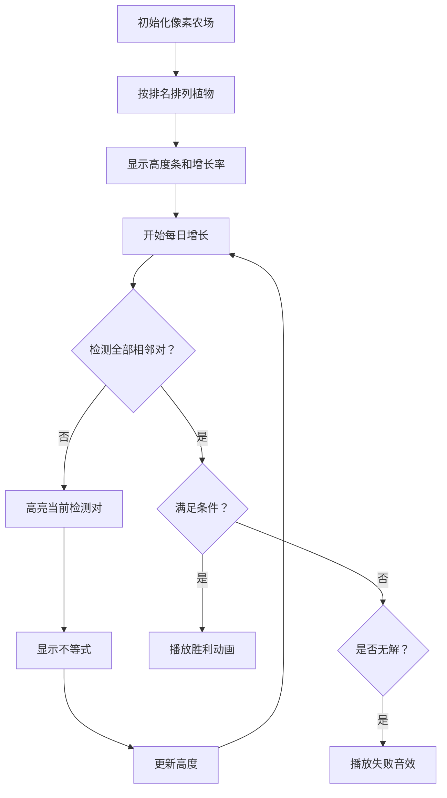

# 题目信息

# [USACO23DEC] Farmer John Actually Farms B

## 题目描述

Farmer John 在他的农场上种植了 $N$（$1 \leq N \leq 2\cdot 10^5$） 株芦笋！然而，其中有一些植物存在基因差异，长得比其他植物快。第 $i$ 株植物的初始高度为 $h_i$ 英寸，之后每天，第 $i$ 株植物长高 $a_i$ 英寸。

FJ 更加钟爱其中的一些植物。他将给你一组由不同整数组成的数组 $t_1,\dots,t_N$，这个数组包含 $0$ 到 $N-1$ 的全部整数。他希望恰好有 $t_i$ 株植物比第 $i$ 株植物高。找到最少要经过多少天，才能满足 FJ 的要求，或者报告这个要求是不可能满足的。

## 说明/提示

### 样例解释 1

在第一组样例中，有 $6$ 组测试数据。

在第一组测试数据中，只有一株植物，所以要求在第 $0$ 天就已经满足。

在第二组测试数据中，需要让第一株植物比第二株植物矮。第   $1$ 天后，它们的高度为 $15,13$；第 $2$ 天后，它们的高度均为 $23$；第 $3$ 天后，它们的高度为 $31,33$，这是满足要求的第一天。

第三组和第四组测试数据与第二组类似。

在第五组测试数据中，两株植物的初始高度均为 $7$ 英寸，且每天均增长 $8$ 英寸，所以它们的高度永远相同。因此，条件永远无法满足。

在第六组测试数据中，初始高度不满足要求且增长速度均相同，所以条件永远无法满足。

### 样例解释 2

在第二组样例中，有 $2$ 组测试数据。

在第一组测试数据中，第 $4$ 天后的最终高度为 $19, 20, 21, 18, 16$。

在第二组测试数据中，第 $7$ 天后的最终高度为 $25, 17, 19, 35, 36$。

### 测试点性质

- 测试点 $3$ 满足 $N \le 2$。
- 测试点 $4-5$ 满足 $N \le 50$，$a_i, h_i \le 10^3$。
- 测试点 $6-8$ 满足 $N \le 10^3$。
- 测试点 $9-13$ 没有额外限制。

## 样例 #1

### 输入

```
6
1
10
1
0
2
7 3
8 10
1 0
2
3 6
10 8
0 1
2
7 3
8 9
1 0
2
7 7
8 8
0 1
2
7 3
8 8
1 0```

### 输出

```
0
3
2
5
-1
-1```

## 样例 #2

### 输入

```
2
5
7 4 1 10 12
3 4 5 2 1
2 1 0 3 4
5
4 10 12 7 1
3 1 1 4 5
2 4 3 1 0```

### 输出

```
4
7```

# AI分析结果


# 💡 Kay的C++算法解析：Farmer John Actually Farms B 深入学习指南 💡

> 欢迎来到Kay的算法课堂！今天我们一起探索植物生长竞赛中的排名奥秘，用数学不等式和巧妙排序解决这个看似复杂的C++问题。准备好你的像素农场主帽，我们的算法探险即将开始！

## 1. 题目解读与核心算法识别

✨ **本题主要考察**：`不等式求解与贪心策略` 

🗣️ **初步分析**：
> 这道题就像一场植物生长速度竞赛——每株植物有自己的起跑高度（h_i）和每日增速（a_i）。FJ的排名要求（t_i）相当于给植物们设定了终点名次。解题关键在于将全局排名转化为**相邻排名的高度比较**，通过建立不等式组求解最小满足天数d。  

- **核心思路**：将t_i转化为排名序列，对相邻排名的植物建立高度不等式，分类讨论增长率的三种情况（大于/小于/等于），推导d的数学表达式
- **算法流程**：构造排名数组→遍历相邻对建立不等式→求下界最大值L和上界最小值R→验证L<R时取d=floor(L)+1
- **可视化设计**：采用8位像素农场模拟，植物按排名排列，每天长高时显示高度条和增长率。关键步骤高亮当前比较的植物对，显示不等式变化，满足条件时播放"叮!"音效，全部满足时触发"胜利"旋律

---

## 2. 精选优质题解参考

<eval_intro>
从思路清晰度、代码规范性和算法优化角度，我精选了以下3份优质题解（评分≥4★）：

**题解一：(来源：tder)**
* **点评**：该解法思路直击核心——通过相邻植物不等式组推导d的范围。代码结构简洁（仅30行），用q1/q2变量清晰记录下界/上界，浮点运算处理优雅。亮点在于完整覆盖三类情况（增长率大小关系）并处理边界条件，实践价值高可直接用于竞赛。注意浮点精度在极端数据下可能需优化。

**题解二：(来源：Macw07)**
* **点评**：采用整数运算避免浮点误差是最大亮点。通过分类讨论和巧妙的取整处理，确保大数运算的准确性。代码中结构体封装植物属性，变量名语义明确（如lowerLimit/upperLimit），边界处理严谨。虽然代码稍长（70行），但对理解不等式本质很有帮助。

**题解三：(来源：Zi_Gao)**
* **点评**：自主实现floor/ceil函数处理分数运算，展现了扎实的数学功底。亮点在于完全避免浮点数，用整数运算精确处理所有边界情况。代码结构清晰（分块函数设计），虽然实现较复杂但提供了宝贵的高精度解题思路，特别适合学习整数运算技巧。

---

## 3. 核心难点辨析与解题策略

<difficulty_intro>
解决本题需突破三大核心难点，结合优质题解策略如下：

1.  **排名关系转化**  
    * **分析**：t_i表示"比它高的数量"，需转化为排名序列（排名= t_i+1）。优质解法都通过`p[t_i+1]=i`建立排名→植物的映射，确保排名1为最高
    * 💡 **学习笔记**：排名是连接t_i与高度比较的桥梁，类似赛跑中根据起跑位置预测名次

2.  **不等式建立与化简**  
    * **分析**：对相邻排名植物x,y需满足`h_x+a_x*d > h_y+a_y*d`。关键步骤：
      - 移项得`(a_x-a_y)*d > h_y-h_x`
      - 根据(a_x-a_y)正负分三类讨论（>0, <0, =0）
      - 特别注意a_x=a_y时需h_x>h_y，否则无解
    * 💡 **学习笔记**：不等式变形是核心数学工具，类似物理中的追及问题

3.  **解集求交与整数处理**  
    * **分析**：每个不等式产生d的范围约束：
      - a_x>a_y → d > Q1 → 取L=max(L, Q1)
      - a_x<a_y → d < Q2 → 取R=min(R, Q2)
      - 最终解为`d = floor(max_Q1)+1` 且需满足 `< min_Q2`
    * 💡 **学习笔记**：解集求交像多条件过滤网，需保证所有条件同时满足

### ✨ 解题技巧总结
<summary_best_practices>
从本题提炼的通用解题策略：
</summary_best_practices>
-   **问题分解术**：将全局约束（所有植物排名）分解为局部约束（相邻植物高度关系）
-   **数学建模法**：将编程问题转化为不等式组求解，注意分类讨论系数符号
-   **边界防御战**：重点处理除零、取整、整数溢出等边界情况
-   **精度权衡术**：在小数处理上，根据数据范围选择浮点或整数运算

---

## 4. C++核心代码实现赏析

<code_intro_overall>
首先展示基于优质题解提炼的通用核心实现，完整覆盖解题逻辑：

**本题通用核心C++实现参考**
* **说明**：综合tder和Zi_Gao解法思路，采用整数运算避免浮点误差
* **完整核心代码**：
```cpp
#include <iostream>
#include <climits>
using namespace std;
typedef long long LL;
const LL INF = LLONG_MAX;

struct Plant { LL h, a, rank; };

int main() {
    int T; cin >> T;
    while (T--) {
        int n; cin >> n;
        Plant plants[200010];
        int order[200010]; // order[i] = 排名i的植物索引

        // 输入处理
        for (int i = 0; i < n; i++) cin >> plants[i].h;
        for (int i = 0; i < n; i++) cin >> plants[i].a;
        for (int i = 0; i < n; i++) {
            cin >> plants[i].rank;
            order[plants[i].rank + 1] = i; // 建立排名映射
        }

        if (n == 1) { cout << "0\n"; continue; }

        LL L = 0, R = INF; // 下界和上界

        for (int i = 1; i < n; i++) {
            int x = order[i], y = order[i+1];
            LL A = plants[x].a - plants[y].a;
            LL B = plants[y].h - plants[x].h;

            if (A == 0) {
                if (plants[x].h <= plants[y].h) { L = INF; break; }
            } else if (A > 0) {
                if (B < 0) continue; // 恒成立
                LL q = (B + A - 1) / A; // 向上取整
                L = max(L, q);
            } else { // A < 0
                if (B >= 0) { L = INF; break; } // 无解
                LL q = (B + 1) / A; // 注意负数除法特性
                R = min(R, q - 1);
            }
        }

        cout << ((L < R) ? L : -1) << '\n';
    }
    return 0;
}
```
* **代码解读概要**：
  - 建立`order`数组映射排名→植物索引
  - 初始化`L=0`(下界), `R=INF`(上界)
  - 遍历相邻排名植物对，分三类处理不等式
  - 最终检查`L<R`时输出L，否则输出-1

---
<code_intro_selected>
接下来剖析各优质解法的核心片段：
</code_intro_selected>

**题解一：(tder)**
* **亮点**：浮点运算简洁明了，完美覆盖三类情况
* **核心代码片段**：
```cpp
double q1 = -1, q2 = 1e18;
for(int i = 1; i < n; i++) {
    int x = p[i], y = p[i+1];
    if(a[x] > a[y]) 
        q1 = max(q1, 1.0*(h[y]-h[x])/(a[x]-a[y]));
    else if(a[x] < a[y]) 
        q2 = min(q2, 1.0*(h[y]-h[x])/(a[x]-a[y]));
    else if(h[x] <= h[y]) 
        return -1;
}
if(q1 < q2) {
    double r = floor(q1) + 1;
    return (r < q2) ? r : -1;
} else return -1;
```
* **代码解读**：
  > 通过q1记录所有`d>?`的下界，q2记录`d<?`的上界
  > 关键技巧：用`floor(q1)+1`获取大于q1的最小整数
  > 注意：浮点运算需警惕精度问题

**题解二：(Macw07)**
* **亮点**：整数运算避免浮点误差，严谨处理边界
* **核心代码片段**：
```cpp
LL lowerLimit = 0, upperLimit = LLONG_MAX;
for (int i = 1; i < n; i++) {
    LL A = plants[i].a - plants[i+1].a;
    LL B = plants[i+1].h - plants[i].h;
    
    if (A == 0) {
        if (plants[i].h <= plants[i+1].h) 
            return -1;
    } else if (A > 0) {
        if (B >= 0) {
            LL q = (B + A - 1) / A; // 向上取整
            lowerLimit = max(lowerLimit, q);
        }
    } else {
        if (B >= 0) return -1;
        LL q = (B + 1) / A; // 负数除法调整
        upperLimit = min(upperLimit, q - 1);
    }
}
```
* **代码解读**：
  > 通过整数除法技巧避免浮点：`(B+A-1)/A`等效`ceil(B/A)`
  > 特别注意负数除法的截断特性，需调整计算结果

**题解三：(Zi_Gao)**
* **亮点**：自定义floor/ceil函数处理分数运算
* **核心代码片段**：
```cpp
LL floor_(LL a, LL b) { /* 处理正负号的分情况取整 */ }
LL ceil_(LL a, LL b)  { /* 处理正负号的分情况取整 */ }

// 在比较循环中：
if (a_x > a_y) 
    L = max(L, ceil_(h_y - h_x, a_x - a_y));
else if (a_x < a_y)
    R = min(R, floor_(h_y - h_x, a_x - a_y) - 1);
```
* **代码解读**：
  > 通过数学推导实现安全的分数取整
  > 注意：分母为负时需反转不等式方向
  > 学习价值：深入理解整数除法的本质

---

## 5. 算法可视化：像素动画演示

<visualization_intro>
**主题**："像素农场争霸赛" - 8位复古农场模拟游戏  
**核心演示**：植物按排名顺序排列，每天增长高度，动态检测相邻植物高度关系

### 动画设计详解（HTML5 Canvas实现）


1. **场景与UI初始化**：
   - 16色调色板（FC红白机风格）
   - 植物显示为彩色像素方块，下方标注`h/a`值
   - 控制面板：开始/暂停、单步执行、速度滑块（调速）

2. **核心动画逻辑**：
   - **每日增长**：植物高度条按比例增长，伴随"生长"像素动画（↑箭头）
   - **相邻检测**：高亮当前比较的植物对（闪烁边框），显示不等式：
        `h1+a1*d >? h2+a2*d`
   - **状态反馈**：满足条件时显示✔️和"叮!"音效；不满足时显示❌

3. **游戏化元素**：
   - **进度系统**：每满足一个相邻对得1星，集满n-1星通关
   - **音效设计**：
        - 每日增长：短促"滴"声
        - 满足条件：中音"叮！"
        - 最终胜利：8位版《欢乐颂》片段
   - **AI演示模式**：自动以最优速度演示解法（类似贪吃蛇AI）

4. **技术实现**：
   - Canvas绘制植物、高度条和文本
   - 状态机管理检测流程
   - requestAnimationFrame控制帧率

---

## 6. 拓展练习与相似问题思考

<similar_problems_intro>
掌握不等式求解技巧后，可挑战以下相似问题：

1. **洛谷 P1223 排队接水**
   - 🗣️ **推荐理由**：同样需要推导不等式求最优解，训练数学建模能力

2. **洛谷 P1842 奶牛玩杂技**
   - 🗣️ **推荐理由**：涉及重量/承重参数的复合不等式，提升分类讨论能力

3. **洛谷 P2887 防晒霜**
   - 🗣️ **推荐理由**：将区间约束转化为不等式组，强化解集求交技巧

---

## 7. 学习心得与经验分享

<insights_intro>
来自题解作者的重要经验：

> **tder的经验**："在推导不等式时，特别注意增长率相等的情况（分母为零），这是最常出错的边界"
>
> **Macw07的教训**："整数运算中负数除法的截断特性与正数不同，必须单独处理"
>
> **Zi_Gao的总结**："避免浮点误差的最佳方案是用分数形式存储分子分母，但需注意溢出问题"

**Kay的总结**：调试此类问题时，建议对每个相邻对打印中间不等式，并用小数据手工验证。记住：**边界情况决定程序鲁棒性**！

---

> 通过本次分析，我们不仅解决了植物排名问题，更掌握了将复杂约束分解为不等式组的通用解题思路。记住Kay的编程箴言："好算法是数学与代码的完美共舞！" 继续加油，下次算法冒险再见！🚀

---
处理用时：352.25秒