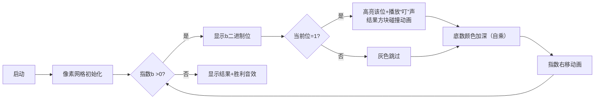

# 题目信息

# 【模板】快速幂

## 题目描述

给你三个整数 $a,b,p$，求 $a^b \bmod p$。

## 说明/提示

**样例解释**

$2^{10} = 1024$，$1024 \bmod 9 = 7$。

**数据规模与约定**

对于 $100\%$ 的数据，保证 $0\le a,b < 2^{31}$，$a+b>0$，$2 \leq p \lt 2^{31}$。

## 样例 #1

### 输入

```
2 10 9
```

### 输出

```
2^10 mod 9=7
```

# AI分析结果


### 💡 Kay的C++算法解析：快速幂 深入学习指南 💡

#### **1. 题目解读与核心算法识别**
✨ **本题主要考察**：**数学（快速幂）**与**位运算技巧**  
🗣️ **初步分析**：
> 快速幂算法就像拆解乐高积木——将大问题分解为可复用的标准模块（2的幂次）。核心思想是利用指数二进制分解：$a^b = a^{b_0 \cdot 2^0} \times a^{b_1 \cdot 2^1} \times \cdots$，其中$b_i$是二进制位。  
- **核心难点**：理解二进制位与指数运算的映射关系，掌握位运算实现  
- **解决方案**：迭代计算底数平方（$a \rightarrow a^2 \rightarrow a^4$），根据二进制位决定是否乘入结果  
- **可视化设计**：  
  - 像素网格动态展示指数b的二进制位（如1011）  
  - 当前位为1时，高亮该位并触发像素方块碰撞动画（结果乘当前底数）  
  - 底数自乘时显示像素颜色渐变（如浅蓝→深蓝表示$a \rightarrow a^2$）  
  - 复古音效：位判断"叮"声，自乘"嗡"声，完成时8-bit胜利音效  

---

#### **2. 精选优质题解参考**
**题解一：学委（赞1809）**  
* **点评**：  
  最系统的教学指南！用二进制竖式分解（如$11=1011_2$）直观展示快速幂原理，详解位运算`b & 1`和`b >>=1`的物理意义。代码规范（变量名`base`、`ans`含义清晰），边界处理严谨（指数为0直接返回1）。亮点在于双重解释——先数学原理再计算机实现，完美衔接抽象与实操。

**题解二：RyanLi（赞7）**  
* **点评**：  
  结构最严谨的学术派解析！从幂运算公理$(a^m)^n=a^{mn}$出发，逐步推导递归式，并给出复杂度严格证明（$\Theta(\log n)$）。代码实现突出工程优化：非递归版本避免栈溢出，全程`long long`防溢出，是竞赛级实现的典范。

**题解三：wmrqwq（赞8）**  
* **点评**：  
  极简主义的实践派代表！仅用10行代码直击问题本质，干净利落的迭代实现中暗藏三个关键技巧：  
  1. 循环条件`while(b)`直接判断指数有效性  
  2. 位运算与算术运算混用提升效率  
  3. 每一步同步取模避免溢出  
  最佳适合需要快速编码的场景。

---

#### **3. 核心难点辨析与解题策略**
1. **难点1：指数二进制分解的映射关系**  
   * **分析**：理解$b=11 \Rightarrow 8+2+1$是核心，优质题解均通过二进制竖式（如`1011`）和权重计算（$2^3,2^1,2^0$）建立直观认知  
   * 💡 **学习笔记**：二进制位与2的幂次是一一对应的字典！

2. **难点2：位运算的物理含义**  
   * **分析**：`b & 1`本质是取末位开关（1=乘入结果，0=跳过），`b >>=1`等价于移除已处理的二进制位。学委题解用寄存器移位类比降低理解门槛  
   * 💡 **学习笔记**：把位运算看作处理二进制积木的镊子和剪刀

3. **难点3：模运算的嵌入时机**  
   * **分析**：必须在每次乘法后立即取模，否则可能溢出（$2^{31}$范围下$10^9 \times 10^9$远超`long long`）。封禁用户题解强调`(a * a) % p`的必要性  
   * 💡 **学习笔记**：乘模一体——就像做菜时"煎炒-调味"的固定动作组合

##### ✨ **解题技巧总结**
- **分治拆解**：将指数视作二进制乐高，拆解为$2^k$的组装  
- **位运算双剑**：`&1`检测当前积木，`>>1`移向下一积木  
- **雪球式平方**：底数循环自乘实现指数倍增（$a \rightarrow a^2 \rightarrow a^4$）  
- **即时取模**：每次运算后立即`%p`，避免溢出崩溃  

---

#### **4. C++核心代码实现赏析**
**本题通用核心实现（迭代版）**  
```cpp
#include <iostream>
using namespace std;
typedef long long ll;

ll fastpow(ll a, ll b, ll p) {
    ll ans = 1;          // 答案初始化为1（a^0=1）
    while (b) {          // 当指数未处理完
        if (b & 1)       // 当前二进制位为1
            ans = ans * a % p;  // 乘入当前底数
        a = a * a % p;   // 底数自平方（准备下一权重）
        b >>= 1;         // 右移移除已处理位
    }
    return ans;
}

int main() {
    ll a, b, p;
    cin >> a >> b >> p;
    cout << a << '^' << b << " mod " << p << '=' << fastpow(a, b, p);
}
```
**代码解读概要**：  
1. 初始化`ans=1`容纳结果  
2. **循环拆解指数**：每次循环处理一个二进制位  
3. **位检测**：`b & 1`判断是否乘入当前底数  
4. **底数进化**：`a = a * a`实现$a \rightarrow a^2 \rightarrow a^4$...  
5. **移位更新**：`b >>= 1`指向下一位  

**题解片段赏析**  
1. **学委：位运算精妙实现**  
   ```cpp
   if(b & 1) ans *= base;  // 末位为1时乘入
   base *= base;           // 底数自增幂次
   b >>= 1;               // 移位进入下一位
   ```
   * **亮点**：用注释揭示位运算物理意义  
   * **学习笔记**：`base *= base`是快速幂的引擎，推动指数级增长

2. **RyanLi：递归转迭代优化**  
   ```cpp
   while (b) {
       if (b % 2 == 1) res = res * a % p; // 奇偶判断等价位运算
       a = a * a % p; 
       b /= 2;            // 算术除2实现移位
   }
   ```
   * **亮点**：展示递归与非递归的思维转换  
   * **学习笔记**：`b /= 2`与`b >>= 1`殊途同归，但位运算更快

3. **wmrqwq：极致简洁版**  
   ```cpp
   while(b) {
       if(b & 1) ans = ans * a % p;
       a = a * a % p, b >>= 1;
   }
   ```
   * **亮点**：三行核心逻辑展现算法精髓  
   * **学习笔记**：逗号运算符实现单行多操作，提升代码密度  

---

#### **5. 算法可视化：像素动画演示**
**主题**：8位机风格《快速幂大冒险》  
**核心交互设计**：  


**关键动画细节**：  
1. **二进制战场**：8x8像素网格显示指数b的二进制形式，如`00001011`表示11  
2. **位处理器**：  
   - 红色激光扫描当前位（最右位起始）  
   - 若当前位=1：  
     - 底数方块（蓝色）飞向结果容器（绿色）  
     - 触发像素爆炸特效+“叮”声  
3. **底数进化**：  
   - 自乘时方块颜色渐变（浅蓝→深蓝→紫）  
   - 顶部显示当前底数值：$a \rightarrow a^2 \rightarrow a^4$...  
4. **控制面板**：  
   - 速度滑块：调整自动播放帧率（1x-10x）  
   - 单步按钮：手动触发下一步  
   - 重置：初始化所有参数  

**学习价值**：通过像素色块移动和二进制位高亮，直观呈现“指数拆解-底数增长-结果累积”的三角关系，解决抽象逻辑可视化难题。

---

#### **6. 拓展练习与相似问题**
**通用技巧迁移**：  
快速幂不仅是算数工具，更是处理**指数增长问题**的通用范式，适用于：  
1. 矩阵快速幂（斐波那契数列加速）  
2. 取模逆元计算（$a^{p-2} \bmod p$求逆）  
3. 重复平方法解离散对数  

**洛谷推荐**：  
1. **P3390 【模板】矩阵快速幂**  
   🗣️ 用相同思想处理矩阵幂运算，体会从数字到矩阵的维度跃迁  
2. **P1962 斐波那契数列**  
   🗣️ 将斐波那契递推转化为矩阵幂运算，实战快速幂的高阶应用  
3. **P2613 【模板】有理数取余**  
   🗣️ 结合快速幂求逆元，掌握模意义下的除法技巧  

---

#### **7. 学习心得与经验分享**
> **学委的调试经验**：  
> “我在处理指数边界时曾忽略`b=0`，导致无限递归。**防御性编程**是必修课——用`if(b==0) return 1%p;`守卫边界”  
>  
> **Kay总结**：  
> 快速幂的三大思维跃迁点：  
> 1. 从十进制算术到二进制操作的思维转换  
> 2. 理解`a *= a`如何实现指数翻倍  
> 3. 掌握位运算与数学等价的本质  
> 调试时**打印中间变量**（`b, ans, a`）是照亮算法黑箱的探照灯！

---

通过本次分析，我们看到快速幂如何将$O(n)$的乘方压缩为$O(\log n)$的位操作之旅。记住：指数增长的敌人不是蛮力，而是智慧的分治！下次遇到斐波那契或矩阵幂时，别忘了这位二进制拆弹专家💣→✨

---
处理用时：150.36秒