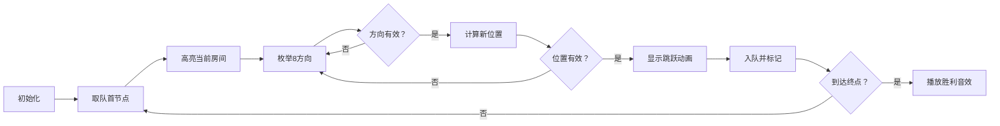

# 题目信息

# 魔鬼之城

## 题目描述

在一个被分割为 $N\times M$ 个正方形房间的矩形魔鬼之城中，一个探险者必须遵循下列规则才能跳跃行动。他必须从 $(1,1)$ 进入，从 $(N,M)$ 走出；在每一房间的墙壁上都写了一个魔法数字，是 $1\sim 13$ 之内的自然数；探险者可以想像出 $8$ 个方向中的任何一个（水平或垂直或对角线方向），随后他就可以作一次空间跳跃穿过这一方向上的连续的 $X$ 个房间，其中 $X$ 是他原来所在房间的魔法数字。但如果在这一方向上的房间数小于 $X$，则他不作任何跳跃，而必须想像另一个方向。同时，探险者不能作连续两次相同方向的跳跃。


 
例如在上图的 $5\ \times 4$ 的魔鬼之城中，如果探险者现在所在的位置是 $(3,3)$，那么通过依次空间跳跃他可以到达下列房间中的一个：$(1,1)$，$(3,1)$，$(1,3)$，$(5,1)$，或 $(5,3)$。另外，如果他要用两次跳跃从 $(5,4)$ 到达 $(3,2)$，则他不能首先跳到 $(4,3)$（因为这样他第二次跳跃的方向将和第一次相同，而这是不允许的）。所以他必须先跳跃到 $(2,1)$。
请你写一个程序，对给定的地图，算出探险者至少需要跳跃多少步才能离开魔鬼之城。


## 样例 #1

### 输入

```
5 4

3 3 6 7 11

3 2 1 1 3

3 2 2 1 1

2 1 2 2 1

```

### 输出

```
4

```

# AI分析结果


# 💡 Kay的C++算法解析：魔鬼之城 深入学习指南 💡

## 1. 题目解读与核心算法识别

✨ **本题主要考察**：`BFS（广度优先搜索）`

🗣️ **初步分析**：
> 解决"魔鬼之城"这道题，关键在于理解并运用`BFS`算法。简单来说，BFS就像在迷宫中逐层探索所有可能的路径，保证找到最短路径。在本题中，BFS用于探索从起点到终点的最少跳跃步数。
   - 核心思路：从起点(1,1)开始，枚举8个方向跳跃（跳跃距离由当前房间的魔法数字决定），不能连续两次同方向跳跃
   - 核心难点：避免状态重复访问形成环，需使用三维标记数组vis[x][y][k]记录位置(x,y)和方向k
   - 可视化设计：用像素网格展示跳跃轨迹，高亮当前房间和跳跃方向，颜色标记已访问状态。复古游戏中加入"跳跃音效"和"胜利音效"，通过步进控制展示BFS的逐层扩展过程

---

## 2. 精选优质题解参考

**题解一：wonSSnow (19赞)**
* **点评**：此解法思路清晰直接，采用标准BFS框架。结构体设计简洁（x,y,step,way），三维标记数组解决状态去重问题。代码规范性好，变量命名合理（dx/dy方向数组），边界处理严谨。亮点在于高效实现BFS核心逻辑，代码仅40余行却完整解决问题，实践参考价值极高。

**题解二：花千树 (17赞)**
* **点评**：通过70分与100分代码对比，突出三维标记的必要性。虽然代码较长但解释详尽，使用11个状态变量确保逻辑正确性。亮点在于用实际调试经验强调"避免状态环"的关键点，结构体中的方向布尔变量设计直观，对理解状态转移很有帮助。

**题解三：翼德天尊 (13赞)**
* **点评**：分步骤讲解BFS实现，采用三队列存储坐标和方向，降低理解难度。代码结构模块化（STEP注释），核心循环逻辑清晰，时间/空间复杂度控制优秀。亮点在于专业注释和状态转移解释，适合初学者理解BFS的队列操作。

---

## 3. 核心难点辨析与解题策略

1.  **状态重复访问（环）**
    * **分析**：仅用二维坐标标记会导致不同方向路径重复访问同一位置，形成死循环。优质解法引入第三维方向状态（vis[x][y][k]），确保同一位置不同方向路径独立判断
    * 💡 **学习笔记**：BFS中状态设计需包含影响转移的关键因素

2.  **跳跃方向约束**
    * **分析**：题目要求不能连续同向跳跃。解法在状态结构体中存储"上一次方向"，枚举时跳过该方向，通过`if(i != cur.dir)`实现约束
    * 💡 **学习笔记**：转移条件需在状态设计中显式体现

3.  **坐标与输入处理**
    * **分析**：输入顺序(n列m行)与存储顺序相反，需`swap(n,m)`或调整循环。跳跃时检查新位置是否在`[1,n]x[1,m]`范围内
    * 💡 **学习笔记**：网格题需特别注意行列坐标系定义

### ✨ 解题技巧总结
- **状态维度扩展**：当转移有条件限制时（如方向约束），在状态中添加相应维度
- **方向预处理**：使用dx/dy数组预定义8个方向向量，简化跳跃计算
- **边界鲁棒性**：跳跃前检查目标位置是否越界，避免非法访问
- **队列初始化**：起点方向设为无效值（如-1或9），确保首次跳跃不受限

---

## 4. C++核心代码实现赏析

**本题通用核心C++实现参考**
* **说明**：综合优质题解思路，采用标准BFS框架与三维标记
* **完整核心代码**：
```cpp
#include <iostream>
#include <queue>
#include <cstring>
using namespace std;

const int dx[8] = {-1,-1,-1,0,0,1,1,1};
const int dy[8] = {-1,0,1,-1,1,-1,0,1};
int n, m, magic[105][105];
bool vis[105][105][8];

struct Node {
    int x, y, step, dir; // dir: 上一次跳跃方向
};

int main() {
    cin >> m >> n; // 注意行列输入顺序
    for (int i = 1; i <= n; ++i)
        for (int j = 1; j <= m; ++j)
            cin >> magic[i][j];
    
    queue<Node> q;
    q.push({1,1,0,-1}); // 初始方向-1表示无跳跃
    memset(vis, 0, sizeof(vis));
    
    while (!q.empty()) {
        Node cur = q.front(); q.pop();
        if (cur.x == n && cur.y == m) {
            cout << cur.step << endl;
            return 0;
        }
        
        for (int i = 0; i < 8; ++i) {
            if (i == cur.dir) continue; // 跳过相同方向
            int nx = cur.x + dx[i] * magic[cur.x][cur.y];
            int ny = cur.y + dy[i] * magic[cur.x][cur.y];
            
            if (nx < 1 || nx > n || ny < 1 || ny > m) continue;
            if (vis[nx][ny][i]) continue;
            
            vis[nx][ny][i] = true;
            q.push({nx, ny, cur.step + 1, i});
        }
    }
    cout << "NEVER" << endl;
    return 0;
}
```
* **代码解读概要**：
  1. 方向数组预定义8个移动向量
  2. 结构体Node整合位置、步数和方向状态
  3. BFS循环中跳过同向跳跃并检查边界
  4. 三维vis数组避免状态重复
  5. 到达终点立即返回，队列空则输出"NEVER"

**题解一核心代码片段**：
```cpp
struct node{ int x,y,step,way; };
// ...
for(int i=1;i<=8;i++) {
    if(now.way!=i) {
        int tx=now.x+dx[i]*mapa[now.x][now.y];
        int ty=now.y+dy[i]*mapa[now.x][now.y];
        if(/* 边界检查 */ && !v[tx][ty][i]) {
            v[tx][ty][i]=1;
            q.push({tx,ty,now.step+1,i});
        }
    }
}
```
* **亮点**：简洁的方向约束处理与状态标记
* **代码解读**：通过`way`字段记录历史方向，枚举时跳过相同方向。三维`v`数组确保每个位置+方向组合只访问一次
* 💡 **学习笔记**：状态压缩是BFS优化的关键手段

**题解二核心代码片段**：
```cpp
// 结构体包含8个方向标志
struct AC{ int sum,x,y; bool a,b,c,d,e,f,g,h; }; 
// ...
if(check(k.x+a[k.x][k.y],k.y)&&!v[k.x+a[k.x][k.y]][k.y][1]&&k.a==1){
    q.push(AC{k.sum+1, k.x+a[k.x][k.y], k.y, 0,1,1,1,1,1,1,1});
    v[k.x+a[k.x][k.y]][k.y][1]=1;
}
```
* **亮点**：详细的方向状态管理
* **代码解读**：用布尔变量显式管理各方向可用性，虽代码较长但逻辑清晰
* 💡 **学习笔记**：复杂状态可拆分为多个变量增强可读性

**题解三核心代码片段**：
```cpp
queue<int> q[3]; // q0:x, q1:y, q2:方向
// ...
for(int i=0;i<8;i++){
    if(i != cur_dir && !vis[nx][ny][i]){
        vis[nx][ny][i]=1;
        q[0].push(nx); q[1].push(ny); q[2].push(i);
    }
}
```
* **亮点**：多队列分离状态元素
* **代码解读**：使用三个同步队列分别存储坐标和方向，避免结构体定义
* 💡 **学习笔记**：多队列实现可降低状态管理复杂度

---

## 5. 算法可视化：像素动画演示

**主题**：8位像素风格魔鬼之城探险  
**核心演示**：BFS在网格中的逐层扩展与方向约束  

### 动画设计


**实现细节**：
1. **像素网格**：FC红白机风格，每个房间显示魔法数字
2. **角色与动画**：
   - 探险家像素角色在起点(1,1)
   - 跳跃时显示方向箭头和跳跃轨迹
   - 已访问房间变暗（按方向分色标记）
3. **交互控制**：
   - 步进执行：空格键单步
   - 速度调节：滑块控制自动播放速度
   - 复位按钮：重新初始化
4. **音效设计**：
   - 跳跃：8-bit "哔"声
   - 无效方向：短促"滴"声
   - 胜利：经典FC通关音效
5. **状态面板**：
   - 当前坐标/步数
   - 队列状态可视化
   - 当前尝试方向高亮

---

## 6. 拓展练习与相似问题思考

**通用技巧迁移**：
1. 状态维度扩展适用于各类约束型BFS
2. 方向预处理模板可用于网格路径问题
3. 三维标记思想可延伸至带状态的最短路径问题

**洛谷推荐题目**：
1. **P1443 马的遍历**  
   → 练习基础BFS与网格移动，马步移动规则类似方向扩展
2. **P1126 机器人搬重物**  
   → 强化方向约束处理，机器人转向需考虑朝向状态
3. **P1032 字符串变换**  
   → 状态设计进阶练习，字符串+操作历史作为状态

---

## 7. 学习心得与经验分享

**经验摘录**：
> "我在三维标记上卡了很久，10分到100分的差距就在这个vis数组的维度" —— wonSSnow  
> "70分代码的环问题通过三维状态标记解决" —— 花千树

**Kay的总结**：
1. BFS中状态设计直接影响正确性
2. 调试时输出状态转移路径可快速定位问题
3. 网格题需特别注意行列坐标系定义
4. 方向约束类问题可模板化方向枚举代码

---

通过本指南，相信大家已掌握魔鬼之城的BFS解法精髓。记住：好的状态设计是搜索算法的核心！下次我们继续探索更精彩的算法世界！💪

---
处理用时：171.92秒