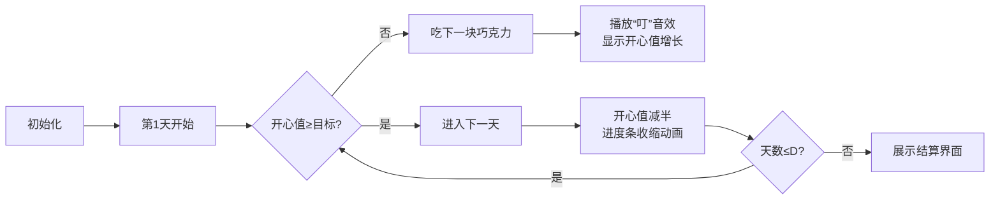

# 题目信息

# [USACO10FEB] Chocolate Eating S

## 题目描述

Bessie has received N (1 <= N <= 50,000) chocolates from the bulls, but doesn't want to eat them too quickly, so she wants to plan out her chocolate eating schedule for the next D (1 <= D <= 50,000) days in order to maximize her minimum happiness level over the set of those days.

Bessie's happiness level is an integer that starts at 0 and halves (rounding down if necessary) over night as she sleeps. However, when she eats chocolate i, her happiness level increases by integer H\_i (1 <= H\_i <= 1,000,000). If she eats chocolates on a day, her happiness for that day is considered the happiness level after she eats the chocolates. Bessie insists that she eat the chocolates in the order that she received them.

If more than one optimal solution exists, print any one of them.

Consider a sequence of 5 chocolates to be eaten over a period of 5 days; they respectively bring happiness (10, 40, 13, 22, 7).

If Bessie eats the first chocolate (10 happiness) on the first day and then waits to eat the others, her happiness level is 10 after the first day.

Here is the complete schedule which turns out to maximize her minimum happiness:

Day  Wakeup happiness   Happiness from eating   Bedtime happiness 1            0                10+40                  50

2           25                 ---                   25

3           12                  13                   25

4           12                  22                   34

5           17                   7                   24

The minimum bedtime happiness is 24, which turns out to be the best Bessie can do.

Bessie 拿到了 $N$（$1 \leq N \leq 5\times 10 ^ 4$）块巧克力。她决定想个办法吃掉这些巧克力，使得它在吃巧克力的这段时间里，最不开心的一天尽可能的开心。并且一共吃 $D$（$1 \leq D \leq 5\times 10 ^ 4$）天。

每块巧克力有一个开心值 $H_i$（$1 \leq H_i \leq 10 ^ 6$），当某天你吃下那块巧克力时，你将获得那块巧克力的开心值。每一天的开心值是所有当天吃掉的巧克力的总开心值之和。每天晚上 Bessie 睡觉之后，它的开心值会减半。也就是说，比如昨天 Bessie 的开心值为 $50$，那么今天早上一醒来就会有 $25$ 点的开心值，舍去小数点后数字。另外，Bessie 还有一个怪癖，她喜欢按照巧克力本来的排列顺序吃。

Bessie 第一天的开心值为 $0$，求一个每天吃巧克力的方案，使得 Bessie 最不开心的一天尽可能的开心。


## 样例 #1

### 输入

```
5 5 
10 
40 
13 
22 
7 
```

### 输出

```
24 
1 
1 
3 
4 
5 
```

# AI分析结果


### 💡 Kay的C++算法解析：Chocolate Eating S 深入学习指南 💡

> 今天我们来分析USACO的经典题目"Chocolate Eating S"，一道融合二分答案与贪心策略的思维挑战。本指南将帮助你掌握最小值最大化问题的解题框架！

---

## 1. 题目解读与核心算法识别

✨ **本题主要考察**：`二分答案` + `贪心应用`

🗣️ **初步分析**：
> 这道题就像规划巧克力冒险旅程——我们需要在D天内按顺序吃掉所有巧克力，确保旅途中最糟糕的一天也能足够开心！核心策略是：
>  - **二分答案**：猜测"最小开心值"的可能范围（0~所有巧克力开心值总和），验证该值是否可实现
>  - **贪心验证**：模拟每天过程，若开心值低于目标就吃巧克力直到达标
> 
> **可视化设计思路**：
>  - 像素动画将展示巧克力队列（彩色方块）和每日开心值进度条
>  - 关键高亮：目标值红线、巧克力被"吃掉"时的消失动画、进度条增减
>  - 复古元素：8-bit音效（吃巧克力"叮"声，达标"胜利"旋律），将每天设计为游戏关卡

---

## 2. 精选优质题解参考

### 题解一（Yae_Sakura）
* **点评**：思路清晰度极佳，完整呈现二分+贪心框架。亮点在于：
  - 用`day[tot]=i`在验证最优解时同步记录食用日期
  - 严格处理未分配巧克力的边界情况（`else printf("%lld\n",d)`）
  - 时间复杂度O(N log SUM)达到理论最优

### 题解二（philosopherchang）
* **点评**：教学价值突出，详细剖析四大坑点：
  - 数据溢出（`unsigned long long`）
  - 未吃完的巧克力需最后一天处理
  - 二次验证确保日期记录准确
  - 输入加速技巧（`ios::sync_with_stdio(false)`）

### 题解三（青无常）
* **点评**：算法健壮性示范：
  - 动态调整日期记录上限（`if(c[i]>d) c[i]=d`）
  - 通过错误案例反向优化边界条件（l从1开始）
  - 清晰的变量命名（`b[]`记录日期，`c[]`存储最终方案）

---

## 3. 核心难点辨析与解题策略

1.  **难点1：如何高效验证目标开心值？**
    * **分析**：贪心模拟需要精确控制双重循环——外层遍历天数（D），内层补充巧克力直到达标。关键技巧：用`>>1`替代`/2`加速运算，用`tot`指针避免巧克力重复食用
    * 💡 **学习笔记**：贪心验证时需保证时间复杂度O(N+D)，否则50000数据会超时

2.  **难点2：如何正确处理方案记录？**
    * **分析**：必须在确定最优解后二次调用check函数记录日期（如题解二）。原因：二分过程中非最优解的日期记录是无效的
    * 💡 **学习笔记**：方案记录与验证分离是解题关键，避免污染最终结果

3.  **难点3：如何应对边界陷阱？**
    * **分析**：三大边界需特殊处理：
      - **数据溢出**：开心值总和>10¹²，必须用long long
      - **未食用巧克力**：最后一天统一处理（`day[i]=0 ? d : day[i]`）
      - **目标值为0**：需特殊判断避免死循环
    * 💡 **学习笔记**：完成主逻辑后，立即检查三大边界是必备习惯

### ✨ 解题技巧总结
- **拆解验证法**：将复杂问题分解为"判断可行性"（check函数）和"记录方案"两个独立步骤
- **滚动指针技巧**：用`tot`指针按序遍历巧克力，避免随机访问破坏顺序性
- **边界预检法**：编码前先列出所有边界（溢出/极值/空数据），设计时针对性处理
- **二次验证机制**：最优解确定后重新验证，确保辅助数据（如食用日期）完全准确

---

## 4. C++核心代码实现赏析

**本题通用核心实现参考**
```cpp
#include <iostream>
using namespace std;
typedef long long ll;
const int N = 50005;

ll n, d, a[N], day[N], ans;

bool check(ll target) {
    ll cur = 0, idx = 0;
    for (int day = 1; day <= d; day++) {
        cur >>= 1; // 每日减半
        while (cur < target && idx <= n) 
            cur += a[++idx]; // 贪心补充巧克力
        if (cur < target) return false;
    }
    return true;
}

int main() {
    cin >> n >> d;
    ll sum = 0, l = 0, r = 0;
    for (int i = 1; i <= n; i++) 
        cin >> a[i], r += a[i];
        
    while (l <= r) { // 二分框架
        ll mid = (l + r) >> 1;
        check(mid) ? ans = mid, l = mid + 1 : r = mid - 1;
    }
    
    check(ans); // 二次验证记录日期
    for (int i = 1; i <= n; i++) 
        cout << (day[i] ? day[i] : d) << endl;
}
```

### 题解一（Yae_Sakura）
* **亮点**：验证与记录分离策略
* **核心代码片段**：
```cpp
bool check(ll x) {
    ll tot = 0, sum = 0;
    for (int i = 1; i <= d; i++) {
        sum >>= 1;
        while (sum < x) {
            sum += a[++tot];
            if (x == ans) day[tot] = i; // 仅记录最优解
        }
    }
    return tot <= n;
}
```
* **代码解读**：
  > `tot`指针严格按序推进巧克力队列
  > 精妙的`if(x==ans)`确保仅最优解记录日期
  > 返回值`tot<=n`暗示巧克力是否够用
* 💡 **学习笔记**：通过参数x与全局ans的联动，实现验证与记录的分离

### 题解二（philosopherchang）
* **亮点**：边界处理完整性
* **核心代码片段**：
```cpp
for (int i = 1; i <= n; i++) {
    if (day[i] != 0) 
        cout << day[i] << endl;
    else  // 关键边界处理
        cout << d << endl; 
}
```
* **代码解读**：
  > 输出时动态检测`day[i]==0`的未记录项
  > 统一赋值为最后一天（`d`）确保所有巧克力被消耗
  > 符合题目"按序吃完"的核心约束
* 💡 **学习笔记**：输出阶段的数据补全能有效规避复杂逻辑

### 题解三（青无常）
* **亮点**：防御性编程实践
* **核心代码片段**：
```cpp
for (int i = 1; i <= n; i++) {
    if (c[i] > d) c[i] = d; // 日期上限保护
    printf("%d\n", c[i]);
}
```
* **代码解读**：
  > `c[i]>d`的防御性检查防止日期越界
  > 将异常值钳制在有效范围（d天内）
  > 增强代码鲁棒性
* 💡 **学习笔记**：对中间数据做有效性验证能避免隐蔽bug

---

## 5. 算法可视化：像素动画演示

### 像素巧克力大冒险（8-bit风格）
**设计目标**：将二分验证转化为可交互冒险游戏



**关键交互设计**：
1. **像素元素**：
   - 巧克力：彩色方块（H_i越大颜色越暖）
   - Bessie牛：像素角色，吃巧克力时张嘴动画
   - 进度条：顶部血条式设计，红/绿分界即目标值

2. **动态演示逻辑**：
   ```python
   # 伪代码实现核心动画
   def visualize_day(day, target):
       current_happiness = previous_day_happiness >> 1  # 位运算动画
       draw_half_effect()  # 进度条收缩像素动画
       
       while current_happiness < target:
           chocolate = pop_next_chocolate()
           play_sound('bite.wav')  # 8-bit音效
           current_happiness += chocolate.value
           animate_progress_bar() 
           mark_chocolate_eaten(day)  # 巧克力打上日期戳
           
       if day == d and chocolates_left:  # 最后一天特判
           eat_all_remaining() 
   ```

3. **游戏化特色**：
   - **关卡制**：每天作为独立关卡，通关解锁次日
   - **评分系统**：根据剩余巧克力数量给予星级
   - **音效方案**：
     * 吃巧克力：短促"叮"声（方波音效）
     * 目标达成：16-bit胜利旋律
     * 验证失败：低沉错误音效

4. **控制面板**：
   ```html
   <!-- HTML实现控制区 -->
   <div class="pixel-panel">
     <button onclick="step()">▶️ 单步执行</button>
     <input type="range" id="speed"> 🐇速度
     <button onclick="reset()">🔄 重置</button>
     <label>目标值：<span id="target">24</span></label>
   </div>
   ```

---

## 6. 拓展练习与相似问题

### 同类问题迁移场景
1. **资源分配问题**：在固定周期内分配有限资源（如电池供电），最大化最小剩余量
2. **时间规划问题**：将任务分配到时间槽，最小化最大负载
3. **路径优化问题**：在限定步数内访问节点，最大化最小收益

### 洛谷推荐练习
1. **P2678 跳石头**  
   → 最小值最大化经典模型，二分答案+贪心验证  
   🗣️ *Kay提示：注意移除石头数限制与距离判断的协同*

2. **P4344 [SHOI2015] 脑洞治疗仪**  
   → 二分答案进阶，结合线段树维护连续区间  
   🗣️ *Kay提示：尝试将"治疗"操作转化为巧克力问题中的"吃巧克力"行为*

3. **P1080 国王游戏**  
   → 贪心策略与高精度结合  
   🗣️ *Kay提示：重点比较按乘积排序与本题目按序处理的异同*

---

## 7. 学习心得与经验分享

> **参考经验（来自 philosopherchang）**：  
> *"我在数据溢出问题上卡了2小时，直到把int改为unsigned long long才通过。这让我意识到：遇到10^5量级的数据时，第一时间该检查中间结果是否可能超过10^10！"*

**Kay的总结**：  
1. **数据敏感度**是竞赛编程核心能力，看到 ∑H_i ≤ 5e4*1e6=5e10 时，立即选择long long
2. **二次验证**策略（先求最优解值，再重新记录方案）能简化逻辑
3. **防御性输出**：对未定义数据显式处理（如`day[i] ? day[i] : d`）

---

> 巧克力之旅暂告段落，但算法探索永无止境！记住：**优秀的解题框架=严谨二分验证+鲁棒边界处理+清晰方案记录**。下次挑战见！🚀

---
处理用时：163.55秒