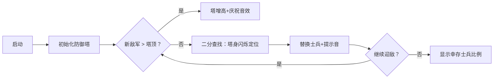

# 题目信息

# 递增

## 题目描述

现有数 $A_1,A_2,\cdots,A_n$，修改最少的数字为**实数**，使得数列严格单调递增。

注：原题误表述为修改为整数，现已纠正为实数。本题数据确保按照修改为整数的做法也可以 AC（只是不能过样例）

## 说明/提示

• 对于50% 的数据，$N \le 10^3$

• 对于100% 的数据，$1 \le N \le 10^5 , 1 \le A_i \le 10^9$


## 样例 #1

### 输入

```
3
1 3 2```

### 输出

```
1```

## 样例 #2

### 输入

```
8
1 2 3 4 4 5 6 7```

### 输出

```
1```

# AI分析结果


### 💡 Kay的C++算法解析：递增 深入学习指南 💡

> 今天我们来分析「递增」这道C++编程题。本指南将帮助你理解题目核心、掌握LIS算法实现，并通过像素动画直观感受算法执行过程。记住：修改最少数字 ⇔ 保留最长递增序列！

---

## 1. 题目解读与核心算法识别

✨ **本题主要考察**：`动态规划与贪心优化（LIS问题）`  
🗣️ **初步分析**：
> 想象你有一列士兵（数字）需要按身高严格递增排列。修改最少数字 ⇔ 保留尽可能多的"合格士兵"（即最长递增子序列）。**关键策略**：  
> - 核心算法是求最长递增子序列（LIS）长度 `len`，答案 = `n - len`  
> - 优化点：暴力DP（O(n²)）会超时，必须用贪心+二分（O(n log n)  
>  
> **可视化设计思路**：  
> 我们将用8位像素风格（类似FC游戏）展示：  
> ① 数字序列显示为彩色像素方块（绿色：已加入LIS，红色：待处理）  
> ② DP数组显示为右侧的"像素塔"（高度=当前LIS长度）  
> ③ 当前数字高亮闪烁，若大于塔顶则塔增高（"叮"音效）；否则二分查找替换位置（"咔"音效+路径闪烁）

---

## 2. 精选优质题解参考

### 题解一（作者：The_Key）
* **点评**：思路直击要害——用`lower_bound`实现贪心二分，代码简洁易读（22行）。亮点在于：  
  - 用`f[++now]`动态扩展LIS序列，逻辑清晰  
  - 边界处理隐含在`lower_bound`中，避免冗余判断  
  - 实践价值高：竞赛中可快速实现（需注意数组开够）

### 题解二（作者：fls233666）
* **点评**：教学价值突出——从暴力DP逐步优化到二分，并强调**关键洞见**：  
  > "DP数组保存的不一定是真实LIS序列，但长度一定正确"  
  - 完整呈现算法演进：O(n²) → O(n²)优化 → O(n log n)  
  - 详细解释`lower_bound`用法（附代码注释）  
  - 特别适合初学者理解算法本质

### 题解三（作者：一扶苏一）
* **点评**：提供**创新解法**——树状数组求LIS（同O(n log n)）：  
  - 亮点：通过离散化+树状数组维护前缀最大值  
  - 代码规范性高：模块化（`init_hash`, `ask`, `change`）  
  - 适合想拓展思路的学习者（需掌握树状数组基础）

---

## 3. 核心难点辨析与解题策略

### 关键点1：问题转化（最少修改 ⇔ 最长保留）
* **分析**：本质是寻找隐藏的递增子序列。优质解法定义`dp[i]`为长度为i的LIS最小末尾值，通过维护此数组避免无效比较
* 💡 学习笔记：**LIS长度是核心，实际序列无需保留**

### 关键点2：二分查找的精准应用
* **分析**：当`a[i] <= dp[len]`时，需在`dp[1..len]`中找到首个≥`a[i]`的位置替换。难点在于：  
  - 必须保持`dp`数组单调性（用`lower_bound`精准定位）  
  - 替换后可能破坏原序列？→ 不影响长度计算（贪心思想）
* 💡 学习笔记：**二分查找是O(n log n)的关键**

### 关键点3：数据结构的选择
* **分析**：  
  | 方法          | 优势                     | 适用场景          |
  |---------------|--------------------------|-----------------|
  | 贪心+二分     | 代码简练，空间O(n)       | 标准LIS问题      |
  | 树状数组      | 可扩展性强               | 需结合其他条件时 |
* 💡 学习笔记：**99%场景选贪心+二分足矣**

### ✨ 解题技巧总结
1. **问题转化思维**：将"最少修改"转化为"最长保留序列"  
2. **STL利器**：熟练使用`lower_bound`/`upper_bound`  
3. **防御性编程**：数组开够（`n+5`）、离散化防溢出  
4. **验证工具**：写完代码用样例模拟DP数组变化

---

## 4. C++核心代码实现赏析

### 本题通用核心实现（综合优质题解）
```cpp
#include <iostream>
#include <algorithm>
using namespace std;

const int MAXN = 100010;
int dp[MAXN]; // dp[i]: 长度为i的LIS的最小末尾值

int main() {
    int n, num, len = 0;
    cin >> n;
    cin >> num;
    dp[++len] = num; // 第一个数直接加入

    for (int i = 2; i <= n; ++i) {
        cin >> num;
        if (num > dp[len]) dp[++len] = num;  // 扩展序列
        else {
            // 二分找到替换位置（lower_bound返回指针）
            int pos = lower_bound(dp + 1, dp + len + 1, num) - dp;
            dp[pos] = num;
        }
    }
    cout << n - len << endl;
    return 0;
}
```
**代码解读概要**：  
- 初始化：读首元素 → `dp[1]`  
- 核心循环：若当前数 > `dp[len]`则追加；否则二分查找替换位置  
- 精妙之处：`lower_bound`在有序区间`[dp+1, dp+len+1)`中定位  

### 题解一（The_Key）片段
```cpp
*lower_bound(f+1, f+now+1, num) = num; // 替换操作
sum++;  // 修改计数
```
**亮点**：巧用STL一行实现二分插入  
**解读**：  
> `lower_bound`返回首个**≥num**的迭代器，直接解引用赋值完成替换。此处`sum`统计修改次数，但注意：**最终答案只需`n-len`，此变量可省略**

### 题解二（fls233666）片段
```cpp
int pos = lower_bound(sa, sa + ans, a[i]) - sa;
sa[pos] = a[i];  // 精准替换
```
**亮点**：完整呈现二分查找过程  
**解读**：  
> 作者将`dp`数组命名为`sa`，通过指针差值计算下标。注意：`ans`即当前LIS长度，此写法需保证`sa[0]`不参与计算

### 题解三（一扶苏一）树状数组片段
```cpp
void change(int x, ci v) {  // 树状数组更新
    while(x <= n) {
        tree[x] = mmax(tree[x], v);
        x += lowbit(x);
    }
}
```
**亮点**：树状数组维护前缀最大值  
**解读**：  
> 离散化后，用`tree[x]`存储以值`x`结尾的LIS长度。更新时沿`lowbit`路径向上传播最大值。复杂度同二分法，但代码量大

---

## 5. 算法可视化：像素动画演示

### 主题：**「像素指挥官：LIS防御战」**
> 敌军（数字序列）来袭！你的任务是指挥绿色士兵（LIS序列）构筑防御塔（DP数组），用最少的兵力调整守住阵地！

### 演示流程（关键帧）：


### 交互设计：
1. **像素风格**：  
   - 数字显示为16x16像素块（绿：LIS成员，灰：待处理）  
   - DP塔：右侧堆叠的像素柱（高度=当前LIS长度）
   
2. **音效系统**：  
   - 正确入塔：8-bit "叮！"（FC游戏金币声）  
   - 替换操作：短促"咔！"（俄罗斯方块旋转声）  
   - 游戏通关：超级玛丽过关音乐

3. **控制面板**：  
   ```javascript
   // 伪代码：核心动画逻辑
   function visualizeStep(num) {
       highlight(num); // 当前数字闪烁
       if (num > dp.last()) {
           dp.push(num); 
           playSound('ding');
           drawTower(); // 塔增高动画（像素块上浮）
       } else {
           let pos = binarySearch(dp, num); // 塔身二分闪烁
           dp[pos] = num;
           playSound('click');
           showHint(`替换位置：${pos}`); // 像素文字气泡
       }
   }
   ```

---

## 6. 拓展练习与相似问题

### 举一反三：
1. **变形思考**：若要求**严格递减**序列？ → 反转数组+同样解法  
2. **进阶挑战**：若只能修改为**整数**？ → 需满足 `a[i] ≥ a[i-1]+1`（转化：令 `b[i] = a[i]-i` 求非严格LIS）

### 洛谷推荐：
1. **P1020 导弹拦截**  
   → 双倍经验！直接应用LIS解法（系统数 = 最长反链）  
2. **P1091 合唱队形**  
   → 双向LIS应用，训练状态定义能力  
3. **P1439 最长公共子序列**  
   → LIS的变种，掌握问题转化的经典案例  

---

## 7. 学习心得与经验分享

> **来自fls233666的调试经验**：  
> *"第一次写二分查找时，我总纠结DP数组不是真实LIS序列。后来明白：我们只关心长度！"*  
>  
> **Kay点评**：这是算法学习的关键突破——理解核心目标（本题只需长度），避免过度纠结实现细节。调试时可打印DP数组观察趋势，不必苛求完美序列。

---

> 本次解析到此结束。记住：LIS问题是动态规划的入门石，务必亲手模拟DP数组变化！下次遇到数列问题，试试问自己：**能否转化为LIS？** 保持思考，编程之旅会更精彩！ 🚀

---
处理用时：178.15秒