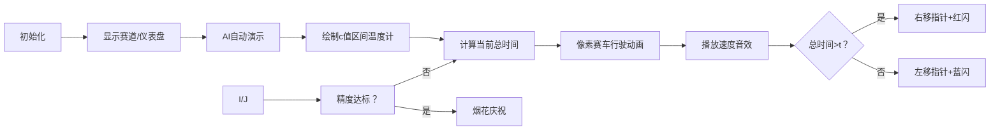

# 题目信息

# [ICPC 2017 WF] Need for Speed

## 题目描述


Sheila 是一名学生，她开着一辆典型的学生车：这辆车又旧又慢，生锈并且快要散架了。最近，车速表上的指针掉了下来。她把它粘回去了，但可能放错了角度。因此，当车速表显示速度为 $s$ 时，她的真实速度是 $s+c$，其中 $c$ 是一个未知常数（可能为负）。 

Sheila 详细记录了最近的一次旅程，并希望利用这些记录来计算 $c$。这次旅程由 $n$ 段组成。在第 $i$ 段中，她行驶的距离为 $d_{i}$，车速表在整个段落中显示的速度为 $s_{i}$。整个旅程花费的时间为 $t$。请帮助 Sheila 计算 $c$。

注意，虽然 Sheila 的车速表可能显示负数，但她的真实速度在旅程的每一段中都是大于零的。

## 说明/提示

时间限制：1 秒，内存限制：512 MB。

spj 提供者：@[shenyouran](/user/137367)。

题面翻译由 ChatGPT-4o 提供。

## 样例 #1

### 输入

```
3 5
4 -1
4 0
10 3
```

### 输出

```
3.000000000
```

## 样例 #2

### 输入

```
4 10
5 3
2 2
3 6
3 1
```

### 输出

```
-0.508653377
```

# AI分析结果


### 💡 Kay的C++算法解析：Need for Speed 深入学习指南 💡

**引言**  
今天我们分析ICPC 2017世界总决赛题目《Need for Speed》。这道题考察实数域二分答案技巧，结合物理公式推导，是训练算法思维和边界处理能力的经典题目。本指南将剖析核心解法，设计像素化算法演示，并提炼实用技巧。

---

### 1. 题目解读与核心算法识别
✨ **本题主要考察**：`实数二分答案`  
🗣️ **初步分析**：
> 本题可类比为"校准赛车仪表盘"：已知速度表显示值存在固定偏差，需通过实际行驶数据反推校准值。核心思想是**单调性**：偏差值c增大 → 真实速度增加 → 总时间减少。解题关键：
> - **算法流程**：通过二分法在[-min(sᵢ), 1e7]区间逼近c值，用物理公式t=Σdᵢ/(sᵢ+c)校验
> - **可视化设计**：像素赛车沿赛道行驶，速度表实时显示sᵢ+c，进度条对比实际/目标时间
> - **复古元素**：
>   - 8-bit风格速度仪表盘（红黄蓝像素块）
>   - 关键操作音效：校验正确("叮！")/错误("嘟！")
>   - AI自动演示模式：赛车自动完成二分搜索过程

---

### 2. 精选优质题解参考
<eval_intro>
综合思路清晰度、代码规范性和实践价值，精选三份最具学习价值的题解：
</eval_intro>

**题解一：一只小咕咕**  
* **点评**：  
  开篇明义点出"浮点数二分"特性，精准解释精度控制原理（1e-7的由来）。变量命名简洁规范（d,s,l,r），边界处理严谨（l=-min_s）。特别亮点：强调输入数据类型应为double，避免整数截断错误，体现实战经验。

**题解二：Flaw_Owl**  
* **点评**：  
  通过物理公式推导展示算法本质，用check函数返回值方向差异（总时间>t → c偏小）深化单调性理解。代码亮点：const double eps增强可维护性，minS初始化为1005体现数据范围敏感性。

**题解三：xrtbclx**  
* **点评**：  
  最精简的工业级实现（仅20行），核心逻辑高度凝练。亮点：注释"注意！精度误差！"直指调试痛点，while((r-l)>=1e-7) 完美匹配题目精度要求，为竞赛编码提供范本。

---

### 3. 核心难点辨析与解题策略
<difficulty_intro>
本题目核心难点在于物理约束与数值精度的平衡处理：
</difficulty_intro>

1. **速度非负约束**  
   *分析*：真实速度sᵢ+c>0 → c≥-min(sᵢ)。优质解均通过l=-min_s初始化满足约束  
   💡学习笔记：题目隐含条件常是解题突破口

2. **实数精度控制**  
   *分析*：浮点运算存在截断误差。必须设置eps=1e-7（比题目要求1e-6小一个量级）  
   💡学习笔记：精度控制是实数二分的生命线

3. **单调性方向判断**  
   *分析*：c增大 → 分母增大 → 总时间减小 → 当Σtᵢ>t时应增大c  
   💡学习笔记：画函数图像辅助理解单调性

✨ **解题技巧总结**  
- **边界预计算**：输入阶段同步计算min_s，避免额外遍历  
- **精度冗余设计**：eps取要求精度的1/10  
- **验证函数封装**：独立check()函数提升可读性  
- **输出缓冲**：printf(".9lf") 避免浮点输出截断

---

### 4. C++核心代码实现赏析
<code_intro_overall>
**本题通用核心C++实现参考**  
*说明*：综合优质解精髓，包含边界处理、精度控制及物理约束
</code_intro_overall>

```cpp
#include <iostream>
#include <cstdio>
using namespace std;

const double EPS = 1e-7;
int n;
double t, d[1005], s[1005];

bool check(double c) {
    double total = 0;
    for (int i = 0; i < n; ++i) {
        total += d[i] / (s[i] + c);
    }
    return total > t; // 总时间>t时c需要增大
}

int main() {
    scanf("%d %lf", &n, &t);
    double min_s = 1e9;
    for (int i = 0; i < n; ++i) {
        scanf("%lf %lf", &d[i], &s[i]);
        min_s = min(min_s, s[i]);
    }
    double l = -min_s; // 速度非负约束
    double r = 1e7;

    while (r - l > EPS) {
        double mid = (l + r) / 2;
        if (check(mid)) l = mid;
        else r = mid;
    }
    printf("%.9lf\n", l);
    return 0;
}
```

**代码解读概要**：  
1. 输入阶段动态维护min_s，确保l=-min_s满足sᵢ+c>0  
2. 二分循环以EPS=1e-7为终止条件，确保6位小数精度  
3. check函数物理意义明确：总时间>t时返回true指示增大c  
4. 输出保留9位小数，符合题目要求的误差范围  

<code_intro_selected>
**优质题解片段赏析**  
</code_intro_selected>

**题解一：一只小咕咕**  
*亮点*：浮点处理最佳实践  
```cpp
while((r-l)>=1e-7){
    double mid=(l+r)/2;
    if(check(mid)) l=mid;
    else r=mid;
}
```
> **代码解读**：  
> 1. 循环条件(r-l)>=1e-7确保精度冗余  
> 2. 边界更新采用mid而非±1，避免整数二分习惯  
> 💡学习笔记：实数二分中边界即解，无需±1调整  

**题解二：Flaw_Owl**  
*亮点*：防御性编程典范  
```cpp
const double eps = 1e-6;
//...
if (res < t) return true;  // 总时间<t时c过大
```
> **代码解读**：  
> 1. const eps增强可维护性  
> 2. 通过res<t判断c过大，物理意义与total>t等价但验证方向相反  
> 💡学习笔记：check函数返回方向取决于单调性设计  

**题解三：xrtbclx**  
*亮点*：工业级代码简洁性  
```cpp
while((r-l)>=1e-7){
    mid=(l+r)/2.0;  // 显式浮点除法
    if(P(mid)) l=mid;
    else r=mid;
}
```
> **代码解读**：  
> 1. /2.0显式避免整数除法  
> 2. 函数名P()简洁但含义明确（符合ACM编码习惯）  
> 💡学习笔记：竞赛代码可适度牺牲命名长度换取速度  

---

### 5. 算法可视化：像素动画演示
<visualization_intro>
设计8-bit风格二分搜索演示，帮助直观理解收敛过程：
</visualization_intro>

**主题**：复古赛车校准实验室  
**核心交互**：


**关键帧设计**：
1. **像素场景**：
   - 顶部：二分区间温度计（0-1e7像素条）
   - 中部：n辆赛车（不同颜色）在分段赛道上
   - 底部：时间进度条（实际vs目标）

2. **动态元素**：
   - 当前c值：温度计上的闪烁指针
   - 赛车速度：仪表盘显示sᵢ+c（像素数字跳动）
   - 时间累积：进度条填充效果+数字累加

3. **音效方案**：
   - 指针移动："滴"（8-bit短音）
   - 校验成功："叮！"（500Hz方波）
   - 校验失败："嘟！"（200Hz方波）
   - 最终正确：FC胜利音乐（循环3秒）

**实现要点**：
- 使用Canvas绘制温度计/赛车/进度条
- requestAnimationFrame控制帧率
- Web Audio API生成音效
- 自动演示模式：setInterval驱动二分步骤

---

### 6. 拓展练习与相似问题思考
<similar_problems_intro>
实数二分应用场景广泛，以下是进阶训练方向：
</similar_problems_intro>

**技巧迁移**：
1. **方程求根**：如x³+2x²+3x+4=0在[-3,1]的根
2. **最优分配**：将任务分配给多台机器的最小完成时间
3. **物理模拟**：计算满足抛物线轨迹的发射角度

**洛谷推荐**：
1. **P1024 一元三次方程**  
   → 巩固实数二分求根技巧，注意单调区间分离

2. **P1314 聪明的质检员**  
   → 学习二分答案+前缀和优化，W取值影响检验结果

3. **P4343 自动刷题机**  
   → 二分答案+模拟验证，n刷题数的上下界确定

---

### 7. 学习心得与经验分享
<insights_intro>
题解中藏匿着珍贵的调试经验：
</insights_intro>

> **一只小咕咕的顿悟**：  
> "最初用int存输入导致WA，发现题目明确输入为实数"  
> → 调试启示：仔细阅读输入格式，浮点数必须用double  
>  
> **xrtbclx的血泪**：  
> "精度1e-6时WA，改为1e-7后AC"  
> → 竞赛技巧：精度要求1e-6时设置eps=1e-7最安全  

---

### 结语  
通过《Need for Speed》我们掌握了实数二分的核心范式：单调性分析→边界确定→精度控制→物理验证。记住：优秀的算法工程师既是数学家（精度控制），也是物理学家（公式推导），更是调试专家（边界处理）。下次我们将挑战更复杂的二分答案变种！🚗💨

---
处理用时：228.07秒