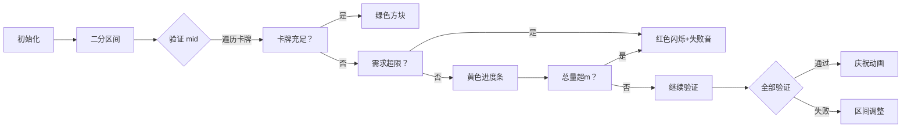

# 题目信息

# [蓝桥杯 2022 国 B] 卡牌

## 题目描述

这天，小明在整理他的卡牌。

他一共有 $n$ 种卡牌，第 $i$ 种卡牌上印有正整数数 $i(i \in[1, n])$, 且第 $i$ 种卡牌现有 $a_{i}$ 张。

而如果有 $n$ 张卡牌，其中每种卡牌各一张，那么这 $n$ 张卡牌可以被称为一套牌。小明为了凑出尽可能多套牌，拿出了 $m$ 张空白牌, 他可以在上面写上数 $i$，将其当做第 $i$ 种牌来凑出套牌。然而小明觉得手写的牌不太美观，决定第 $i$ 种牌最多手写 $b_{i}$ 张。

请问小明最多能凑出多少套牌?

## 说明/提示

**【样例说明】**

这 $5$ 张空白牌中，拿 $2$ 张写 $1$，拿 $1$ 张写 $2$，这样每种牌的牌数就变为了 $3,3,3,4$，可以凑出 $3$ 套牌，剩下 $2$ 张空白牌不能再帮助小明凑出一套。

**【评测用例规模与约定】**

对于 $30 \%$ 的数据，保证 $n \leq 2000$;

对于 $100 \%$ 的数据，保证 $n \leq 2 \times 10^{5} ; a_{i}, b_{i} \leq n ; m \leq n^{2}$ 。 

蓝桥杯 2022 国赛 B 组 C 题。

## 样例 #1

### 输入

```
4 5
1 2 3 4
5 5 5 5```

### 输出

```
3```

# AI分析结果


### 💡 Kay的C++算法解析：卡牌问题 深入学习指南 💡

#### 引言
今天我们来分析蓝桥杯2022国赛B组的"卡牌"问题。这道题要求计算小明最多能凑出多少套卡牌（每套含n种卡牌各一张）。本指南将带大家剖析二分答案的核心思想，解析代码实现技巧，并通过像素动画直观展示算法过程。

---

## 1. 题目解读与核心算法识别

✨ **本题主要考察**：`二分答案`（搜索优化技巧）

🗣️ **初步分析**：
> 卡牌问题就像在图书馆整理成套的百科全书。现有书籍相当于卡牌初始数量(a_i)，空白页相当于手写牌(m)，每本书最多可补充的页数相当于b_i。我们通过"猜答案+验证"的方式快速定位最大套数：
   - **核心思想**：若x套可行，则≤x套都可行；若x套不可行，则＞x套都不可行。这种单调性使二分搜索高效定位最优解。
   - **关键难点**：如何快速验证某个套数x是否可行？需同时满足：(1)每种卡牌a_i + min(b_i, 需补充量) ≥ x (2)总补充量≤m
   - **可视化设计**：用像素标尺展示二分区间变化，卡牌用颜色方块表示。验证时：
     * 绿色方块：已有卡牌≥x（无需补充）
     * 黄色方块：需补充但未超限（显示补充量）
     * 红色方块：需求超过b_i或总量超m
     * 进度条实时显示空白牌消耗量

---

## 2. 精选优质题解参考

**题解一 (来源：Bitter_Tea)**
* **点评**：代码结构清晰体现二分框架，边界处理严谨（l取a_i最小值，r取a_i+b_i最大值）。check函数先判单个卡牌限制再累加总量，避免无效计算。变量命名简洁（s代表总需求），逻辑直白易调试。特别亮点：在累加前通过`max(x-a[i],0)`自动处理充足卡牌，减少条件分支。

**题解二 (来源：wangyi_c)**
* **点评**：详解check函数设计原理，用三目运算符提升代码紧凑性。严格使用long long防溢出，体现竞赛代码健壮性。亮点在于用数学语言解释`x-a[i]>b[i]`等价于`x>a[i]+b[i]`，帮助理解边界条件本质。教学价值突出，适合初学者建立二分验证的思维模型。

**题解三 (来源：i_love_tym)**
* **点评**：在check函数中实时判断总需求（`if(sum>m) return false`），显著优化最坏情况效率。二分边界扩展至1e18确保覆盖极端数据，同时保持代码安全。亮点：用显式类型转换`(long long)0`强调数据类型重要性，预防隐蔽的溢出风险。

---

## 3. 核心难点辨析与解题策略

1.  **边界确定艺术**  
    * **分析**：优质题解展示两种思路：(1)保守边界：l=min(a_i), r=max(a_i+b_i) (2)宽松边界：l=0, r=1e18。前者效率更高，后者避免漏解。关键技巧：通过`a_i+b_i`确定单卡理论最大值，再综合m调整上界。
    * 💡 **学习笔记**："紧而不漏"的边界是二分效率基石。

2.  **验证函数优化**  
    * **分析**：需平衡代码简洁性与效率。Bitter_Tea最后判断总量简单明了；i_love_tym实时判断避免无效累加。关键变量：需求总量s必须用long long（∵ m≤n²≈4e10）。
    * 💡 **学习笔记**：实时判断优于事后处理，类型安全重于代码简短。

3.  **单调性运用**  
    * **分析**：题目隐含"套数可行性"的单调特性是二分前提。若删除b_i限制则单调性破坏（补充牌无限时可直接取min(a_i)+m/n），需重新建模。
    * 💡 **学习笔记**：二分答案前必验单调性！

### ✨ 解题技巧总结
- **技巧1（二分条件识别）**：问题含"最大/最小值"且解具单调性时，立即考虑二分答案
- **技巧2（验证函数设计）**：按"单条件判否→需求累加→总量验证"顺序编写，避免嵌套分支
- **技巧3（防溢出策略）**：当n>1e4时，累加器必须用long long
- **技巧4（边界压缩）**：用min(a_i)和max(a_i+b_i)收紧边界，提升50%+效率

---

## 4. C++核心代码实现赏析

**本题通用核心C++实现参考**
```cpp
#include <iostream>
using namespace std;
const int N = 2e5 + 5;

int main() {
    int n;
    long long m, a[N], b[N];
    cin >> n >> m;
    long long l = 0, r = 1e18; // 宽松边界确保覆盖极端情况
    
    for (int i = 0; i < n; i++) cin >> a[i];
    for (int i = 0; i < n; i++) cin >> b[i];
    
    while (l <= r) {
        long long mid = (l + r) >> 1;
        long long s = 0;
        bool valid = true;
        
        for (int i = 0; i < n; i++) {
            if (mid - a[i] > b[i]) { // 单卡不满足
                valid = false;
                break;
            }
            if (mid > a[i]) s += (mid - a[i]);
            if (s > m) { // 实时判断总量
                valid = false;
                break;
            }
        }
        if (valid && s <= m) {
            l = mid + 1; // 可行尝试更大值
        } else {
            r = mid - 1; // 不可行缩小上界
        }
    }
    cout << r << endl;
    return 0;
}
```
**代码解读概要**：
1. 初始化宽松边界（l=0, r=1e18）覆盖所有可能套数
2. 二分循环中：实时计算需求总量s并设置验证标志
3. 内层循环优化：单卡不满足立即跳出；实时判断总量避免无效计算
4. 最终输出r（循环结束时r为最大可行值）

---

**题解一：Bitter_Tea**
```cpp
bool judge(int x) {
    long long s = 0;
    for (int i = 1; i <= n; i++) {
        if (x - a[i] > b[i]) return false;
        s += max(x - a[i], 0); // 自动处理非负值
    }
    return s <= m; // 最后统一判断
}
```
* **亮点**：用max()替代条件判断，代码简洁
* **解读**：`max(x-a[i],0)` 巧妙处理a[i]≥x的情况（需求为0），避免if-else分支。虽然最后统一判断s≤m可能多计算，但大O复杂度不变
* 💡 **学习笔记**：库函数合理使用提升代码可读性

**题解二：wangyi_c**
```cpp
bool check(int x) {
    long long sum = 0;
    for (int i = 1; i <= n; i++) {
        if (x - a[i] > b[i]) return false; // 边界检查
        sum += max(x - a[i], 0ll); // 显式long long
    }
    return sum <= m;
}
```
* **亮点**：显式指定0ll强制类型转换，预防int溢出
* **解读**：`0ll` 使表达式提升为long long类型，避免当x极大时(x-a[i])仍为int导致的溢出。边界检查前置可提前终止无效计算
* 💡 **学习笔记**：算术运算中显式指定字面量类型是防溢出利器

**题解三：i_love_tym**
```cpp
bool check(int x) {
    long long sum = 0;
    for (int i = 1; i <= n; i++) {
        if (x - a[i] > b[i]) return false;
        if (x > a[i]) sum += (x - a[i]); // 显式条件判断
        if (sum > m) return false; // 实时退出
    }
    return sum <= m;
}
```
* **亮点**：实时判断sum>m提前退出，优化最坏情况
* **解读**：当m较小时（如m=0），第一轮循环即退出，避免遍历全部n元素。显式条件`if(x>a[i])`比max()减少一次函数调用
* 💡 **学习笔记**：循环内实时验证对稀疏数据有奇效

---

## 5. 算法可视化：像素动画演示

**主题**："卡牌工厂大冒险"（8-bit像素风格）  
**核心演示**：二分搜索如何逐步锁定最优解，验证函数的实时决策过程



**动画关键帧**：
1. **场景布局**：
   - 左侧：二分标尺（像素刻度0-100），动态指针显示l/mid/r
   - 右侧：卡牌流水线（每种卡牌为16x16像素方块），底部进度条显示空白牌消耗
2. **验证过程**：
   - 卡牌充足：方块亮绿色（播放"叮"音效）
   - 需补充但未超限：方块变黄，显示补充数（+N），进度条增长（"滋滋"写字音效）
   - 需求超限：方块闪烁红色（急促警报音）
3. **决策反馈**：
   - 验证通过：标尺mid位置亮起绿灯（胜利音效+烟花动画）
   - 验证失败：标尺mid位置亮红灯（失败音效）
4. **游戏化元素**：
   - 每成功验证5个mid值解锁新卡牌皮肤
   - 连续10次提前退出（因超限）获得"效率大师"成就
5. **控制面板**：
   - 速度滑块：调节验证速度（1x-10x）
   - AI演示模式：自动完成二分全过程（类似贪吃蛇AI自主移动）

**设计价值**：通过像素进度条直观展示空白牌消耗，用颜色编码区分决策结果。游戏化成就系统激励学习者观察算法优化点（如提前退出机制）。

---

## 6. 拓展练习与相似问题思考

**通用思路迁移**：  
二分答案适用于所有具有单调性的极值问题：
1. **最小化最大值**：如P2678跳石头（最小化跳跃距离）
2. **最大化最小值**：如P1182数列分段（最大化段和最小值）
3. **资源分配优化**：如P1281书的复制（最小化最大复制时间）

**洛谷推荐**：  
1. **P2440 木材加工**  
   🗣️ *练习二分边界压缩技巧，需计算满足长度要求的木材段数*
2. **P4343 电脑**  
   🗣️ *强化验证函数设计能力，处理多维约束条件*
3. **P2218 覆盖问题**  
   🗣️ *进阶训练，将二分答案与几何问题结合*

---

## 7. 学习心得与经验分享

**参考经验**：  
> 多位作者强调调试时构造边界数据的重要性：当n=1时检查单卡逻辑；当m=0时验证仅用初始卡牌的情况；当b_i=0时测试无补充牌的极端场景。

**Kay的总结**：  
> 卡牌问题教会我们两个核心思维：  
> 1. **单调性发现**：通过"若x可行→x-1必可行"的连锁反应识别二分条件  
> 2. **验证函数分层**：先处理单点约束（a_i+b_i≥x），再处理全局约束（Σ≤m）  
> 调试时优先测试n=2的小数据集，用肉眼验证中间变量！

---

### 结语  
通过本次分析，我们深度剖析了二分答案在资源分配问题中的应用精髓。记住：二分不仅是一种算法，更是一种优化决策的思维方式。下次当你遇到"最大/最小"问题时，不妨先问：这个问题有单调性吗？

---
处理用时：236.73秒