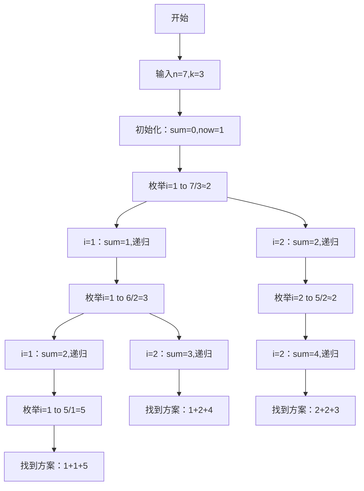

# 题目信息

# [NOIP 2001 提高组] 数的划分

## 题目描述

将整数 $n$ 分成 $k$ 份，且每份不能为空，任意两个方案不相同（不考虑顺序）。

例如：$n=7$，$k=3$，下面三种分法被认为是相同的。

$1,1,5$;   
$1,5,1$;   
$5,1,1$.

问有多少种不同的分法。


## 说明/提示

四种分法为：  
$1,1,5$;  
$1,2,4$;  
$1,3,3$;  
$2,2,3$.

**【题目来源】**

NOIP 2001 提高组第二题

## 样例 #1

### 输入

```
7 3
```

### 输出

```
4
```

# AI分析结果


# 💡 Kay的C++算法解析：数的划分 深入学习指南 💡

> "编程如探险，算法如地图。今天我们一起探索整数划分的奇妙世界！" —— Kay

## 1. 题目解读与核心算法识别

✨ **本题主要考察**：`动态规划 / 搜索剪枝` 

🗣️ **初步分析**：
> 解决"数的划分"这道题，关键在于理解并运用**动态规划**或**搜索剪枝**。简单来说：
> - **动态规划**就像搭积木，用小积木的组合方式推导大积木的搭建方案
> - **搜索剪枝**则像迷宫探险，通过设置"安全通道"避免进入死胡同
>
> 在本题中，这两种方法主要用于**计算将整数n划分为k个非空部分的方案数**：
> - **核心难点**：避免重复计数（如1+1+5与5+1+1视为相同）
> - **解决方案**：动态规划通过状态定义解决重复问题；搜索通过强制递增顺序避免重复
>
> **可视化设计思路**：
> - 动态规划：展示二维DP表格填充过程，高亮状态转移路径
> - 搜索剪枝：显示搜索树，用不同颜色标记有效分支和剪枝分支
> - 复古像素风格：FC红白机界面，网格展示数字划分过程，每步操作伴随"叮"音效

---

## 2. 精选优质题解参考

### 题解一：s_r_f (动态规划)
* **点评**：
> 这份题解思路清晰直白，核心在于状态定义`f[i][x]`（i分成x份的方案数）和精妙的状态转移方程`f[i][x]=f[i-1][x-1]+f[i-x][x]`。代码规范简洁，变量名`f[i][x]`含义明确，边界处理严谨（特别处理了`i<x`和`i=x`的情况）。算法采用标准DP，空间复杂度O(nk)，实践价值高，可直接用于竞赛。亮点在于对状态转移的物理解释（"有1"和"无1"两种情况），帮助理解DP本质。

### 题解二：Trinity (DFS+剪枝)
* **点评**：
> 提供DFS和DP双解法，思路清晰互补。DFS解法亮点在于剪枝策略：通过`i<=num/part`限制枚举范围（上界为剩余数字平均值），并采用`i>=a[k-1]`保证递增顺序避免重复。代码结构工整，递归参数设计合理（`num`, `part`, `now`），边界处理明确（`part==1`时返回1）。实践价值高，特别适合帮助理解搜索优化技巧。

### 题解三：Clouder (优化DP)
* **点评**：
> 提出O(nk)优化DP解法，亮点在于空间优化技巧：使用滚动数组（600大小）和指针映射技术`f[i]=dp[pos(i)]`避免大数组乘法运算。代码实现巧妙，通过`pointer`循环避免求余运算。虽然代码稍复杂，但算法优化程度高，解决了大数据的MLE和TLE问题，展示了高效解决大规模问题的进阶技巧。

---

## 3. 核心难点辨析与解题策略

### 难点1：如何避免重复计数
* **分析**：
> 题目要求不同顺序视为相同方案（如1+1+5≡5+1+1）。优质解法采用两种策略：
> - DP：隐含顺序保证（通过状态转移自然保证非递减）
> - DFS：强制枚举顺序（从上一个数开始枚举）
* 💡 **学习笔记**：解决划分问题必须固定顺序！

### 难点2：状态定义与转移设计
* **分析**：
> DP解法中：
> - `f[i][x]`定义：i分成x份的方案数
> - 状态转移：`f[i][x] = f[i-1][x-1]（含1） + f[i-x][x]（不含1）`
> DFS解法中：
> - 参数设计：`(当前和, 剩余份数, 当前最小值)`
> - 剪枝条件：`当前数 ≥ 前一个数`且`当前数 ≤ 剩余和/剩余份数`
* 💡 **学习笔记**：好的状态定义是解题的基石

### 难点3：复杂度优化
* **分析**：
> 原始DP空间O(nk)可能MLE：
> - 滚动数组：只保留必要状态
> - 指针映射：`f[i] = dp[pos(i)]`避免大数组乘法
> DFS原始复杂度指数级：
> - 上下界剪枝：将枚举范围从指数降到多项式
* 💡 **学习笔记**：优化 = 减少状态 + 减少无效搜索

### ✨ 解题技巧总结
1. **问题分解艺术**：将大问题拆解为子问题（如DP的状态分解）
2. **剪枝策略**：上下界剪枝（剩余平均值）和顺序约束
3. **空间优化**：滚动数组（仅保留必要状态）
4. **边界处理**：DP初始化`f[i][1]=1`，DFS处理`part==1`
5. **避免重复**：固定划分顺序（关键！）

---

## 4. C++核心代码实现赏析

### 本题通用核心C++实现参考
```cpp
#include <iostream>
using namespace std;

int main() {
    int n, k, dp[210][10] = {};
    cin >> n >> k;
    
    // 初始化边界
    for (int i = 1; i <= n; i++) dp[i][1] = 1;
    
    // DP状态转移
    for (int i = 2; i <= n; i++)
        for (int x = 2; x <= k; x++)
            if (i > x) dp[i][x] = dp[i-1][x-1] + dp[i-x][x];
            else dp[i][x] = dp[i-1][x-1];
    
    cout << dp[n][k];
    return 0;
}
```
* **说明**：综合优质题解的标准DP实现，逻辑清晰完整
* **代码解读概要**：
  1. 初始化：单份划分只有1种方案
  2. 双重循环：i从2到n，x从2到k
  3. 状态转移：分情况（i>x和i≤x）更新
  4. 结果输出：dp[n][k]即为答案

### 题解一：s_r_f (动态规划)
* **亮点**：状态转移简洁明了，边界处理严谨
* **核心代码片段**：
```cpp
for (int i = 2; i <= n; i++)
    for (int x = 2; x <= k; x++)
        if (i > x) f[i][x] = f[i-1][x-1] + f[i-x][x];
        else f[i][x] = f[i-1][x-1];
```
* **代码解读**：
  > 这两层循环是DP的核心引擎：
  > - 外层`i`：当前要划分的数字（从2开始，1已初始化）
  > - 内层`x`：划分份数（从2开始，1已处理）
  > - 关键判断：当`i>x`时可使用完整转移方程；否则只能使用`f[i-1][x-1]`
  > - 转移方程：`f[i-1][x-1]`（含1的方案）+`f[i-x][x]`（不含1的方案）
* 💡 **学习笔记**：DP状态转移要考虑完备情况

### 题解二：Trinity (DFS剪枝)
* **亮点**：上下界剪枝高效实用
* **核心代码片段**：
```cpp
void dfs(int num, int part, int now) {
    if (part == 1) return 1; // 终止条件
    int sum = 0;
    for (int i = now; i <= num / part; i++) // 关键剪枝
        sum += dfs(num - i, part - 1, i);
    return sum;
}
```
* **代码解读**：
  > 这个DFS函数展现了精妙的剪枝：
  > - 参数设计：`num`（剩余数字），`part`（剩余份数），`now`（当前最小值）
  > - 剪枝条件：`i <= num/part`（上界=剩余数字平均值）
  > - 顺序保证：`i >= now`（从当前值开始枚举）
  > - 递归过程：减去当前值`i`，份数减1，新最小值`i`
* 💡 **学习笔记**：有效剪枝 = 数学边界 + 问题约束

### 题解三：Clouder (优化DP)
* **亮点**：指针映射优化空间访问
* **核心代码片段**：
```cpp
int pointer = 0;
for (int i = 0; i <= n; ++i) {
    if (pointer >= 600) pointer -= 600; // 循环滚动
    f[i] = dp[pointer + 1]; // 指针映射
    ++pointer;
}
```
* **代码解读**：
  > 这段代码实现了高效空间优化：
  > - `pointer`循环：0→599→0...模拟环形缓冲区
  > - `f[i] = dp[pointer+1]`：将一维指针映射到二维数组行
  > - 优势：避免大数组乘法运算（`f[i][j]`→`*(f[i]+j)`）
  > - 空间：O(k)替代O(nk)，解决MLE问题
* 💡 **学习笔记**：指针映射 = 空间优化 + 访问加速

---

## 5. 算法可视化：像素动画演示

### 像素探险家：划分之旅
**设计理念**：用FC红白机风格可视化DFS剪枝过程，让算法执行看得见！



* **动画演示流程**：
  1. **场景初始化**：8-bit像素网格，左侧数字池（7个1），右侧3个空位
  2. **DFS过程可视化**：
     - 当前选择数字：高亮闪烁（像素动画）
     - 有效路径：绿色像素块延伸
     - 剪枝分支：红色"X"标记（伴随"噗"音效）
  3. **控制面板**：
     - 单步执行：空格键控制
     - 自动播放：速度滑块调节
     - 重置：R键
  4. **状态显示**：
     - 当前路径：底部显示已选数字
     - 剩余数字：动态更新
  5. **游戏化元素**：
     - 每找到方案：像素烟花+胜利音效
     - 剪枝时：灰色路径+提示音
     - 完成所有：8-bit通关音乐

> "通过像素动画，我们不仅看到算法的执行，更理解剪枝如何避免无效搜索！" —— Kay

---

## 6. 拓展练习与相似问题思考

### 相似问题迁移
1. **放苹果**：M个苹果放N个盘，允许空盘（Luogu P2386）
2. **整数拆分**：单整数拆分最大乘积（LeetCode 343）
3. **组合总和**：找出所有和为target的组合（LeetCode 39）

### 洛谷推荐
1. **P2386 放苹果**  
   🗣️ 巩固划分思想，思考"空盘"对状态转移的影响
2. **P1466 集合划分**  
   🗣️ 变形训练，理解子集划分与整数划分的关联
3. **P2409 Y的积木**  
   🗣️ 分组背包问题，体会动态规划的通用性

---

## 7. 学习心得与经验分享

> **经验摘录**（来自题解）：
> - "DP状态定义是解题基石" —— s_r_f
> - "剪枝的艺术 = 数学边界 + 问题约束" —— Trinity
> - "指针映射：用O(k)空间解决O(nk)问题" —— Clouder
>
> **Kay点评**：
> 这些经验凝聚了解题智慧：
> 1. DP的核心在于状态定义，如同建筑的地基
> 2. 高效搜索=完备性+高效剪枝，数学分析是关键
> 3. 空间优化技巧是大数据竞赛必备技能
> 
> 特别提醒：处理边界条件时，可用小数据手工模拟验证！

---

> "编程之路如星辰大海，每次解题都是新的探险。坚持思考，勇于实践，你终将成为算法大师！" —— Kay  
> **下次我们将探索图论迷宫，敬请期待！** 🚀

---
处理用时：154.38秒