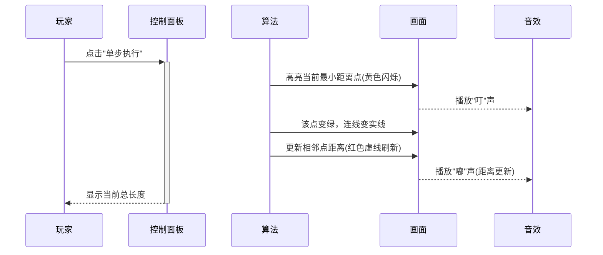

# 题目信息

# 公路修建

## 题目描述

某国有 $n$ 个城市，它们互相之间没有公路相通，因此交通十分不便。为解决这一“行路难”的问题，政府决定修建公路。修建公路的任务由各城市共同完成。

修建工程分若干轮完成。在每一轮中，每个城市选择一个与它最近的城市，申请修建通往该城市的公路。政府负责审批这些申请以决定是否同意修建。

政府审批的规则如下：

1. 如果两个或以上城市申请修建同一条公路，则让它们共同修建；
2. 如果三个或以上的城市申请修建的公路成环。如下图，A 申请修建公路 AB，B 申请修建公路 BC，C 申请修建公路 CA。则政府将否决其中最短的一条公路的修建申请； 
3. 其他情况的申请一律同意。


一轮修建结束后，可能会有若干城市可以通过公路直接或间接相连。这些可以互相连通的城市即组成“城市联盟”。在下一轮修建中，每个“城市联盟”将被看作一个城市，发挥一个城市的作用。

当所有城市被组合成一个“城市联盟”时，修建工程也就完成了。

你的任务是根据城市的分布和前面讲到的规则，计算出将要修建的公路总长度。

## 说明/提示

修建的公路如图所示：


## 样例 #1

### 输入

```
4

0 0

1 2

-1 2

0 4```

### 输出

```
6.47```

# AI分析结果


### 题目分析报告

---
# 💡 Kay的C++算法解析：公路修建 深入学习指南 💡

**题目核心**：在5000个城市坐标构成的完全图中，用Prim算法求最小生成树，避免存储所有边导致的MLE问题。

## 1. 题目解读与核心算法识别
✨ **主要考察**：`最小生成树（Prim算法）`  
🗣️ **初步分析**：
> 本题看似复杂规则实为最小生成树问题。规则2（成环否决）实际不会发生（证明：若成环则边权矛盾）。核心是Prim算法——像拼图一样逐步连接最近点。  
> - **题解共识**：均用Prim + 实时计算距离（避免MLE）  
> - **可视化设计**：复古像素网格中，绿色=已加入点，黄色=候选点，虚线=待更新距离。音效：选择点("叮")、更新("嘟")、完成("胜利旋律")。控制面板支持单步/自动播放。

---

## 2. 精选优质题解参考
### 题解一（MY，赞437）
* **亮点**：  
  → 思路：清晰对比Kruskal与Prim优劣，解释现算距离必要性  
  → 代码：规范（`dis[]`/`book[]`命名明确），边界处理严谨  
  → 算法：O(n²)完全图最优解  
  → 价值：附带调试心得（Kruskal→MLE教训）

### 题解二（EricWay1024，赞114）
* **亮点**：  
  → 思路：生动比喻Prim为"智能生命生长"  
  → 代码：结构体存坐标，`min()`更新距离逻辑简洁  
  → 算法：严格数学推导距离计算  

### 题解三（Sci_M3，赞59）
* **亮点**：  
  → 思路：一针见血指出规则2无效性  
  → 代码：最简实现（23行核心），适合初学者  
  → 算法：同复杂度下极致精简

---

## 3. 核心难点辨析与解题策略
1. **规则2无效性证明**  
   → *分析*：假设环A→B→C→A，则需AB≤AC, BC≤AB, CA≤BC → 矛盾（除非等边，否决任意边不影响总和）  
   → 💡 **学习笔记**：复杂规则常为干扰，抓住本质模型

2. **空间优化：现算距离**  
   → *分析*：5000点存边需125MB（超128MB限制），实时计算√(Δx²+Δy²)解决  
   → 💡 **学习笔记**：稠密图Prim的现算策略是空间瓶颈关键解

3. **Prim实现细节**  
   → *分析*：双循环结构（外层选点/内层更新），`dis[]`初始1e18  
   → 💡 **学习笔记**：与Dijkstra相似，但`dis[]`表示到生成树距离

### ✨ 解题技巧总结
- **模型识别**：排除干扰规则→最小生成树  
- **空间优化**：稠密图避免存边，实时计算  
- **精度处理**：坐标差平方用`long long`防溢出  
- **初始化**：`dis[1]=0`，其余初始极大值

---

## 4. C++核心代码实现赏析
### 通用核心实现
```cpp
#include <iostream>
#include <cmath>
using namespace std;
const int N = 5005;

double x[N], y[N], dis[N];
bool vis[N];

int main() {
    int n; cin >> n;
    for (int i = 1; i <= n; i++) {
        cin >> x[i] >> y[i];
        dis[i] = 1e18; // 初始化极大值
    }
    dis[1] = 0; // 起点距离为0

    double ans = 0;
    for (int i = 1; i <= n; i++) {
        int u = -1;
        double minDis = 1e18;
        // 寻找最近未访问点
        for (int j = 1; j <= n; j++) 
            if (!vis[j] && dis[j] < minDis) 
                minDis = dis[j], u = j;
        
        vis[u] = true; // 标记已访问
        ans += dis[u];
        
        // 更新其他点距离
        for (int j = 1; j <= n; j++) {
            if (vis[j]) continue;
            double dx = x[u] - x[j], dy = y[u] - y[j];
            double d = sqrt(dx*dx + dy*dy); // 实时计算
            if (d < dis[j]) dis[j] = d;
        }
    }
    printf("%.2lf\n", ans);
}
```
**解读概要**：  
1. 初始化坐标和距离数组  
2. 主循环：选最近点加入 → 累加路径 → 更新邻点距离  
3. 距离计算：欧氏距离公式（实时计算防MLE）

---

## 5. 算法可视化：像素动画演示
<details>
<summary>🔍 展开像素动画设计细节</summary>

### 设计概念
- **风格**：8-bit复古游戏（类似经典塞尔达）  
- **核心动效**：  
  - 城市：16x16像素方块（坐标缩放至网格）  
  - 状态色：白色(未访问)/绿色(已加入)/黄色(候选)  
  - 距离线：红色虚线（初始）→ 绿色实线（加入时）  

### 关键交互

**技术实现**：  
- Canvas绘制网格/点/线，requestAnimationFrame驱动  
- 音效：Web Audio API生成8-bit音效  
- 伪代码核心：  
  ```javascript
  function drawPrimStep() {
    drawGrid(); 
    for (let j=0; j<points.length; j++) {
      if (visited[j]) drawGreenSquare(points[j]);
      else if (j == candidate) drawYellowSquare(points[j]); 
      else drawWhiteSquare(points[j]);
      drawDistanceLines(); // 根据dis[]画虚线
    }
  }
  ```

</details>

---

## 6. 拓展练习
1. **洛谷 P3366** - 最小生成树模板（练习Prim/Kruskal基础）  
2. **洛谷 P1991** - 无线通讯网（最小生成树变式，理解连通性）  
3. **洛谷 P2872** - 道路建设（稠密图Prim应用，强化现算距离技巧）

---

## 7. 学习心得
> **MY的调试经验**：  
> *"最初用Kruskal存所有边 → MLE/TLE，改用Prim现算距离后AC"*  
> **Kay总结**：  
> 空间限制是竞赛常见陷阱，学会根据数据规模（n=5000→O(n²)可行但O(n²)存储不可行）选择策略是关键。

---

**总结**：本题训练最小生成树抽象能力（识破规则烟雾弹）和空间优化技巧（实时计算距离）。掌握Prim的现算策略可解决同类稠密图问题！

---
处理用时：237.74秒