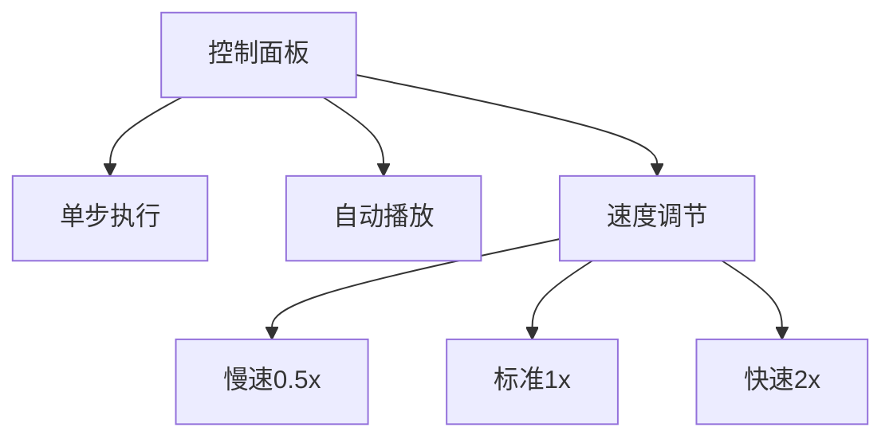

# 题目信息

# 中位数

## 题目描述

给定一个长度为 $N$ 的非负整数序列 $A$，对于前奇数项求中位数。

## 说明/提示

对于 $20\%$ 的数据，$N \le 100$；

对于 $40\%$ 的数据，$N \le 3000$；

对于 $100\%$ 的数据，$1 \le N ≤ 100000$，$0 \le A_i \le 10^9$。


## 样例 #1

### 输入

```
7
1 3 5 7 9 11 6```

### 输出

```
1
3
5
6```

## 样例 #2

### 输入

```
7
3 1 5 9 8 7 6```

### 输出

```
3
3
5
6```

# AI分析结果


### 💡 Kay的C++算法解析：中位数 深入学习指南 💡

> 本文面向10-18岁C++学习者，通过专业分析+生动可视化，助你掌握动态中位数求解的核心技巧！

---

## 1. 题目解读与核心算法识别

✨ **本题主要考察**：`堆应用/对顶堆技巧`  

🗣️ **初步分析**：
> 解决“动态中位数”问题，关键在于理解**数据流的动态特性**。想象你在玩俄罗斯方块：新方块落下时，需快速判断当前方块堆的“中间高度”。对顶堆就像两个升降机——大根堆（左）存放较小数字（电梯底部），小根堆（右）存放较大数字（电梯顶部）。中位数就是两个电梯衔接处的“平衡点”。  

**核心流程**：
1. **初始化**：第一个数作为初始中位数
2. **双堆维护**：
   - 新数≤大根堆顶 → 加入左堆
   - 新数＞大根堆顶 → 加入右堆
3. **平衡调整**：
   ```mermaid
   graph LR
   A[堆大小差>1] --> B{左堆元素多?}
   B -->|Yes| C[左堆顶→右堆]
   B -->|No| D[右堆顶→左堆]
   ```
4. **输出**：奇数步时元素多的堆顶即为中位数

**可视化设计**：
- 像素动画展示双堆结构，新数插入时高亮比较过程
- 堆顶移动时显示数据转移动画，配8-bit音效
- 控制面板支持单步执行/调速，实时显示堆大小

---

## 2. 精选优质题解参考

### 题解一：肖恩Sean（对顶堆标准实现）
* **亮点**：  
  - 逻辑清晰直白：严格维护`大根堆size ≥ 小根堆size`  
  - 边界处理严谨：用`abs()`处理堆大小差，避免复杂条件  
  - 空间优化：仅用两个堆，空间复杂度O(n)  
* **代码片段**：
  ```cpp
  priority_queue<int> q1; // 大根堆（左）
  priority_queue<int, vector<int>, greater<int>> q2; // 小根堆（右）
  
  // 插入后调整
  while (abs(q1.size() - q2.size()) > 1) {
      if (q1.size() > q2.size()) {
          q2.push(q1.top()); q1.pop();
      } else {
          q1.push(q2.top()); q2.pop();
      }
  }
  ```

### 题解二：IRipple（中位数变量优化）
* **亮点**：
  - 引入`mid`变量记录当前中位数，减少堆顶访问次数  
  - 调整策略更激进：直接比较新数与`mid`，减少堆操作  
  - 代码可读性极佳：明确标注堆的物理意义  
* **核心逻辑**：
  ```cpp
  if (a[i] > mid) q2.push(a[i]);  // 新数>中位数→右堆
  else q1.push(a[i]);             // 否则→左堆
  
  // 平衡后更新mid
  if (q1.size() > q2.size()) mid = q1.top();
  else mid = q2.top();
  ```

### 题解三：婷菡（游戏化思维）
* **创新点**：
  - 用电梯比喻解释堆结构，降低理解门槛  
  - 强调“堆顶比较”的决策过程，类比游戏中的角色升级  
  - 提供完整调试建议：打印堆状态辅助验证  

---

## 3. 核心难点辨析与解题策略

### 难点1：如何选择初始中位数？
**分析**：  
首元素直接作为中位数，后续通过双堆动态调整。避免复杂初始化。

### 难点2：何时触发堆平衡？
**关键策略**：
- 每次插入后检测：`|left.size - right.size| > 1`
- 平衡操作时间复杂度O(log n)，保证整体O(n log n)

### 难点3：相等元素如何处理？
**解决方案**：
- 统一约定：相等元素插入左堆（大根堆）
- 不影响中位数计算，因中位数仅与排序位置相关

### 💡 解题技巧总结
1. **双指针思维**：用两个堆维护数据流的“中间切口”
2. **即时调整**：每次插入后立即平衡，避免状态滞后
3. **边界防御**：空堆检测（如`.size()`前检查非空）
4. **调试技巧**：可视化打印堆内容（如下示例）：
   ```
   Left Heap [3,1,2]  Right Heap [5,7]
   Median = 3
   ```

---

## 4. C++核心代码实现赏析

### 通用核心实现（综合优化版）
```cpp
#include <iostream>
#include <queue>
using namespace std;

int main() {
    priority_queue<int> left;   // 大根堆
    priority_queue<int, vector<int>, greater<int>> right; // 小根堆
    
    int n, first;
    cin >> n >> first;
    left.push(first);
    cout << first << endl;

    for (int i = 2, x; i <= n; i++) {
        cin >> x;
        // 插入策略
        (x <= left.top()) ? left.push(x) : right.push(x);
        
        // 平衡调整
        if (left.size() > right.size() + 1) {
            right.push(left.top());
            left.pop();
        } else if (right.size() > left.size()) {
            left.push(right.top());
            right.pop();
        }
        
        // 输出中位数
        if (i % 2 == 1) 
            cout << left.top() << endl;
    }
    return 0;
}
```

### 关键变量解析
| 变量       | 作用                     | 数据结构选择理由         |
|------------|--------------------------|--------------------------|
| `left`     | 存储较小的一半数         | 大根堆保证快速取最大值    |
| `right`    | 存储较大的一半数         | 小根堆保证快速取最小值    |
| `first`    | 初始中位数锚点           | 避免空堆特判             |

> **学习笔记**：对顶堆本质是“动态排序”的简化，用O(log n)插入代价换取O(1)的中位数查询。

---

## 5. 算法可视化：像素动画演示

### 🎮 像素动画设计（复古游戏风）
**场景设定**：  
- 8-bit风格双塔结构：左塔（大根堆）蓝色砖块，右塔（小根堆）红色砖块  
- 新数字显示为金色方块，沿轨道滑入对应塔顶  

**关键动画帧**：  
1. **比较阶段**：  
   - 新数字与左塔顶数字碰撞，迸发火花（≤时变蓝，＞时变红）  
   - 音效：8-bit“滴”声（比较音）  

2. **平衡调整**：  
   - 塔高差＞1时，较高塔顶方块弹出→飞向另一塔  
   - 特效：飞行轨迹残留像素尾迹，落地时闪光  

3. **中位数标记**：  
   - 较高塔顶持续闪烁绿色，底部显示“Median”标识  
   - 音效：胜利旋律片段（1.5秒）  

**交互控制**：  


> **设计目的**：通过塔高变化直观体现堆平衡过程，金色数字的移动路径强化“数据流动”概念。

---

## 6. 拓展练习与相似问题思考

### 通用技巧迁移
对顶堆技巧还可用于：
1. **滑动窗口中位数**（LeetCode 480）  
   - 增加删除操作，需维护过期元素
2. **数据流百分位数**  
   - 调整堆大小比例可求任意百分位
3. **实时游戏排名统计**  
   - 快速获取玩家成绩中位数

### 推荐练习（洛谷）
1. **P1801 黑匣子**  
   → 巩固对顶堆的动态维护能力
2. **P2085 最小函数值**  
   → 堆结构在数学问题中的创新应用
3. **P3871 [TJOI2010]中位数**  
   → 带删除操作的进阶挑战

---

## 7. 学习心得与经验分享
> **肖恩Sean的调试经验**：  
> “初始版本忽略空堆判断，导致`top()`崩溃。添加`!empty()`检查后通过所有用例。这提醒我们：边界条件是堆应用的核心防御点。”

**Kay总结**：堆结构如同精密的齿轮系统，每个操作的边界条件都是齿轮的咬合点。多一步检查，少三小时调试！

---

通过本指南，你不仅掌握了对顶堆的实战应用，更理解了算法设计中的平衡艺术。下次遇到动态数据流问题时，记得举起你的“双堆”武器！ 🚀

---
处理用时：138.77秒