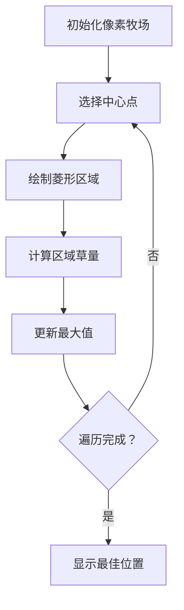

# 题目信息

# [USACO14MAR] The Lazy Cow S

## 题目描述

It's a hot summer day, and Bessie the cow is feeling quite lazy.  She wants

to locate herself at a position in her field so that she can reach as much

delicious grass as possible within only a short distance.


The field Bessie inhabits is described by an N by N grid of square cells

(1 <= N <= 400).  The cell in row r and column c (1 <= r,c <= N) contains

G(r,c) units of grass (0 <= G(r,c) <= 1000).  From her initial square in

the grid, Bessie is only willing to take up to K steps (0 <= K <= 2\*N).

Each step she takes moves her to a cell that is directly north, south,

east, or west of her current location.


For example, suppose the grid is as follows, where (B) describes Bessie's

```cpp
50    5     25*   6     17    
14    3*    2*    7*    21    
99*   10*   1*(B) 2*    80*    
8     7*    5*    23*   11   
10    0     78*   1     9        
```

initial position (here, in row 3, column 3):

If K=2, then Bessie can only reach the locations marked with \*s.

Please help Bessie determine the maximum amount of grass she can reach, if

she chooses the best possible initial location in the grid.

奶牛贝茜非常懒惰，她希望在她的地盘内找到一点最佳位置居住，以便在有限的步数内可以吃到尽量多的青草。

她的地盘是一个 $N \times N(1\le N \le 400)$ 的矩阵，第 $r$ 行 $c$ 列包含 $G(r,c)$ 单位的青草 $(0 \le G(r,c) \le 1000)$。从她的居住点，她最多愿意走 $K$ 步 $(0 \le K \le 2 \times N)$，每一步她可以走到上与她相邻的某个格子。

## 说明/提示

OUTPUT DETAILS:


In the example above, Bessie can reach 342 total units of grass if she

locates herself in the middle of the grid.


Source: USACO 2014 March Contest, Silver


## 样例 #1

### 输入

```
5 2
50 5 25 6 17
14 3 2 7 21
99 10 1 2 80
8 7 5 23 11
10 0 78 1 9
```

### 输出

```
342```

# AI分析结果


# 💡 Kay的C++算法解析：[USACO14MAR] The Lazy Cow S 深入学习指南 💡

## 1. 题目解读与核心算法识别

✨ **本题主要考察**：`前缀和优化` + `枚举技巧`

🗣️ **初步分析**：
> 这道题可以想象成在一个像素化的牧场中寻找最佳喂食点。奶牛贝茜就像经典游戏《吃豆人》中的角色，但只能在有限的步数内移动（曼哈顿距离≤K）。解题的关键是高效计算每个位置能到达的菱形区域内的草量总和。
> 
> - **核心思路**：通过**前缀和技巧**避免重复计算，将时间复杂度从O(N⁴)优化到O(N³)或O(N²)
> - **两种解法**：直接枚举中心点+行前缀和（O(N³)）和坐标旋转+二维前缀和（O(N²)）
> - **可视化设计**：我们将设计8位像素风格动画，展示奶牛从不同中心点出发的菱形活动区域。当选择新中心点时会有"哞~"音效，计算区域和时有"咀嚼"音效，找到最大值时播放胜利音效

---

## 2. 精选优质题解参考

**题解一：(yxy666 - 旋转坐标法)**
* **点评**：这份题解思路新颖，通过45度坐标旋转将菱形区域转化为矩形区域，巧妙运用二维前缀和将复杂度优化到O(N²)。代码结构清晰，变量命名规范（如now_x, now_y），边界处理严谨。亮点在于数学变换思维，将复杂问题转化为经典前缀和问题，是竞赛中值得掌握的高级技巧。

**题解二：(Ajwallet - 直接前缀和法)**
* **点评**：解法直接易懂，通过行前缀和优化计算过程。代码中边界处理详细（如uuu, uuuu变量），体现了良好的工程实践。虽然时间复杂度O(N³)，但N≤400时完全可行，适合初学者理解问题本质。亮点在于对菱形区域的行分解逻辑清晰，实践价值高。

**题解三：(一只野生蒟蒻 - 朴素前缀和法)**
* **点评**：最易理解的实现，完整展示菱形区域的行分解过程。代码包含详细注释和边界检查，sum函数中菱形左右边界的计算逻辑直观。特别适合初学者学习前缀和应用，虽然效率不如旋转法，但教学价值突出。

---

## 3. 核心难点辨析与解题策略

1.  **难点：高效计算菱形区域和**
    * **分析**：直接遍历菱形区域每个点需O(K²)，整体O(N²K²)不可行。优质题解通过行前缀和将单点计算优化到O(K)，或通过坐标旋转优化到O(1)
    * 💡 **学习笔记**：前缀和是区域求和问题的"万能钥匙"

2.  **难点：复杂边界处理**
    * **分析**：菱形靠近网格边缘时需特殊处理。如Ajwallet解法中的`max(1,j-k+uu)`和`min(n,j+k-uu)`确保不越界
    * 💡 **学习笔记**：边界处理是竞赛编程的常见失分点，要预留安全边际

3.  **难点：算法选择与优化**
    * **分析**：O(N³)解法简洁易懂但效率较低，O(N²)解法高效但需要坐标变换思维。根据数据范围(N≤400)选择合适解法
    * 💡 **学习笔记**：没有绝对最优解法，只有最适合当前约束的解法

### ✨ 解题技巧总结
- **空间换时间**：预处理前缀和数组，避免重复计算
- **问题分解**：将菱形区域按行分解为连续区间
- **数学变换**：通过坐标系旋转简化问题
- **边界防御**：所有数组访问前进行范围检查

---

## 4. C++核心代码实现赏析

**通用核心实现参考**
```cpp
#include <cstdio>
#include <algorithm>
using namespace std;
const int N = 405;

int n, k, grass[N][N], rowSum[N][N];

int main() {
    scanf("%d%d", &n, &k);
    for (int i = 1; i <= n; i++) {
        for (int j = 1; j <= n; j++) {
            scanf("%d", &grass[i][j]);
            rowSum[i][j] = rowSum[i][j-1] + grass[i][j]; // 行前缀和
        }
    }

    int maxGrass = 0;
    for (int r = 1; r <= n; r++) {
        for (int c = 1; c <= n; c++) {
            int total = 0;
            // 遍历菱形区域包含的行
            for (int i = max(1, r-k); i <= min(n, r+k); i++) {
                int range = k - abs(i - r); // 当前行左右边界
                int left = max(1, c - range);
                int right = min(n, c + range);
                total += rowSum[i][right] - rowSum[i][left-1];
            }
            maxGrass = max(maxGrass, total);
        }
    }
    printf("%d\n", maxGrass);
    return 0;
}
```

**代码解读概要**：
> 该实现采用直接前缀和法：1) 预处理每行的前缀和数组 2) 枚举每个可能中心点 3) 对中心点上下K行范围，计算每行在菱形区域内的左右边界 4) 用行前缀和快速求和 5) 更新最大值

---

**题解一：旋转坐标法**
```cpp
// 坐标旋转：(r,c) -> (r+c-1, n-r+c)
mp[i+j-1][N-i+j] = read(); 

// 二维前缀和
F[i][j] = F[i-1][j] + F[i][j-1] - F[i-1][j-1] + mp[i][j];

// 查询旋转后矩形区域
int x_l = max(0, now_x-K-1), y_l = max(0, now_y-K-1);
int x_r = min(2*N-1, now_x+K), y_r = min(2*N-1, now_y+K);
ans = max(ans, F[x_r][y_r] - F[x_l][y_r] - F[x_r][y_l] + F[x_l][y_l]);
```

**代码解读**：
> 1. **坐标变换**：将原坐标(r,c)映射到新坐标系(i+j-1, n-i+j)，菱形区域变为矩形
> 2. **二维前缀和**：F[i][j]存储旋转后网格从(1,1)到(i,j)的矩形区域和
> 3. **区域查询**：通过前缀和加减法在O(1)时间计算任意矩形区域和
> 💡 **学习笔记**：坐标旋转是处理菱形问题的利器

**题解二：直接前缀和法**
```cpp
for (int u = i-k; u <= i+k; u++) {
    if (u < 1) u = 1; // 边界处理
    int uu = abs(i - u);
    int left = max(1, j - k + uu);  // 左边界
    int right = min(n, j + k - uu); // 右边界
    now += rowSum[u][right] - rowSum[u][left-1];
}
```

**代码解读**：
> 1. **行遍历**：枚举中心点上下K行范围
> 2. **边界计算**：每行的左右边界距中心点距离为k-|r-i|
> 3. **前缀和求值**：直接获取该行在[left,right]区间的草量和
> 💡 **学习笔记**：复杂区域可分解为简单行区间处理

---

## 5. 算法可视化：像素动画演示

* **主题**："像素牧场大冒险"（8位像素风格）
* **核心演示**：奶牛移动范围可视化与草量计算过程



**动画设计**：
1. **场景初始化**：16色像素网格牧场，不同草量用绿色渐变表示
2. **选择中心点**：奶牛像素图标闪烁，伴随"哞~"音效
3. **绘制菱形区域**：
   - 逐步扩展绘制曼哈顿距离≤K的格子（类似《吃豆人》吃豆动画）
   - 当前处理行高亮显示，左右边界有动态标记
4. **计算过程**：
   - 行前缀和计算：数字在格子间流动的动画
   - 区域求和：被计算的格子闪烁黄色，伴随"咔嚓"咀嚼音效
5. **结果更新**：
   - 发现新最大值：奶牛欢呼动画 + 胜利音效
   - 当前最大值实时显示在计分板
6. **交互控制**：
   - 步进/自动模式切换
   - 速度调节滑块（蜗牛→兔子）
   - 重置按钮（像素风格）

---

## 6. 拓展练习与相似问题思考

* **技巧迁移**：
  1. 子矩阵和问题（二维前缀和）
  2. 菱形区域处理（坐标旋转）
  3. 曼哈顿距离相关计算

* **洛谷推荐**：
  1. **P1719** 最大加权矩形 - 二维前缀和经典应用
  2. **P2280** 激光炸弹 - 子矩阵和+边界处理
  3. **P3667** 灯光 - 曼哈顿距离应用

---

## 7. 学习心得与经验分享

> **经验分享**（来自题解作者）：
> "调试时被边界条件卡了很久，特别是当K值较大时，必须考虑网格边缘情况"
> 
> **Kay点评**：边界处理是竞赛编程的常见痛点。建议：
> 1. 使用`max(1, pos)`和`min(n, pos)`限制范围
> 2. 在草稿纸上画出边界案例
> 3. 专门测试K=0, K≥2N等极端情况

---

通过本指南，相信大家已掌握菱形区域问题的求解技巧。记住：前缀和是区域计算的神器，而坐标旋转是处理菱形问题的魔法棒！下次遇到类似问题，不妨先思考"如何让问题变规则"。继续加油！💪

---
处理用时：154.92秒