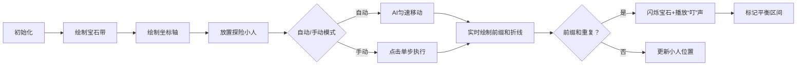

# 题目信息

# 宝石串

## 题目描述

有一种宝石串，由绿宝石和红宝石串成，仅当绿宝石和红宝石数目相同的时候，宝石串才最为稳定，不易断裂。安安想知道从给定的宝石串中，可以截取一段最长的稳定的宝石串，有多少颗宝石组成。请你帮助他。

绿宝石用 $\texttt G$ 表示，红宝石用 $\texttt R$ 表示。


## 说明/提示

$\texttt {RGGR}$ 为答案。

宝石数小于等于 $10^6$。


## 样例 #1

### 输入

```
GRGGRG```

### 输出

```
4```

# AI分析结果


### 💡 Kay的C++算法解析：宝石串 深入学习指南 💡

#### **1. 题目解读与核心算法识别**
✨ **本题主要考察**：前缀和与哈希映射  
🗣️ **初步分析**：
> 宝石串问题的本质是寻找最长的子串，使得其中绿宝石(G)和红宝石(R)数量相等。这就像在一条宝石带上寻找平衡点——想象你左右手各持天秤，每遇到一颗G就在左盘放1g砝码，遇到R则在右盘放1g砝码，目标就是找到最长的平衡区间。
> - **核心思想**：将G视为-1，R视为1，计算前缀和。若某两个位置前缀和相等，说明这两点间G和R数量相同（子串和为0）。
> - **关键难点**：处理负数索引（用偏移量转化）和高效记录首次出现位置（哈希映射）。  
> - **可视化设计**：采用"宝石探险"像素游戏风格。宝石带显示在上方，下方绘制前缀和变化折线。当折线两次到达同一高度时，触发宝石闪烁特效和"叮"的音效，标记平衡区间。自动演示模式下，AI小人会沿折线行走并实时标记路径。

---

#### **2. 精选优质题解参考**
**题解一：在想Peach（赞60）**  
* **点评**：此解法思路精妙，用`last`变量动态维护前缀和，通过`p[last]`记录首次出现位置。代码仅14行却完整覆盖核心逻辑：  
  - **思路清晰**：用"当前前缀和 vs 历史位置"直接定位平衡区间  
  - **代码亮点**：用`last`替代传统前缀和数组，省空间；偏移量1000000解决负数索引  
  - **实践价值**：O(n)时间复杂度，可直接用于竞赛  

**题解二：MloVtry（赞39）**  
* **点评**：经典前缀和解法，教学价值突出：  
  - **结构规范**：显式声明`f`数组存储前缀和，`num`数组记录首次位置  
  - **算法严谨**：专门处理初始状态`num[n+1]=0`（空串平衡）  
  - **可读性**：`f[i]+n+1`的偏移计算增强代码可维护性  

**题解三：altar（赞16）**  
* **点评**：最适合初学者的实现：  
  - **注释详尽**：每行代码均有功能解释  
  - **防御编程**：`bo[sum[i]+1000001]`显式处理偏移  
  - **教学亮点**：用三目运算符`(a[i]=='R'?1:-1)`直观展现宝石映射  

---

#### **3. 核心难点辨析与解题策略**
1. **难点：负数索引处理**  
   * **分析**：前缀和可能为负，直接作数组下标会越界。优质解法均采用"偏移量"技巧：  
     ```cpp
     p[last] // last=初始值1000000±变化量
     ```
   * 💡 学习笔记：偏移量应大于最大可能负值（通常取总长度）

2. **难点：平衡区间判定原理**  
   * **分析**：当`sum[i]==sum[j]`时，区间`(i,j]`内新增的G/R数量相等，数学表达：  
     ```
     ∑(G-R)=0 → G数量=R数量
     ```
   * 💡 学习笔记：前缀和相等 ⇨ 子串平衡

3. **难点：首次位置记录必要性**  
   * **分析**：为获取最长区间，需记录每个前缀和最早出现位置。用数组比map更高效：  
     ```cpp
     if(!p[last]) p[last]=i; // 首次出现时记录
     else ans=max(ans,i-p[last]); // 非首次时更新最大值
     ```

✨ **解题技巧总结**  
- **映射转换**：将计数问题转化为数学求和问题  
- **偏移防御**：`数组大小=2*maxn+1`解决负索引  
- **时空权衡**：用O(n)空间换O(1)的哈希查找效率  

---

#### **4. C++核心代码实现赏析**
**通用核心实现参考**  
```cpp
#include <iostream>
#include <cstring>
using namespace std;
const int BASE = 1000000; // 偏移基数
string s;
int p[2*BASE+5]; // 记录首次位置

int main() {
    cin >> s;
    memset(p,0,sizeof(p));
    int last = BASE, ans = 0; // 初始偏移
    
    for(int i=0; i<s.size(); i++){
        last += (s[i]=='R') ? 1 : -1;
        
        if(p[last]==0 && last!=BASE) 
            p[last]=i+1; // 记录首次位置
        else 
            ans = max(ans, i+1 - p[last]);
            
        if(last == BASE) ans = i+1; // 从起点开始平衡
    }
    cout << ans;
}
```
**代码解读概要**：  
1. 初始化偏移量`BASE`避免负索引  
2. 遍历时动态更新前缀和`last`  
3. 通过`p`数组记录/查询首次出现位置  
4. 特殊处理从头开始的平衡串(`last==BASE`)  

---

#### **5. 算法可视化：像素动画演示**
**主题**：宝石平衡探险  
**核心演示流程**：  


**实现细节**：  
1. **8位像素风**：  
   - 宝石带：32×32像素块，G=绿色，R=红色  
   - 坐标轴：y轴范围[-maxn, maxn]，每单位=10像素  
2. **交互控制**：  
   - 控制面板：开始/暂停/重置 + 速度滑块  
   - 单步按钮：按步长1前进  
3. **动态效果**：  
   - 小人移动：每帧更新x坐标，y值=当前前缀和  
   - 平衡触发：当折线两次到达同一高度，触发宝石闪烁动画  
4. **音效系统**：  
   - 移动："滴"声（8bit短音）  
   - 平衡发现："叮咚"上升音阶  
   - 错误操作：低沉蜂鸣  

---

#### **6. 拓展练习与相似问题思考**
**通用技巧迁移**：  
前缀和+哈希表技巧适用于：  
1. 子数组和为k（Leetcode 560）  
2. 01串中0/1数量相等（Codeforces 873B）  
3. 区间平均数判定（Leetcode 1343）  

**洛谷推荐**：  
1. **P1115 最大子段和**  
   🗣️ 前缀和基础应用，理解区间最值衍生问题  
2. **P1865 区间质数统计**  
   🗣️ 结合筛法，练习前缀和预处理技巧  
3. **P3131 子串查找2**  
   🗣️ 二维前缀和拓展，提升空间建模能力  

---

#### **7. 学习心得与经验分享**
> **参考经验**：  
> 多位作者提及调试时遇到数组越界：  
> *"负数索引导致段错误，增加偏移量后解决"*  
>  
> **Kay点评**：  
> 偏移量设置是此类问题的关键防御手段：  
> 1. 预估前缀和极值（通常±maxn）  
> 2. 数组大小=`2*maxn+5`提供安全边界  
> 3. 初始化时`memset(p,0,sizeof(p))`避免脏数据  

---

通过本次分析，我们深入掌握了前缀和的核心思想与实现技巧。记住：**将问题转化为数学表达往往是优化算法的钥匙**！下次遇到计数问题时，不妨先想想前缀和这把利器哦~ 💪

---
处理用时：116.40秒