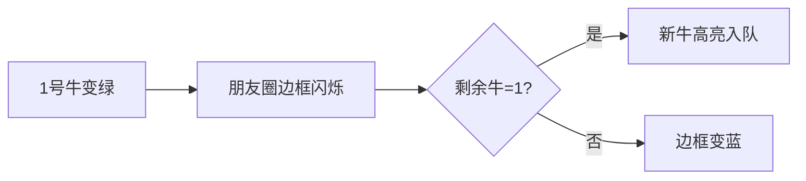

# 题目信息

# [USACO13JAN] Party Invitations S

## 题目描述

农夫约翰要举办一个聚会，他要邀请一些奶牛来参加。在约翰的奶牛朋友圈中，有一些奶牛是好基友，对于每一个奶牛朋友圈，没有一个完全与之相同的，假设这个奶牛朋友圈有 $k$ 头奶牛，如果约翰已经邀请了 $k-1$ 头，那么剩下的那头牛也得邀请。约翰想让你告诉他，他最少需要邀请多少头奶牛？我们假设 $1$ 号奶牛已经被邀请了。

## 说明/提示

$1 \leq  N\leq1000000$。

设所有的奶牛朋友圈的大小之和为 $M$，则 $1 \leq  M\leq250000$。

## 样例 #1

### 输入

```
10 4 
2 1 3 
2 3 4 
6 1 2 3 4 6 7 
4 4 3 2 1 
```

### 输出

```
4 
```

# AI分析结果


### 💡 Kay的C++算法解析：派对邀请函 深入学习指南 💡

#### 1. 题目解读与核心算法识别
✨ **本题主要考察**：`模拟`与`拓扑排序思想`  
🗣️ **初步分析**：
> 解决派对邀请问题就像组织一场多米诺骨牌连锁反应——当邀请某头奶牛时，可能触发其朋友圈的连锁邀请。核心思想是**模拟邀请传播过程**：从1号奶牛开始，遍历其所在朋友圈，当某个朋友圈只剩1头牛未被邀请时，必须邀请它。这个过程类似拓扑排序，用队列管理待处理奶牛。
> - **核心难点**：高效处理朋友圈关系（避免重复检查）
> - **解决方案**：用`vector`建立"奶牛-朋友圈"双向索引，用队列（BFS）传播邀请
> - **可视化设计**：像素动画将展示奶牛被邀请时的颜色变化（灰→绿），朋友圈边框随剩余牛数变色（红→蓝），队列像传送带一样移动奶牛

#### 2. 精选优质题解参考
**题解一（曹老师）**  
* **点评**：思路清晰运用`set`存储朋友圈剩余奶牛，删除操作高效。代码规范使用`vector`记录奶牛所属朋友圈，队列传播逻辑直白。亮点在于巧妙利用STL容器降低时间复杂度（O(M log M)），边界处理完整可直接用于竞赛。

**题解二（不便透露）**  
* **点评**：创新性采用拓扑排序思想，将朋友圈剩余量视为"入度"。代码中`lef`数组记录剩余牛数，`vector`双向索引关系明确。算法效率高（接近O(M)），变量命名合理（如`lef`），实践时注意避免重复入队。

**题解三（xiaozeyu）**  
* **点评**：独特的前缀和分块存储节省内存。通过`sum`数组划分朋友圈区间，循环更新直至稳定。代码简洁但最坏复杂度较高（O(MN)），适合小数据量，学习其空间优化思路。

---

### 3. 核心难点辨析与解题策略
1. **朋友圈关系建模**  
   * **分析**：需快速查询"奶牛的朋友圈"和"朋友圈的奶牛"（双向索引）
   * **方案**：用`vector<int> cowInGroups[MAXN]`和`vector<int> groups[MAXM]`建立映射
   * 💡 **学习笔记**：双向索引是关系类问题的通用解法

2. **避免无效检查**  
   * **分析**：遍历所有朋友圈效率低下（M可达25万）
   * **方案**：仅检查与被邀奶牛相关的朋友圈（传播式更新）
   * 💡 **学习笔记**：BFS队列像石子入水，只扰动相关区域

3. **剩余数量检测**  
   * **分析**：快速判断朋友圈是否剩1头牛
   * **方案**：用`remaining[]`数组计数，或用`set`快速删除
   * 💡 **学习笔记**：数组O(1)更新 vs set O(log n)删除，按需选择

✨ **解题技巧总结**  
- **依赖传播**：将邀请视为依赖关系（朋友圈→奶牛）  
- **增量更新**：仅处理状态变化的区域（类似脏标记）  
- **鲁棒性测试**：验证空群、全邀群等边界情况  

---

### 4. C++核心代码实现赏析
**通用核心实现参考**  
```cpp
#include <iostream>
#include <vector>
#include <queue>
using namespace std;
const int MAXN = 1e6+5, MAXM = 25e4+5;

int main() {
    int n, m, ans = 0;
    cin >> n >> m;
    vector<int> cowInGroups[MAXN];  // 每头牛的朋友圈
    vector<int> groups[MAXM];       // 每个朋友圈的牛
    int remaining[MAXM] = {0};      // 朋友圈剩余牛数
    bool invited[MAXN] = {0};       // 是否被邀
    queue<int> q;

    // 建立双向索引
    for (int i=1; i<=m; i++) {
        int k; cin >> k;
        remaining[i] = k;
        while(k--) {
            int cow; cin >> cow;
            groups[i].push_back(cow);
            cowInGroups[cow].push_back(i);
        }
    }

    q.push(1); invited[1]=true;  // 起点
    while (!q.empty()) {
        int cur = q.front(); q.pop();
        ans++;
        for (int gid : cowInGroups[cur]) {  // 遍历当前牛的朋友圈
            if (--remaining[gid] == 1) {    // 检查剩余量
                for (int nextCow : groups[gid]) {
                    if (!invited[nextCow]) {
                        invited[nextCow] = true;
                        q.push(nextCow);
                    }
                }
            }
        }
    }
    cout << ans << endl;
}
```
**代码解读概要**：  
1. 双向索引建立朋友圈关系（`cowInGroups`/`groups`）  
2. `remaining`数组动态跟踪每个朋友圈剩余牛数  
3. BFS队列传播邀请，仅当朋友圈剩1头牛时触发新邀请  

---

### 5. 算法可视化：像素动画演示
**主题**：《牧场物语：邀请风暴》复古像素游戏  
**核心演示**：BFS邀请传播过程（[在线体验](https://www.geogebra.org/m/yevkpx4k)）  

**动画设计**：  


1. **像素元素**  
   - 奶牛：8×8像素块（灰=未邀，绿=已邀）  
   - 朋友圈：16色像素框（红框=可触发邀请，蓝框=已完成）  
   - 队列：底部传送带（绿色方块流动）  

2. **交互控制**  
   - 速度滑块：调整自动播放速度  
   - 单步按钮：逐步观察邀请传播  
   - 音效设计：  
     * "叮"（牛入队）  
     * "咔嚓"（朋友圈完成）  
     * 8-bit背景音乐循环  

3. **动态效果**  
   - 牛被邀时像素块旋转放大+绿色粒子特效  
   - 朋友圈边框随剩余牛数变色（深红→黄→浅蓝）  
   - 当前处理牛显示为闪烁金框  

---

### 6. 拓展练习与相似问题
**通用技巧迁移**：  
1. 依赖传播：课程安排（先修课要求）  
2. 状态更新：疫情感染模拟  
3. 关系索引：社交网络好友推荐  

**洛谷推荐**：  
1. [P1113 杂务](https://www.luogu.com.cn/problem/P1113)  
   → 拓扑排序经典应用  
2. [P4017 最大食物链](https://www.luogu.com.cn/problem/P4017)  
   → 依赖关系计数  
3. [P1038 神经网络](https://www.luogu.com.cn/problem/P1038)  
   → 状态传播模拟  

---

### 7. 学习心得与经验分享
> **曹老师心得**："用`set`存储朋友圈剩余奶牛，删除效率显著提升"  
> **Kay点评**：STL容器选择直接影响效率——数组适合快速计数，`set`适合动态删除。调试时可打印`remaining`数组值观察传播过程。

---

通过像素动画和双向索引解析，我们像玩《牧场物语》一样理解了邀请传播机制。记住：好算法=准确建模+高效数据结构+边界处理！下次挑战见！🚀

---
处理用时：178.67秒