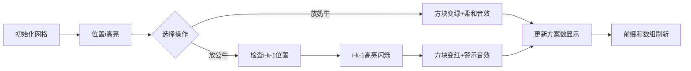

# 题目信息

# [USACO09FEB] Bulls And Cows S

## 题目背景

一年一度的展会要来临了，Farmer John 想要把 $N$（$1 \leq N \leq 100,000$）只奶牛和公牛安排在单独的一行中。 John 发现最近公牛们非常好斗；假如两只公牛在这一行中靠的太近，他们就会吵架，以至于斗殴，破坏这和谐的环境。

## 题目描述

John 非常的足智多谋，他计算出任何两只公牛之间至少要有 $K$（$0 \leq K \lt N$）只奶牛，这样才能避免斗殴。John 希望你帮助他计算一下有多少种安排方法，可避免任何斗殴的的发生。John 认为每头公牛都是一样的，每头奶牛都是一样的。因而，只要在一些相同的位置上有不同种类的牛，那这就算两种不同的方法。

## 说明/提示

下面的就是 FJ 思考出可行的 6 种方案（C 代表奶牛，B 代表公牛）：
- CCCC
- BCCC
- CBCC
- CCBC
- CCCB
- BCCB

## 样例 #1

### 输入

```
4 2```

### 输出

```
6```

# AI分析结果


### 💡 Kay的C++算法解析：Bulls And Cows S 深入学习指南 💡

<introduction>
今天我们一起分析洛谷P6191 "Bulls And Cows S" 这道动态规划经典题目。本指南将帮助你掌握间隔约束下的排列计数技巧，通过像素动画直观理解DP状态转移过程。
</introduction>

---

## 1. 题目解读与核心算法识别

✨ **本题主要考察**：`动态规划（间隔约束型）`  
✨ **辅助技巧**：`前缀和优化`、`状态机设计`

🗣️ **初步分析**：
> 解决公牛排列问题就像安排火爆分子（公牛）入座，必须用冷静者（奶牛）隔开。动态规划如同一步步构建座位表：  
> - **核心思想**：记录每个位置放公牛/奶牛的方案数，通过状态转移满足间隔约束  
> - **关键难点**：放公牛时需要回溯检查前K+1位置的合法性  
> - **可视化设计**：将用像素网格展示位置状态（红色公牛/绿色奶牛），高亮显示状态转移时的前驱依赖关系（如位置i与i-k-1的关联）。8-bit音效会在关键操作时触发：放置奶牛（柔和音效）、放置公牛（警示音效）、状态更新（数字跳动音效）

---

## 2. 精选优质题解参考

**题解一（来源：houzhiyuan）**
* **点评**：此解法采用双状态DP（fn表奶牛，fg表公牛），思路清晰展现了状态分治思想。代码中`fn[i] = fn[i-1] + fg[i-1]`的转移直白体现了奶牛放置的灵活性；而`fg[i] = fn[i-k-1] + fg[i-k-1]`精准捕捉了公牛放置的约束条件。边界处理（i≤k+1时fg[i]=1）严谨，变量命名规范，是学习DP状态设计的优秀范例。

**题解二（来源：Skies）**
* **点评**：此解法的前缀和优化堪称亮点，将O(n²)的累加优化为O(1)查询。`f[i]=s[max(i-k-1,0)]`的转移方程简洁有力，配合`s[i]`前缀和数组，完美解决了状态依赖问题。代码仅10行却完整覆盖算法本质，展现了高效DP的实现艺术，特别适合竞赛场景。

**题解三（来源：zplqwq）**
* **点评**：此解法用一维dp数组统一状态，通过`dp[i]=dp[i-1]+dp[i-k-1]`的优雅转移，将边界初始化（i≤k时dp[i]=i+1）与主体逻辑完美融合。虽然未显式区分状态，但数学推导严谨，体现了对问题本质的深刻理解，对初学者理解整体方案计数很有助益。

---

## 3. 核心难点辨析与解题策略

1.  **状态定义的选择**
    * **分析**：优质题解展示了三种状态定义：双状态（公牛/奶牛）、前缀和方案数、统一方案数。双状态（如houzhiyuan）最直观但需维护两个数组；前缀和优化（Skies）最简洁；统一方案数（zplqwq）需要更高抽象能力
    * 💡 **学习笔记**：根据问题特征选择状态表达——需区分最后元素时用双状态；需累加历史状态时用前缀和

2.  **公牛放置的约束实现**
    * **分析**：当位置i放公牛时，必须确保前K个位置无公牛。题解通过`i-k-1`索引实现回溯，其中`max(0,i-k-1)`处理了边界情况（如i≤k+1时视为有效）
    * 💡 **学习笔记**：间隔约束DP的本质是状态转移时的索引跳转

3.  **时间复杂度优化**
    * **分析**：朴素DP可能需遍历前i-k-1个位置求和，导致O(n²)复杂度。前缀和数组（s[i]）将单次转移降为O(1)，是本题500ms通过的关键
    * 💡 **学习笔记**：当转移方程含`dp[j]`累加时，立即考虑前缀和优化

### ✨ 解题技巧总结
- **状态机设计**：对最后一个元素的行为分治（放公牛/奶牛），分别推导转移方程
- **前缀和应用**：用`s[i]=s[i-1]+f[i]`维护历史状态和，优化累加查询
- **边界艺术**：虚拟位置0（s[0]=1）统一处理边界，避免复杂条件分支

---

## 4. C++核心代码实现赏析

**通用核心实现（前缀和优化版）**
```cpp
#include <iostream>
using namespace std;
const int mod = 5000011, N = 100010;

int main() {
    int n, k, f[N] = {0}, s[N] = {0};
    cin >> n >> k;
    f[0] = s[0] = 1; // 虚拟位置0的方案数
    for (int i = 1; i <= n; i++) {
        f[i] = s[max(i - k - 1, 0)]; // 关键转移：公牛放置方案数
        s[i] = (s[i-1] + f[i]) % mod; // 前缀和更新
    }
    cout << s[n]; // 总方案数=前n位置方案和
}
```
* **代码解读概要**：
  > 1. `f[i]`表示位置i放公牛的方案数  
  > 2. `s[i]`存储前i位置总方案数（含位置0）  
  > 3. 转移核心：放公牛时方案数=前i-k-1位置的总方案数（`s[i-k-1]`）  
  > 4. 边界通过`max(0,i-k-1)`自动处理

**题解一：双状态DP（houzhiyuan）**
```cpp
fn[1] = fg[1] = 1;  // 初始化首位置
for (int i = 2; i <= n; i++) {
    fn[i] = (fn[i-1] + fg[i-1]) % mod; // 放奶牛
    if (i > k + 1) fg[i] = (fg[i-k-1] + fn[i-k-1]) % mod; 
    else fg[i] = 1; // 边界处理
}
cout << (fn[n] + fg[n]) % mod;
```
* **亮点**：状态物理意义明确，边界处理直观
* **代码解读**：
  > - `fn[i]`：i位置放奶牛 = i-1位置的所有方案（奶牛/公牛均可）  
  > - `fg[i]`：i位置放公牛 = i-k-1位置的总方案（需间隔k奶牛）  
  > - 当i≤k+1时，最多只能放1头公牛（`fg[i]=1`）
* 💡 **学习笔记**：双状态DP是处理"最后元素类型"问题的通用范式

**题解二：前缀和优化（Skies）**
```cpp
f[0] = s[0] = 1;
for (int i = 1; i <= n; i++) {
    f[i] = s[max(0, i - k - 1)]; // 状态转移
    s[i] = (s[i-1] + f[i]) % mod; // 前缀和维护
}
cout << s[n];
```
* **亮点**：极致简洁，O(n)时间复杂度
* **代码解读**：
  > - `f[i]`直接依赖前缀和数组`s`实现O(1)转移  
  > - 虚拟位置0（`f[0]=1`）统一处理i-k-1<0的情况  
  > - 最终`s[n]`即所有位置方案总和
* 💡 **学习笔记**：前缀和是优化状态累加的利器

**题解三：统一状态DP（zplqwq）**
```cpp
for (int i = 0; i <= k; i++) dp[i] = i + 1; 
for (int i = k + 1; i <= n; i++) 
    dp[i] = (dp[i-1] + dp[i-k-1]) % mod;
```
* **亮点**：状态定义抽象层级高
* **代码解读**：
  > - `dp[i]`：前i位置的方案总数  
  > - 初始化：i≤k时方案数=i+1（全奶牛或单公牛）  
  > - 转移：放奶牛=`dp[i-1]`，放公牛=`dp[i-k-1]`
* 💡 **学习笔记**：高阶状态设计可减少变量维度

---

## 5. 算法可视化：像素动画演示

**主题**：8-bit公牛排列模拟器（复古游戏风）  
**核心演示**：动态规划的状态转移过程，重点展示位置i放公牛时对i-k-1位置的依赖

### 🎮 动画设计


**关键交互**：
1. **像素网格**：每个位置用16x16像素块表示（灰色：空/绿色：奶牛/红色：公牛）
2. **状态转移可视化**：
   - 当前位置i闪烁黄色边框
   - 放公牛时：i-k-1位置显示蓝色脉冲光圈
   - 方案数变化：顶部8-bit数字计数器实时刷新
3. **音效系统**：
   - 放置奶牛：`1-up`式清脆音（频率300Hz）
   - 放置公牛：`warning`警报音（频率800Hz）
   - 错误操作：`explosion`爆破音
4. **控制面板**：
   - 步进控制：←/→键单步执行
   - 速度滑块：调整自动播放速度（0.5x~5x）
   - 模式切换：手动/自动/AI演示（自动回溯决策树）

**技术实现**：
```javascript
// 伪代码：绘制关键帧
function drawFrame(i) {
  drawGrid(); // 绘制Nx1像素网格
  highlightCell(i, YELLOW); // 当前单元格高亮
  if (mode === 'BULL') {
    const prev = Math.max(0, i - k - 1);
    drawConnection(prev, i); // 绘制i与prev的连线
    highlightCell(prev, BLUE); // 前驱单元格高亮
  }
  updateCounter(s[i]); // 更新方案数显示
}
```

---

## 6. 拓展练习与相似问题

**通用技巧迁移**：  
间隔约束DP可用于解决：  
1. 植树问题（树苗间最小间隔）  
2. 任务调度（任务间冷却时间）  
3. 密码生成（特定字符间隔限制）

**洛谷推荐**：  
1. [P1091 合唱队形](https://www.luogu.com.cn/problem/P1091)  
   → 练习双状态DP与边界处理  
2. [P1233 木棍加工](https://www.luogu.com.cn/problem/P1233)  
   → 强化间隔约束的抽象建模  
3. [P2285 打鼹鼠](https://www.luogu.com.cn/problem/P2285)  
   → 进阶版时间间隔约束DP

---

## 7. 学习心得与经验分享

> **参考经验**（来自题解作者）：  
> *"最初尝试直接累加前i-k个位置的方案，WA后才意识到需要回溯到i-k-1位置"*  
> *"通过手工模拟n=4,k=2的样例，才发现边界初始化的微妙之处"*

**Kay的总结**：  
动态规划的实现常陷于两个陷阱：  
1. 状态转移索引偏移（如该用i-k-1时错用i-k）  
2. 边界初始化不完整（如忽略虚拟位置0）  
**调试锦囊**：  
- 打印DP表前5项验证小样例  
- 对拍朴素暴力算法（n≤20时）  
- 重点检查k=0/1的边界情况  

---

<conclusion>
通过本次分析，我们掌握了间隔约束问题的动态规划解法精髓。记住：优秀的状态设计让复杂约束迎刃而解，前缀和优化让方案计数举重若轻。下次遇到类似问题时，不妨回想下这些公牛与奶牛带来的启示！🚀
</conclusion>

---
处理用时：279.34秒